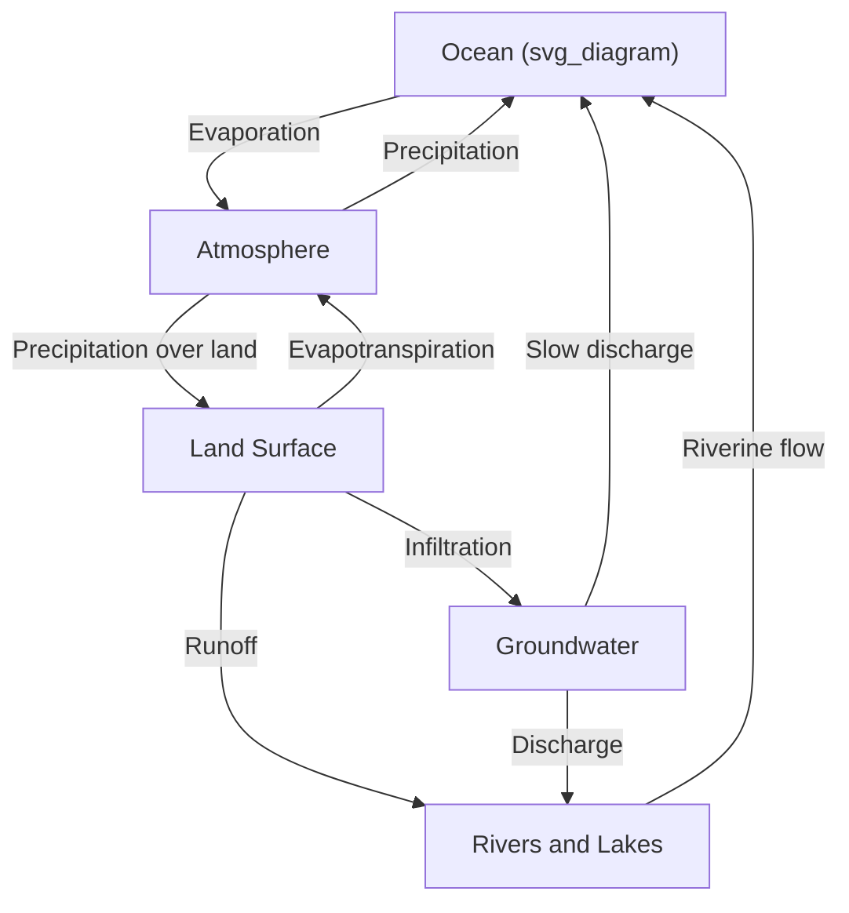
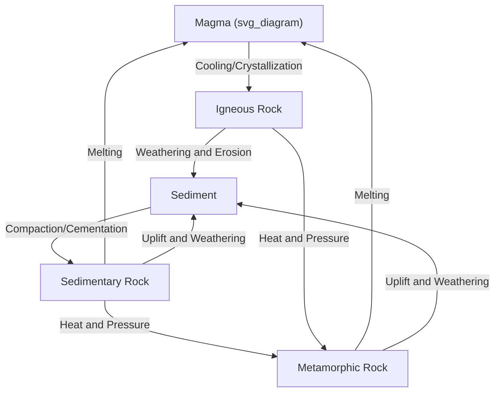

## The Hydrologic and Rock Cycles Revisited

### Overview

The hydrologic cycle and the rock cycle are two of Earth's most fundamental material circulation systems, governing the movement of water and rock-forming material through the planet's major reservoirs. Though often introduced separately at an introductory level, revisiting them jointly within a geochemistry and biogeochemical cycling framework highlights their deep interdependence: water is the primary agent driving weathering, erosion, and sediment transport in the rock cycle, while rock weathering in turn regulates long-term ocean chemistry, atmospheric CO₂, and nutrient availability that structure biogeochemical cycling more broadly.

### The Hydrologic Cycle: Reservoirs and Fluxes

#### Major Reservoirs

**Key Points**

- **Oceans** hold the overwhelming majority of Earth's total water inventory, acting as the dominant reservoir from which most atmospheric water vapor originates via evaporation.
- **Ice sheets and glaciers** constitute the largest reservoir of freshwater, locking up water on timescales of centuries to millennia, with direct relevance to sea level through their mass balance.
- **Groundwater** represents a substantial freshwater reservoir with much longer residence times than surface water, often ranging from years to thousands of years depending on aquifer characteristics and depth.
- **Rivers, lakes, atmosphere, and soil moisture** collectively hold a comparatively small fraction of total water by volume but exhibit the fastest turnover, making them disproportionately important to short-term water availability and weather.

#### Fluxes and Residence Time

The concept of **residence time** — the average duration a water molecule spends in a given reservoir before moving to another — varies by many orders of magnitude across reservoirs:

$$\tau = \frac{M}{F}$$

where $\tau$ is residence time, $M$ is the reservoir mass (or volume) of water, and $F$ is the flux rate into or out of that reservoir at steady state.

**Example**

Atmospheric water vapor has a residence time on the order of about 9–10 days, reflecting the rapid cycling of evaporation and precipitation, whereas deep groundwater and glacial ice can have residence times of thousands of years or more, illustrating the vast disparity in cycling rates across the hydrologic system.

#### Core Processes

- **Evaporation and transpiration** (jointly termed **evapotranspiration** over vegetated land) — the transfer of liquid water to atmospheric water vapor, driven by solar energy input.
- **Condensation and precipitation** — the phase change of water vapor to liquid or solid form, driven by atmospheric cooling below the dew point, and subsequent gravitational fall to the surface.
- **Infiltration and percolation** — the movement of surface water into soil and, eventually, groundwater aquifers, governed by soil permeability and the pre-existing moisture state.
- **Runoff** — surface flow of water over land into streams and rivers, occurring when precipitation rate exceeds the infiltration capacity of the surface.

### The Rock Cycle: Pathways of Transformation

#### The Three Rock Classes

**Key Points**

- **Igneous rocks** form from the cooling and crystallization of molten rock material (magma below the surface, forming intrusive/plutonic rocks; lava at the surface, forming extrusive/volcanic rocks).
- **Sedimentary rocks** form from the accumulation, compaction, and cementation (lithification) of weathered rock fragments (clastic sediment), or from chemical/biological precipitation of dissolved minerals (chemical/biogenic sediment, e.g., limestone).
- **Metamorphic rocks** form when pre-existing rock (igneous, sedimentary, or previously metamorphic) is subjected to sufficient heat and/or pressure to alter its mineralogy and/or texture without complete melting.

#### Pathways Between Rock Types

Any rock type can theoretically transform into any other rock type, depending on the specific geological pathway followed:

1. **Melting** — any rock type, if subjected to sufficiently high temperature, will melt to form magma, which upon cooling forms new igneous rock.
2. **Weathering and erosion** — any exposed rock type at the surface is broken down (mechanically and chemically) and transported, ultimately producing sediment that can lithify into sedimentary rock.
3. **Metamorphism** — any rock type subjected to elevated heat and pressure without melting (typically due to burial or tectonic processes) recrystallizes into metamorphic rock.
4. **Uplift and exposure** — tectonic processes bring buried rock (of any type) back to the surface, where it becomes subject to weathering, restarting the surface portion of the cycle.

### Weathering: The Interface Between the Two Cycles

#### Mechanical (Physical) Weathering

Mechanical weathering breaks rock into smaller fragments without altering its chemical composition, through processes including frost wedging (freeze-thaw cycling of water in rock fractures), thermal expansion/contraction, biological root growth, and abrasion during transport.

#### Chemical Weathering

Chemical weathering alters the mineralogical composition of rock through reactions primarily mediated by water, and is the process most directly linking the hydrologic cycle to long-term geochemical cycling:

**Key Points**

- **Hydrolysis** — water reacts directly with silicate minerals, breaking them down into clay minerals and releasing dissolved ions into solution (as illustrated by the Urey/silicate weathering reaction central to the long-term carbon cycle).
- **Dissolution** — some minerals (notably carbonate minerals like calcite) dissolve directly in slightly acidic water (water containing dissolved CO₂ forms weak carbonic acid), a process responsible for karst landscape formation.
- **Oxidation** — iron-bearing minerals react with dissolved atmospheric oxygen in water, forming iron oxide/hydroxide weathering products.
- Chemical weathering rate is strongly dependent on climate (temperature and precipitation), meaning the hydrologic cycle directly governs the pace of the geochemical weathering flux linking the rock cycle to atmospheric CO₂ regulation and ocean chemistry.

### Integration: How the Two Cycles Are Coupled

#### Water as the Primary Weathering and Transport Agent

Water is the dominant medium through which weathering products and dissolved ions are transported from continents to the ocean, directly linking hydrologic cycling to sediment production, ocean chemistry, and nutrient delivery.

$$\text{Denudation Rate} = f(\text{precipitation}, \text{runoff}, \text{lithology}, \text{relief})$$

[Inference] This functional relationship is a general conceptual framework used in geomorphology and geochemistry rather than a single universal equation, since the specific quantitative relationship between hydrologic variables and erosion/weathering rate varies considerably by regional climate, tectonic setting, and rock type.

#### Riverine Flux to the Ocean

**Example**

Rivers serve as the primary integrating pathway linking terrestrial weathering (rock cycle output) to ocean geochemistry (a key biogeochemical cycle input): dissolved silica, calcium, bicarbonate, and nutrient ions (phosphate, in particular) delivered by rivers originate from continental weathering and ultimately support marine biological productivity, while also supplying the raw material for marine carbonate and silica biomineralization that feeds back into long-term sedimentary rock formation.

#### The Hydrologic Cycle's Role in Sediment Transport and Deposition

- Runoff and river systems transport weathered sediment from source regions (uplands, mountain belts) to depositional basins (river deltas, continental shelves, deep ocean basins), where accumulation and eventual lithification produces new sedimentary rock.
- Glacial ice, as a component of the hydrologic cycle, is itself a highly effective erosional and sediment-transport agent, carving distinctive landscape features and depositing characteristic glacial sediment (till, outwash) upon melting.

### Climate Feedbacks Linking the Two Cycles

**Key Points**

- The silicate weathering feedback (discussed under the carbon cycle) exemplifies the coupling directly: a warmer, wetter climate (hydrologic cycle state) accelerates chemical weathering (rock cycle process), drawing down atmospheric CO₂ and providing a long-term negative feedback on climate.
- Conversely, tectonic uplift (e.g., mountain building events) increases relief and exposes fresh rock to weathering, potentially accelerating the weathering-driven CO₂ drawdown flux and contributing to long-term cooling trends over geological time — a hypothesis prominently associated with major mountain-building episodes in Earth's climate history. [Inference] The magnitude of the causal link between specific historical uplift events and associated global cooling episodes remains an active area of research and scientific debate, since isolating the weathering-driven climate signal from other concurrent geological and paleogeographic changes is methodologically challenging.

### Summary Comparison: Cycle Characteristics

| Feature | Hydrologic Cycle | Rock Cycle |
| --- | --- | --- |
| Primary driving energy | Solar energy (evaporation) and gravity | Internal Earth heat (metamorphism, melting) and gravity (weathering, erosion) |
| Fastest component | Atmospheric water vapor (days) | Surface weathering/erosion (variable, can be rapid) |
| Slowest component | Deep groundwater, glacial ice (millennia) | Metamorphic/igneous rock recycling (millions of years) |
| Key linking process | Precipitation-driven weathering and runoff | Weathering feeding sediment into hydrologic transport |

**Related Topics**

- The Carbon Cycle and Silicate Weathering Feedback
- The Nitrogen and Phosphorus Cycles
- Groundwater Hydrology and Aquifer Systems
- Sedimentary Basin Formation and Stratigraphy
- Plate Tectonics and Mountain Building (Orogeny)
- Karst Landscapes and Carbonate Dissolution
- Ocean Chemistry and Riverine Nutrient Flux
- Isotope Geochemistry and Weathering Tracers