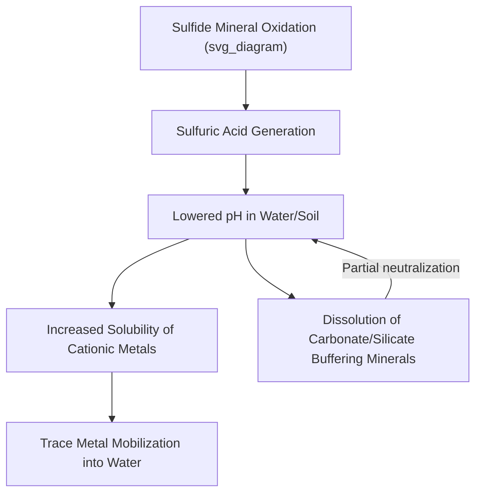

## Environmental and Trace Element Geochemistry

### Overview

Environmental and trace element geochemistry examines the sources, distribution, mobility, and fate of elements present at low concentrations in Earth's surface systems, with particular emphasis on how natural geochemical processes and anthropogenic activities influence their behavior in soils, water, sediments, and biota. This field bridges fundamental geochemical principles with applied environmental science, informing contaminant assessment, resource exploration, and ecosystem health evaluation.

### Fundamental Concepts

#### Trace Elements Defined

Trace elements are those present in Earth materials at concentrations typically below 0.1% (1,000 parts per million) by mass, in contrast to major elements (oxygen, silicon, aluminum, iron, etc.) that dominate bulk rock composition. Despite their low absolute abundance, trace elements often exert disproportionate influence on biological systems, mineral exploration targeting, and environmental hazard assessment.

**Key Points**

- **Essential trace elements (micronutrients)** — required in small quantities for biological function (e.g., zinc, copper, selenium, molybdenum), but potentially toxic at elevated concentrations, illustrating the general toxicological principle that "the dose makes the poison."
- **Non-essential trace elements** — have no known biological function and are generally toxic even at relatively low concentrations (e.g., lead, cadmium, mercury, arsenic), often termed **heavy metals** or, more precisely in some usage, **potentially toxic elements (PTEs)**, since the term "heavy metal" itself lacks a single rigorous scientific definition and is used inconsistently across the literature.

#### Speciation

**Chemical speciation** — the specific chemical form (oxidation state, molecular or ionic form, complexation with other ligands) in which an element exists — is often more important than total elemental concentration in determining an element's environmental mobility, bioavailability, and toxicity.

**Example**

Arsenic speciation illustrates this principle clearly: inorganic arsenite (As³⁺) is generally considered more toxic and mobile than inorganic arsenate (As⁵⁺) under many environmental conditions, while organic arsenic species (as found in some seafood) are generally considered substantially less toxic than either inorganic form — meaning total arsenic concentration alone is an incomplete indicator of actual environmental or health risk without accompanying speciation data.

### Controls on Trace Element Mobility

#### Redox Conditions (Eh)

**Key Points**

- Many trace elements exist in multiple oxidation states with dramatically different solubility, mobility, and toxicity characteristics, making the oxidation-reduction (redox) state of the surrounding environment a first-order control on their behavior.
- **Iron and manganese** — mobile and soluble in their reduced forms (Fe²⁺, Mn²⁺) under anoxic conditions (e.g., waterlogged soils, deep groundwater), but precipitate as insoluble oxide/hydroxide minerals under oxidizing conditions, a process with direct relevance to groundwater quality and the co-precipitation (scavenging) of other trace elements onto iron/manganese oxide surfaces.
- **Chromium** — hexavalent chromium (Cr⁶⁺) is generally more mobile, bioavailable, and toxic than trivalent chromium (Cr³⁺), which tends to be relatively immobile and less bioavailable under most natural pH conditions, making redox state a critical determinant of chromium contamination risk.
- **Arsenic** — redox state governs whether arsenic exists as more mobile arsenite or less mobile (under many conditions) arsenate, directly relevant to naturally occurring arsenic contamination of groundwater in various regions worldwide.

#### pH Dependence

- Soil and water pH strongly influences trace element solubility, since most cationic metals (e.g., lead, cadmium, zinc, copper) become increasingly soluble and mobile under acidic conditions, while oxyanion-forming elements (e.g., arsenic, selenium, molybdenum as arsenate, selenate, molybdate) often show the opposite pH-mobility relationship, becoming more mobile under alkaline conditions.
- Acid mine drainage represents an extreme example of pH-driven trace element mobilization, where oxidation of sulfide minerals (particularly pyrite) generates sulfuric acid, dramatically lowering pH and mobilizing associated trace metals from mine waste and surrounding rock.

#### Sorption and Ion Exchange

- Clay minerals, organic matter, and iron/manganese oxide surfaces carry surface charge that allows them to adsorb dissolved trace element ions, a process that can substantially retard trace element mobility relative to that expected from solubility alone.
- **Cation exchange capacity (CEC)** — a soil or sediment's capacity to hold and exchange cations on charged mineral and organic surfaces — is a key parameter governing the retention versus leaching of many cationic trace elements, with higher CEC generally corresponding to greater metal retention capacity.
- Co-precipitation and adsorption onto freshly precipitated iron and manganese oxides is a particularly important scavenging mechanism removing dissolved trace elements from water as it transitions from reducing to oxidizing conditions.

### Sources of Trace Elements in the Environment

#### Natural (Geogenic) Sources

**Key Points**

- **Mineralization and ore deposits** — naturally elevated trace element concentrations in bedrock associated with economic ore deposits (e.g., sulfide mineral deposits enriched in copper, lead, zinc, arsenic) create localized natural geochemical anomalies independent of human activity.
- **Volcanic activity** — volcanic emissions release trace elements (e.g., mercury, arsenic, selenium) directly to the atmosphere and surrounding environment.
- **Weathering of naturally enriched bedrock** — certain rock types (e.g., black shales, ultramafic rocks) naturally weather to release elevated concentrations of specific trace elements (e.g., selenium from certain shale formations, nickel and chromium from ultramafic rocks) into soils and water even in the complete absence of human activity.

#### Anthropogenic Sources

- **Mining and mineral processing** — extraction and processing of ore deposits exposes large volumes of sulfide-bearing rock to oxidizing surface conditions, accelerating natural weathering-release processes and generating tailings and waste rock with elevated trace element mobility potential.
- **Industrial emissions and effluent** — combustion of fossil fuels (particularly coal) releases trace elements including mercury, arsenic, and selenium to the atmosphere; various industrial processes discharge trace metals directly into water bodies.
- **Agricultural inputs** — some phosphate fertilizers contain elevated cadmium as a natural impurity derived from the parent phosphate rock, representing an often underappreciated pathway of soil trace element enrichment through routine agricultural practice.
- **Legacy contamination** — historical industrial and mining activоко, conducted prior to modern environmental regulation, has left many sites with persistent elevated trace element concentrations in soil and sediment that continue to pose contemporary environmental management challenges.

### Environmental Fate and Transport

#### Bioaccumulation and Biomagnification

**Key Points**

- **Bioaccumulation** — the progressive accumulation of a substance within an organism over its lifetime, occurring when uptake rate exceeds the organism's elimination rate.
- **Biomagnification** — the progressive increase in tissue concentration of certain persistent substances at successively higher trophic levels within a food web, most classically documented for methylmercury and certain persistent organic pollutants.
- **Methylmercury formation** — inorganic mercury can be converted to highly bioaccumulative and neurotoxic methylmercury by anaerobic microbial activity, particularly in wetland, sediment, and other low-oxygen environments, illustrating how speciation transformation (rather than simple total concentration) governs the ultimate ecological and human health risk of a given trace element.

#### Sediment as a Trace Element Sink and Secondary Source

- Fine-grained sediments, particularly those rich in clay minerals and organic matter, often act as long-term repositories for trace elements that have been scavenged from the water column, effectively serving as environmental archives of historical contamination inputs.
- Under certain conditions (e.g., redox state change, pH shift, physical disturbance such as dredging), previously sequestered sediment-bound trace elements can be remobilized back into the water column, meaning contaminated sediment can act as a persistent secondary contamination source long after the original input source has ceased.

### Analytical and Assessment Approaches

**Key Points**

- **Total digestion techniques** (e.g., strong acid digestion followed by inductively coupled plasma mass spectrometry, ICP-MS) measure total elemental concentration but provide no direct information on speciation or bioavailability.
- **Sequential extraction procedures** — a stepwise application of progressively stronger chemical reagents designed to operationally partition trace elements among different geochemical "pools" (e.g., exchangeable, carbonate-bound, iron/manganese oxide-bound, organic-bound, residual mineral-bound), providing insight into relative mobility and potential bioavailability beyond total concentration alone. [Inference] Sequential extraction results are widely used as a practical mobility indicator in environmental geochemistry, though the operationally defined nature of the extraction fractions means results can vary somewhat between different specific extraction protocols, and results should generally be interpreted as relative indicators rather than absolute measures of a discrete physical pool.
- **Background/baseline determination** — establishing natural, pre-anthropogenic-impact trace element concentrations for a given geological setting is essential context for distinguishing genuine contamination from natural geochemical variability, since natural background concentrations can already be elevated in certain geological settings independent of any human impact.

### Case Applications

**Example**

- **Naturally occurring groundwater arsenic** — extensive regions globally (most notably parts of South and Southeast Asia) experience naturally elevated groundwater arsenic concentrations, linked to the reductive dissolution of arsenic-bearing iron oxide minerals in young alluvial sediment aquifers under specific redox conditions, representing a major public health concern arising from natural geochemical processes rather than industrial contamination.
- **Acid mine drainage remediation** — treatment approaches include active methods (lime addition to raise pH and precipitate metals) and passive methods (constructed wetlands, permeable reactive barriers using materials like limestone or zero-valent iron to promote metal precipitation and sequestration).
- **Urban soil lead contamination** — historical use of leaded gasoline and lead-based paint has left many urban soils with elevated lead concentrations, particularly near roadways and older housing, representing a persistent legacy exposure pathway distinct from any single current-day emission source.

### Summary: Key Controls on Trace Element Behavior

| Control | Effect on Mobility | Example Element(s) |
| --- | --- | --- |
| Redox state | Governs oxidation state and associated solubility | Fe, Mn, As, Cr |
| pH | Governs cationic vs. oxyanion solubility behavior | Pb, Cd (cationic); As, Se (oxyanion) |
| Sorption/CEC | Retards mobility via surface binding | Most cationic trace metals |
| Speciation | Governs bioavailability/toxicity independent of total concentration | As, Hg, Cr |
| Organic matter/microbial activity | Can transform speciation, altering bioavailability | Hg (methylation) |

**Related Topics**

- Ore Deposit Formation and Economic Geology
- Groundwater Hydrology and Contaminant Transport
- Isotope Geochemistry and Environmental Tracers
- Soil Chemistry and Weathering Processes
- The Nitrogen and Phosphorus Cycles
- Mining Environmental Impact and Remediation
- Bioaccumulation and Ecotoxicology
- Analytical Geochemistry Methods (ICP-MS, XRF)