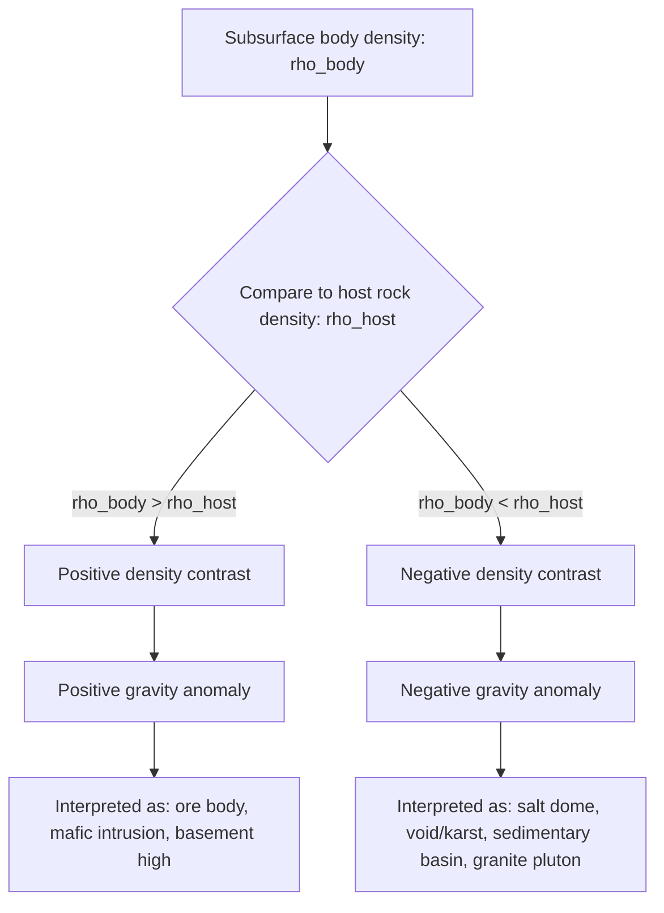

## Gravity Surveys and Anomalies

### Overview

Gravity surveying is a geophysical exploration method that measures spatial variations in Earth's gravitational field to infer subsurface density distributions. Because rock units and structures differ in density, they produce measurable, though small, perturbations in the local gravitational acceleration. These perturbations, once isolated from all other predictable effects, are called gravity anomalies and form the basis for interpreting subsurface geology.

### Physical Basis

**Newton's Law of Gravitation**

The gravitational attraction between two masses is given by:

$$F = G\frac{m_1 m_2}{r^2}$$

where $G$ is the universal gravitational constant ($6.674 \times 10^{-11}\ \text{N}\cdot\text{m}^2/\text{kg}^2$), $m_1$ and $m_2$ are the interacting masses, and $r$ is the separation distance.

For a survey station on Earth's surface, the quantity of interest is the acceleration due to gravity, $g$, not force:

$$g = G\frac{M}{r^2}$$

where $M$ is Earth's mass and $r$ is the distance from Earth's center to the station.

**Units**

- SI unit: $\text{m/s}^2$
- Conventional geophysical unit: the gal ($1\ \text{Gal} = 1\ \text{cm/s}^2$)
- Practical field unit: the milligal (mGal), where $1\ \text{mGal} = 10^{-5}\ \text{m/s}^2$
- Modern relative gravimeters resolve to the microgal ($\mu\text{Gal}$) level in high-precision work

Average surface gravity is approximately $980{,}000\ \text{mGal}$ (about $9.8\ \text{m/s}^2$), so anomalies of interest — typically tens to a few hundred mGal for regional structures, and fractions of a mGal for shallow engineering targets — represent a tiny fraction of the total field. This is why systematic corrections dominate survey processing.

### Instrumentation

**Relative Gravimeters**

Most exploration surveys use relative (spring-based) gravimeters, which measure differences in gravity between stations rather than absolute values.

- **LaCoste & Romberg (LCR) meters**: zero-length spring design, high sensitivity, historically an industry standard
- **Scintrex CG-5 / CG-6**: fused-quartz spring sensors, automated tilt and temperature compensation, electronic data logging
- Key error sources: instrument drift (thermal and mechanical relaxation of the spring), tares (sudden jumps from shocks), and tilt

**Absolute Gravimeters**

- Use free-fall interferometry (e.g., FG5, A-10) to measure $g$ directly by timing a falling corner-cube reflector with a laser interferometer
- Provide station values without drift correction, often used to establish base station networks

**Airborne and Marine Gravimeters**

- Mounted on gyro-stabilized platforms to isolate the sensor from vehicle accelerations
- Require additional corrections for platform motion (Eötvös correction) and are inherently lower resolution than static land surveys

**Satellite Gravimetry**

- Missions such as GRACE and GRACE-FO measure gravity field variations via inter-satellite ranging, primarily used for large-scale and time-lapse (hydrological, glacial) studies rather than exploration-scale targets

### Field Survey Design

**Station Network**

- Station spacing is chosen based on the target's depth and lateral extent — a general rule is that station spacing should not exceed the depth of the shallowest target of interest
- Regional reconnaissance surveys: station spacing of hundreds of meters to kilometers
- Detailed exploration or engineering surveys: station spacing of meters to tens of meters

**Base Stations and Looping**

- A base station with known or repeatedly occupied gravity value is used to monitor instrument drift
- Survey loops begin and end at the base station within a limited time window (typically under a few hours) so that drift can be modeled as linear or low-order polynomial over the loop
- Precise positioning (horizontal and especially vertical, via differential GPS or leveling) is essential, since elevation errors translate directly into gravity errors through the free-air effect

**Tie to Absolute Reference**

- Regional surveys are tied into national or international gravity base networks (e.g., the International Gravity Standardization Net, IGSN71) to allow comparison across surveys and datasets

### Data Reduction and Corrections

Raw gravimeter readings must be corrected for known, predictable effects before any geologically meaningful anomaly can be isolated. The general processing sequence is:

**1. Instrument Drift Correction**

Removes the effect of spring relaxation over time, computed by comparing repeat readings at the base station within a loop and applying a linear (or higher-order) time-based correction.

**2. Tidal Correction**

Removes the periodic effect of Sun and Moon gravitational attraction, which can shift readings by up to approximately 0.3 mGal. Computed from theoretical tidal models as a function of time and location, or handled automatically by modern instrument firmware.

**3. Latitude Correction**

Earth's rotation and equatorial bulge cause gravity to increase from the equator toward the poles. The theoretical gravity at latitude $\phi$ on the reference ellipsoid is given by the International Gravity Formula (1980):

$$g_\phi = g_e \left(1 + 0.0053024 \sin^2\phi - 0.0000058 \sin^2(2\phi)\right)$$

where $g_e$ is theoretical gravity at the equator ($978{,}032.7\ \text{mGal}$). The latitude correction is subtracted from the observed, drift- and tide-corrected reading.

**4. Free-Air Correction**

Accounts for the decrease in gravity with elevation above (or below) the reference datum, due purely to increased distance from Earth's center (no mass considered):

$$\delta g_{FA} = 0.3086 \times h\ \text{mGal}$$

where $h$ is station elevation in meters above the datum. This correction is added for stations above datum.

**5. Bouguer Correction**

Accounts for the gravitational attraction of the rock mass between the station and the datum (the "Bouguer slab"), which the free-air correction ignores:

$$\delta g_B = 0.04193 \times \rho \times h\ \text{mGal}$$

where $\rho$ is the assumed slab density in $\text{g/cm}^3$ (commonly $2.67\ \text{g/cm}^3$ for average crustal rock) and $h$ is elevation in meters. This correction is subtracted for stations above datum, since the extra mass adds to observed gravity and must be removed.

**6. Terrain (Topographic) Correction**

Corrects for the effect of irregular topography around the station — both nearby valleys (which reduce gravity, an under-attraction not accounted for by the flat Bouguer slab) and nearby hills (which also reduce vertical-component gravity at the station due to their horizontal-to-oblique pull). Traditionally computed using Hammer charts (concentric zone templates), now computed digitally using digital elevation models (DEMs) via ring or prism integration methods (e.g., Nagy's prism formula).

**7. Eötvös Correction (moving platforms only)**

Applies to airborne and marine surveys, correcting for the Coriolis-related acceleration induced by the survey vehicle's velocity relative to Earth's rotation:

$$\delta g_E = 7.503\, V \cos\phi \sin\alpha + 0.004154\, V^2$$

where $V$ is vehicle speed (knots), $\phi$ is latitude, and $\alpha$ is heading (measured clockwise from north).

### Anomaly Types

**Free-Air Anomaly**

$$\Delta g_{FA} = g_{obs} - g_\phi + \delta g_{FA}$$

Includes only latitude and free-air corrections (no mass correction for the rock between station and datum). Useful in marine and isostatic studies since it reflects the total gravitational effect of both topography and the compensating (or uncompensated) mass at depth.

**Bouguer Anomaly**

$$\Delta g_B = g_{obs} - g_\phi + \delta g_{FA} - \delta g_B + \delta g_T$$

The most commonly used anomaly in exploration geophysics, as it isolates the effect of subsurface density variations after removing latitude, elevation, and known topographic mass effects. Divided into:

- **Simple Bouguer Anomaly**: without terrain correction
- **Complete Bouguer Anomaly**: with terrain correction applied

**Isostatic Anomaly**

Bouguer anomaly further corrected for the gravitational effect of deep compensating masses predicted by isostatic models (e.g., Airy or Pratt isostasy), used to study crustal-scale mass balance and mountain root structures.

### Regional–Residual Separation

Observed Bouguer anomalies represent a superposition of effects from shallow (local) and deep (regional) sources. Interpretation of a specific target requires separating these components.

**Common Techniques**

- **Graphical/manual smoothing**: hand-drawn regional trend surfaces subtracted from observed data
- **Polynomial trend surface fitting**: least-squares fitting of low-order polynomials to represent the regional field, with the residual being the target signal
- **Moving average / low-pass filtering**: spatial filters that suppress short-wavelength (local) variation to estimate the regional field
- **Upward continuation**: mathematically projects the observed field to a higher elevation, attenuating shorter-wavelength (shallower) anomalies and isolating deeper regional sources
- **Wavelength (Fourier) filtering**: separates anomalies by spatial frequency content, since deep sources produce broad, long-wavelength anomalies and shallow sources produce narrow, short-wavelength anomalies

### Anomaly Interpretation

**Qualitative Interpretation**

- Anomaly shape, amplitude, and gradient provide first-order clues to source geometry, depth, and density contrast
- Elongated anomalies suggest linear structures (faults, dikes, fold axes)
- Circular/equant anomalies suggest pluton-like or diapiric bodies (e.g., salt domes, intrusions)

**Quantitative Interpretation — Forward Modeling**

Simple geometric bodies have closed-form gravity expressions used as interpretation building blocks:

*Sphere (point mass approximation for buried spherical body):*

$$\Delta g(x) = \frac{4}{3}\pi G \Delta\rho R^3 \frac{z}{(x^2 + z^2)^{3/2}}$$

where $\Delta\rho$ is density contrast, $R$ is sphere radius, $z$ is depth to center, and $x$ is horizontal distance from the point above the sphere's center.

*Infinite horizontal cylinder:*

$$\Delta g(x) = 2\pi G \Delta\rho R^2 \frac{z}{x^2 + z^2}$$

*Semi-infinite vertical slab/fault step:*

$$\Delta g(x) = 2 G \Delta\rho\, t \left(\frac{\pi}{2} + \tan^{-1}\frac{x}{z}\right)$$

where $t$ is slab thickness.

**Depth Estimation Rules of Thumb**

- **Half-width method**: for a sphere, the depth to center $z$ is approximately $1.3$ times the half-width of the anomaly at half its maximum amplitude
- **Second derivative/maximum gradient methods**: used to sharpen edges and locate boundaries of tabular or fault-like bodies

**Quantitative Interpretation — Inverse Modeling**

- Iterative forward modeling: an initial subsurface density model is refined by comparing computed and observed anomalies until residuals are minimized
- Non-uniqueness is a fundamental limitation: different density-geometry combinations can produce identical surface anomaly signatures [Inference — this is a well-established theoretical property of potential-field inversion, though its practical severity is model- and dataset-dependent]. Independent geological, well, or seismic constraints are needed to reduce ambiguity.
- Modern software packages (e.g., Geosoft Oasis Montaj, GM-SYS) implement 2D and 3D constrained inversion using DEM-based terrain models and layered density structures

### Applications

- **Hydrocarbon exploration**: mapping basin geometry, salt domes, and basement structure (salt has notably lower density than surrounding sediments, producing negative anomalies)
- **Mineral exploration**: detecting dense ore bodies (e.g., massive sulfides, chromite) as positive anomalies
- **Groundwater and engineering geology**: locating voids, cavities, buried channels, and karst features as negative anomalies
- **Crustal and tectonic studies**: mapping the Moho, rift structures, and isostatic compensation at regional to continental scale
- **Volcano monitoring**: repeat "4D" microgravity surveys to detect subsurface magma or fluid movement over time
- **Archaeological and forensic geophysics**: detecting buried voids, tombs, or foundations at shallow depth using high-resolution microgravimetry

### Limitations and Sources of Ambiguity

- **Non-uniqueness**: any given anomaly can be produced by an infinite set of density-depth-geometry combinations
- **Density contrast uncertainty**: interpretation requires assumed or measured density values, which may not be well constrained without borehole or sample data
- **Resolution vs. depth**: gravity resolution decreases with depth, since deep sources produce broad, low-amplitude, easily-masked anomalies
- **Terrain correction errors**: in areas of rugged topography, incomplete or coarse DEM data can introduce significant residual error
- **Cultural and near-surface noise**: nearby buildings, vehicles, or shallow soil density variations can obscure target signals in high-resolution surveys

### Example Workflow

1. Design station grid based on target depth (e.g., 50 m spacing for a target expected at ~100 m depth)
2. Occupy stations with a relative gravimeter, looping through a base station every 2–3 hours
3. Record precise elevation and coordinates at each station (differential GPS)
4. Apply drift, tidal, latitude, free-air, Bouguer, and terrain corrections to compute the Complete Bouguer Anomaly
5. Perform regional-residual separation (e.g., upward continuation) to isolate the local anomaly of interest
6. Forward-model simple bodies (sphere, cylinder, slab) to obtain first-pass depth and density-contrast estimates
7. Refine via constrained inversion using any available independent geological control
8. Integrate results with other geophysical methods (magnetics, seismic, resistivity) for a multi-method subsurface model

### Anomaly Correction Workflow (svg_diagram)

<svg xmlns="http://www.w3.org/2000/svg" viewBox="0 0 900 480" font-family="Helvetica, Arial, sans-serif">
<text x="450" y="30" font-size="18" font-weight="bold" text-anchor="middle" fill="#111">Gravity Data Reduction Workflow (svg_diagram)</text>

<g font-size="13">
<rect x="30" y="60" width="180" height="50" rx="6" fill="#eef3fb" stroke="#3b5b92" />
<text x="120" y="90" text-anchor="middle">Observed Reading (g_obs)</text>



```
<rect x="30" y="140" width="180" height="50" rx="6" fill="#eef3fb" stroke="#3b5b92" />
<text x="120" y="165" text-anchor="middle">Drift Correction</text>
<text x="120" y="180" text-anchor="middle" font-size="11">(base station looping)</text>

<rect x="30" y="220" width="180" height="50" rx="6" fill="#eef3fb" stroke="#3b5b92" />
<text x="120" y="245" text-anchor="middle">Tidal Correction</text>
<text x="120" y="260" text-anchor="middle" font-size="11">(Sun/Moon model)</text>

<rect x="260" y="60" width="180" height="50" rx="6" fill="#eef3fb" stroke="#3b5b92" />
<text x="350" y="90" text-anchor="middle">Latitude Correction</text>

<rect x="260" y="140" width="180" height="50" rx="6" fill="#eef3fb" stroke="#3b5b92" />
<text x="350" y="165" text-anchor="middle">Free-Air Correction</text>
<text x="350" y="180" text-anchor="middle" font-size="11">0.3086 × h</text>

<rect x="260" y="220" width="180" height="50" rx="6" fill="#eef3fb" stroke="#3b5b92" />
<text x="350" y="245" text-anchor="middle">Bouguer Correction</text>
<text x="350" y="260" text-anchor="middle" font-size="11">0.04193 × ρ × h</text>

<rect x="490" y="140" width="180" height="50" rx="6" fill="#eef3fb" stroke="#3b5b92" />
<text x="580" y="165" text-anchor="middle">Terrain Correction</text>
<text x="580" y="180" text-anchor="middle" font-size="11">(DEM / Hammer chart)</text>

<rect x="330" y="320" width="240" height="55" rx="6" fill="#dff0d8" stroke="#3c763d" />
<text x="450" y="345" text-anchor="middle" font-weight="bold">Complete Bouguer Anomaly</text>
<text x="450" y="362" text-anchor="middle" font-size="11">Δg_B</text>

<rect x="330" y="410" width="240" height="55" rx="6" fill="#fcf3cf" stroke="#9a7d0a" />
<text x="450" y="435" text-anchor="middle" font-weight="bold">Regional–Residual Separation</text>
<text x="450" y="452" text-anchor="middle" font-size="11">→ subsurface interpretation</text>
```

</g>

<g stroke="#333" stroke-width="1.5" marker-end="url(#arrow)" fill="none">
<path d="M120,110 L120,140" />
<path d="M120,190 L120,220" />
<path d="M210,85 L260,85" />
<path d="M210,165 L260,165" />
<path d="M210,245 L260,245" />
<path d="M440,165 L490,165" />
<path d="M350,270 L440,320" />
<path d="M450,375 L450,410" />
</g>
</svg>

### Density Contrast and Anomaly Sign Logic



**Next Steps**

- Magnetic Surveys and Anomalies (comparison of potential-field methods)
- Seismic Refraction and Reflection Methods
- Electrical Resistivity Surveying
- Isostasy and Crustal Structure
- Digital Elevation Models in Geophysical Terrain Correction
- Potential Field Inversion Theory and Non-Uniqueness
- Microgravity Applications in Engineering and Archaeological Geophysics
- Integrated Multi-Method Geophysical Interpretation