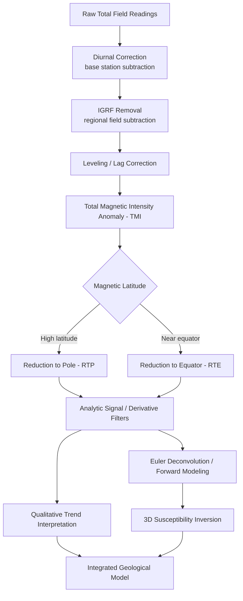

## Magnetic Surveys and Interpretation

### Overview

Magnetic surveying measures spatial variations in Earth's magnetic field to infer subsurface geology. Rocks and minerals differ in magnetic susceptibility and remanent magnetization, producing local perturbations (anomalies) superimposed on Earth's main field. Magnetic surveys are among the fastest and least expensive geophysical methods, widely used from regional reconnaissance to detailed engineering and archaeological investigations.

### Physical Basis

**Earth's Magnetic Field**

Earth's magnetic field approximates a dipole field, described at any point by three main elements:

- **Total field intensity ($F$)**: magnitude of the field vector, expressed in nanotesla (nT)
- **Inclination ($I$)**: angle between the field vector and the horizontal plane
- **Declination ($D$)**: angle between magnetic north and true north

The field varies globally from about 25,000 nT near the equator to about 65,000 nT near the magnetic poles.

**International Geomagnetic Reference Field (IGRF)**

The IGRF is a mathematical model, updated every 5 years by international agreement, that describes Earth's main field as a function of location, elevation, and time using spherical harmonic coefficients. Survey processing subtracts the IGRF value at each station/time to remove the predictable regional field, isolating the local anomaly caused by shallow crustal sources.

**Induced vs. Remanent Magnetization**

- **Induced magnetization**: magnetization acquired by a rock in the presence of Earth's current field, proportional to magnetic susceptibility ($\kappa$) and field strength: $M_i = \kappa H$
- **Remanent magnetization**: "fossil" magnetization locked into a rock at the time of its formation or alteration (e.g., thermoremanent magnetization in cooling igneous rocks), which may differ in direction and magnitude from the present field
- The **Königsberger ratio** ($Q = M_r / M_i$) expresses the relative importance of remanent versus induced magnetization; high-$Q$ rocks (e.g., some volcanics) can produce anomalies inconsistent with simple induced-field modeling

**Magnetic Susceptibility**

Magnetic susceptibility ($\kappa$, dimensionless in SI) varies enormously between rock and mineral types:

| Material | Typical Susceptibility (SI, ×10⁻³) |
| --- | --- |
| Magnetite | 1,000–20,000 |
| Basalt | 0.2–175 |
| Gabbro | 1–90 |
| Granite | 0–50 |
| Limestone | 0–3 |
| Sandstone/Shale | 0–20 |
| Quartz/Salt | ~0 (diamagnetic, slightly negative) |

Magnetite content is the dominant control on susceptibility in most rock types, making magnetic surveys highly sensitive to mafic/ultramafic rocks, banded iron formations, and magnetite-bearing ore deposits.

### Instrumentation

**Proton Precession Magnetometer**

- Measures total field intensity via the precession frequency of protons in a hydrocarbon fluid after polarization by an applied field
- Robust, absolute measurement (no drift), moderate sensitivity (~1 nT), widely used for base station and reconnaissance work

**Overhauser Magnetometer**

- A refinement of the proton precession design using dynamic nuclear polarization for faster cycle times and higher sensitivity (~0.01–0.1 nT), suited to continuous mobile surveying

**Fluxgate Magnetometer**

- Measures vector field components (not just total intensity) using saturable ferromagnetic cores
- Lower absolute accuracy but capable of high-rate vector measurement; used in some airborne and directional applications, and in magnetotelluric/variometer setups

**Optically Pumped (Cesium/Potassium Vapor) Magnetometer**

- Uses atomic resonance (Zeeman splitting) for very high sensitivity (~0.001 nT) and fast sampling rates
- Standard for modern airborne, marine, and high-resolution ground and UAV surveys

**Gradiometers**

- Two sensors mounted at a fixed vertical or horizontal separation measure the spatial gradient of the field directly
- Suppresses temporal (diurnal) variation without requiring a separate base station, and enhances resolution of shallow, small-scale sources — widely used in archaeological and unexploded ordnance (UXO) surveys

### Field Survey Design

**Platforms**

- **Ground surveys**: highest resolution, used for detailed exploration, engineering, and archaeological targets; station or continuous-walk spacing from under 1 m to several meters
- **Airborne surveys**: fixed-wing or helicopter-borne, efficient for regional and reconnaissance coverage; line spacing from tens of meters (detailed) to kilometers (regional), flown at low, controlled terrain-draped altitude
- **Marine surveys**: towed magnetometer (to remove ship's own magnetic interference) for offshore exploration and geological mapping
- **UAV (drone) magnetometry**: increasingly used for high-resolution, low-altitude surveys over difficult terrain [Inference — reflects current industry practice as of recent years; specific platform capabilities continue to evolve rapidly]

**Base Station Monitoring**

A stationary base magnetometer continuously records the diurnal variation of the field (caused by ionospheric current systems) so that this time-varying component can be subtracted from mobile survey readings collected at the same time.

**Line Spacing and Sampling**

Line spacing and along-line sample spacing are chosen relative to target depth and size, following the same general principle as gravity surveys: closer spacing resolves shallower and smaller targets.

### Data Reduction and Corrections

**1. Diurnal Correction**

Removes time-varying field changes recorded at the base station, synchronized by time stamp to each survey reading.

**2. IGRF (Regional Field) Removal**

Subtracts the modeled main field value (accounting for location, elevation, and survey date) from the diurnal-corrected reading, isolating the crustal (anomalous) field.

**3. Heading/Compensation Correction (airborne/marine)**

Corrects for magnetic effects of the survey platform itself (aircraft, ship), typically established through a compensation flight/run pattern and applied via a compensation algorithm.

**4. Leveling**

Adjusts for small line-to-line or tie-line mismatches (residual errors from diurnal or positioning inaccuracies) so that data merge smoothly into a consistent grid, often using tie-line intersections and least-squares leveling.

**5. Lag/Positioning Correction**

Corrects for the sensor's physical offset from the GPS antenna (particularly in towed-bird airborne configurations) so anomaly locations align with true source positions.

After these steps, the resulting dataset is termed the **Total Magnetic Intensity (TMI)** anomaly, or in some processing conventions, the **residual magnetic field**.

### Anomaly Enhancement and Filtering

Because magnetic anomalies are strongly shape-distorted by the inclination/declination of the inducing field (a phenomenon not present in gravity data), specialized filters are used to aid interpretation.

**Reduction to Pole (RTP)**

Mathematically transforms the anomaly as though it were measured at the magnetic pole (where induced anomalies are symmetric and centered directly over their source), removing the skewing effect of oblique inclination/declination. Most effective at high magnetic latitudes; becomes numerically unstable near the magnetic equator, where **Reduction to Equator (RTE)** is preferred instead.

**Analytic Signal**

Computes the amplitude of the total gradient vector, producing anomaly peaks centered over source edges regardless of magnetization direction (both induced and remanent) — useful when remanence is significant and RTP assumptions are violated.

**Vertical and Horizontal Derivatives**

- **First vertical derivative**: sharpens anomalies, enhances shallow/near-surface sources, and improves resolution of closely spaced bodies
- **Horizontal derivative / tilt derivative**: aids boundary/edge detection of source bodies

**Upward Continuation**

Projects the field to a higher elevation, attenuating short-wavelength (shallow) anomalies to emphasize deep, regional sources — directly analogous to its gravity application.

**Power Spectrum Depth Estimation**

Analyzes the radially averaged power spectrum of gridded magnetic data in the frequency domain; the slope of the log-power spectrum versus wavenumber gives a statistical estimate of the average depth to the top of an ensemble of magnetic sources.

### Anomaly Interpretation

**Qualitative Interpretation**

- Anomaly shape is strongly influenced by magnetic latitude: at high latitudes anomalies are simple, roughly symmetric highs over positively magnetized bodies; near the equator anomalies become dipolar, with a low flanking a high
- Linear, elongated anomaly trends suggest dikes, faults, or shear zones (often associated with magnetite alteration along fault planes)
- Circular anomalies suggest plugs, plutons, or kimberlite pipes

**Quantitative Interpretation — Forward Modeling**

Simple source geometries have analytic magnetic anomaly expressions used as first-pass interpretation tools, analogous to gravity forward modeling:

*Vertically magnetized sphere (dipole approximation), profile anomaly:*

$$\Delta Z(x) = \frac{2 G_m M z (2z^2 - x^2)}{(x^2+z^2)^{5/2}}$$

where $M$ is the dipole moment, $z$ is depth to center, $x$ is horizontal offset, and $G_m$ is the magnetic constant term (form varies with convention used).

*Thin dike / tabular body:*

Modeled via analytic dike formulas parameterized by depth to top, dip, strike width, and magnetization contrast; widely implemented in software (e.g., GM-SYS, Oasis Montaj MAGMAP) for interactive 2D profile fitting.

**Depth Estimation Rules of Thumb**

- **Peters' half-slope method**: depth to a tabular/dike-like source estimated from the horizontal distance between points where the anomaly gradient reaches specific fractions of its maximum slope
- **Werner deconvolution**: automated, model-based method assuming dike/contact sources, solving simultaneously for depth, position, and dip along a profile
- **Euler deconvolution**: uses Euler's homogeneity equation with an assumed structural index (a parameter representing source geometry — e.g., sphere, dike, contact) to automatically estimate source location and depth across a grid or profile, widely used for rapid, semi-automated interpretation

**3D Inversion**

Modern workflows commonly invert magnetic grids (often jointly with gravity) into 3D susceptibility or magnetization models using voxel-based unconstrained or geologically-constrained inversion (e.g., UBC-GIF's MAG3D, Geosoft VOXI). As with gravity, magnetic inversion is inherently non-unique and benefits from independent geological, drilling, or petrophysical constraints. [Inference — non-uniqueness is an established theoretical property of potential-field inversion generally, consistent with the gravity case above]

### Applications

- **Mineral exploration**: direct detection of magnetite-bearing iron ore, and indirect detection of base-metal and precious-metal deposits associated with magnetic alteration halos (e.g., IOCG deposits, porphyry systems, kimberlites)
- **Petroleum exploration**: mapping basement depth and structure (basement rocks are typically more magnetic than overlying sediments), aiding basin architecture interpretation
- **Structural mapping**: delineating faults, shear zones, dikes, and lithological contacts from linear anomaly trends
- **Unexploded ordnance (UXO) and archaeological surveys**: high-resolution gradiometer surveys detect buried ferrous objects, kilns, hearths, and structural remains
- **Engineering and environmental investigations**: locating buried drums, pipelines, and utility infrastructure
- **Regional/continental tectonic studies**: aeromagnetic compilations used to map crustal provinces, sutures, and basement terranes

### Limitations and Sources of Ambiguity

- **Non-uniqueness**: as with gravity, distinct source geometries and magnetization distributions can produce identical observed anomalies
- **Remanent magnetization**: can cause anomalies to be shifted, inverted, or otherwise inconsistent with simple induced-field models, complicating both RTP processing and forward modeling
- **Magnetic latitude effects**: anomaly shape distortion near the equator requires careful use of RTE or analytic signal processing rather than raw TMI interpretation
- **Cultural noise**: fences, vehicles, buildings, and buried metal objects can produce large, sharp anomalies unrelated to geology, particularly problematic in urban or infrastructure-dense survey areas
- **Diurnal/geomagnetic storm activity**: severe space weather can introduce rapid field variations exceeding normal base-station correction capacity, sometimes requiring survey suspension

### Example Workflow

1. Select platform (ground, airborne, marine, or UAV) and design line spacing based on target depth
2. Establish a base station to record diurnal variation throughout the survey period
3. Acquire total field (or gradiometer) readings along survey lines with continuous GPS positioning
4. Apply diurnal correction, then remove the IGRF regional field to obtain the TMI anomaly
5. Perform leveling and lag corrections to produce a coherent gridded dataset
6. Apply enhancement filters (RTP or RTE, analytic signal, derivatives) appropriate to the survey's magnetic latitude and remanence characteristics
7. Interpret qualitatively (trend and lithology mapping) and quantitatively (Euler deconvolution, forward/inverse modeling) to estimate source depth, geometry, and magnetization
8. Integrate with gravity, EM, and geological/drilling data for a constrained multi-method subsurface model

### Magnetic Anomaly Shape vs. Magnetic Latitude (svg_diagram)

<svg xmlns="http://www.w3.org/2000/svg" viewBox="0 0 900 420" font-family="Helvetica, Arial, sans-serif">
<text x="450" y="30" font-size="18" font-weight="bold" text-anchor="middle" fill="#111">Anomaly Shape vs. Magnetic Latitude (svg_diagram)</text>

<g>
<text x="180" y="65" font-size="14" font-weight="bold" text-anchor="middle">High Magnetic Latitude</text>
<line x1="40" y1="200" x2="340" y2="200" stroke="#999" stroke-width="1" />
<path d="M40,195 C120,195 150,90 180,90 C210,90 240,195 340,195" fill="none" stroke="#c0392b" stroke-width="2.5" />
<circle cx="180" cy="240" r="14" fill="#555" />
<text x="180" y="270" font-size="11" text-anchor="middle">Magnetized body (positive contrast)</text>
<text x="180" y="130" font-size="11" text-anchor="middle" fill="#c0392b">Simple symmetric high</text>
</g>

<g>
<text x="620" y="65" font-size="14" font-weight="bold" text-anchor="middle">Near Magnetic Equator</text>
<line x1="470" y1="200" x2="770" y2="200" stroke="#999" stroke-width="1" />
<path d="M470,195 C520,195 540,230 570,230 C600,230 610,110 640,110 C670,110 690,195 770,195" fill="none" stroke="#2980b9" stroke-width="2.5" />
<circle cx="620" cy="240" r="14" fill="#555" />
<text x="620" y="270" font-size="11" text-anchor="middle">Magnetized body (positive contrast)</text>
<text x="555" y="255" font-size="11" fill="#2980b9">low</text>
<text x="645" y="150" font-size="11" fill="#2980b9">high</text>
<text x="620" y="300" font-size="11" text-anchor="middle" fill="#2980b9">Dipolar anomaly (low + high)</text>
</g>
<text x="450" y="360" font-size="12" text-anchor="middle" fill="#333">
Reduction-to-Pole (RTP) recenters high-latitude-style anomalies; Reduction-to-Equator (RTE) used instead near the magnetic equator.
</text>
</svg>

### Magnetic Survey Processing Sequence

**Next Steps**

- Gravity Surveys and Anomalies (comparison of potential-field methods)
- Electromagnetic (EM) Survey Methods
- Seismic Refraction and Reflection Methods
- Petrophysics: Density and Magnetic Susceptibility of Rocks
- Euler and Werner Deconvolution Techniques
- 3D Potential Field Inversion (UBC-GIF, VOXI)
- Aeromagnetic Survey Design and Compensation
- Archaeogeophysics and UXO Detection Methods