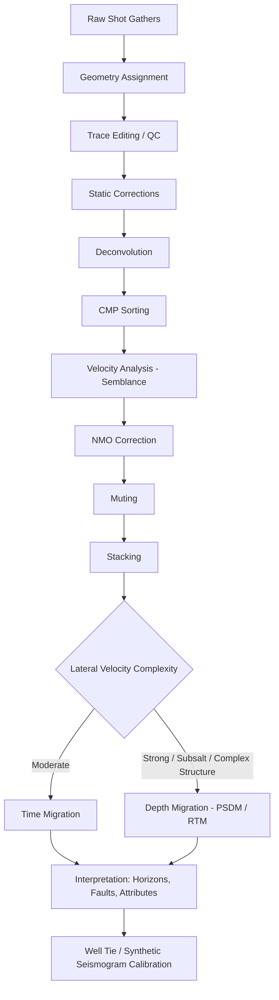

## Seismic Reflection and Refraction Methods

### Overview

Seismic methods use artificially generated elastic waves to image subsurface structure and estimate physical properties of rocks and sediments. Two principal approaches — reflection and refraction seismology — exploit different aspects of wave propagation at velocity boundaries (interfaces between layers with contrasting acoustic/elastic properties) to recover subsurface geometry, depth, and velocity structure.

### Physical Basis

**Elastic Wave Types**

- **P-waves (compressional/primary waves)**: particle motion parallel to propagation direction; travel through solids, liquids, and gases; fastest wave type, used in most conventional seismic surveys
- **S-waves (shear/secondary waves)**: particle motion perpendicular to propagation direction; travel only through solids (no shear strength in fluids); slower than P-waves, used in specialized multicomponent surveys
- **Surface waves (Rayleigh, Love)**: travel along the free surface with amplitude decaying with depth; generally treated as noise in body-wave surveys but exploited directly in surface-wave methods (e.g., MASW) for near-surface shear-velocity profiling

**Seismic Velocity**

P-wave velocity in an elastic medium is given by:

$$V_p = \sqrt{\frac{K + \frac{4}{3}\mu}{\rho}}$$

where $K$ is the bulk modulus, $\mu$ is the shear modulus, and $\rho$ is density. S-wave velocity is:

$$V_s = \sqrt{\frac{\mu}{\rho}}$$

Velocity generally increases with depth due to compaction, cementation, and reduced porosity, though velocity inversions (lower-velocity layers beneath higher-velocity layers) do occur and create specific interpretation challenges.

**Reflection and Refraction at an Interface**

When a wave encounters a boundary between media of different acoustic impedance ($Z = \rho V$), part of the energy reflects and part transmits (refracts), governed by Snell's Law:

$$\frac{\sin\theta_1}{V_1} = \frac{\sin\theta_2}{V_2}$$

The **reflection coefficient** for normal incidence is:

$$R = \frac{Z_2 - Z_1}{Z_2 + Z_1} = \frac{\rho_2 V_2 - \rho_1 V_1}{\rho_2 V_2 + \rho_1 V_1}$$

**Critical Refraction**

When a wave travels from a slower to a faster medium ($V_2 > V_1$), there exists a critical angle $\theta_c$ at which the refracted ray travels exactly along the interface:

$$\theta_c = \sin^{-1}\left(\frac{V_1}{V_2}\right)$$

This critically refracted wave (the "head wave") propagates along the boundary at velocity $V_2$, continuously radiating energy back to the surface — the physical basis of the refraction method.

### Seismic Sources

- **Ground surveys**: sledgehammer and plate (shallow, low-cost, engineering-scale), weight drop, accelerated weight drop, seismic vibrator (Vibroseis, producing a controlled swept-frequency signal), explosives/dynamite in shot holes (higher energy, deeper penetration)
- **Marine surveys**: air guns (compressed air release producing an acoustic pulse), historically also water guns and sparkers for higher-resolution shallow work

### Receivers and Recording

- **Geophones**: electromagnetic transducers (moving coil in a magnetic field) that convert ground velocity into voltage, used predominantly on land
- **Hydrophones**: piezoelectric sensors measuring pressure variation, used in marine streamers and boreholes
- **Multicomponent sensors**: 3-component geophones recording both P- and S-wave motion, used in advanced land and ocean-bottom surveys
- **Recording systems**: modern seismographs digitize and record signals from arrays of tens to thousands of channels simultaneously, with geometry (source-receiver offsets) precisely logged for processing

### Seismic Refraction Method

**Principle**

Refraction surveys record the first-arrival travel times of critically refracted head waves at a series of receivers along a line, from which layer velocities and depths can be derived. The method requires velocity to increase with depth at each successive interface.

**Travel-Time Equations (Flat, Horizontal Layers)**

For a single horizontal layer over a half-space:

- Direct wave travel time: $t_d = \dfrac{x}{V_1}$
- Refracted (head wave) travel time: $t_r = \dfrac{x}{V_2} + \dfrac{2h\cos\theta_c}{V_1}$

where $x$ is source-receiver offset, $h$ is depth to the interface, and $V_1$, $V_2$ are layer velocities ($V_2 > V_1$).

On a travel-time curve (time vs. offset), the direct wave and refracted wave appear as straight-line segments with slopes $1/V_1$ and $1/V_2$ respectively; the **crossover distance** is where the refracted arrival overtakes the direct arrival and becomes the observed first break.

**Interpretation Methods**

- **Intercept-time method**: uses the time-axis intercept of the refracted line to solve for depth, assuming flat layering
- **Crossover-distance method**: estimates depth from the crossover distance and the two layer velocities
- **Reciprocal (Hagiwara/Hales) methods**: use forward and reverse shot travel-time curves to solve for dipping or irregular interfaces without assuming flat layers
- **Generalized Reciprocal Method (GRM)**: an extension allowing mapping of irregular refractor topography using paired forward/reverse shots with an optimized offset parameter
- **Delay-time methods**: decompose travel time into source-side and receiver-side delay contributions to build refractor depth profiles along a spread
- **Seismic refraction tomography**: iterative ray-tracing inversion of first-arrival times to produce a smoothly varying 2D/3D velocity model, better suited to gradational or laterally variable velocity structure than layer-based methods

**Limitations**

- **Hidden layer problem**: a thin layer with insufficient velocity contrast or thickness may not produce a distinguishable first-arrival segment, and its presence is effectively invisible to refraction interpretation
- **Velocity inversion problem**: a layer with lower velocity than the one above it cannot be detected by refraction methods, since no critical refraction occurs at such an interface
- Requires long survey lines relative to the target depth (offsets several times greater than the depth of interest), limiting resolution of deep targets

### Seismic Reflection Method

**Principle**

Reflection surveys record energy reflected from impedance-contrast interfaces at near-normal incidence, using dense receiver arrays to build a detailed structural and stratigraphic image of the subsurface. This method dominates hydrocarbon exploration and deep to intermediate structural imaging.

**Normal Moveout (NMO)**

For a horizontal reflector at depth $h$ with overburden velocity $V$, the reflection travel time at offset $x$ is:

$$t(x) = \sqrt{t_0^2 + \frac{x^2}{V^2}}$$

where $t_0 = 2h/V$ is the two-way zero-offset travel time. The offset-dependent increase in travel time relative to $t_0$ is the **normal moveout**, and NMO velocity analysis is a core step in reflection processing used to estimate subsurface velocity and correct traces to zero-offset equivalent time.

**Common Midpoint (CMP) Method**

Multiple source-receiver pairs sharing the same subsurface reflection midpoint (but different offsets) are gathered together. Because a horizontal reflector's midpoint is illuminated redundantly at multiple offsets, summing (stacking) these traces after NMO correction improves the signal-to-noise ratio and attenuates multiples and random noise. The number of traces contributing to each midpoint is the **fold** (e.g., "60-fold data"), a key quality/cost parameter in survey design.

**Processing Sequence (Land/Marine 2D/3D)**

1. **Geometry assignment**: linking recorded traces to source and receiver coordinates
2. **Editing/QC**: removal of noisy or dead traces
3. **Static corrections**: compensating for near-surface weathering-layer velocity variations and topography (particularly critical in land surveys)
4. **Deconvolution**: compressing the source wavelet and suppressing short-period multiples/reverberations to improve temporal resolution
5. **CMP sorting**: regrouping traces by common midpoint
6. **Velocity analysis**: iterative estimation of NMO (stacking) velocities via semblance analysis of CMP gathers
7. **NMO correction**: flattening reflection hyperbolas to zero-offset equivalent
8. **Muting**: removing NMO-stretched or refraction-contaminated portions of traces
9. **Stacking**: summing NMO-corrected CMP gather traces to produce a single stacked trace per midpoint
10. **Migration**: repositioning dipping and diffracted energy to its true subsurface location, converting the stacked (time) section into a structurally accurate image; performed in time or depth domain depending on velocity complexity
11. **Post-stack processing**: filtering, gain correction, and display optimization for interpretation

**Migration Approaches**

- **Time migration**: assumes moderate lateral velocity variation, computationally efficient, standard for many settings
- **Depth migration**: required in areas of strong lateral velocity contrast (e.g., beneath salt bodies, in complex thrust belts); computationally more intensive, often implemented as **pre-stack depth migration (PSDM)** for the most structurally complex targets
- **Reverse time migration (RTM)**: a full wave-equation approach handling steep dips and complex velocity structure with high accuracy, standard in modern deepwater and subsalt imaging [Inference — reflects current industry standard practice; specific algorithm choices continue to evolve with computational capability]

**Multiples and Noise**

- **Multiples**: reflections that have bounced more than once between interfaces, mimicking primary reflections at incorrect depths; suppressed via deconvolution, NMO-based discrimination, and specialized demultiple algorithms (e.g., Radon transform filtering, SRME)
- **Ground roll**: strong, low-velocity Rayleigh-wave surface noise on land data, attenuated by receiver-array design, frequency filtering, and f-k filtering
- **Multiple attenuation and noise suppression are major components of the overall processing effort**, particularly in marine data with strong water-bottom and peg-leg multiples

### Interpretation

**Structural Interpretation**

- Migrated sections are interpreted for faults, folds, unconformities, and stratal geometry, typically by horizon and fault picking on a 2D/3D seismic volume
- **Seismic stratigraphy**: interpretation of reflection terminations (onlap, downlap, toplap, truncation) to infer depositional environment and sequence stratigraphic framework
- **Amplitude Versus Offset (AVO) analysis**: examines how reflection amplitude varies with source-receiver offset/angle, used to infer lithology and pore fluid content (notably hydrocarbon indication) beyond simple structural geometry

**Well Ties and Synthetic Seismograms**

Sonic and density logs from wells are combined to generate a synthetic seismogram, calibrating seismic reflection times to true stratigraphic depth and confirming horizon identification.

**Seismic Attributes**

Derived quantities computed from the seismic volume (e.g., amplitude, instantaneous phase, frequency, coherence/similarity, curvature) used to highlight structural discontinuities, stratigraphic features, and potential fluid indicators beyond what is visible on a conventional amplitude display.

### Comparison: Refraction vs. Reflection

| Aspect | Refraction | Reflection |
| --- | --- | --- |
| Primary use | Shallow velocity structure, engineering, near-surface statics | Deep structural/stratigraphic imaging, hydrocarbon exploration |
| Required condition | Velocity must increase with depth | Any impedance contrast |
| Typical depth range | Meters to a few hundred meters (conventional); deeper with tomography | Hundreds to thousands of meters |
| Survey geometry | Longer offsets relative to target depth | Dense, redundant CMP coverage |
| Key limitation | Hidden layer / velocity inversion problems | Cost, processing complexity, multiples |
| Typical output | Layered or tomographic velocity model | Migrated structural/stratigraphic image |

### Applications

- **Hydrocarbon exploration and development**: primary tool for mapping structural traps, stratigraphic traps, and reservoir characterization (2D, 3D, and time-lapse 4D surveys for reservoir monitoring)
- **Engineering site investigation**: refraction and shallow reflection for bedrock depth, rippability assessment, and foundation design
- **Groundwater studies**: mapping aquifer geometry and bedrock topography
- **Near-surface hazard assessment**: fault location, landslide characterization, and void detection
- **Crustal and academic research**: deep seismic reflection/refraction profiling to image Moho depth, crustal layering, and tectonic structure
- **Mineral exploration**: increasing use of high-resolution reflection seismics for hardrock and deep mineral targets [Inference — an active but comparatively newer application area relative to hydrocarbon exploration, with continuing methodological development]

### Limitations and Sources of Ambiguity

- **Resolution vs. depth trade-off**: vertical resolution is fundamentally limited by dominant wavelength (approximately a quarter-wavelength for reflection tuning effects), so higher-frequency (shallow) surveys resolve thinner beds than lower-frequency (deep) surveys
- **Velocity model uncertainty**: migration and depth conversion accuracy are directly dependent on the accuracy of the velocity model, which is itself estimated from the same imperfect data
- **Multiple contamination**: incompletely suppressed multiples can be misinterpreted as primary reflectors
- **Refraction's structural blind spots**: hidden layers and velocity inversions are fundamentally undetectable by travel-time refraction methods alone
- **Anisotropy**: many rock formations (especially shales) exhibit velocity anisotropy that, if unaccounted for, introduces systematic depth and positioning errors

### Example Workflow (2D Land Reflection Survey)

1. Design survey geometry (source/receiver spacing, spread length, fold) based on target depth and required resolution
2. Deploy geophone spread and acquire shot records using a chosen source (Vibroseis, weight drop, or explosives)
3. Apply geometry, edit noisy traces, and compute static corrections for near-surface velocity variation
4. Perform deconvolution and sort data into CMP gathers
5. Conduct velocity analysis and apply NMO correction
6. Mute stretched/refraction-contaminated zones and stack CMP gathers
7. Apply time or depth migration appropriate to the structural complexity
8. Interpret the migrated section for structure and stratigraphy, tying to well control where available
9. Generate attribute volumes (3D case) to support fault and stratigraphic interpretation

### Refraction Travel-Time Curve (svg_diagram)

<svg xmlns="http://www.w3.org/2000/svg" viewBox="0 0 800 420" font-family="Helvetica, Arial, sans-serif">
<text x="400" y="30" font-size="18" font-weight="bold" text-anchor="middle" fill="#111">Refraction Travel-Time Curve (svg_diagram)</text>

<line x1="80" y1="340" x2="740" y2="340" stroke="#333" stroke-width="1.5" />
<line x1="80" y1="340" x2="80" y2="60" stroke="#333" stroke-width="1.5" />
<text x="410" y="380" font-size="13" text-anchor="middle">Offset, x</text>
<text x="30" y="200" font-size="13" text-anchor="middle" transform="rotate(-90 30 200)">Travel time, t</text>

<line x1="80" y1="340" x2="420" y2="120" stroke="#c0392b" stroke-width="2.5" />
<text x="440" y="115" font-size="12" fill="#c0392b">Direct wave (slope = 1/V1)</text>

<line x1="80" y1="260" x2="740" y2="90" stroke="#2980b9" stroke-width="2.5" />
<text x="560" y="120" font-size="12" fill="#2980b9">Refracted head wave (slope = 1/V2)</text>

<circle cx="80" cy="260" r="4" fill="#2980b9" />
<line x1="60" y1="260" x2="80" y2="260" stroke="#2980b9" stroke-width="1" stroke-dasharray="3,3" />
<text x="20" y="264" font-size="11" fill="#2980b9">t_i</text>

<circle cx="300" cy="171" r="5" fill="#111" />
<line x1="300" y1="171" x2="300" y2="340" stroke="#666" stroke-width="1" stroke-dasharray="4,4" />
<text x="300" y="360" font-size="12" text-anchor="middle">x_crossover</text>
<text x="310" y="160" font-size="11">Crossover distance</text>

<text x="410" y="60" font-size="12" text-anchor="middle" fill="#333">Beyond crossover, refracted arrival becomes the first break</text>

</svg>

### Reflection Processing Pipeline

**Next Steps**

- Gravity Surveys and Anomalies
- Magnetic Surveys and Interpretation
- Electrical Resistivity and Induced Polarization Methods
- Ground Penetrating Radar (GPR)
- Seismic Stratigraphy and Sequence Interpretation
- AVO Analysis and Fluid/Lithology Discrimination
- Seismic Anisotropy and Depth Imaging
- Multicomponent (P-S) Seismic Methods
- 4D (Time-Lapse) Reservoir Seismic Monitoring