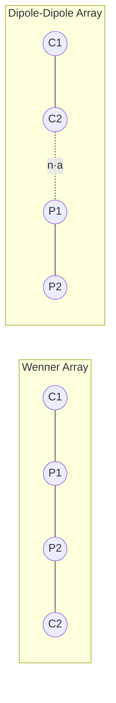
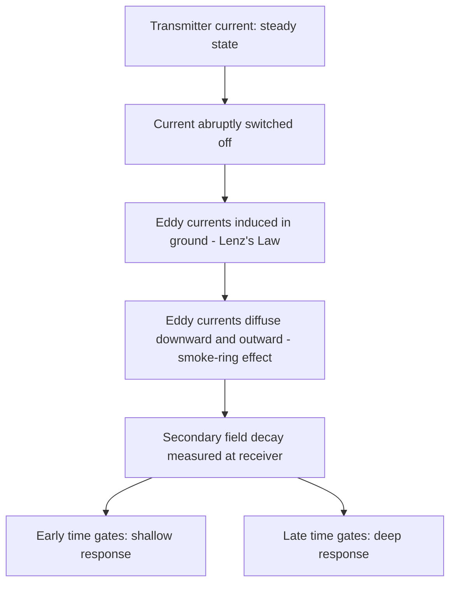

## Electrical and Electromagnetic Methods

### Overview

Electrical and electromagnetic (EM) methods are geophysical techniques that image subsurface structure and composition by measuring how earth materials respond to electric currents and electromagnetic fields. These methods exploit contrasts in electrical resistivity (or its inverse, conductivity), dielectric permittivity, and, in induced polarization work, chargeability. They are widely applied in groundwater exploration, mineral exploration, environmental site characterization, engineering geology, archaeological prospection, and hydrocarbon exploration.

The physical basis distinguishes these methods from potential-field methods (gravity, magnetics): electrical/EM methods actively or passively probe how the subsurface conducts, polarizes, or reacts to time-varying fields, rather than passively measuring a static field arising from density or magnetization contrasts.

### Fundamental Physical Properties

**Electrical Resistivity ($\rho$)**

Resistivity, measured in ohm-meters ($\Omega \cdot m$), quantifies a material's opposition to current flow. It is the reciprocal of conductivity ($\sigma$):

$$\rho = \frac{1}{\sigma}$$

Resistivity in earth materials is controlled primarily by:

- **Porosity and pore geometry** — higher porosity generally lowers bulk resistivity when pores are fluid-filled
- **Fluid saturation and salinity** — saline pore water drastically reduces resistivity
- **Clay content** — clay minerals conduct via surface (electrical double-layer) conduction, lowering resistivity independent of pore fluid
- **Temperature** — resistivity decreases with increasing temperature in most electrolytic conduction regimes
- **Mineralogy** — metallic sulfides and graphite are highly conductive; most silicate rock-forming minerals are resistive

Archie's Law relates formation resistivity to porosity and saturation in clean (clay-free) sedimentary rocks:

$$\rho_f = a \, \phi^{-m} \, S_w^{-n} \, \rho_w$$

where $\phi$ is porosity, $S_w$ is water saturation, $\rho_w$ is pore-water resistivity, $a$ is a tortuosity factor, $m$ is the cementation exponent, and $n$ is the saturation exponent.

**Typical Resistivity Ranges**

| Material | Resistivity Range ($\Omega \cdot m$) |
| --- | --- |
| Massive sulfide ores | $10^{-3}$ – $1$ |
| Graphite, magnetite | $10^{-3}$ – $10^2$ |
| Clay, wet | $1$ – $20$ |
| Saltwater-saturated sand | $0.5$ – $5$ |
| Freshwater-saturated sand/gravel | $50$ – $500$ |
| Shale | $10$ – $100$ |
| Sandstone | $50$ – $500$ |
| Limestone | $100$ – $5000$ |
| Crystalline bedrock (fresh) | $10^3$ – $10^6$ |
| Dry sand/gravel | $200$ – $10{,}000$ |
| Air | effectively infinite |

**Chargeability**

Chargeability describes a material's capacity to retain polarization charge briefly after an applied current is switched off, exploited in induced polarization (IP) surveys. It is diagnostic of disseminated sulfide mineralization and clay content.

**Dielectric Permittivity**

Relevant at higher frequencies (MHz–GHz range), governing propagation velocity and reflection in ground-penetrating radar (GPR), which is often classified alongside EM methods though it operates on wave-propagation rather than diffusion principles.

### Direct Current (DC) Resistivity Methods

**Principle**

A known current $I$ is injected into the ground through two current electrodes (C1, C2), and the resulting potential difference $\Delta V$ is measured between two potential electrodes (P1, P2). The apparent resistivity is:

$$\rho_a = k \frac{\Delta V}{I}$$

where $k$ is a geometric factor dependent on electrode array geometry and spacing.

**Electrode Array Configurations**

- **Wenner array**: Equally spaced electrodes (C1-P1-P2-C2) with spacing $a$. Geometric factor $k = 2\pi a$. Good vertical resolution, moderate signal strength, moderate sensitivity to lateral heterogeneity near electrodes.
- **Schlumberger array**: Widely spaced current electrodes with closely spaced potential electrodes near the center. Efficient for vertical electrical sounding (VES) since only current electrodes need moving for most readings. Better depth of investigation per electrode movement.
- **Dipole-Dipole array**: Two closely spaced current electrode pairs and potential electrode pairs, separated by a variable factor $n$. High sensitivity to lateral resistivity variations, commonly used in 2D/3D electrical resistivity tomography (ERT) and IP surveys, but lower signal-to-noise ratio at large $n$.
- **Pole-Dipole and Pole-Pole arrays**: Use one or both "infinite" (remote) electrodes; offer deeper penetration and operational efficiency but at reduced resolution and increased susceptibility to remote electrode noise.

**Vertical Electrical Sounding (VES)**

VES progressively expands electrode spacing about a fixed center point to probe increasing depth, producing a 1D resistivity-versus-depth profile at a single location. Interpretation proceeds via forward modeling and inversion of apparent resistivity curves against layered-earth models, historically via curve-matching against master curves, now via computer inversion (e.g., least-squares or Occam's inversion).

**Electrical Resistivity Tomography (ERT)**

ERT extends DC resistivity to 2D and 3D imaging using multi-electrode arrays (typically 24–120+ electrodes) connected to a multiplexed resistivity meter. Thousands of apparent resistivity measurements across varying array geometries and electrode combinations are collected automatically, then inverted using finite-element or finite-difference forward modeling coupled with smoothness-constrained (Occam-style) or robust (L1-norm) inversion algorithms to recover a resistivity model of the subsurface.

**Depth of Investigation**

Depth of investigation is approximately proportional to electrode separation, though the precise relationship depends on array type. As a general rule of thumb: $[Inference]$ effective depth is roughly 15–30% of the maximum electrode spacing for Wenner-type arrays, though this varies with true subsurface resistivity structure and should not be treated as a fixed ratio.

### Induced Polarization (IP)

**Principle**

IP measures the ground's capacity to store and slowly release electrical charge, arising from electrochemical polarization at mineral grain–electrolyte interfaces (electrode polarization, dominant for disseminated sulfides and some oxides) and at pore constrictions and clay surfaces (membrane polarization).

**Time-Domain IP**

After current is switched off, the decaying voltage is measured over a defined time window. Chargeability $M$ is typically computed as:

$$M = \frac{1}{V_p} \int_{t_1}^{t_2} V(t) \, dt$$

where $V_p$ is the primary voltage before switch-off and $V(t)$ is the decaying secondary voltage.

**Frequency-Domain IP**

Apparent resistivity is measured at two or more frequencies; the percent frequency effect (PFE) or phase shift between current and voltage quantifies polarizability. Spectral IP (SIP) measures the full frequency response, which can be diagnostic of mineral type, grain size, and pore structure via models such as the Cole-Cole relaxation model.

**Applications**

IP is the primary geophysical tool for disseminated sulfide (porphyry copper, epithermal) mineral exploration, since disseminated ore bodies often lack the bulk conductivity contrast needed for pure resistivity methods but exhibit strong chargeability.

### Self-Potential (SP) Method

SP is a passive method measuring naturally occurring electric potentials at the surface, arising from electrochemical (mineralization, redox gradients around sulfide bodies), electrokinetic (streaming potentials from fluid flow through porous media, e.g., in dam seepage and geothermal investigations), and thermoelectric processes. No artificial current is injected; only potential differences between electrode pairs are recorded, making SP simple and low-cost, though interpretation is often qualitative due to non-uniqueness and superposition of multiple source mechanisms.

### Electromagnetic (EM) Methods — General Principles

EM methods exploit electromagnetic induction: a time-varying primary magnetic field, generated by a transmitter (a current loop or grounded wire), induces eddy currents in conductive subsurface bodies via Faraday's law. These eddy currents generate a secondary magnetic field, which is detected by a receiver coil along with the primary field. The phase and amplitude relationship between primary and secondary fields is diagnostic of subsurface conductivity, geometry, and depth.

$$\nabla \times \mathbf{E} = -\frac{\partial \mathbf{B}}{\partial t}$$

The induced eddy current response depends on the **induction number**, a dimensionless parameter relating target conductivity, geometry, frequency, and transmitter-receiver-target geometry, governing whether a survey operates in the low-induction-number (LIN) regime (response approximately linear in conductivity, used in most ground conductivity meters) or high-induction-number regime (response saturates, more relevant to time-domain EM over strong conductors).

**Skin Depth**

The depth to which EM fields penetrate before attenuating to $1/e$ of their surface amplitude is the skin depth $\delta$:

$$\delta = \sqrt{\frac{2}{\omega \mu \sigma}} \approx 503 \sqrt{\frac{\rho}{f}} \text{ (meters, for non-magnetic ground)}$$

where $\omega$ is angular frequency, $\mu$ is magnetic permeability, $\sigma$ is conductivity, $\rho$ is resistivity in $\Omega \cdot m$, and $f$ is frequency in Hz. Lower frequencies penetrate deeper but at reduced resolution; this trade-off governs frequency selection across all EM methods.

### Frequency-Domain EM (FDEM) Methods

**Ground Conductivity Meters**

Instruments such as the EM31, EM34, and EM38 (Geonics) use a fixed transmitter-receiver coil separation and operate at a single frequency in the LIN regime, providing rapid apparent-conductivity mapping for shallow investigations (contamination plumes, soil salinity, archaeological reconnaissance, UXO screening). Coil orientation (horizontal vs. vertical dipole) controls effective depth of investigation.

**Airborne FDEM**

Fixed-wing or helicopter-borne "bird" systems fly multiple coil-pair frequencies simultaneously, enabling rapid regional mapping of conductivity for mineral exploration and hydrogeological mapping over large areas.

**VLF (Very Low Frequency) Method**

VLF exploits distant military VLF radio transmitters (15–30 kHz) as a plane-wave source. Elongated conductors (fault zones, mineralized veins, fracture zones) induce a secondary field detected as tilt or ellipticity of the resultant field. VLF is simple, portable, and effective for mapping shallow linear conductors but is sensitive to transmitter availability, orientation relative to target strike, and cultural noise (power lines, fences).

### Time-Domain EM (TDEM) Methods

**Principle**

A transmitter loop carries a steady current that is abruptly switched off. Per Lenz's law, the collapsing primary field induces eddy currents in the ground that initially mimic the transmitter loop geometry near-surface, then diffuse downward and outward over time — the so-called "smoke-ring" effect. The decaying secondary field is measured at the receiver during current-off periods across a series of time gates, with early-time gates sensing shallow structure and late-time gates sensing progressively deeper structure.

**Configurations**

- **Central-loop and coincident-loop**: receiver at center of, or coincident with, transmitter loop
- **In-loop and offset-loop**: receiver inside or outside transmitter loop at fixed offset
- **Grounded-wire TDEM**: uses a long grounded transmitter wire for deeper penetration

TDEM is widely used for groundwater exploration (mapping saline/fresh water interfaces, aquifer geometry), mineral exploration (detecting massive sulfides via late-time conductive response), and permafrost/hydrogeological studies, generally offering better resolution of deep conductors than FDEM due to the wide time-gate range and absence of continuous primary-field interference during measurement.

### Magnetotellurics (MT) and Audio-Magnetotellurics (AMT)

MT is a passive EM method using naturally occurring EM fields — generated by global lightning activity (audio-frequency, AMT range: ~10 Hz–100 kHz) and magnetospheric/ionospheric current systems (lower-frequency MT range: ~0.0001–10 Hz) — as source fields. Simultaneous measurement of orthogonal horizontal electric and magnetic field components at the surface yields the surface impedance tensor:

$$Z_{xy} = \frac{E_x}{H_y}$$

from which apparent resistivity and phase are computed as a function of frequency, then inverted for a resistivity-depth model. Because natural source fields span many decades of frequency, MT can image from near-surface to crustal and upper-mantle depths (tens of kilometers) without the power limitations of controlled-source systems, making it valuable in deep crustal studies, geothermal exploration, and hydrocarbon basin analysis, though it typically has coarser resolution than controlled-source methods and is vulnerable to cultural EM noise, particularly in the AMT "dead band" (~1–5 kHz).

### Ground-Penetrating Radar (GPR)

GPR is often grouped with electrical/EM methods pedagogically, though its physics is distinct: it uses high-frequency (10 MHz–2.6 GHz) EM wave propagation and reflection, governed by contrasts in dielectric permittivity rather than diffusive induction. A transmitter antenna emits a short EM pulse; reflections occur at interfaces with contrasting dielectric properties (stratigraphic boundaries, water tables, buried objects, voids), and two-way travel time is converted to depth using an estimated or measured propagation velocity:

$$v = \frac{c}{\sqrt{\varepsilon_r}}$$

where $c$ is the speed of light in vacuum and $\varepsilon_r$ is relative dielectric permittivity. GPR performs best in resistive, low-clay, low-conductivity environments (dry sand, ice, dry rock); high electrical conductivity (e.g., saline groundwater, clay-rich soils) strongly attenuates GPR signal, since conductive loss increases wave attenuation independent of dielectric contrast.

### Data Processing and Inversion Workflow

**Key Points**

- **Data acquisition**: field measurements of apparent resistivity, chargeability, or EM response, organized by electrode/coil geometry
- **Quality control**: reciprocal error checking, contact resistance monitoring (DC methods), noise stacking, removal of outlier/bad electrode data
- **Forward modeling**: computing the theoretical geophysical response of an assumed subsurface model, typically via finite-difference, finite-element, or integral-equation methods
- **Inversion**: iteratively adjusting a subsurface model (typically discretized into cells) to minimize misfit between forward-modeled and observed data, regularized (e.g., smoothness-constrained/Occam, or sparse/blocky L1) to counteract inherent non-uniqueness
- **Non-uniqueness and equivalence**: A well-known limitation across all electrical/EM methods — different subsurface models can produce near-identical surface responses (e.g., the classic thin-conductive-layer equivalence problem in resistivity sounding, where layer thickness and resistivity trade off if their ratio/product is preserved). Independent geological or borehole constraints are essential to reduce ambiguity.

### Applications Summary

| Method | Primary Applications | Typical Depth Range |
| --- | --- | --- |
| DC Resistivity / ERT | Groundwater, geotechnical site investigation, contamination mapping | meters to ~100s of m |
| IP | Disseminated sulfide/porphyry exploration | meters to ~100s of m |
| SP | Seepage detection, sulfide ore delineation | shallow, qualitative |
| Ground conductivity (FDEM) | Soil mapping, UXO, shallow contamination | <30 m |
| VLF | Fracture/fault/vein mapping | shallow (<50 m) |
| TDEM | Groundwater, mineral exploration, saline intrusion | 10s to 100s of m |
| MT/AMT | Geothermal, crustal studies, basin exploration | 100s of m to 10s of km |
| GPR | Stratigraphy, utilities, archaeology, ice studies | <1 m to ~30 m (site-dependent) |

### Instrument Response Schematic (svg_diagram)

<svg xmlns="http://www.w3.org/2000/svg" viewBox="0 0 700 340">
<text x="350" y="25" font-size="16" font-weight="bold" text-anchor="middle">TDEM Transmitter/Receiver Response Over Time (svg_diagram)</text>
<line x1="60" y1="290" x2="650" y2="290" stroke="black" stroke-width="1.5" />
<line x1="60" y1="60" x2="60" y2="290" stroke="black" stroke-width="1.5" />
<text x="355" y="315" font-size="13" text-anchor="middle">Time</text>
<text x="30" y="175" font-size="13" text-anchor="middle" transform="rotate(-90 30 175)">Amplitude</text>
<path d="M 60 100 L 250 100 L 250 290" stroke="#1f77b4" stroke-width="2" fill="none" />
<text x="150" y="90" font-size="12" fill="#1f77b4">Primary field (on)</text>
<text x="255" y="105" font-size="12" fill="#1f77b4">switch-off</text>
<path d="M 250 290 C 300 130, 330 110, 380 105 C 450 100, 550 100, 640 100" stroke="#d62728" stroke-width="2" fill="none" stroke-dasharray="0" />
<text x="420" y="90" font-size="12" fill="#d62728">Decaying secondary field (eddy currents)</text>
<line x1="330" y1="115" x2="330" y2="290" stroke="gray" stroke-dasharray="3,3" />
<text x="335" y="140" font-size="11" fill="gray">early gates</text>
<text x="335" y="155" font-size="11" fill="gray">(shallow)</text>
<line x1="560" y1="98" x2="560" y2="290" stroke="gray" stroke-dasharray="3,3" />
<text x="565" y="140" font-size="11" fill="gray">late gates</text>
<text x="565" y="155" font-size="11" fill="gray">(deep)</text>
</svg>

### Limitations and Practical Considerations

- **Cultural noise**: Buried metallic infrastructure, power lines, and fences produce strong spurious EM responses; can be partially mitigated by frequency selection, filtering, and survey design, though results in urban/industrialized settings should be interpreted with caution regarding data quality $[Unverified — site-specific]$
- **Terrain effects**: Topography distorts apparent resistivity/EM response; requires terrain correction in rugged terrain
- **Depth-resolution trade-off**: Universal across EM/electrical methods — greater depth of investigation generally comes at the cost of resolving power for thin or small targets
- **Equivalence and suppression**: Thin resistive or conductive layers may be poorly resolved (suppression) or their properties non-uniquely determined (equivalence) from surface data alone
- **Coupling effects**: In IP surveys, electromagnetic coupling between current and potential cables can contaminate chargeability measurements, particularly at high frequencies or long cable lengths, and typically requires correction or careful array/cable design

### Integration with Other Geophysical Methods

Electrical/EM methods are frequently combined with seismic refraction/reflection (to cross-validate depth-to-bedrock and structural boundaries), gravity and magnetics (for regional structural context and to help resolve density/susceptibility versus resistivity ambiguities), and borehole geophysical logging (to ground-truth surface inversions against direct resistivity/lithology measurements at known depths).

**Related Topics**

- Seismic Refraction and Reflection Methods
- Gravity Methods in Subsurface Exploration
- Magnetic Methods and Magnetic Susceptibility
- Borehole Geophysics and Well Logging
- Archie's Law and Petrophysical Relationships
- Inversion Theory and Non-Uniqueness in Geophysics
- Airborne Geophysical Survey Systems
- Hydrogeophysics and Aquifer Characterization
- Geothermal Exploration Techniques
- Near-Surface Geophysics for Engineering and Environmental Applications