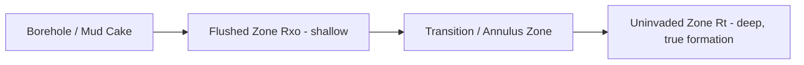
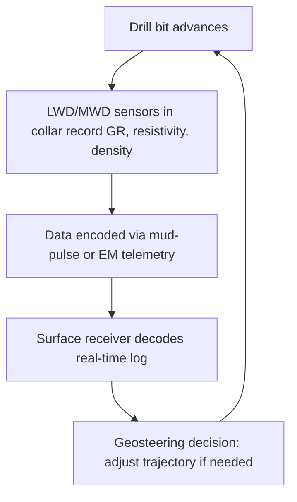

## Well Logging Techniques

### Overview

Well logging (borehole geophysical logging) is the process of recording physical, chemical, and structural properties of subsurface formations as a function of depth by lowering sensor-equipped instruments (sondes) into a borehole. Logs provide direct, continuous, in-situ measurements that ground-truth surface geophysical surveys, guide formation evaluation, and support decisions in petroleum exploration, groundwater development, mineral exploration, and geotechnical/environmental investigations. Logging is broadly divided into **wireline logging** (post-drilling, sonde lowered on an electrical cable) and **logging while drilling (LWD/MWD)** (sensors embedded in the drill string, recording in real time as drilling proceeds).

### Fundamental Concepts

**Depth of Investigation vs. Vertical Resolution**

Every logging tool involves a trade-off between how far into the formation it senses (radial depth of investigation) and how finely it resolves thin beds (vertical resolution). Tools with short source-detector spacing generally have high vertical resolution but shallow investigation depth, while long-spacing tools penetrate deeper but average over thicker intervals.

**Invasion and the Near-Wellbore Environment**

During drilling with water- or oil-based mud, drilling fluid filtrate invades permeable formations, displacing native fluids near the borehole wall and creating a radially zoned resistivity profile: the **flushed zone** ($R_{xo}$, mud-filtrate dominated), the **transition (annulus) zone**, and the **uninvaded (virgin) zone** ($R_t$, true formation resistivity). Multiple resistivity tools with different depths of investigation are used together to resolve this profile and correct shallow readings back to true formation resistivity.

### Electrical and Resistivity Logs

**Spontaneous Potential (SP) Log**

Records naturally occurring potential differences between a surface electrode and a moving downhole electrode, arising from electrochemical (membrane and liquid-junction) potentials generated where mud filtrate and formation water salinities differ across shale/sand boundaries. SP is used to identify permeable beds, estimate formation water resistivity ($R_w$), and provide a qualitative shale/sand (volume of shale) indicator. SP is unreliable in oil-based mud (no electrical continuity) and in formations where mud filtrate salinity approximates formation water salinity.

**Resistivity Logs**

- **Laterolog (focused electrode) tools**: Force current into the formation in a focused beam using guard electrodes, providing accurate resistivity readings in conductive (saline) mud systems; commonly deployed as deep (LLd) and shallow (LLs) laterolog pairs.
- **Induction logs**: Use coil arrays to induce eddy currents in the formation and measure the resulting secondary field, which is proportional to formation conductivity; effective in resistive (oil-based or fresh) muds and non-conductive boreholes (including air-filled holes), performing poorly in highly conductive muds or very resistive formations.
- **Microresistivity logs** (microlog, microspherically focused log/MSFL): Pad-mounted electrodes pressed against the borehole wall measure the flushed zone resistivity ($R_{xo}$) at high vertical resolution, also used to detect mudcake (indicating permeability) and to correct deeper resistivity readings for invasion effects.

**Formation Factor and Saturation**

Resistivity logs feed directly into Archie's Law-based water saturation calculations:

$$S_w = \left( \frac{a \, R_w}{\phi^m \, R_t} \right)^{1/n}$$

where $\phi$ is porosity (from porosity logs), $R_w$ is formation water resistivity, $R_t$ is true formation resistivity (from deep resistivity logs), and $a$, $m$, $n$ are empirical constants. This is the central petrophysical computation linking well logs to hydrocarbon or groundwater saturation estimates.

### Radioactivity (Nuclear) Logs

**Natural Gamma Ray Log**

Measures naturally occurring gamma radiation from radioactive isotopes (primarily potassium-40, and the uranium and thorium decay series) concentrated in clay minerals. It is the primary shale/lithology indicator, usable in both open and cased holes and through any mud type, making it the standard correlation log across nearly all logging suites. **Spectral gamma ray** tools further resolve the individual K, U, and Th contributions, useful for clay typing and identifying organic-rich (uranium-associated) source rock intervals.

**Density Log**

A chemical (Cs-137) or, increasingly, electronic gamma-ray source emits gamma rays that undergo Compton scattering proportional to electron density, closely related to bulk density. A detector (or dual detectors for borehole correction) measures the scattered gamma-ray count rate, converted to bulk density $\rho_b$, from which density porosity is derived:

$$\phi_D = \frac{\rho_{ma} - \rho_b}{\rho_{ma} - \rho_f}$$

where $\rho_{ma}$ is matrix (grain) density and $\rho_f$ is fluid density. The **photoelectric factor (PEF)**, measured from the low-energy portion of the gamma-ray spectrum, is sensitive to lithology (atomic number) largely independent of porosity, aiding mineral identification.

**Neutron Log**

A source (chemical, e.g., americium-beryllium, or pulsed electronic) emits fast neutrons that lose energy primarily through collisions with hydrogen nuclei; a detector measures the resulting thermal or epithermal neutron population, which is inversely related to hydrogen concentration and thus responds primarily to porosity (since pore fluids are hydrogen-rich). Neutron porosity reads high in shale (due to bound water in clay structure) and in gas-bearing zones it reads anomalously low relative to true porosity due to gas's low hydrogen index — the **neutron-density gas crossover** is a key direct hydrocarbon (gas) indicator when neutron and density porosity curves are overlain on a compatible scale.

**Combined Neutron-Density Interpretation**

Overlaying neutron and density porosity curves is standard practice:

- Curves overlay closely in clean, liquid-filled formations
- Separation with density porosity below neutron porosity indicates shale
- Crossover (density porosity above neutron porosity) indicates gas effect

### Acoustic (Sonic) Logs

**Principle**

A transmitter emits an acoustic pulse; receivers at fixed spacing measure the travel time of the compressional (P) wave (and, in advanced tools, shear and Stokes waves) through the formation. Interval transit time $\Delta t$ (μs/ft or μs/m) is converted to sonic porosity via the Wyllie time-average equation (or more rigorous models for unconsolidated/complex lithology):

$$\phi_S = \frac{\Delta t_{log} - \Delta t_{ma}}{\Delta t_f - \Delta t_{ma}}$$

where $\Delta t_{ma}$ and $\Delta t_f$ are matrix and fluid transit times respectively.

**Applications**

- **Porosity estimation**, especially where density/neutron are compromised
- **Seismic tie**: Sonic logs generate synthetic seismograms linking well data to surface seismic sections
- **Mechanical properties**: Compressional and shear velocities, combined with density, yield dynamic elastic moduli (Young's modulus, Poisson's ratio, bulk/shear modulus) for geomechanical analysis
- **Cement bond logging**: Amplitude and attenuation of the acoustic signal through casing assess cement bond quality behind casing

### Caliper and Mechanical Logs

**Caliper Log**

Mechanical arms (2-arm, 4-arm, or multi-arm) measure borehole diameter, used to detect washouts (enlarged, poorly consolidated intervals), mudcake buildup (indicating permeability, borehole diameter smaller than bit size), and to provide borehole-size corrections for other logging tools whose responses are diameter-sensitive.

**Dipmeter and Borehole Imaging Logs**

Multi-pad microresistivity or acoustic imaging tools (e.g., formation microimager, ultrasonic borehole televiewer) provide high-resolution, oriented images of the borehole wall, used to determine bedding dip and azimuth, identify fractures and their orientation, characterize sedimentary structures, and assess borehole stability (breakouts).

### Formation Evaluation and Sampling Tools

**Formation Testers**

Wireline formation testers (e.g., repeat formation tester/RFT-type tools) set a probe against the borehole wall to measure formation pressure directly and can recover small fluid samples, enabling pressure-gradient analysis to identify fluid contacts (oil-water, gas-oil) and formation permeability estimates.

**Core-Log Calibration**

Physical core samples, when available, are used to calibrate and validate log-derived porosity, permeability (via core plug analysis), and lithology interpretations, since logs are indirect proxy measurements requiring ground-truth correlation.

### Logging While Drilling (LWD) and Measurement While Drilling (MWD)

LWD/MWD tools integrate gamma ray, resistivity (often electromagnetic propagation-based), density, neutron, and directional (inclination/azimuth) sensors directly into drill collars, transmitting data to surface in real time via mud-pulse telemetry, electromagnetic telemetry, or (increasingly) wired drill pipe. LWD enables **geosteering** — real-time adjustment of the wellbore trajectory to stay within a target reservoir zone — and provides formation data before drilling fluid invasion has fully developed, which can differ from wireline logs run later on the same interval $[Unverified — invasion-timing effects are formation- and mud-system-dependent]$.

### Specialized and Environmental/Groundwater Logging

**Flowmeter and Temperature Logs**

Spinner or heat-pulse flowmeters measure fluid movement within the borehole, used to identify producing/injecting zones and detect inter-zonal flow behind casing. Temperature logs identify fluid entry points, cement top location (via heat of hydration), and gas entry (Joule-Thomson cooling effects).

**Fluid Conductivity/Resistivity Logs**

Measure borehole fluid conductivity with depth, used in groundwater studies to detect saline intrusion zones, contaminant plumes, and to identify water-producing intervals in open boreholes.

**Cased-Hole Logging**

After casing installation, logging options are limited to tools that do not require electrical contact with formation (gamma ray, neutron, cement bond/ultrasonic imaging, and cased-hole resistivity/pulsed-neutron tools), since casing electrically shields the formation from conventional resistivity measurement. **Pulsed-neutron logging** (e.g., carbon-oxygen or thermal decay time tools) enables monitoring of saturation changes behind casing over the life of a well.

### Standard Log Suite Presentation

Logs are conventionally displayed as continuous depth-track plots, typically organized into tracks:

| Track | Typical Curves |
| --- | --- |
| Track 1 (left) | Gamma ray, SP, caliper |
| Track 2 (depth) | Depth markers |
| Track 3 | Resistivity curves (deep, medium, shallow) — often logarithmic scale |
| Track 4 | Density, neutron porosity, sonic (porosity/lithology track) |

### Log Interpretation Workflow

**Key Points**

- **Environmental corrections**: Borehole size, mud weight, temperature, and invasion corrections applied before quantitative interpretation
- **Lithology identification**: Gamma ray, PEF, and neutron-density crossplots used to classify shale, sandstone, carbonate, and evaporite intervals
- **Porosity determination**: Cross-check density, neutron, and sonic porosity; account for shale and gas effects
- **Water saturation calculation**: Apply Archie's equation (clean formations) or shaly-sand models (e.g., Simandoux, Waxman-Smits) where clay conductivity is significant
- **Net pay determination**: Combine porosity, saturation, and permeability cutoffs with lithology (shale volume) cutoffs to define productive intervals
- **Correlation**: Gamma ray and resistivity logs correlated between wells to map stratigraphic continuity and structural geometry across a field

### Log Response Schematic (svg_diagram)

<svg xmlns="http://www.w3.org/2000/svg" viewBox="0 0 700 380">
<text x="350" y="25" font-size="16" font-weight="bold" text-anchor="middle">Standard Well Log Track Layout (svg_diagram)</text>
<line x1="40" y1="50" x2="40" y2="360" stroke="black" stroke-width="1" />
<line x1="200" y1="50" x2="200" y2="360" stroke="black" stroke-width="1" />
<line x1="260" y1="50" x2="260" y2="360" stroke="black" stroke-width="1" />
<line x1="440" y1="50" x2="440" y2="360" stroke="black" stroke-width="1" />
<line x1="660" y1="50" x2="660" y2="360" stroke="black" stroke-width="1" />
<text x="120" y="45" font-size="12" text-anchor="middle" font-weight="bold">Track 1: GR / SP / Caliper</text>
<text x="230" y="45" font-size="11" text-anchor="middle" font-weight="bold">Depth</text>
<text x="350" y="45" font-size="12" text-anchor="middle" font-weight="bold">Track 3: Resistivity (log scale)</text>
<text x="550" y="45" font-size="12" text-anchor="middle" font-weight="bold">Track 4: Density / Neutron</text>
<path d="M 60 60 Q 100 100 70 140 Q 50 180 110 220 Q 150 260 80 300 Q 60 330 100 355" stroke="#2ca02c" stroke-width="1.5" fill="none" />
<text x="45" y="65" font-size="9" fill="#2ca02c">GR</text>
<path d="M 300 60 Q 400 90 320 150 Q 280 200 420 250 Q 430 280 320 320 Q 300 340 340 355" stroke="#d62728" stroke-width="1.5" fill="none" />
<text x="440" y="70" font-size="9" fill="#d62728">Rt (deep)</text>
<path d="M 480 60 L 560 140 L 500 200 L 620 260 L 540 320 L 580 355" stroke="#1f77b4" stroke-width="1.5" fill="none" />
<text x="620" y="70" font-size="9" fill="#1f77b4">Density</text>
<path d="M 480 355 L 560 300 L 500 220 L 620 160 L 540 100 L 580 60" stroke="#ff7f0e" stroke-width="1.5" fill="none" stroke-dasharray="4,2" />
<text x="620" y="90" font-size="9" fill="#ff7f0e">Neutron</text>
</svg>

### Limitations and Practical Considerations

- **Tool-formation environmental sensitivity**: Borehole rugosity, mud type, temperature, and pressure can degrade log quality; correction algorithms are standard but assume conditions within calibrated ranges
- **Radioactive source handling**: Chemical-source density and neutron tools involve regulated radioactive materials, requiring certified handling, transport, and source-recovery procedures (electronic/pulsed alternatives increasingly reduce this requirement in many operations) $[Unverified — regulatory practice varies by jurisdiction and operator]$
- **Non-uniqueness in interpretation**: As with surface geophysics, multiple lithology/fluid combinations can produce similar log responses; multi-log integration and core calibration reduce (but do not eliminate) ambiguity
- **LWD vs. wireline discrepancies**: Time-lapse differences between real-time LWD readings and later wireline logs on the same interval can arise from progressive invasion; interpretation should account for logging timing relative to drilling

### Integration with Surface Geophysics and Geology

Well logs provide the essential "ground truth" tying surface geophysical surveys (seismic, resistivity, EM) to actual subsurface lithology, fluid content, and physical properties. Sonic and density logs generate synthetic seismograms for seismic-to-well ties; resistivity and porosity logs calibrate surface DC resistivity and EM inversions; and gamma ray/lithology logs support stratigraphic correlation used in structural and sedimentological basin modeling.

**Related Topics**

- Electrical and Electromagnetic Methods
- Seismic Refraction and Reflection Methods
- Archie's Law and Petrophysical Relationships
- Formation Evaluation and Petrophysics
- Core Analysis and Rock Physics
- Reservoir Characterization
- Directional Drilling and Geosteering
- Cased-Hole and Production Logging
- Hydrogeophysics and Aquifer Characterization
- Borehole Imaging and Fracture Characterization