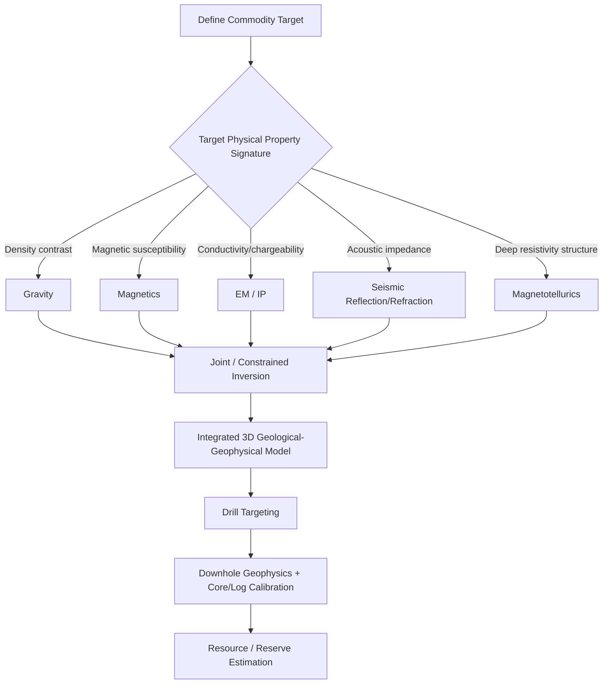

## Applications in Resource Exploration


### Overview

Resource exploration integrates the geophysical methods of gravity, magnetics, seismic reflection/refraction, and electrical/electromagnetic surveying into targeted, multi-method workflows tailored to specific commodity types. Rather than applying methods in isolation, effective exploration programs sequence and combine techniques according to the physical property contrasts each target is expected to produce, the required depth of investigation, and the cost/resolution trade-offs appropriate to each exploration stage (regional reconnaissance through detailed delineation).

### Exploration Stages and Method Sequencing

**Regional Reconnaissance**

- Low-cost, wide-coverage methods dominate: regional aeromagnetic and airborne gravity/gravity gradiometry surveys, satellite/airborne remote sensing, and regional geological/structural mapping
- Objective is to identify broad prospective terrains, structural corridors, and first-order targets for follow-up, not to resolve individual deposits

**Target Generation / Prospect Scale**

- Higher-resolution ground or airborne surveys focused on identified anomalies: detailed magnetics, IP/resistivity, TDEM, and gravity infill
- Geochemical sampling (soil, stream sediment, rock chip) typically integrated alongside geophysics at this stage

**Detailed Delineation / Resource Definition**

- Drilling-supported methods dominate: downhole/borehole geophysics, high-resolution 3D seismic (hydrocarbons), detailed ground IP/EM grids (minerals), and integrated inversion combining all available surface and downhole data
- Objective shifts from target identification to accurate geometric and grade/reserve definition

### Hydrocarbon Exploration

**Primary Method Stack**

- **Seismic reflection** is the dominant tool, from regional 2D grids through high-resolution 3D surveys, used to map structural traps (anticlines, fault blocks, salt-related structures) and stratigraphic traps (channel sands, reef buildups, pinch-outs)
- **Gravity and magnetics** support regional basin architecture interpretation, particularly basement depth (magnetics) and salt/evaporite body mapping (gravity, since salt is markedly less dense than surrounding sediments)
- **Magnetotellurics (MT)** increasingly used in structurally complex settings (subsalt, sub-basalt) where seismic imaging is degraded by velocity complexity, providing an independent resistivity-based structural constraint
- **Well logging** (resistivity, density-neutron, sonic) provides direct formation evaluation, calibrates seismic velocity models via well ties, and supports reserves estimation
- **4D (time-lapse) seismic** monitors reservoir fluid movement over the production life of a field, informing reservoir management decisions

**Integration Example**

A typical hydrocarbon exploration workflow moves from regional 2D seismic and potential-field reconnaissance, to 3D seismic acquisition over identified leads, to exploration drilling with full logging suites, to development-phase 4D seismic monitoring — with gravity/magnetic and MT data providing continuous structural and velocity-model constraints throughout.

### Mineral Exploration

**Method Selection by Deposit Type**

| Deposit Type | Primary Methods | Physical Property Basis |
| --- | --- | --- |
| Porphyry Cu-Au | IP (chargeability), magnetics, MT | Disseminated sulfides, magnetic alteration halos |
| Volcanogenic Massive Sulfide (VMS) | TDEM (ground/airborne), IP, gravity | High conductivity, high density (massive sulfide) |
| Banded Iron Formation (BIF) / Iron Ore | Magnetics, gravity | High magnetite content, high density |
| Kimberlite (diamond) | Magnetics, gravity, EM | Distinct magnetic/density signature of pipe vs. host rock |
| Nickel-Copper-PGE (magmatic sulfide) | TDEM, magnetics, gravity | Conductive sulfide mineralization, mafic/ultramafic host |
| IOCG (iron oxide copper gold) | Magnetics, gravity, IP | Magnetite/hematite alteration, associated sulfides |
| Sedimentary-hosted (e.g., MVT lead-zinc) | Resistivity, IP, gravity | Density and resistivity contrasts in host carbonates |

**Typical Workflow**

- Regional airborne magnetic (and often radiometric) survey to identify prospective structural and lithological settings
- Follow-up ground or airborne EM/IP survey over anomalies consistent with target deposit style
- Detailed ground IP/resistivity grids and gravity infill over drill-ready targets
- Downhole geophysics (magnetic susceptibility, density, resistivity, and downhole EM to detect off-hole conductors) integrated with core logging and assay data during resource drilling
- 3D inversion of combined geophysical datasets (often magnetics + gravity + IP jointly) to build a constrained 3D geological/geophysical model supporting resource estimation

### Groundwater Exploration

**Primary Method Stack**

- **Electrical resistivity (VES, ERT)** for aquifer geometry mapping, saturated/unsaturated zone delineation, and saltwater intrusion detection in coastal aquifers
- **TDEM** for regional aquifer and paleochannel mapping, particularly effective in layered sedimentary sequences
- **Seismic refraction** for bedrock depth and weathered-zone/aquifer thickness mapping in hard-rock terrains
- **Gravity** occasionally used for large-scale basin/paleovalley mapping where density contrast between saturated sediments and bedrock is significant
- **Borehole geophysics** (gamma ray, resistivity, caliper) for well construction QC and aquifer zonation once wells are drilled

**Distinguishing Feature**

Groundwater exploration typically operates at shallower depths (meters to a few hundred meters) than hydrocarbon or many mineral targets, favoring methods with strong shallow resolution (resistivity, GPR, shallow seismic) over deep-penetrating methods (deep seismic reflection, MT).

### Geothermal Exploration

**Primary Method Stack**

- **Magnetotellurics (MT)** is the standard tool for imaging the resistive-to-conductive transition associated with hydrothermal alteration (clay caps) overlying geothermal reservoirs
- **Gravity** used to map structural controls (faults, calderas) and density variations associated with intrusive heat sources
- **Microseismic monitoring** used both in exploration (natural seismicity associated with active fault/fracture systems) and during reservoir development/stimulation monitoring
- **Temperature gradient drilling** combined with the above geophysical datasets to refine reservoir models prior to full-scale production drilling

### Coal and Bulk Commodity Exploration

- **Seismic reflection** (shallow, high-resolution) for coal seam mapping, structural interpretation (faulting, folding), and seam continuity assessment
- **Gravity and magnetics** for regional basin structure and, in the case of iron ore, direct ore-body detection given magnetite's strong physical property contrast
- **Downhole geophysics** (density, gamma ray) for seam thickness, quality (ash content correlates with density), and structural correlation between boreholes

### Integrated Multi-Method Interpretation

**Joint and Constrained Inversion**

Modern exploration increasingly uses **joint inversion**, simultaneously inverting two or more geophysical datasets (e.g., gravity and magnetics, or seismic velocity and MT resistivity) under a shared structural or petrophysical framework, reducing non-uniqueness relative to inverting each dataset independently. **Constrained inversion** incorporates independent geological control (drill hole lithology/petrophysics, known structural geometry) directly into the inversion process to further reduce ambiguity.

**Data Fusion and 3D Geological Modeling**

Exploration programs increasingly build integrated 3D earth models combining geophysical inversion results, drill hole data, and structural geological interpretation within a shared modeling environment (e.g., Leapfrog, GOCAD, Petrel-type platforms depending on commodity sector), enabling consistent cross-validation between datasets and more robust resource/reserve estimation. [Inference — reflects prevailing industry practice; the specific software ecosystem in use varies by sector and continues to evolve]

**Why Multi-Method Integration Matters**

No single geophysical method uniquely resolves subsurface geology — each method is sensitive to a different physical property and carries its own resolution, depth, and ambiguity characteristics. Combining methods with complementary and ideally independent property sensitivities (e.g., density from gravity, susceptibility from magnetics, resistivity from EM, velocity from seismic) narrows the range of geologically plausible models far more effectively than any single dataset, particularly for indirect (non-drilling) exploration decisions.

### Applications Summary Matrix

| Commodity/Target | Key Property Contrasts | Dominant Methods | Typical Exploration Depth |
| --- | --- | --- | --- |
| Oil & Gas | Acoustic impedance, resistivity | Seismic reflection, MT, well logs | 100s to 1000s of m |
| Porphyry/VMS/IOCG minerals | Chargeability, conductivity, susceptibility | IP, TDEM, magnetics | 10s to 100s of m |
| Iron ore/BIF | Susceptibility, density | Magnetics, gravity | 10s to 100s of m |
| Groundwater | Resistivity | ERT, TDEM, refraction | Meters to 100s of m |
| Geothermal | Resistivity (alteration), density | MT, gravity, microseismic | 100s to 1000s of m |
| Coal | Acoustic impedance, density | Shallow seismic, downhole logs | 10s to 100s of m |

### Limitations and Sources of Ambiguity

- **Method-target mismatch risk**: applying a method poorly suited to a target's physical property contrast (e.g., relying on magnetics alone for a non-magnetic sulfide deposit) can produce false negatives regardless of survey quality
- **Cost-resolution trade-offs across exploration stages**: regional-scale reconnaissance methods necessarily sacrifice resolution for coverage, meaning early-stage anomalies require follow-up before drill-target confidence is achieved
- **Non-uniqueness compounding across methods**: while joint inversion reduces ambiguity relative to single-method interpretation, it does not eliminate it, and results remain model-dependent on the assumptions built into the inversion framework [Inference — consistent with the general non-uniqueness properties of potential-field and most indirect geophysical inversion discussed in the individual method topics]
- **Weathering, cover, and near-surface effects**: regolith, alluvium, and weathering profiles can mask or distort geophysical responses from deeper targets, particularly in tropical and deeply weathered terrains
- **Commodity price and economic context**: exploration method selection is also governed by economic factors (survey cost vs. target value) not purely technical suitability, though this falls outside the geophysical method assessment itself

### Example Integrated Workflow (Porphyry Copper Exploration Program)

1. Regional airborne magnetic and radiometric survey to identify prospective intrusive centers and alteration-related magnetic signatures
2. Follow-up regional IP/resistivity or airborne EM survey over magnetic/alteration anomalies to detect disseminated sulfide chargeability response
3. Detailed ground IP grid and gravity infill over the most prospective target to refine chargeability and density geometry
4. Geochemical soil/rock sampling integrated with geophysical anomaly maps to prioritize drill targets
5. Diamond drilling with full downhole geophysical logging (magnetic susceptibility, density, resistivity) and systematic core logging/assay
6. Joint or constrained inversion of surface IP, magnetics, and gravity data using drill hole lithology and assay results as constraints
7. Construction of an integrated 3D geological-geophysical model supporting resource estimation and further drill targeting

### Exploration Stage vs. Method Resolution/Coverage Trade-off (svg_diagram)

<svg xmlns="http://www.w3.org/2000/svg" viewBox="0 0 900 420" font-family="Helvetica, Arial, sans-serif">
<text x="450" y="30" font-size="18" font-weight="bold" text-anchor="middle" fill="#111">Exploration Stage: Coverage vs. Resolution Trade-off (svg_diagram)</text>

<line x1="90" y1="360" x2="820" y2="360" stroke="#333" stroke-width="1.5" />
<line x1="90" y1="360" x2="90" y2="60" stroke="#333" stroke-width="1.5" />
<text x="455" y="400" font-size="13" text-anchor="middle">Exploration Stage Progression →</text>
<text x="40" y="210" font-size="13" text-anchor="middle" transform="rotate(-90 40 210)">Resolution ↑ / Coverage ↓</text>

<g font-size="12">
<rect x="120" y="300" width="160" height="40" rx="6" fill="#eef3fb" stroke="#3b5b92" />
<text x="200" y="325" text-anchor="middle">Regional Reconnaissance</text>
<text x="200" y="355" text-anchor="middle" font-size="10">Airborne magnetics, gravity, remote sensing</text>



```
<rect x="360" y="220" width="180" height="40" rx="6" fill="#eef3fb" stroke="#3b5b92" />
<text x="450" y="245" text-anchor="middle">Target Generation</text>
<text x="450" y="275" text-anchor="middle" font-size="10">Ground IP/EM, detailed magnetics/gravity</text>

<rect x="620" y="120" width="180" height="40" rx="6" fill="#eef3fb" stroke="#3b5b92" />
<text x="710" y="145" text-anchor="middle">Delineation / Definition</text>
<text x="710" y="175" text-anchor="middle" font-size="10">3D inversion, downhole geophysics, drilling</text>
```

</g>

<path d="M120,320 L450,240 L710,140" fill="none" stroke="#c0392b" stroke-width="2" stroke-dasharray="6,4" />
</svg>

### Multi-Method Integration Logic by Commodity



**Next Steps**

- Gravity Surveys and Anomalies
- Magnetic Surveys and Interpretation
- Seismic Reflection and Refraction Methods
- Electrical and Electromagnetic Methods
- Well Logging Techniques
- Joint and Constrained Geophysical Inversion
- 3D Geological Modeling and Resource Estimation
- Mineral Deposit Models and Exploration Targeting
- Geothermal Reservoir Characterization