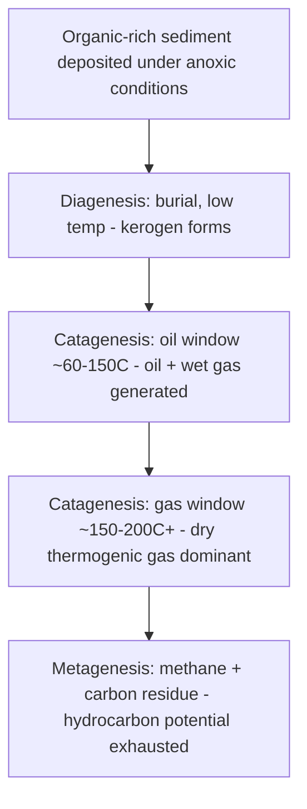
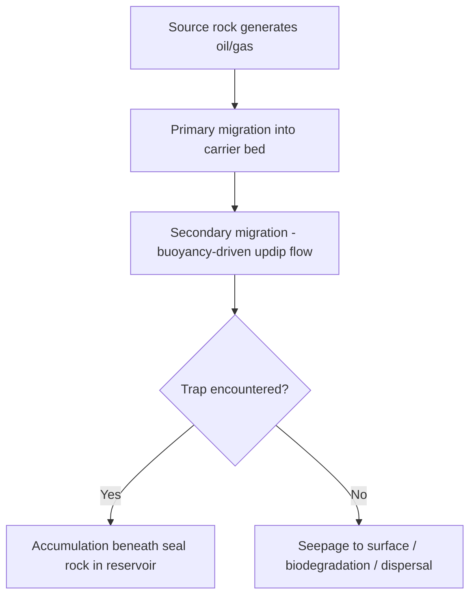

## Formation of Fossil Fuels

### Overview

Fossil fuels — coal, petroleum (crude oil), and natural gas — are hydrocarbon-rich or carbon-rich deposits formed from the burial, alteration, and thermal maturation of ancient organic matter over geological timescales. Their formation requires a specific sequence of conditions: organic matter production and accumulation, preservation under low-oxygen conditions, burial under increasing temperature and pressure, and (for petroleum and gas) migration into a trapping structure. Coal forms predominantly from terrestrial plant material, while petroleum and natural gas form primarily from marine and lacustrine microorganisms (algae, plankton) and organic-rich muds.

### Source Material and Depositional Requirements

**Organic Matter Types**

- **Type I kerogen**: Derived mainly from algal and bacterial biomass, typically deposited in lacustrine (lake) settings; hydrogen-rich, highly oil-prone
- **Type II kerogen**: Derived from marine planktonic organic matter (phytoplankton, zooplankton) deposited in marine settings; oil-prone with some gas potential
- **Type III kerogen**: Derived from terrestrial higher-plant material (woody, lignin-rich tissue); primarily gas-prone, and the principal precursor to coal
- **Type IV kerogen**: Highly oxidized, inert organic matter with negligible hydrocarbon-generating potential

**Depositional Environment Requirements**

For organic matter to be preserved rather than fully oxidized and recycled, deposition must occur in an environment combining:

- **High organic productivity** — nutrient-rich waters (upwelling zones, restricted basins, swamps) generating abundant biomass
- **Low-oxygen (anoxic to dysoxic) bottom conditions** — preventing aerobic decomposition and scavenging that would otherwise destroy organic matter before burial; common in stratified silled basins, deep anoxic lake bottoms, and stagnant swamp waters
- **Rapid burial** — fine-grained sediment (mud, peat) accumulating quickly enough to isolate organic matter from the oxygenated water column and from bioturbation

Source rocks are typically fine-grained, organic-rich shales or mudstones (for oil and gas) formed in these restricted, low-energy, low-oxygen settings.

### Coal Formation

**Peat Accumulation**

Coal formation begins in freshwater swamp and mire environments where plant material (mosses, ferns, trees) accumulates faster than it decomposes, aided by acidic, waterlogged, oxygen-poor conditions that inhibit microbial decay. Partially decayed plant material accumulates as **peat**, the precursor to all coal ranks.

**Coalification (Diagenesis to Metamorphism)**

Progressive burial subjects peat to increasing temperature and pressure over geological time, driving a sequence of physical and chemical changes collectively termed coalification: loss of moisture and volatile compounds (water, CO$_2$, methane), and progressive enrichment in fixed carbon content. This produces a rank sequence:

$$\text{Peat} \rightarrow \text{Lignite} \rightarrow \text{Sub-bituminous coal} \rightarrow \text{Bituminous coal} \rightarrow \text{Anthracite}$$

**Rank Characteristics**

| Rank | Approximate Carbon Content | Moisture | Heating Value | Notes |
| --- | --- | --- | --- | --- |
| Peat | <60% | Very high (>75%) | Low | Unconsolidated, not a true coal |
| Lignite | 60–70% | High (~35–75%) | Low-moderate | "Brown coal," soft, crumbly |
| Sub-bituminous | 70–76% | Moderate | Moderate | Widely used for power generation |
| Bituminous | 76–87% | Low | High | Most abundant rank mined globally; used for both power and metallurgical coking |
| Anthracite | >87% | Very low | Highest | Hard, glossy, lowest volatile content; least abundant rank |

**Controlling Factors**

Coal rank is primarily controlled by the temperature and duration of burial (geothermal gradient and time), rather than pressure alone; higher-rank coals generally indicate deeper burial and/or proximity to regional or contact metamorphic heat sources. Coal seam thickness and lateral extent depend on the duration and stability of the original swamp environment and subsequent basin subsidence history.

### Petroleum and Natural Gas Formation

**Source Rock Deposition**

Petroleum source rocks (typically organic-rich marine or lacustrine shales) accumulate in the same anoxic, high-productivity, rapid-burial settings described above, preserving Type I and Type II kerogen.

**Diagenesis (Early Burial Stage)**

In the shallow subsurface (roughly the upper few hundred to ~1,500 m, temperatures below ~50°C $[Inference — exact thresholds vary by basin and geothermal gradient]$), microbial and low-temperature chemical processes convert raw organic matter into **kerogen**, a complex, insoluble, high-molecular-weight organic solid dispersed through the source rock. Some biogenic methane may be generated at this stage by anaerobic methanogenic bacteria.

**Catagenesis and the Oil/Gas Window**

As burial depth and temperature increase, kerogen undergoes thermal cracking, breaking down into progressively smaller hydrocarbon molecules:

- **Oil window** (approximately 60–150°C, roughly 2–4 km burial depth $[Inference — thresholds are basin-specific, depending on local geothermal gradient]$): Kerogen thermally cracks to generate liquid petroleum (oil) and associated gas
- **Gas window** (approximately 150–200°C+ and greater burial depths): Continued thermal maturation cracks remaining kerogen and previously generated oil into progressively lighter hydrocarbons, ultimately dominated by thermogenic natural gas (primarily methane)

**Metagenesis**

At the highest temperatures and depths, remaining organic matter is reduced essentially to methane and a carbon-rich residue (analogous to coalification's endpoint), beyond which further burial destroys hydrocarbon-generating potential entirely.

**Thermal Maturity Indicators**

- **Vitrinite reflectance (%Ro)**: Measures the reflectivity of vitrinite macerals (derived from woody plant tissue) under microscope; low values indicate immature organic matter, ~0.6–1.3% Ro corresponds broadly to the oil window, and higher values indicate gas-window to overmature material
- **Kerogen color and Thermal Alteration Index (TAI)**: Palynomorphs (spores, pollen) darken progressively with thermal exposure, providing a visual maturity proxy
- **Tmax (from Rock-Eval pyrolysis)**: The temperature of maximum hydrocarbon generation during programmed pyrolysis heating, used alongside %Ro to assess maturity

### Primary and Secondary Migration

**Primary Migration**

Newly generated oil and gas must first move out of the low-permeability source rock into an adjacent, more permeable carrier bed — a process driven by generation-induced overpressure, microfracturing of the source rock as hydrocarbon volume increases, and buoyancy of hydrocarbons relative to formation water. The precise mechanisms of primary migration remain an active area of study $[Unverified — multiple competing/complementary mechanisms are proposed in the literature]$.

**Secondary Migration**

Once in a permeable carrier bed (typically porous sandstone or fractured/vuggy carbonate), petroleum and gas migrate — driven mainly by buoyancy (density contrast with formation water) and hydrodynamic flow — updip through interconnected pore space until encountering either a trap (where accumulation occurs) or reaching the surface (resulting in seepage and eventual biodegradation/loss).

### Reservoir Rocks, Seals, and Traps

**Reservoir Rock**

A porous, permeable rock capable of storing and transmitting fluids — commonly sandstone, or carbonate rocks with primary (intergranular, vuggy) or secondary (fracture, dissolution) porosity.

**Seal (Cap Rock)**

An impermeable or low-permeability rock overlying the reservoir that prevents further upward migration, commonly shale, evaporite (salt, anhydrite), or dense unfractured carbonate/limestone.

**Trap Types**

- **Structural traps**: Formed by tectonic deformation — anticlines (upward-arched folds), fault traps (juxtaposing reservoir against impermeable rock across a fault), and salt-related structures (diapirs creating adjacent closures)
- **Stratigraphic traps**: Formed by lateral or vertical facies changes, unconformities, pinch-outs, or depositional geometry (e.g., reef buildups, channel sands sealed by surrounding shale) without requiring structural deformation
- **Combination traps**: Involve both structural and stratigraphic elements

### Petroleum System Concept

**Key Points**

A complete **petroleum system** requires the coincident presence and correct timing of:

- **Source rock** — organic-rich rock capable of generating hydrocarbons
- **Maturation** — sufficient burial/heating to reach the oil or gas window
- **Migration pathway** — permeable conduit connecting source to trap
- **Reservoir rock** — adequate porosity and permeability to store hydrocarbons
- **Seal (cap rock)** — impermeable barrier preventing further escape
- **Trap** — structural or stratigraphic geometry that concentrates migrating hydrocarbons
- **Timing** — trap formation must predate or be contemporaneous with hydrocarbon generation and migration; a trap forming after migration has already occurred cannot capture an accumulation

Failure of any single element (absent source, insufficient maturity, breached seal, or unfavorable timing) results in a "dry hole" despite otherwise favorable geology.

### Unconventional Resources

**Shale Oil and Shale Gas**

Hydrocarbons that remain trapped within the low-permeability source rock itself (or closely associated tight formations) rather than having migrated to a conventional reservoir; extraction requires horizontal drilling combined with hydraulic fracturing to create artificial permeability.

**Tight Gas and Tight Oil**

Hydrocarbons hosted in low-permeability reservoir rocks (tight sandstones, tight carbonates) that required migration from an adjacent source but lack the reservoir quality for conventional flow rates without stimulation.

**Coalbed Methane (CBM)**

Methane generated during coalification (both biogenic and thermogenic) that remains adsorbed onto the internal surface area of coal (in the coal matrix's micropore structure) rather than migrating away; produced by depressurizing the coal seam, typically via dewatering, to desorb methane.

**Biogenic vs. Thermogenic Gas**

Natural gas origin is distinguished by isotopic signature (carbon and hydrogen isotope ratios) and gas composition: **biogenic gas** forms at shallow depth/low temperature via microbial (methanogenic) activity and is typically dry (nearly pure methane) with a distinct light carbon isotope signature; **thermogenic gas** forms via thermal cracking at depth and commonly contains heavier hydrocarbon fractions (wet gas) alongside methane, with a heavier isotopic signature.

### Hydrocarbon Generation Depth/Temperature Schematic (svg_diagram)

<svg xmlns="http://www.w3.org/2000/svg" viewBox="0 0 700 400">
<text x="350" y="25" font-size="16" font-weight="bold" text-anchor="middle">Burial Depth vs. Hydrocarbon Generation (svg_diagram)</text>
<line x1="80" y1="50" x2="80" y2="360" stroke="black" stroke-width="1.5" />
<line x1="80" y1="360" x2="620" y2="360" stroke="black" stroke-width="1.5" />
<text x="30" y="200" font-size="12" text-anchor="middle" transform="rotate(-90 30 200)">Burial Depth / Temperature (increasing)</text>
<text x="350" y="385" font-size="12" text-anchor="middle">Organic Matter Maturity</text>
<rect x="80" y="50" width="540" height="90" fill="#d6eaf8" opacity="0.6" />
<text x="90" y="75" font-size="13" font-weight="bold">Diagenesis</text>
<text x="90" y="95" font-size="11">Kerogen formation; biogenic methane possible</text>
<text x="90" y="130" font-size="11">~0-50C, shallow burial</text>
<rect x="80" y="140" width="540" height="90" fill="#d5f5e3" opacity="0.6" />
<text x="90" y="165" font-size="13" font-weight="bold">Catagenesis - Oil Window</text>
<text x="90" y="185" font-size="11">Thermal cracking of kerogen to liquid oil + wet gas</text>
<text x="90" y="220" font-size="11">~60-150C</text>
<rect x="80" y="230" width="540" height="80" fill="#fdebd0" opacity="0.6" />
<text x="90" y="255" font-size="13" font-weight="bold">Catagenesis - Gas Window</text>
<text x="90" y="275" font-size="11">Cracking to dry thermogenic gas</text>
<text x="90" y="300" font-size="11">~150-200C</text>
<rect x="80" y="310" width="540" height="50" fill="#f5b7b1" opacity="0.6" />
<text x="90" y="335" font-size="13" font-weight="bold">Metagenesis</text>
<text x="90" y="350" font-size="11">Residual methane; hydrocarbon potential exhausted</text>
</svg>

### Distribution and Basin Controls

Fossil fuel accumulations are concentrated in sedimentary basins with sufficient subsidence history to bury source rocks into the generative window while preserving trap integrity — rift basins, passive margin basins, foreland basins, and intracratonic basins are all recognized settings for major petroleum systems, with the specific basin type influencing typical source rock character, thermal history, and trap style. Coal basins are similarly controlled by long-lived, stable subsidence in fluvial-deltaic or paralic (coastal swamp) settings that sustained repeated peat accumulation, commonly producing cyclic coal-bearing sequences (cyclothems).

### Limitations and Uncertainties in Formation Models

- **Primary migration mechanisms**: Remain incompletely understood and are the subject of ongoing research, with proposed mechanisms including microfracturing, solution/exsolution transport, and kerogen-network connectivity $[Unverified]$
- **Precise window boundaries**: Oil and gas window temperature/depth thresholds are not fixed universal values; they vary with basin-specific geothermal gradient, burial rate, and kerogen type, so figures cited are representative ranges rather than fixed cutoffs $[Inference]$
- **Trap timing reconstruction**: Requires integrated basin modeling (burial history, thermal history, migration modeling) and carries inherent uncertainty, particularly in structurally complex or poorly dated basins

**Related Topics**

- Sedimentary Basin Analysis and Basin Types
- Petroleum Exploration and Reservoir Characterization
- Electrical and Electromagnetic Methods
- Well Logging Techniques
- Seismic Reflection Methods in Hydrocarbon Exploration
- Coal Geology and Coal Resource Classification
- Unconventional Hydrocarbon Resources and Hydraulic Fracturing
- Organic Geochemistry and Kerogen Typing
- Structural Geology of Petroleum Traps
- Carbon Cycling and Fossil Fuel Formation in Deep Time