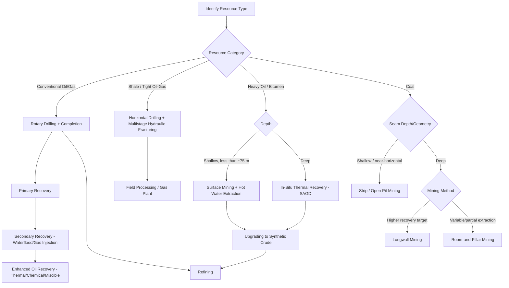

## Fossil Fuel Extraction and Processing


### Overview

Fossil fuel extraction and processing encompasses the engineering and technical workflows by which coal, petroleum, and natural gas are recovered from subsurface deposits and converted into marketable products. Extraction methods are governed by the resource's occurrence (conventional vs. unconventional, surface vs. deep), while processing methods transform raw extracted material into refined fuels, petrochemical feedstocks, and pipeline-quality gas.

### Petroleum (Oil) Extraction

**Drilling**

- **Rotary drilling** is the standard method: a rotating drill bit attached to a drill string cuts through rock, with drilling fluid (mud) circulated to cool the bit, remove cuttings, and control formation pressure
- **Directional and horizontal drilling**: deviates the wellbore from vertical to reach targets offset from the surface location, maximize reservoir contact (particularly in thin or unconventional reservoirs), or access multiple targets from a single pad
- **Well control**: blowout preventers (BOPs) and mud weight management prevent uncontrolled formation fluid influx (kicks) during drilling

**Well Completion**

- **Casing and cementing**: steel casing strings are run and cemented in place to isolate formations, prevent borehole collapse, and provide pressure integrity
- **Perforating**: shaped explosive charges create perforations through casing and cement into the target reservoir interval, establishing a flow path
- **Hydraulic fracturing**: high-pressure fluid (typically water, proppant, and chemical additives) injected to create and prop open fractures in low-permeability reservoirs, standard for unconventional shale oil/gas and tight reservoir development
- **Sand control**: gravel packs or screens installed in unconsolidated reservoirs to prevent formation sand production

**Production Mechanisms**

- **Primary recovery**: production driven by natural reservoir energy (solution gas drive, gas cap expansion, water drive, or rock/fluid expansion), typically recovering only 5–20% of original oil in place
- **Secondary recovery**: injection of water or gas to maintain reservoir pressure and displace additional oil toward producing wells (waterflooding, gas injection), extending recovery
- **Tertiary/Enhanced Oil Recovery (EOR)**: further recovery via thermal methods (steam injection, in-situ combustion — particularly for heavy oil/bitumen), chemical methods (polymer, surfactant flooding), or miscible gas injection (CO₂ flooding), targeting oil left behind after primary/secondary recovery

**Artificial Lift**

Once reservoir pressure is insufficient to sustain natural flow, artificial lift methods bring fluids to surface: sucker rod pumps ("pumpjacks"), electric submersible pumps (ESPs), gas lift (injecting gas to reduce fluid column density), and progressive cavity pumps, selected based on fluid properties, depth, and production rate.

**Offshore Extraction**

- **Fixed platforms**: for shallow to moderate water depths, structurally attached to the seabed
- **Floating production systems** (FPSOs, semi-submersibles, spar platforms, TLPs): for deepwater developments, with subsea wellheads tied back via flowlines and risers
- **Subsea production systems**: wellheads and processing equipment on the seafloor, tied back to a host platform or directly to shore, increasingly used in deepwater and marginal field development [Inference — reflects an established and continuing trend in offshore development practice]

### Natural Gas Extraction

Largely shares drilling and completion technology with oil extraction, with key distinctions:

- **Gas reservoirs** are produced primarily via pressure depletion (expansion drive), generally achieving higher recovery efficiencies than oil reservoirs
- **Unconventional gas** (shale gas, tight gas, coal bed methane) requires horizontal drilling and multistage hydraulic fracturing (shale/tight gas) or dewatering to reduce hydrostatic pressure and desorb methane from coal (coal bed methane)
- **Associated gas**: natural gas produced alongside oil, either processed for sale, reinjected for pressure maintenance, or in some operations flared (increasingly discouraged/regulated due to emissions and resource waste concerns)

### Coal Extraction

**Surface Mining**

- **Strip mining**: overburden removed in sequential strips to expose near-surface coal seams, used where seams are shallow and roughly horizontal
- **Open-pit/open-cast mining**: used for thicker or steeply dipping seams, progressively deepening pit geometry
- **Mountaintop removal**: overburden from ridge tops removed to access seams, historically used in some regions, associated with significant environmental impact and regulatory scrutiny

**Underground Mining**

- **Room-and-pillar mining**: coal extracted in a grid pattern, leaving pillars of coal to support the roof; can be followed by partial pillar extraction ("pillar robbing") in later mining phases
- **Longwall mining**: a long face of coal is progressively sheared by a mechanized cutting shearer, with the roof allowed to collapse behind the advancing face (controlled subsidence), generally achieving higher recovery and productivity than room-and-pillar for suitable seam geometries
- **Ventilation and gas management**: underground coal mining requires continuous ventilation to manage methane (explosion hazard) and dust (respiratory hazard and explosion risk), with degasification (coal bed methane drainage) sometimes performed in advance of mining in gassy seams

**Coal Beneficiation (Preparation)**

Run-of-mine coal is processed at a coal preparation plant to remove mineral matter (ash-forming material) and improve quality: crushing/sizing, gravity separation (dense medium cyclones, jigs) exploiting density contrast between coal and mineral matter, and froth flotation for fine coal fractions.

### Petroleum Refining

**Primary Distillation**

Crude oil is separated by boiling point range in an **atmospheric distillation column**, yielding fractions from light gases and naphtha (lowest boiling point, top of column) through kerosene, diesel/gas oil, to heavy residue (highest boiling point, bottom of column). Heavy residue may be further processed in a **vacuum distillation** unit (operating under reduced pressure to allow further separation without thermal cracking) to recover additional distillate fractions.

**Conversion Processes**

- **Catalytic cracking (FCC — fluid catalytic cracking)**: breaks heavy, low-value fractions into lighter, higher-value products (primarily gasoline-range hydrocarbons) using a catalyst at elevated temperature
- **Hydrocracking**: catalytic cracking in the presence of hydrogen, producing high-quality middle distillates (diesel, jet fuel) with lower sulfur and aromatic content than FCC products
- **Coking (delayed/fluid coking)**: thermally cracks the heaviest residue fractions into lighter products plus a solid carbon byproduct (petroleum coke), used to maximize liquid yield from heavy/residual crude fractions
- **Catalytic reforming**: converts low-octane naphtha into high-octane reformate (rich in aromatics) for gasoline blending, also producing hydrogen as a byproduct used elsewhere in the refinery

**Treatment Processes**

- **Hydrotreating**: catalytic hydrogen treatment to remove sulfur, nitrogen, and other impurities from distillate fractions, essential for meeting fuel sulfur specifications and protecting downstream catalysts
- **Alkylation**: combines light olefins with isobutane to produce high-octane alkylate for gasoline blending
- **Blending**: final fuel products are blended from multiple refinery streams to meet specification requirements (octane rating, cetane number, sulfur content, vapor pressure, seasonal formulation)

### Natural Gas Processing

**Field Processing**

- **Separation**: removes free liquids (produced water, condensate) from the gas stream at or near the wellhead
- **Dehydration**: removes water vapor (via glycol absorption or molecular sieve adsorption) to prevent hydrate formation and pipeline corrosion
- **Acid gas removal (sweetening)**: removes hydrogen sulfide (H₂S) and carbon dioxide (CO₂) via amine absorption or other solvent processes, required both for pipeline specification and safety (H₂S toxicity)

**Gas Plant Processing**

- **Natural Gas Liquids (NGL) recovery**: cryogenic or refrigeration-based processes extract ethane, propane, butanes, and natural gasoline from raw natural gas, both to meet pipeline heating-value specifications and to recover valuable NGL products for separate sale
- **Fractionation**: separates recovered NGLs into individual components (ethane, propane, butane, natural gasoline) for distinct market sale
- **Sulfur recovery** (Claus process): converts recovered H₂S into elemental sulfur, a marketable byproduct and an environmental compliance requirement

**Liquefied Natural Gas (LNG)**

Natural gas is cooled to approximately −162°C to condense it into liquid form for efficient transport by specialized LNG carrier ships where pipeline transport is impractical (e.g., overseas export), requiring pre-treatment (dehydration, acid gas and heavy hydrocarbon removal) to prevent freezing/plugging in the cryogenic liquefaction process, and regasification at the receiving terminal before pipeline distribution.

### Unconventional Extraction Techniques

**Hydraulic Fracturing (Detailed)**

Multistage hydraulic fracturing in horizontal wells is the enabling technology for most modern shale oil and shale gas development: the horizontal wellbore is divided into multiple stages, each isolated (typically via mechanical or dissolvable plugs) and fractured sequentially, with proppant (typically sand or ceramic beads) keeping induced fractures open to sustain gas/oil flow after fracturing fluid pressure is released. Water sourcing, fracturing fluid chemical composition, and produced/flowback water management are significant operational and regulatory considerations.

**Oil Sands (Bitumen) Extraction**

- **Surface mining**: used where bitumen deposits are shallow (typically less than ~75 m), followed by hot water extraction (Clark process-derived) to separate bitumen from sand
- **In-situ thermal recovery**: used for deeper deposits, primarily **Steam-Assisted Gravity Drainage (SAGD)**, in which steam injected through a horizontal well reduces bitumen viscosity, allowing it to drain by gravity to a parallel horizontal production well below
- **Upgrading**: extracted bitumen is typically upgraded (via coking or hydrocracking) to synthetic crude oil before conventional refining, given its very high viscosity and density

### Environmental and Waste Management Considerations

- **Produced water management**: large volumes of formation water co-produced with oil and gas require treatment, disposal (typically via injection into deep disposal wells), or, increasingly, reuse in operations such as hydraulic fracturing
- **Tailings management**: oil sands surface mining generates large tailings ponds requiring long-term management and reclamation planning
- **Coal mine reclamation**: surface-mined land requires regrading, topsoil replacement, and revegetation under most modern regulatory regimes
- **Fugitive emissions**: methane leakage during extraction, processing, and transport is a significant concern given methane's potency as a greenhouse gas, driving increased industry and regulatory focus on leak detection and repair programs [Inference — reflects an active area of increasing industry and regulatory attention; specific requirements vary substantially by jurisdiction]

### Comparative Summary

| Resource | Primary Extraction Method(s) | Primary Processing Step |
| --- | --- | --- |
| Conventional Oil | Rotary drilling, primary/secondary/EOR recovery | Refining (distillation, cracking, treating) |
| Shale Oil/Gas | Horizontal drilling + multistage hydraulic fracturing | Refining / gas processing |
| Heavy Oil/Bitumen | Surface mining or SAGD | Upgrading to synthetic crude, then refining |
| Conventional Gas | Rotary drilling, pressure depletion | Field processing, NGL recovery, sweetening |
| Coal (surface) | Strip/open-pit mining | Beneficiation (washing/sizing) |
| Coal (underground) | Room-and-pillar or longwall mining | Beneficiation (washing/sizing) |

### Applications and Downstream Products

- **Transportation fuels**: gasoline, diesel, jet fuel (kerosene-derived), all produced via refining of crude oil fractions
- **Petrochemical feedstocks**: naphtha and NGLs (particularly ethane and propane) feed steam cracking processes producing ethylene, propylene, and other building-block chemicals for plastics and synthetic materials
- **Electricity generation**: coal and natural gas remain major fuel sources for thermal power generation, with natural gas combined-cycle plants generally achieving higher thermal efficiency than conventional coal steam plants
- **Metallurgical use**: coking (metallurgical) coal is a key input to blast furnace steelmaking, converted to coke prior to use
- **Industrial and residential heating**: pipeline natural gas and refined heating oil serve direct heating markets

### Limitations and Sources of Variability

- **Recovery factor variability**: primary, secondary, and EOR recovery factors vary substantially with reservoir rock and fluid properties, and quoted percentage ranges are general guides rather than fixed values applicable to any specific reservoir
- **Regulatory and jurisdictional variation**: permitted extraction methods (e.g., hydraulic fracturing, mountaintop removal mining), environmental controls, and emissions requirements vary significantly by country and region, and are subject to ongoing policy change
- **Reservoir-specific engineering design**: artificial lift selection, fracturing design, and processing configuration are tailored to site-specific reservoir and fluid properties; the methods described represent standard industry approaches rather than universal prescriptions [Inference — general caveat that method selection is engineering-judgment-dependent on a per-field basis]
- **Economic sensitivity**: extraction method viability (particularly EOR and unconventional development) is strongly sensitive to commodity price, though this is an economic rather than technical constraint

### Example Workflow (Unconventional Shale Oil Development)

1. Drill vertical section to target depth, then build horizontal section through the target shale interval using directional drilling
2. Run and cement casing to isolate formations and establish wellbore integrity
3. Perforate the horizontal lateral at planned stage intervals
4. Perform multistage hydraulic fracturing, isolating and fracturing each stage sequentially from toe to heel (or using alternative completion designs)
5. Flow back fracturing fluid and begin production, managing produced water and associated gas
6. Install artificial lift (if needed) as reservoir pressure declines over the well's production life
7. Transport produced oil/gas to gathering and processing facilities for stabilization, dehydration, and further treatment
8. Route stabilized crude to a refinery (distillation, conversion, treating) and processed gas to pipeline sales or NGL fractionation

### Petroleum Refining Process Flow (svg_diagram)

<svg xmlns="http://www.w3.org/2000/svg" viewBox="0 0 900 460" font-family="Helvetica, Arial, sans-serif">
<text x="450" y="30" font-size="18" font-weight="bold" text-anchor="middle" fill="#111">Petroleum Refining: Simplified Process Flow (svg_diagram)</text>
<rect x="60" y="70" width="160" height="60" rx="6" fill="#eef3fb" stroke="#3b5b92" />
<text x="140" y="105" text-anchor="middle" font-size="13">Crude Oil Feed</text>
<rect x="280" y="70" width="180" height="60" rx="6" fill="#eef3fb" stroke="#3b5b92" />
<text x="370" y="100" text-anchor="middle" font-size="13">Atmospheric Distillation</text>
<text x="370" y="118" text-anchor="middle" font-size="11">separation by boiling point</text>

<g font-size="11">
<rect x="530" y="50" width="150" height="30" rx="4" fill="#dff0d8" stroke="#3c763d" />
<text x="605" y="70" text-anchor="middle">Light Gases / Naphtha</text>



```
<rect x="530" y="90" width="150" height="30" rx="4" fill="#dff0d8" stroke="#3c763d" />
<text x="605" y="110" text-anchor="middle">Kerosene / Jet Fuel</text>

<rect x="530" y="130" width="150" height="30" rx="4" fill="#dff0d8" stroke="#3c763d" />
<text x="605" y="150" text-anchor="middle">Diesel / Gas Oil</text>

<rect x="530" y="170" width="150" height="30" rx="4" fill="#f4d9b0" stroke="#a8712e" />
<text x="605" y="190" text-anchor="middle">Atmospheric Residue</text>
```

</g>
<line x1="460" y1="100" x2="530" y2="65" stroke="#333" stroke-width="1.5" />
<line x1="460" y1="100" x2="530" y2="105" stroke="#333" stroke-width="1.5" />
<line x1="460" y1="100" x2="530" y2="145" stroke="#333" stroke-width="1.5" />
<line x1="460" y1="100" x2="530" y2="185" stroke="#333" stroke-width="1.5" />
<line x1="220" y1="100" x2="280" y2="100" stroke="#333" stroke-width="1.5" />

<rect x="530" y="230" width="150" height="50" rx="6" fill="#eef3fb" stroke="#3b5b92" />
<text x="605" y="260" text-anchor="middle" font-size="12">Vacuum Distillation</text>
<line x1="605" y1="200" x2="605" y2="230" stroke="#333" stroke-width="1.5" />
<rect x="530" y="310" width="150" height="50" rx="6" fill="#f9e6b0" stroke="#a8712e" />
<text x="605" y="333" text-anchor="middle" font-size="12">Cracking / Coking /</text>
<text x="605" y="350" text-anchor="middle" font-size="12">Hydrocracking</text>
<line x1="605" y1="280" x2="605" y2="310" stroke="#333" stroke-width="1.5" />
<rect x="250" y="230" width="180" height="50" rx="6" fill="#f9e6b0" stroke="#a8712e" />
<text x="340" y="260" text-anchor="middle" font-size="12">Hydrotreating (sulfur removal)</text>
<line x1="530" y1="145" x2="430" y2="255" stroke="#333" stroke-width="1.5" />
<rect x="250" y="330" width="180" height="50" rx="6" fill="#dff0d8" stroke="#3c763d" />
<text x="340" y="360" text-anchor="middle" font-size="12">Blending → Finished Fuels</text>
<line x1="340" y1="280" x2="340" y2="330" stroke="#333" stroke-width="1.5" />
<line x1="530" y1="335" x2="430" y2="355" stroke="#333" stroke-width="1.5" />
</svg>

### Extraction Method Selection Logic



**Next Steps**

- Formation of Fossil Fuels
- Petroleum Refining Chemistry
- Enhanced Oil Recovery Techniques
- Environmental Impacts of Fossil Fuel Extraction
- Coal Mining Safety and Ventilation Engineering
- Natural Gas Processing and LNG Value Chains
- Petrochemical Manufacturing from Refinery Feedstocks
- Mine Reclamation and Produced Water Management