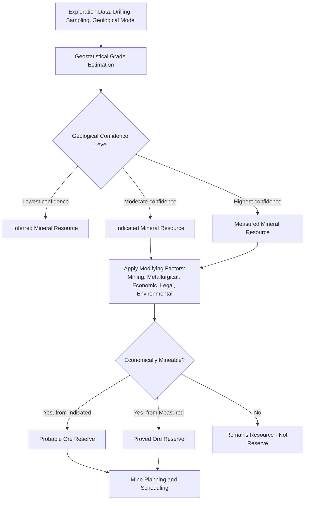

## Ore Deposits and Mineral Resources


### Overview

Ore deposits are natural concentrations of minerals from which one or more commodities can be extracted at a profit under prevailing economic and technological conditions. Their formation requires an anomalous enrichment process — geological, geochemical, or biological — that concentrates metals or minerals from typically low background (crustal) abundance to economically viable grades. Understanding ore-forming processes underpins exploration targeting, resource classification, and mine planning across the mining industry.

### Fundamental Concepts

**Ore vs. Gangue**

An **ore** is rock containing economically extractable valuable minerals; **gangue** refers to the associated worthless minerals that must be separated during processing. The same rock may be ore at one commodity price and sub-economic (waste) at another, making "ore" fundamentally an economic rather than purely mineralogical classification.

**Grade and Cutoff Grade**

**Grade** expresses the concentration of the valuable commodity (e.g., percent Cu, g/t Au). The **cutoff grade** is the minimum grade at which material can be economically processed, determined by commodity price, mining and processing costs, and metallurgical recovery — material below cutoff is classified as waste even if geologically similar to ore.

**Concentration Factor**

The ratio of a deposit's ore grade to average crustal abundance ("Clarke value") of that element, illustrating the degree of geological concentration required to form an economic deposit. Concentration factors required for economic viability vary enormously by commodity — several hundred-fold for base metals like copper, versus tens of thousands-fold for gold, reflecting gold's very low crustal abundance.

### Classification of Ore-Forming Processes

Ore deposits are broadly classified by the dominant geological process responsible for metal concentration: magmatic, hydrothermal, sedimentary/diagenetic, metamorphic, and surficial (weathering-related) processes. Many deposit types involve more than one process acting in sequence or combination.

### Magmatic Ore Deposits

**Principle**

Metals concentrate directly from cooling magma through crystallization, gravitational settling, or immiscible liquid separation.

**Key Types**

- **Magmatic sulfide deposits** (Ni-Cu-PGE): immiscible sulfide liquid segregates from silicate magma (typically mafic/ultramafic) and settles gravitationally, concentrating nickel, copper, and platinum-group elements (e.g., Sudbury, Noril'sk-type deposits)
- **Chromite/PGE layered intrusions**: fractional crystallization in large, slowly cooled mafic-ultramafic intrusions produces rhythmically layered chromite and PGE-rich horizons (e.g., Bushveld Complex-type deposits)
- **Kimberlite/diamond deposits**: diamonds crystallize at great mantle depth and are transported rapidly to the surface in volatile-rich kimberlite or lamproite magmas, with rapid ascent critical to diamond preservation (avoiding conversion to graphite at shallower, lower-pressure conditions)
- **Carbonatite-associated deposits**: rare earth elements (REE), niobium, and phosphate concentrations associated with carbonatite intrusions

### Hydrothermal Ore Deposits

**Principle**

Hot aqueous fluids (magmatic, metamorphic, meteoric, or basinal in origin) dissolve, transport, and precipitate metals in response to changes in temperature, pressure, pH, redox state, or fluid mixing, typically depositing ore minerals in veins, disseminations, or replacement bodies.

**Key Types**

- **Porphyry deposits** (Cu-Mo-Au): large-tonnage, low-to-moderate grade deposits associated with shallow, felsic to intermediate porphyritic intrusions, characterized by pervasive hydrothermal alteration zoning (potassic core, phyllic, argillic, propylitic outward) and disseminated/stockwork sulfide mineralization
- **Volcanogenic Massive Sulfide (VMS) deposits**: form on or near the seafloor from submarine hydrothermal venting (analogous to modern "black smoker" systems), depositing stratabound, typically lens-shaped massive sulfide accumulations rich in Cu, Zn, Pb, Au, and Ag
- **Epithermal deposits** (Au-Ag): form at shallow crustal levels (generally less than ~1–1.5 km depth) from low-to-moderate temperature hydrothermal fluids, subdivided into **low-sulfidation** (near-neutral pH fluids) and **high-sulfidation** (acidic, magmatic-fluid-dominated) types based on alteration mineralogy and sulfide assemblage
- **Skarn deposits**: form where hydrothermal fluids react with carbonate host rocks (typically limestone) adjacent to intrusive contacts, producing calc-silicate mineral assemblages hosting Cu, Fe, Zn, W, or Au mineralization
- **Iron Oxide Copper-Gold (IOCG) deposits**: large, structurally controlled deposits characterized by abundant iron oxide (magnetite/hematite) alteration accompanying Cu-Au (and often REE, U) mineralization, genetically distinct from and generally larger than typical porphyry systems
- **Orogenic (mesothermal) gold deposits**: structurally controlled gold-quartz vein systems associated with deformed and metamorphosed terranes, typically formed from metamorphic devolatilization fluids during orogenesis
- **Mississippi Valley-Type (MVT) Pb-Zn deposits**: form from warm basinal brines migrating through and precipitating sulfides within permeable carbonate sequences, typically in structurally undeformed sedimentary basins distal from any obvious igneous heat source

### Sedimentary and Diagenetic Ore Deposits

**Principle**

Metals or minerals concentrate through sedimentary or early diagenetic processes, without requiring elevated hydrothermal temperatures.

**Key Types**

- **Banded Iron Formations (BIF)**: Precambrian chemical sedimentary rocks with alternating iron-rich and silica-rich (chert) laminations, interpreted as reflecting changes in ocean chemistry and oxygenation during Earth's early atmospheric evolution; the primary source of the world's major iron ore deposits (often after secondary supergene enrichment)
- **Sedimentary exhalative (SEDEX) Pb-Zn deposits**: form from metal-bearing brines venting onto the seafloor into typically anoxic marine basins, producing stratiform, laterally extensive sulfide accumulations distinct from the more structurally focused VMS style
- **Placer deposits**: mechanical concentration of dense, resistant minerals (gold, platinum, diamonds, cassiterite, heavy mineral sands such as ilmenite/rutile/zircon) by fluvial, alluvial, or beach sedimentary processes exploiting density and durability contrasts with lighter, less resistant gangue minerals
- **Evaporite deposits**: precipitation of soluble salts (halite, potash/sylvite, gypsum, borates, lithium-bearing brines) from evaporating restricted marine or continental water bodies
- **Phosphorite deposits**: marine sedimentary accumulations of phosphate minerals, typically associated with upwelling-driven high biological productivity zones

### Metamorphic and Metamorphosed Deposits

- **Metamorphosed/remobilized deposits**: pre-existing ore deposits (e.g., original VMS or sedimentary deposits) that have been structurally and mineralogically modified by later metamorphism, sometimes with local metal remobilization into structurally favorable sites
- **Metamorphic deposits sensu stricto**: form directly through metamorphic processes, such as some graphite and talc deposits, or contact metamorphic industrial mineral deposits

### Surficial (Weathering-Related) Deposits

**Supergene Enrichment**

Near-surface weathering and oxidation of a primary (hypogene) sulfide deposit leaches metals downward in oxidizing, often acidic groundwater, which then re-precipitate at or below the water table in a **supergene enrichment blanket**, locally elevating grade well above the primary hypogene grade — a critical economic factor in many porphyry copper deposits.

**Laterite and Residual Deposits**

Intense tropical weathering of favorable parent rock leaches soluble elements and residually concentrates immobile elements, producing economically important deposits including:

- **Bauxite** (aluminum ore): residual concentration from intensely weathered aluminosilicate parent rocks
- **Lateritic nickel deposits**: residual and saprolitic nickel enrichment from weathered ultramafic (peridotite/serpentinite) parent rock
- **Residual/eluvial deposits**: local mechanical concentration of resistant ore minerals directly above their weathered source, without significant transport

### Ore Deposit Classification Summary

| Deposit Type | Dominant Process | Typical Commodities |
| --- | --- | --- |
| Magmatic sulfide | Magmatic segregation | Ni, Cu, PGE |
| Layered intrusion | Fractional crystallization | Cr, PGE, V |
| Kimberlite | Rapid mantle-derived ascent | Diamonds |
| Porphyry | Hydrothermal (magmatic-derived) | Cu, Mo, Au |
| VMS | Submarine hydrothermal venting | Cu, Zn, Pb, Au, Ag |
| Epithermal | Shallow hydrothermal | Au, Ag |
| Skarn | Contact metasomatism | Cu, Fe, Zn, W, Au |
| IOCG | Hydrothermal, structurally controlled | Cu, Au, REE, U |
| Orogenic gold | Metamorphic devolatilization | Au |
| MVT | Basinal brine migration | Pb, Zn |
| BIF | Chemical sedimentation | Fe |
| SEDEX | Seafloor brine venting | Pb, Zn |
| Placer | Mechanical sedimentary concentration | Au, PGE, diamonds, heavy minerals |
| Evaporite | Evaporation | Halite, potash, borates, Li brines |
| Laterite/residual | Tropical weathering | Bauxite (Al), Ni |
| Supergene enrichment | Weathering/remobilization | Cu (enrichment of porphyry deposits) |

### Mineral Resource and Reserve Classification

**Resource/Reserve Framework**

Internationally, mineral inventories are reported under standardized classification codes (e.g., the JORC Code in Australia, NI 43-101 in Canada, SEC S-K 1300 in the United States, all broadly harmonized under CRIRSCO templates) that distinguish:

- **Mineral Resource**: a concentration of material with reasonable prospects for economic extraction, classified by increasing geological confidence as **Inferred**, **Indicated**, or **Measured**
- **Ore Reserve**: the economically mineable portion of a Measured or Indicated Resource, incorporating modifying factors (mining, processing, economic, marketing, legal, environmental, social, and governmental factors), classified as **Probable** or **Proved**

This framework ensures that public resource/reserve statements reflect both geological confidence and demonstrated economic viability, rather than purely geological tonnage/grade estimates.

**Resource Estimation Methods**

- **Classical/polygonal and inverse-distance methods**: simpler, historically foundational estimation approaches based on spatial weighting of nearby sample data
- **Geostatistical (kriging) methods**: use variogram-based spatial modeling of grade continuity to produce statistically optimized grade estimates and associated confidence/uncertainty measures, now standard practice for most modern resource estimation
- **Block modeling**: subdivides the deposit into a 3D grid of blocks, each assigned estimated grade and geological/economic attributes, forming the basis for mine planning and reserve reporting

### Applications and Economic Considerations

- **Exploration targeting**: deposit-type knowledge directly informs which geophysical, geochemical, and geological exploration methods are most effective for a given commodity and terrane (as detailed in Applications in Resource Exploration)
- **Mine planning**: cutoff grade, resource classification, and block model geometry directly determine pit design (open pit) or stope design (underground), production scheduling, and financial modeling
- **Metallurgical processing selection**: ore mineralogy (sulfide vs. oxide, refractory vs. free-milling gold, etc.) determines the appropriate beneficiation and extraction process (flotation, leaching, smelting)
- **Critical minerals and supply chains**: growing global demand for battery and technology metals (lithium, cobalt, rare earth elements, graphite) has increased exploration and economic focus on deposit types historically considered minor or niche, including lithium brines, pegmatites, and laterite-hosted cobalt-nickel [Inference — reflects an active and rapidly evolving area of the minerals industry driven by clean energy and technology demand trends, with specific market dynamics subject to ongoing change]

### Limitations and Sources of Uncertainty

- **Grade-tonnage trade-off and cutoff sensitivity**: reported resource/reserve tonnage and grade are directly sensitive to the assumed cutoff grade and commodity price, meaning published figures can change materially without any change in underlying geology
- **Resource classification confidence**: Inferred resources carry substantially lower geological confidence than Measured resources and generally cannot be used as the sole basis for economic feasibility decisions under most reporting codes
- **Deposit model non-uniqueness**: many deposits display characteristics of more than one classification type or represent transitional/hybrid styles, and deposit-model assignment can evolve as exploration and understanding progress
- **Weathering and supergene overprint complexity**: distinguishing primary hypogene mineralization from supergene-modified zones is critical for accurate grade control and metallurgical planning, and misclassification can lead to processing and recovery problems
- **Jurisdictional reporting code differences**: while broadly harmonized, specific resource/reserve reporting requirements and terminology can differ between codes (JORC, NI 43-101, SEC S-K 1300), requiring care when comparing publicly reported figures across companies/jurisdictions [Inference — general caveat on cross-code comparability, not a claim about any specific company's reporting]

### Example Workflow (Porphyry Copper Deposit Assessment)

1. Identify prospective terrane using regional geological, geochemical, and geophysical targeting criteria consistent with porphyry deposit settings
2. Conduct exploration drilling to intersect and characterize hydrothermal alteration zoning and sulfide mineralization
3. Log core for alteration, mineralization style, and structural features; collect systematic assay samples
4. Distinguish supergene-enriched, leached-cap, and hypogene mineralization zones through mineralogical and metallurgical characterization
5. Build a 3D geological model incorporating lithology, alteration, structure, and assay data
6. Perform geostatistical grade estimation and block modeling
7. Apply cutoff grade and mining/metallurgical modifying factors to convert Mineral Resources into Ore Reserves
8. Use the reserve model as the basis for mine design, scheduling, and economic feasibility studies

### Ore Deposit Formation by Process Category (svg_diagram)

<svg xmlns="http://www.w3.org/2000/svg" viewBox="0 0 900 460" font-family="Helvetica, Arial, sans-serif">
<text x="450" y="30" font-size="18" font-weight="bold" text-anchor="middle" fill="#111">Ore-Forming Process Categories (svg_diagram)</text>
<g font-size="12">
<rect x="40" y="70" width="160" height="70" rx="6" fill="#eef3fb" stroke="#3b5b92" />
<text x="120" y="100" text-anchor="middle" font-weight="bold">Magmatic</text>
<text x="120" y="120" text-anchor="middle" font-size="11">Ni-Cu-PGE, Cr, Diamonds</text>



```
<rect x="230" y="70" width="160" height="70" rx="6" fill="#f9e6b0" stroke="#a8712e" />
<text x="310" y="100" text-anchor="middle" font-weight="bold">Hydrothermal</text>
<text x="310" y="120" text-anchor="middle" font-size="11">Porphyry, VMS, Epithermal, Skarn</text>

<rect x="420" y="70" width="160" height="70" rx="6" fill="#dff0d8" stroke="#3c763d" />
<text x="500" y="100" text-anchor="middle" font-weight="bold">Sedimentary/Diagenetic</text>
<text x="500" y="120" text-anchor="middle" font-size="11">BIF, SEDEX, Placer, Evaporite</text>

<rect x="610" y="70" width="130" height="70" rx="6" fill="#f4d1d1" stroke="#a94442" />
<text x="675" y="100" text-anchor="middle" font-weight="bold">Metamorphic</text>
<text x="675" y="120" text-anchor="middle" font-size="11">Orogenic Au, remobilized ores</text>

<rect x="230" y="200" width="320" height="70" rx="6" fill="#e6dff0" stroke="#6c3ba0" />
<text x="390" y="230" text-anchor="middle" font-weight="bold">Surficial / Weathering</text>
<text x="390" y="250" text-anchor="middle" font-size="11">Supergene enrichment, Laterite (Bauxite, Ni)</text>
```

</g>
<line x1="120" y1="140" x2="390" y2="200" stroke="#666" stroke-width="1.5" stroke-dasharray="4,3" />
<line x1="310" y1="140" x2="390" y2="200" stroke="#666" stroke-width="1.5" stroke-dasharray="4,3" />
<text x="450" y="330" font-size="12" text-anchor="middle" fill="#333">Weathering can overprint and re-concentrate deposits originally formed by any primary process</text>
</svg>

### Resource-to-Reserve Classification Pathway



**Next Steps**

- Applications in Resource Exploration
- Formation of Fossil Fuels
- Mineral Processing and Beneficiation
- Mine Planning and Pit/Stope Design
- Geostatistics and Resource Estimation Methods
- Hydrothermal Alteration Systems
- Critical Minerals and Battery Metal Deposits
- Environmental and Social Considerations in Mining