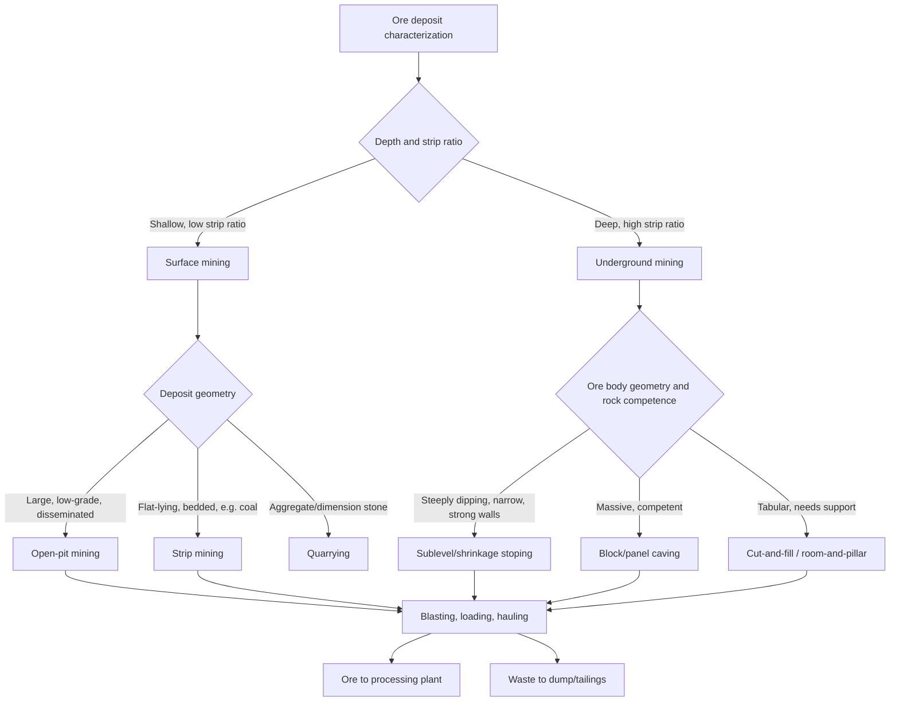
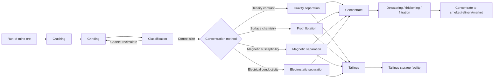

## Mining Methods and Mineral Processing

### Overview

Mining methods and mineral processing together form the extraction chain by which economically valuable minerals and rocks (ore) are removed from the Earth and converted into usable, marketable products. Mining method selection depends on the geometry, depth, grade, and structural competence of the deposit, as well as economic and environmental constraints. Mineral processing (ore dressing/beneficiation) then separates valuable minerals from waste (gangue), upgrading run-of-mine ore into a concentrate suitable for smelting, refining, or direct sale.

### Ore Deposit Characterization

Before mining method selection, deposits are characterized by:

- **Grade**: Concentration of valuable mineral/metal, often expressed in percent (base metals), grams per tonne (g/t, precious metals), or carats per tonne (diamonds).
- **Cutoff grade**: The minimum grade at which extraction remains economically viable given current costs and prices; material below cutoff is classified as waste.
- **Tonnage**: Total estimated quantity of ore, typically reported alongside grade in a resource/reserve statement.
- **Geometry**: Tabular (veins, seams), massive (irregular 3D bodies), or disseminated (low-grade, widely distributed) deposit shapes.
- **Depth and dip**: Near-surface, flat-lying deposits favor surface mining; deep or steeply-dipping deposits favor underground methods.
- **Host rock competence**: Rock mass strength determines whether open stopes are stable or whether support (backfill, pillars, timbering) is required.

**Reserve classification** (following frameworks such as JORC or the CRIRSCO family of codes) distinguishes **Measured**, **Indicated**, and **Inferred** Resources by increasing geological uncertainty, and **Proved** and **Probable** Reserves as the economically mineable subset of Measured/Indicated Resources.

### Mining Method Selection

Mining methods are broadly divided into **surface mining** and **underground mining**, with selection driven primarily by the **strip ratio** (waste rock volume removed per unit of ore) and depth of the deposit.

$$\text{Strip Ratio} = \frac{\text{Volume (or mass) of waste removed}}{\text{Volume (or mass) of ore recovered}}$$

A lower strip ratio favors surface mining economics; as deposits deepen, the strip ratio rises until underground mining becomes more cost-effective, defining the **crossover depth** between surface and underground methods. [Inference — the exact crossover point is site-specific, depending on commodity price, ore value, and local stripping/mining costs, rather than a fixed universal depth.]

### Surface Mining Methods

**Open-Pit Mining**

Used for large, low-grade, disseminated deposits (e.g., porphyry copper, many gold deposits) and near-surface massive sulfides. The pit is excavated as a series of descending **benches**, each with a defined height, width, and slope angle, engineered to balance ore recovery against pit-wall stability.

- **Bench height**: Typically 5–15 m, matched to equipment reach.
- **Pit slope angle**: Governed by rock mass strength, structural discontinuities, and groundwater conditions; steeper slopes reduce waste stripping but increase failure risk.
- Extraction cycle: **drilling → blasting → loading (shovel/excavator) → hauling (truck, conveyor, or rail)**.
- Ultimate pit limits are determined using economic optimization algorithms (e.g., the Lerchs-Grossmann algorithm) that maximize net value subject to slope and mining sequence constraints.

**Strip Mining**

Applied to flat-lying, tabular deposits close to the surface, most notably bituminous coal seams. Overburden is removed in long strips using draglines or bucket-wheel excavators and placed in the adjacent, already-mined strip (spoil), progressively advancing across the deposit. **Area strip mining** is used on relatively flat terrain; **contour strip mining** follows terrain contours in hilly regions.

**Quarrying**

Extraction of dimension stone (granite, marble, slate) or aggregate (crushed stone, sand, gravel) for construction. Dimension stone quarrying emphasizes minimizing fracturing (using diamond wire saws, controlled blasting, or waterjet cutting) to preserve large, intact blocks; aggregate quarrying prioritizes volume and uses conventional drill-and-blast.

**Placer Mining**

Recovery of heavy minerals (gold, tin/cassiterite, diamonds, titanium-bearing sands) concentrated by fluvial or coastal sedimentary processes, exploiting the density contrast between valuable heavy minerals and lighter gangue. Methods include dredging, hydraulic mining (now heavily restricted in many jurisdictions due to severe environmental impact), and sluicing.

### Underground Mining Methods

Underground methods are categorized by whether they provide **support** to the excavated void, are conducted in **unsupported (open stope)** conditions, or deliberately induce **caving**.

**Unsupported Methods**

- **Room-and-pillar**: Ore is extracted in a grid pattern of rooms, leaving regularly spaced pillars of unmined ore to support the roof. Common in flat-lying, tabular deposits (coal, potash, limestone). Pillar dimensions are engineered using rock mechanics to balance ore recovery against long-term stability; **pillar robbing** (retreat mining) may later recover some pillar ore as the section is abandoned.
- **Sublevel stoping / open stoping**: Used in steeply dipping, competent ore bodies with strong wall rock. Ore is extracted from large open voids (stopes) accessed via a network of sublevel drifts, typically using long-hole (fan or ring) drilling and blasting, with broken ore gravity-flowing to drawpoints below.

**Supported Methods**

- **Cut-and-fill**: Ore is extracted in horizontal (or inclined) slices from the bottom up (or top down), with the resulting void immediately backfilled (using waste rock, cemented rock fill, or tailings) before the next slice is mined. Provides high selectivity for irregular, high-grade, or structurally weaker ore bodies, at higher cost than bulk methods.
- **Shrinkage stoping**: Ore is blasted in horizontal slices from the bottom up; roughly 35–40% of broken ore is left in the stope to serve as a working platform and temporary wall support, with the remainder drawn off; the retained ore is recovered once the stope is completed. Less common today due to grade-control and ground-control limitations relative to modern alternatives.
- **Square-set stoping**: Timber or steel sets provide support in three dimensions for irregular, high-grade, weak-ground deposits; largely historical due to high cost.

**Caving Methods**

Bulk, low-cost methods suited to large, low-to-moderate grade, structurally weak-to-moderate-strength ore bodies, where controlled collapse of the ore (and often overlying rock) is deliberately induced.

- **Block caving**: An undercut is created at the base of a large ore column; the ore above, being insufficiently strong to self-support, progressively fractures and caves under gravity, with broken ore drawn from a grid of drawpoints below. Achieves very low per-tonne costs at very high production rates but requires long lead times to develop and is largely inflexible once underway.
- **Sublevel caving**: Ore is extracted in a top-down sequence of sublevels; each ring is drilled, blasted, and drawn while overlying waste rock caves in behind it, mixing progressively with the ore (causing dilution) as extraction proceeds. Offers better grade control and faster ramp-up than block caving, at generally lower overall recovery.
- **Longwall mining**: Primarily used for coal and some bedded deposits; a long face (typically 200–400 m) is mined by a shearer that traverses back and forth, with hydraulic roof supports advancing behind it and the roof allowed to controllably collapse (cave) into the void left behind (the "goaf") once support is withdrawn.

### Mine Development and Support Infrastructure

- **Access**: Shafts (vertical), declines/ramps (inclined, allowing rubber-tired vehicle access), and adits (horizontal, in hillside terrain) provide access to underground workings.
- **Ventilation**: Forced-air systems supply fresh air and remove blast fumes, dust, and heat, engineered around a primary intake/exhaust circuit and regulated by mine ventilation networks; critical for worker safety (methane control in coal mines, diesel particulate control elsewhere).
- **Ground support**: Rock bolts, mesh, shotcrete, and cable bolts stabilize excavations against fall-of-ground hazards, selected based on rock mass rating systems (e.g., RMR, Q-system).
- **Dewatering**: Pumping systems manage groundwater inflow, essential in both open pits (slope stability) and underground workings (safety and access).
- **Backfilling**: Waste rock, cemented rock fill, or tailings are returned underground in supported mining methods, improving ground stability and reducing surface waste storage requirements.

### Drilling and Blasting

- **Drilling patterns**: Blastholes are arranged in a grid defined by **burden** (distance from the hole to the nearest free face) and **spacing** (distance between adjacent holes in a row), optimized to achieve uniform fragmentation.
- **Explosives**: ANFO (ammonium nitrate/fuel oil) is the dominant bulk explosive for surface blasting due to low cost; emulsion explosives offer better water resistance and are common in underground and wet conditions.
- **Initiation systems**: Detonators (electric, non-electric shock tube, or electronic) with programmed delays sequence blast timing to control fragmentation, throw direction, and vibration.
- **Fragmentation objectives**: Blast design balances fragment size (fine enough for efficient loading and crushing) against explosive cost, vibration limits, and flyrock safety constraints.

### Mineral Processing (Ore Dressing / Beneficiation)

Once ore is mined, it undergoes processing to separate valuable minerals from gangue, generally following the sequence: **comminution → sizing/classification → concentration → dewatering**.

**Comminution (Crushing and Grinding)**

Reduces particle size to liberate valuable mineral grains from surrounding gangue and to prepare material for downstream separation.

- **Crushing** (coarse size reduction): Performed in stages (primary, secondary, sometimes tertiary) using jaw crushers (primary, handling large run-of-mine blocks), cone crushers, and gyratory crushers, typically reducing ore to a few centimeters.
- **Grinding** (fine size reduction): Rod mills, ball mills, and increasingly semi-autogenous grinding (SAG) mills reduce particle size further, often to the range required for mineral liberation (commonly tens to a few hundred microns, highly deposit-specific).
- **Liberation size**: The particle size at which valuable mineral grains are sufficiently freed from gangue for effective separation; over-grinding wastes energy and can generate problematic fine "slimes," while under-grinding leaves valuable minerals locked in composite particles (middlings).
- Comminution is typically the most energy-intensive stage of mineral processing, a major driver of both operating cost and process greenhouse gas footprint. [Unverified as a universal quantitative benchmark — the exact energy share varies significantly by ore hardness, circuit design, and commodity, though comminution's status as a dominant energy consumer in most hard-rock processing circuits is well documented.]

**Classification**

Separates particles by size, typically using hydrocyclones (for fine, wet slurries) or vibrating screens (for coarser material), often operated in closed circuit with grinding mills to recirculate oversize material.

**Concentration Methods**

- **Gravity separation**: Exploits density differences between valuable minerals and gangue. Techniques include jigging, shaking tables, spiral concentrators, and dense-medium separation (DMS). Effective for minerals with strong density contrast to gangue (e.g., gold, tin, coal beneficiation, iron ore).
- **Froth flotation**: The dominant concentration method for base metal sulfides (copper, lead, zinc, nickel) and increasingly for other commodities. Exploits differences in surface hydrophobicity: ground ore is slurried with water, **collectors** (surfactant chemicals) are added to selectively render target mineral surfaces hydrophobic, **frothers** generate stable air bubbles, and **activators/depressants** fine-tune selectivity between similar minerals. Hydrophobic particles attach to rising air bubbles and are recovered in the froth (concentrate); hydrophilic gangue particles remain in the pulp (tailings).
- **Magnetic separation**: Exploits differences in magnetic susceptibility; low-intensity magnetic separation recovers strongly magnetic minerals (magnetite), while high-intensity separation targets weakly magnetic minerals (hematite, some rare-earth minerals).
- **Electrostatic separation**: Exploits differences in electrical conductivity, used for mineral sands processing (separating conductive minerals like ilmenite/rutile from non-conductive zircon/monazite) and some recycling applications.
- **Dense-medium (heavy-media) separation**: A specific gravity-based technique using a suspension (commonly ferrosilicon or magnetite in water) of controlled density to float lighter particles and sink denser ones; widely used in coal preparation and diamond recovery.

**Key Point**: Froth flotation's selectivity arises from surface chemistry rather than bulk physical properties, allowing separation of minerals with very similar density (e.g., separating chalcopyrite from pyrite, both iron-bearing sulfides) — something gravity or magnetic methods cannot achieve.

**Dewatering and Tailings Management**

- **Thickening**: Gravity settling in large circular tanks concentrates slurry solids before filtration or disposal.
- **Filtration**: Vacuum, pressure, or belt filters further remove water from concentrate to produce a shippable filter cake.
- **Tailings storage facilities (TSFs)**: Store the fine-grained waste slurry remaining after concentration; engineered as impoundments behind constructed embankments (upstream, downstream, or centerline construction methods) or increasingly via dry-stack (filtered) tailings, which reduce water content and associated dam-failure risk relative to conventional slurry impoundments.

### Extractive Metallurgy (Downstream of Processing)

Following physical concentration, further metallurgical processing extracts the metal itself:

- **Pyrometallurgy**: High-temperature processes (smelting, roasting) used for sulfide concentrates (e.g., copper, nickel) and iron ore (blast furnace), producing matte, metal, or slag.
- **Hydrometallurgy**: Aqueous chemical processes (leaching, solvent extraction, electrowinning) used extensively for oxide/gold ores (cyanide leaching), copper oxide/some sulfide ores (heap leach-SX-EW), and increasingly for battery-metal processing.
- **Electrometallurgy**: Electrolytic processes (electrowinning, electrorefining) used to produce high-purity metal, notably in copper refining and aluminum smelting (Hall-Héroult process).

### Environmental and Regulatory Considerations

- **Acid mine drainage (AMD)**: Sulfide minerals (particularly pyrite) exposed to air and water oxidize to produce sulfuric acid, which can mobilize heavy metals; long-term management requires water treatment, cover systems, or blending strategies, often persisting long after mine closure.
- **Tailings dam safety**: High-profile tailings dam failures have driven increased regulatory scrutiny and adoption of the Global Industry Standard on Tailings Management; dry-stack and paste tailings are increasingly favored where economically feasible.
- **Mine closure and reclamation**: Modern mine planning integrates progressive rehabilitation, land-form reconstruction, and long-term water management from the design stage, governed by jurisdiction-specific closure regulations.
- **Environmental Impact Assessment (EIA)**: Required in most jurisdictions prior to permitting, addressing water, air, biodiversity, and social/community impacts.

**Example**: A porphyry copper deposit is typically mined by open-pit methods due to its large, low-grade (often <1% Cu), disseminated character; ore is crushed and ground, then concentrated by froth flotation to produce a copper concentrate (roughly 25–30% Cu), which is subsequently smelted and electrorefined to produce cathode copper.

### Related Topics

- Ore genesis and hydrothermal mineral deposit models
- Rock mechanics and slope/ground stability analysis
- Mine planning, scheduling, and economic pit optimization
- Hydrometallurgical leaching and solvent extraction-electrowinning (SX-EW)
- Tailings dam engineering and the Global Industry Standard on Tailings Management
- Life-cycle assessment and the carbon footprint of metal production
- Critical minerals and battery-metal supply chains
- Artisanal and small-scale mining (ASM) practices and impacts