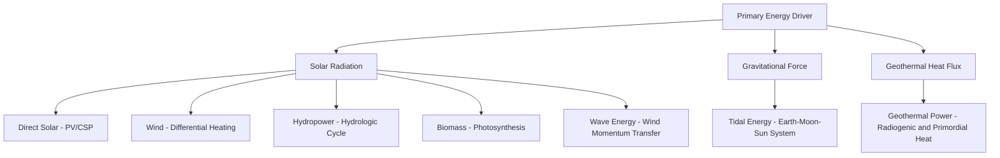

## Renewable Energy Resources

### Definition and Scope

Renewable energy resources are naturally replenishing energy sources that are not depleted on human timescales, distinguishing them from finite fossil fuels (coal, petroleum, natural gas) and nuclear fuels (uranium, thorium). The classification rests on the resource's regeneration rate relative to its extraction/use rate. Earth science treats renewable resources as manifestations of three primary energy inputs:

- **Solar radiation** (direct and indirect forms)
- **Gravitational forces** (tidal energy from Earth-Moon-Sun interactions)
- **Geothermal heat** (residual planetary formation heat and radioactive decay in Earth's interior)

Most renewable sources are indirect solar derivatives: wind arises from differential atmospheric heating, hydropower depends on solar-driven evaporation and precipitation, and biomass results from photosynthetic carbon fixation.

### Classification of Renewable Resources

**Solar Energy**

- Direct conversion of insolation via photovoltaic (PV) cells or concentrated solar power (CSP) systems
- Global average solar constant at top of atmosphere: approximately $1361 \text{ W/m}^2$
- Surface insolation varies with latitude, atmospheric attenuation, and cloud cover, typically $150$–$300 \text{ W/m}^2$ averaged annually depending on region

**Wind Energy**

- Kinetic energy of atmospheric circulation, driven by pressure gradients from uneven solar heating
- Power extractable scales with the cube of wind velocity:

$$P = \frac{1}{2} \rho A v^3 C_p$$

where $\rho$ is air density, $A$ is rotor swept area, $v$ is wind speed, and $C_p$ is the power coefficient (theoretical maximum given by the Betz limit, $C_p \leq 0.593$)

**Hydropower**

- Gravitational potential energy of water elevated by the hydrologic cycle, converted to kinetic energy during descent
- Power output: $P = \rho g Q H \eta$, where $Q$ is volumetric flow rate, $H$ is hydraulic head, $g$ is gravitational acceleration, and $\eta$ is turbine-generator efficiency

**Geothermal Energy**

- Heat flux from Earth's interior, sourced from primordial accretion heat (~20%) and radiogenic decay of isotopes such as $\text{U-238}$, $\text{Th-232}$, and $\text{K-40}$ (~80%)
- Average continental geothermal gradient: approximately $25$–$30\text{ °C/km}$ depth
- Average global heat flow: approximately $0.06$–$0.1 \text{ W/m}^2$, though anomalously high at plate boundaries and hotspots

**Biomass Energy**

- Chemical energy stored via photosynthesis: $6\text{CO}_2 + 6\text{H}_2\text{O} + \text{light energy} \rightarrow \text{C}_6\text{H}_{12}\text{O}_6 + 6\text{O}_2$
- Includes wood, agricultural residues, energy crops, and organic waste, convertible via combustion, gasification, pyrolysis, or anaerobic digestion

**Tidal and Wave Energy**

- Tidal energy derives from gravitational interaction among Earth, Moon, and Sun, dissipated through frictional interaction with ocean basins and continental shelves
- Wave energy derives from wind-driven momentum transfer to ocean surface waters

**Ocean Thermal and Salinity Gradient Energy**

- Ocean Thermal Energy Conversion (OTEC) exploits the vertical temperature differential between warm surface water and cold deep water (typically requiring a gradient of at least $20\text{ °C}$)
- Salinity gradient energy exploits osmotic pressure differences at river-ocean interfaces

### Resource Distribution and Geological Controls

**Solar Potential**

Governed by latitude, cloud climatology, and atmospheric turbidity. Arid, low-latitude regions (e.g., the Sahara, Atacama, Sonoran deserts) exhibit the highest direct normal irradiance due to persistent clear-sky conditions and high solar elevation angles.

**Wind Potential**

Concentrated where topography and pressure systems generate sustained high-velocity flow: coastal zones, mountain passes, continental interiors under strong pressure gradients, and offshore areas with low surface roughness.

**Hydropower Potential**

Requires a combination of high precipitation/runoff and favorable relief (steep gradients, narrow valleys suitable for impoundment). Orogenic belts and monsoon-influenced watersheds (Himalayan rivers, Andean drainages) hold substantial global potential.

**Geothermal Potential**

Strongly controlled by plate tectonic setting. High-grade resources cluster along:

- Divergent boundaries (Iceland, East African Rift)
- Convergent boundaries with volcanic arcs (Pacific Ring of Fire: Philippines, Indonesia, Japan, western United States)
- Hotspots (Hawaii, Yellowstone)

**Biomass Potential**

Governed by net primary productivity (NPP), which depends on climate zone, soil fertility, and growing season length. Tropical and temperate biomes with high NPP offer greater sustainable biomass yield.

### Quantitative Resource Assessment Methods

**Solar Resource Assessment**

- Uses pyranometers and pyrheliometers for ground-truth measurement of Global Horizontal Irradiance (GHI) and Direct Normal Irradiance (DNI)
- Satellite-derived irradiance models (e.g., NASA POWER, Meteosat-based products) provide spatial coverage where ground stations are sparse
- Capacity factor (CF) for solar PV typically ranges $15$–$25\%$ depending on latitude and system type

**Wind Resource Assessment**

- Wind resource mapping relies on meteorological mast data, extrapolated vertically using the power law or logarithmic wind profile:

$$v(z) = v_{ref} \left( \frac{z}{z_{ref}} \right)^{\alpha}$$

where $\alpha$ is the wind shear exponent (typically $0.14$ for open terrain)

- Weibull distribution is standard for characterizing wind speed frequency at a site, used to estimate long-term energy yield

**Geothermal Resource Assessment**

- Volumetric heat-in-place method estimates recoverable thermal energy in a reservoir given rock volume, porosity, temperature, and specific heat capacity
- Classified by enthalpy: low-enthalpy (<150°C, direct-use applications), and high-enthalpy (>150°C, electricity generation)

**Hydropower Resource Assessment**

- Flow-duration curves derived from streamflow gauging records characterize discharge variability
- Run-of-river vs. reservoir-storage classification depends on flow regulation capacity and head availability

### Conversion Technologies

**Key Points**

- Photovoltaic cells: direct conversion via the photovoltaic effect in semiconductor p-n junctions (crystalline silicon, thin-film CdTe, perovskite)
- Concentrated Solar Power: parabolic troughs, solar towers, and dish-Stirling systems concentrate sunlight to drive thermodynamic (Rankine or Brayton) cycles
- Wind turbines: horizontal-axis (dominant, three-blade) and vertical-axis configurations; modern utility-scale turbines exceed $10\text{ MW}$ capacity offshore
- Hydropower turbines: Pelton (high head, low flow, impulse type), Francis (medium head, mixed flow, reaction type), and Kaplan (low head, high flow, propeller-type reaction) turbines selected based on site-specific head and flow characteristics
- Geothermal power plants: dry steam, flash steam, and binary cycle (Organic Rankine Cycle) plants, with binary systems enabling utilization of lower-temperature resources
- Biomass conversion: direct combustion, anaerobic digestion (producing biogas, primarily $\text{CH}_4$ and $\text{CO}_2$), and thermochemical gasification/pyrolysis

**Example**

A binary geothermal plant circulates geothermal brine at $120\text{ °C}$ through a heat exchanger, vaporizing a low-boiling-point working fluid (e.g., isobutane or pentane) that drives a turbine in a closed loop, allowing electricity generation from moderate-temperature resources that dry-steam plants cannot exploit.

### Environmental and Geological Considerations

- Hydropower reservoirs alter sediment transport regimes, causing downstream channel incision and delta erosion (documented extensively for the Aswan High Dam and Nile Delta)
- Geothermal extraction can induce microseismicity due to fluid injection/withdrawal altering subsurface stress states, particularly in Enhanced Geothermal Systems (EGS)
- Large-scale hydropower impoundment can induce reservoir-triggered seismicity in tectonically stressed regions
- Wind and solar farms have comparatively low direct geological impact but require land-use and material-sourcing (rare earth elements for turbine magnets, silicon/silver for PV) consideration
- Biomass energy carbon neutrality is contingent on sustainable harvest rates not exceeding regrowth rates; land-use change for energy crops can result in net carbon debt [Inference: the magnitude and payback period vary substantially by feedstock, prior land use, and regional carbon accounting methodology]

### Resource Intermittency and Grid Integration

Solar and wind resources exhibit temporal variability at diurnal, synoptic, and seasonal scales, requiring grid balancing mechanisms:

- Energy storage (pumped-hydro storage, battery systems, compressed air energy storage)
- Geographic diversification and interconnection to smooth aggregate output variability
- Dispatchable renewable baseload from geothermal and reservoir hydropower can offset intermittency of solar and wind

[Unverified: specific capacity factor and grid-penetration figures are highly system- and region-dependent and require reference to current national energy agency statistics for precise values]

### Comparative Overview

| Resource | Typical Capacity Factor | Primary Geological Control | Dispatchability |
| --- | --- | --- | --- |
| Solar PV | 15–25% | Latitude, cloud climatology | Non-dispatchable |
| Wind (onshore) | 25–40% | Pressure gradients, topography | Non-dispatchable |
| Wind (offshore) | 40–55% | Coastal bathymetry, wind regime | Non-dispatchable |
| Hydropower (reservoir) | 40–60% | Relief, precipitation/runoff | Dispatchable |
| Geothermal | 70–95% | Plate tectonic setting | Dispatchable (baseload) |
| Biomass | 50–80% | Net primary productivity | Dispatchable |
| Tidal | 20–35% | Coastal geomorphology, tidal range | Predictable, cyclical |

### Global Resource Distribution (Illustration)

<svg xmlns="http://www.w3.org/2000/svg" viewBox="0 0 800 420">
<text x="400" y="30" font-size="18" font-weight="bold" text-anchor="middle" fill="#1a1a1a">Renewable Resource Intensity by Geological/Climatic Setting (svg_diagram)</text>
<rect x="40" y="60" width="720" height="40" fill="#fdebd0" stroke="#333" />
<text x="60" y="85" font-size="14" fill="#1a1a1a">Arid Low-Latitude Belts (20-35°) — High Solar Irradiance (Sahara, Atacama, Arabian Peninsula)</text>
<rect x="40" y="110" width="720" height="40" fill="#d6eaf8" stroke="#333" />
<text x="60" y="135" font-size="14" fill="#1a1a1a">Coastal / Mountain Pass Zones — High Wind Consistency (North Sea, Patagonia, Great Plains)</text>
<rect x="40" y="160" width="720" height="40" fill="#d5f5e3" stroke="#333" />
<text x="60" y="185" font-size="14" fill="#1a1a1a">Orogenic / Monsoon Watersheds — High Hydropower Potential (Himalaya, Andes, Congo Basin)</text>
<rect x="40" y="210" width="720" height="40" fill="#f9e79f" stroke="#333" />
<text x="60" y="235" font-size="14" fill="#1a1a1a">Plate Boundaries / Hotspots — High Geothermal Gradient (Ring of Fire, Iceland, East African Rift)</text>
<rect x="40" y="260" width="720" height="40" fill="#e8daef" stroke="#333" />
<text x="60" y="285" font-size="14" fill="#1a1a1a">Tropical / Temperate High-NPP Biomes — High Biomass Yield (Amazon Basin, SE Asia, Temperate Forests)</text>
<rect x="40" y="310" width="720" height="40" fill="#aed6f1" stroke="#333" />
<text x="60" y="335" font-size="14" fill="#1a1a1a">Macrotidal Coastlines — High Tidal Range (Bay of Fundy, Severn Estuary, Sea of Okhotsk)</text>

<text x="400" y="380" font-size="12" text-anchor="middle" fill="#555">Resource intensity determined by latitude, tectonic setting, atmospheric circulation, and hydrologic regime</text>

</svg>

### Related Topics

- Fossil Fuel Formation and Occurrence (coal, petroleum, natural gas geology)
- Plate Tectonics and Geothermal Gradient Distribution
- The Hydrologic Cycle and Watershed Hydrology
- Mineral Resources for Renewable Technology (lithium, cobalt, rare earth elements)
- Energy Storage Systems and Grid-Scale Integration
- Carbon Cycle and Climate Change Mitigation
- Environmental Impact Assessment of Energy Infrastructure
- Sustainable Resource Management and Reserve-to-Production Ratios
- Ocean and Coastal Geomorphology (relevant to tidal/wave siting)
- Enhanced Geothermal Systems and Induced Seismicity