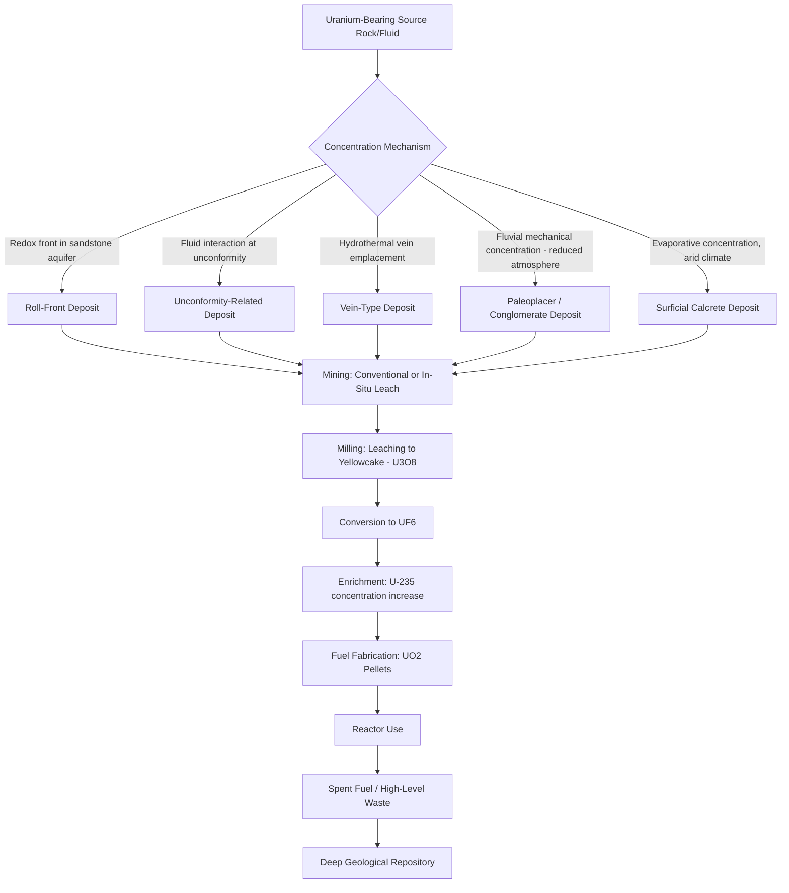

## Geothermal and Nuclear Energy

### Overview

Geothermal and nuclear energy are non-fossil-fuel energy resources that draw on Earth's internal heat and nuclear fission processes respectively, both providing dispatchable baseload electricity generation distinct from intermittent renewable sources such as wind and solar. Though technologically very different, both fields draw substantially on geological expertise — geothermal for reservoir characterization and heat source assessment, nuclear for fuel resource geology (uranium/thorium deposits) and geological repository siting for waste disposal.

### Geothermal Energy — Physical Basis

**Earth's Heat Budget**

Geothermal energy derives from Earth's internal heat, sourced from primordial heat retained since planetary accretion and ongoing radiogenic heat production (decay of radioactive isotopes, principally uranium, thorium, and potassium, within the crust and mantle). Average continental geothermal gradient is approximately 25–30°C per kilometer of depth, though this varies substantially with local tectonic and geological setting.

**Elevated Heat Flow Settings**

Economic geothermal resources require anomalously elevated heat flow relative to average continental gradient, typically associated with:

- **Volcanic and magmatic settings**: active or recently active volcanic systems (subduction zone volcanic arcs, hotspot volcanism, rift-related volcanism) provide shallow magmatic heat sources
- **Extensional tectonic settings**: thinned crust in rift zones and extensional provinces (e.g., Basin and Range-type settings) can produce elevated regional heat flow even without active volcanism
- **Elevated radiogenic heat production**: some high-heat-producing granitic terranes generate anomalous heat flow through radiogenic decay alone, the basis of "hot dry rock"/enhanced geothermal targeting in some non-volcanic settings

**Geothermal Reservoir Components**

A conventional (hydrothermal) geothermal system requires three key elements:

- **Heat source**: typically a shallow magma body or elevated regional heat flow
- **Permeable reservoir**: fractured or porous rock allowing fluid circulation and heat extraction
- **Fluid**: meteoric water (occasionally with a magmatic fluid component) that circulates through the reservoir, extracting heat
- **Caprock/seal**: a low-permeability layer overlying the reservoir that limits fluid and heat loss to the surface, analogous in concept to a petroleum system seal

### Geothermal Resource Types

**Hydrothermal Systems**

The conventional, currently most commercially developed geothermal resource type, exploiting naturally occurring hot fluid circulating through permeable reservoirs, further subdivided by reservoir temperature and fluid phase:

- **Vapor-dominated systems**: reservoir dominated by steam rather than liquid water (relatively rare, e.g., The Geysers field), generally the most straightforward and efficient to exploit for direct steam-turbine power generation
- **Liquid-dominated (hot water) systems**: more common, requiring flashing of produced hot water to steam at surface (single or double flash) or, for lower-temperature resources, binary cycle technology

**Enhanced (Engineered) Geothermal Systems (EGS)**

Where naturally sufficient permeability is absent despite adequate heat, EGS technology creates or enhances reservoir permeability through hydraulic and/or chemical stimulation of hot, low-permeability rock (often crystalline basement), followed by circulation of injected fluid through the engineered fracture network between injection and production wells. EGS substantially expands the geographic and geological range of exploitable geothermal resources beyond naturally permeable hydrothermal settings, though it remains a technically and economically more challenging resource class than conventional hydrothermal development. [Inference — reflects the current general characterization of EGS in the industry and research literature; the technology continues to mature and specific project economics vary]

**Low-to-Moderate Temperature and Direct-Use Resources**

Lower-temperature geothermal resources (broadly below the threshold typically needed for efficient conventional electricity generation) are used directly for space heating, district heating networks, greenhouse agriculture, aquaculture, and industrial process heat, without conversion to electricity.

**Geothermal Heat Pumps (Ground-Source Heat Pumps)**

Exploit the relatively stable shallow subsurface temperature (a few meters to tens of meters depth) for building heating and cooling via heat pump technology, technically distinct from deep geothermal resource exploitation but often grouped under the broader "geothermal energy" umbrella.

### Geothermal Exploration and Development

**Exploration Methods**

Geothermal exploration integrates several geoscience disciplines: geological mapping of volcanic/structural features, geochemical sampling of surface thermal manifestations (hot springs, fumaroles) to estimate subsurface reservoir temperature via geothermometry, and geophysical surveying — particularly **magnetotellurics (MT)**, used to image the resistive-to-conductive transition associated with clay-cap alteration overlying the reservoir, as covered in Electrical and Electromagnetic Methods.

**Drilling and Well Testing**

Geothermal wells share substantial technology overlap with petroleum drilling, but must accommodate higher downhole temperatures (requiring specialized cementing and casing materials) and often more corrosive/scaling-prone fluid chemistry. Well testing (flow testing, pressure transient analysis) characterizes reservoir productivity, temperature, and connectivity prior to full field development.

**Power Generation Technology**

- **Dry steam plants**: used directly with vapor-dominated resource steam
- **Flash steam plants**: liquid-dominated fluid is flashed to steam at reduced pressure (single or multiple stages) to drive turbines
- **Binary cycle plants**: geothermal fluid heat is transferred via heat exchanger to a secondary working fluid with a lower boiling point (organic Rankine cycle), enabling electricity generation from lower-temperature resources that cannot efficiently flash to steam directly

**Reservoir Management**

Sustained production requires managing reservoir pressure decline, typically through reinjection of spent geothermal fluid back into the reservoir, which also mitigates surface disposal issues associated with often mineral-laden and sometimes toxic (e.g., arsenic-bearing) geothermal fluids.

### Geothermal Applications and Considerations

- **Baseload electricity generation**: unlike solar and wind, geothermal provides continuous, weather-independent power generation, making it valuable for grid baseload supply in suitable regions
- **Direct-use heating**: district heating, greenhouse agriculture, and industrial process heat represent significant non-electrical geothermal applications, particularly economical in regions with widespread low-to-moderate temperature resources
- **Induced seismicity**: fluid injection associated with both EGS stimulation and conventional reinjection has, in some cases, been associated with induced microseismicity, requiring monitoring and, in some project settings, adaptive traffic-light management protocols [Inference — reflects a recognized and actively managed risk in the geothermal industry, with specific occurrence and severity being site- and project-dependent]
- **Resource sustainability**: while geothermal heat sources are effectively inexhaustible on human timescales, individual reservoir productivity can decline with production if reinjection and reservoir management are inadequate, making sustainable field management an ongoing technical consideration

### Nuclear Energy — Fuel Resource Geology

**Uranium Ore Deposits**

Nuclear fuel begins with uranium ore, formed through several distinct geological processes:

- **Unconformity-related deposits**: high-grade uranium mineralization localized at or near major stratigraphic unconformities (notably in the Athabasca Basin, Canada, and similar settings), formed by interaction of oxidized, uranium-bearing basinal fluids with reducing conditions near the unconformity surface
- **Sandstone-hosted (roll-front) deposits**: uranium precipitates at redox fronts within permeable sandstone aquifers where oxidized, uranium-bearing groundwater encounters reducing conditions (organic matter, sulfides), forming characteristic crescent-shaped ("roll-front") ore bodies amenable to in-situ leach mining
- **Vein-type deposits**: uranium minerals in structurally controlled hydrothermal veins, often associated with granitic or metamorphic host terranes
- **Surficial (calcrete) deposits**: uranium concentrated in near-surface calcrete formed by evaporative groundwater processes in arid climates
- **Uraniferous conglomerate (quartz-pebble) deposits**: paleoplacer-style deposits (e.g., Witwatersrand-associated uranium) formed by mechanical concentration of detrital uraninite in ancient fluvial conglomerates, generally interpreted as reflecting the reduced (low-oxygen) atmosphere of the early Precambrian, which allowed detrital uraninite to survive fluvial transport without oxidative dissolution [Inference — this genetic interpretation reflects the prevailing scientific consensus regarding early Earth atmospheric evolution, though it remains an area of ongoing geological research]

**Uranium Processing and Fuel Cycle**

- **Milling**: uranium ore is crushed, ground, and leached (typically with sulfuric acid, or alkaline leaching for carbonate-rich ores) to produce a concentrated uranium oxide product ("yellowcake," U₃O₈)
- **Conversion**: yellowcake is converted to uranium hexafluoride (UF₆) gas, the feed material for enrichment
- **Enrichment**: increases the proportion of the fissile isotope U-235 (naturally ~0.7% of uranium) to the level required for reactor fuel (typically 3–5% for most commercial light-water reactors), via gas centrifuge (the dominant modern technology) or, historically, gaseous diffusion
- **Fuel fabrication**: enriched UF₆ is converted to uranium dioxide (UO₂) ceramic pellets, loaded into fuel rods and assembled into fuel assemblies for reactor use

**Thorium as an Alternative Fuel Resource**

Thorium, more abundant in Earth's crust than uranium and not itself fissile, can be converted to fissile U-233 through neutron capture in a breeding reactor cycle; thorium-fuel-cycle reactor concepts have received renewed research interest, though thorium-based commercial power generation remains at a substantially earlier stage of deployment than conventional uranium-fueled reactors. [Inference — reflects the current general status of thorium fuel cycle technology as an active research and development area rather than a mature commercial alternative]

### Nuclear Waste Management and Geological Disposal

**Waste Classification**

Nuclear waste is generally classified by activity level and origin: low-level waste (LLW, e.g., contaminated tools and clothing), intermediate-level waste (ILW, e.g., reactor components), and high-level waste (HLW, primarily spent nuclear fuel and reprocessing waste), with HLW requiring the most stringent long-term isolation given its high radioactivity and long-lived radionuclide content.

**Geological Repository Concept**

Long-term disposal of high-level waste is generally addressed through deep geological repository concepts, siting waste in stable geological formations at depth (typically several hundred meters) selected for low permeability, geochemical retardation of radionuclide migration, tectonic stability, and absence of exploitable resources that might attract future human intrusion. Candidate host rock types studied or used internationally include crystalline (granitic) rock, clay/shale formations, and salt formations, each offering different combinations of mechanical stability, low permeability, and self-sealing behavior (notably salt, which exhibits plastic deformation that can seal fractures over time).

**Site Characterization Requirements**

Repository site selection requires extensive geological and hydrogeological characterization: regional tectonic and seismic history, groundwater flow modeling over very long timescales, geochemical assessment of radionuclide-rock-groundwater interaction, and geomechanical characterization of host rock stability under thermal loading from decaying waste.

**Multi-Barrier Safety Concept**

Geological repository designs typically rely on a combination of engineered barriers (waste form, canister, buffer/backfill material) and the natural geological barrier (host rock and surrounding geological setting) to provide redundant, independent containment over the very long timescales required for high-level waste isolation.

### Comparative Summary

| Aspect | Geothermal | Nuclear |
| --- | --- | --- |
| Primary geological role | Reservoir/heat source characterization | Fuel resource geology, waste repository siting |
| Key resource geology | Volcanic/tectonic heat sources, reservoir permeability | Uranium ore deposit genesis (unconformity, roll-front, vein, placer types) |
| Key geophysical tool | Magnetotellurics (resistivity/alteration mapping) | Site characterization geophysics for repository siting |
| Waste/byproduct consideration | Mineral-laden fluid disposal (typically reinjection) | High-level radioactive waste requiring geological isolation |
| Generation dispatch character | Baseload, weather-independent | Baseload, weather-independent |

### Applications

- **Electricity generation**: both resources provide low-carbon, dispatchable baseload power, of particular relevance to decarbonization strategies alongside intermittent renewables
- **Direct-use heating (geothermal)**: district heating, greenhouse, and industrial applications extend geothermal's utility beyond electricity in suitable regions
- **Uranium exploration**: deposit-model knowledge (unconformity, roll-front, vein, surficial, paleoplacer styles) directly guides exploration targeting, analogous to the broader ore deposit framework covered in Ore Deposits and Mineral Resources
- **Repository siting programs**: geological and geophysical site characterization for high-level waste repositories represents a specialized, long-timescale application of applied geoscience distinct from resource extraction

### Limitations and Sources of Uncertainty

- **Geothermal resource assessment uncertainty**: subsurface reservoir temperature, permeability, and productivity carry substantial uncertainty prior to drilling, and exploration/appraisal drilling success rates, while improved by integrated geoscience programs, remain an inherent project risk
- **EGS technology maturity**: enhanced geothermal systems remain a less proven technology class than conventional hydrothermal development, with induced seismicity management an active area of ongoing engineering and regulatory attention
- **Uranium deposit genetic model debate**: some uranium deposit types (particularly unconformity-related deposits) have genetic models that remain subjects of ongoing scientific discussion regarding specific fluid source and mineralization timing details, even though the general redox-controlled precipitation mechanism is broadly accepted [Inference — reflects the general state of ongoing scientific refinement typical of actively researched ore deposit models, not a claim of fundamental disagreement on the basic ore-forming process]
- **Geological repository timescale challenge**: demonstrating repository safety over the very long timescales required for high-level waste (tens of thousands of years and beyond) relies on geological and geochemical modeling that cannot be empirically validated through direct observation over such timescales, and remains an area of rigorous but inherently model-dependent safety case development [Inference — reflects a widely acknowledged characteristic of long-term repository safety assessment methodology in the nuclear waste management field]
- **Jurisdictional and policy variation**: both geothermal development incentives and nuclear waste repository programs are strongly shaped by national energy policy and regulatory frameworks that vary significantly and are subject to change over time, which falls outside the geological/technical assessment itself

### Example Workflow (Geothermal Exploration to Development)

1. Conduct regional geological and geochemical reconnaissance (surface thermal manifestations, geothermometry) to identify prospective areas
2. Perform magnetotelluric and other geophysical surveys to map resistivity structure and infer clay-cap/reservoir geometry
3. Drill temperature-gradient and slim exploration wells to confirm subsurface temperature and estimate reservoir characteristics
4. Conduct full-diameter exploration/appraisal drilling with flow testing to characterize reservoir productivity
5. Select appropriate power conversion technology (dry steam, flash, or binary) based on measured reservoir temperature and fluid chemistry
6. Design field development including production and reinjection well placement for sustainable long-term reservoir management
7. Monitor reservoir pressure, temperature, and any induced seismicity throughout field operation, adjusting injection strategy as needed

### Geothermal System Components (svg_diagram)

<svg xmlns="http://www.w3.org/2000/svg" viewBox="0 0 900 460" font-family="Helvetica, Arial, sans-serif">
<text x="450" y="30" font-size="18" font-weight="bold" text-anchor="middle" fill="#111">Conventional Hydrothermal Geothermal System (svg_diagram)</text>

<line x1="50" y1="80" x2="850" y2="80" stroke="#555" stroke-width="2" />
<text x="60" y="70" font-size="11">Surface</text>

<rect x="50" y="80" width="800" height="60" fill="#d9d2c5" />
<text x="450" y="115" font-size="12" text-anchor="middle">Caprock / Low-Permeability Seal</text>

<rect x="50" y="140" width="800" height="120" fill="#f9e6b0" opacity="0.7" />
<text x="450" y="175" font-size="13" text-anchor="middle" font-weight="bold">Permeable Reservoir (fractured rock + circulating fluid)</text>
<text x="450" y="200" font-size="11" text-anchor="middle">Convective fluid circulation extracts heat</text>

<path d="M300,260 Q450,420 600,260 Z" fill="#e07050" opacity="0.85" />
<text x="450" y="300" font-size="13" text-anchor="middle" fill="#5a1d00" font-weight="bold">Heat Source</text>
<text x="450" y="320" font-size="11" text-anchor="middle" fill="#5a1d00">(magma body or elevated regional heat flow)</text>

<line x1="200" y1="80" x2="200" y2="180" stroke="#2980b9" stroke-width="4" />
<text x="200" y="70" font-size="10" text-anchor="middle" fill="#2980b9">Production</text>
<line x1="650" y1="80" x2="650" y2="180" stroke="#27ae60" stroke-width="4" />
<text x="650" y="70" font-size="10" text-anchor="middle" fill="#27ae60">Reinjection</text>

<circle cx="750" cy="80" r="8" fill="#c0392b" />
<text x="750" y="65" font-size="10" text-anchor="middle">Hot Spring / Fumarole</text>
</svg>

### Uranium Deposit Genesis and Fuel Cycle Path

**Next Steps**

- Ore Deposits and Mineral Resources
- Applications in Resource Exploration
- Formation of Fossil Fuels
- Renewable Energy Geology (Wind, Solar Siting, Critical Minerals)
- Radiometric Dating and Isotope Geochemistry
- Rock Mass Characterization for Repository Siting
- Induced Seismicity and Reservoir Geomechanics
- Nuclear Fuel Cycle Engineering