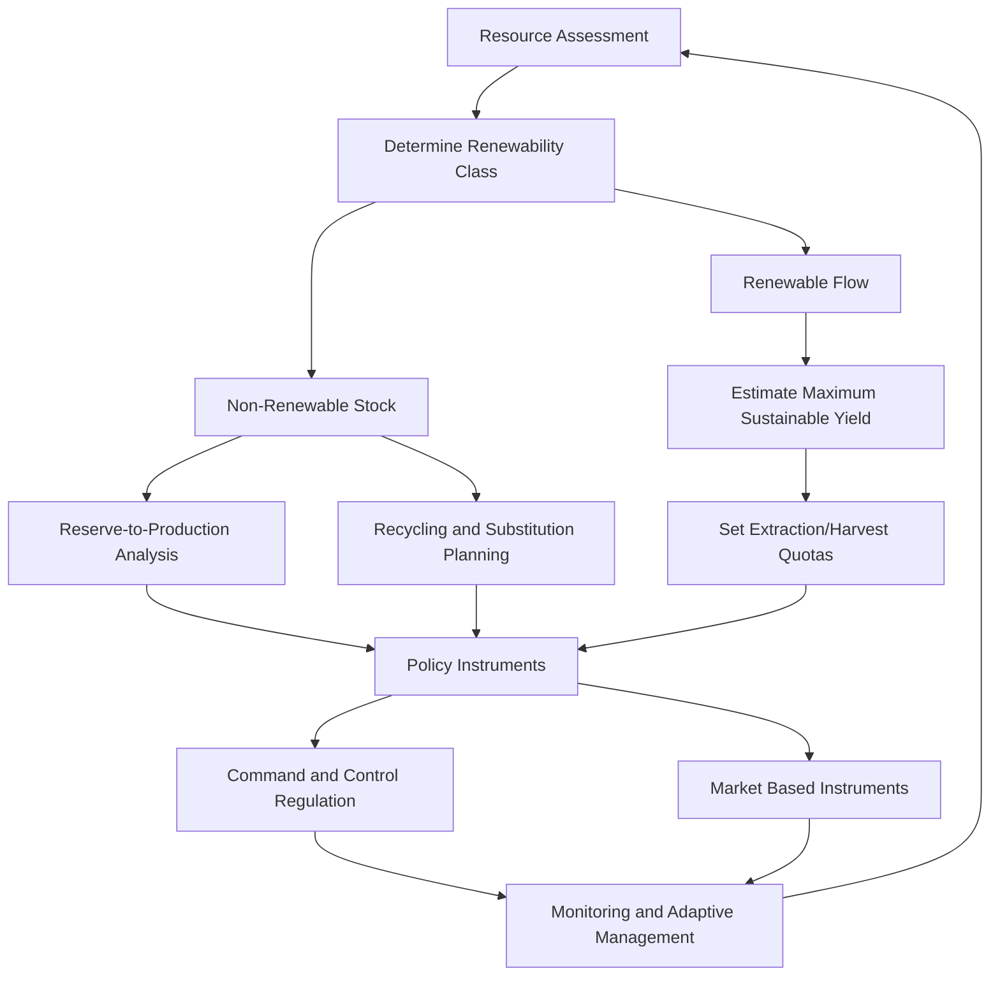

## Sustainable Resource Management

### Definition and Core Principles

Sustainable resource management refers to the extraction, use, and stewardship of natural resources at rates and in manners that preserve their availability, ecological function, and utility for future generations, while minimizing environmental degradation. In economic geology, this concept governs how mineral, energy, water, soil, and biotic resources are appraised, exploited, and regulated. The framework rests on three interdependent pillars:

- **Environmental integrity** — maintaining ecosystem function, biodiversity, and geochemical cycling
- **Economic viability** — ensuring resource use remains commercially and socially productive
- **Social equity** — distributing resource benefits and burdens fairly across generations and communities

This triad is commonly termed the "triple bottom line" and underlies most formal sustainability frameworks, including the Brundtland Commission's 1987 definition of sustainable development as development that meets present needs without compromising the ability of future generations to meet their own.

### Classification of Resources by Renewability

**Non-Renewable (Stock) Resources**

- Fixed quantity relative to human timescales: metallic ores, fossil fuels, most industrial minerals
- Management focus: extend reserve lifespan, maximize recovery efficiency, minimize waste, and plan substitution/recycling pathways

**Renewable (Flow) Resources**

- Naturally replenished if extraction does not exceed regeneration rate: forests, fisheries, groundwater (partially), soil, biomass, solar/wind/hydro energy
- Management focus: maintain harvest or extraction at or below the **sustainable yield** threshold

**Potentially Renewable / Threshold Resources**

- Renewable only if a critical ecological threshold is not breached: groundwater aquifers, soil fertility, coral reefs
- Overexploitation can convert these into functionally non-renewable resources (e.g., aquifer compaction causing permanent loss of storage capacity)

### Key Quantitative Concepts

**Maximum Sustainable Yield (MSY)**

The largest harvest or extraction rate that a renewable resource population can sustain indefinitely without depleting its regenerative base. For a logistic population growth model:

$$\frac{dN}{dt} = rN\left(1 - \frac{N}{K}\right) - H$$

where $N$ is resource stock, $r$ is intrinsic growth rate, $K$ is carrying capacity, and $H$ is harvest rate. MSY occurs at $N = K/2$, where population growth rate is maximized.

**Reserve-to-Production Ratio (R/P)**

Used for non-renewable resources to estimate the number of years a reserve would last at current production rates:

$$R/P = \frac{\text{Proven Reserves}}{\text{Annual Production Rate}}$$

This is a static index; it does not account for future demand shifts, technological recovery improvements, or new discoveries, and should not be interpreted as a fixed depletion date.

**Hotelling's Rule**

An economic principle stating that the net price (marginal profit) of a non-renewable resource should rise at a rate equal to the discount rate under efficient market conditions, incentivizing conservation as scarcity increases:

$$\frac{dP}{dt} = rP$$

where $P$ is resource price/rent and $r$ is the discount rate. [Inference: real-world markets frequently deviate from this idealized trajectory due to technological change, exploration, and policy intervention]

**Ecological Footprint and Carrying Capacity**

Carrying capacity denotes the maximum resource consumption or population level an environment can support indefinitely without degradation. Ecological footprint analysis compares human demand against biocapacity, often expressed in global hectares (gha) per capita.

### Sustainable Management Strategies by Resource Type

**Mineral and Metallic Resources**

- **Reserve classification systems** (e.g., JORC Code, NI 43-101, SEC S-K 1300) standardize reporting of measured, indicated, and inferred resources to inform responsible extraction planning
- **Recycling and circular economy integration**: secondary metal recovery reduces primary extraction pressure (e.g., aluminum recycling requires roughly 5% of the energy needed for primary smelting)
- **Mine reclamation and closure planning**: legally mandated restoration of landform, hydrology, and vegetation post-extraction
- **Responsible sourcing certification** (e.g., conflict-mineral due diligence frameworks) addresses social dimensions of extraction

**Water Resources**

- **Sustainable yield management** of aquifers: extraction rate should not exceed natural recharge rate to avoid land subsidence and saline intrusion
- **Integrated Water Resources Management (IWRM)**: coordinated development of water, land, and related resources to maximize economic and social welfare without compromising ecosystem sustainability
- **Watershed-based governance** aligns administrative boundaries with hydrological units

**Soil Resources**

- **Erosion control**: contour plowing, terracing, cover cropping to maintain soil formation rates above loss rates (natural soil formation is extremely slow, often cited at approximately 1 cm per several hundred years, depending on parent material and climate)
- **Nutrient cycling management**: crop rotation, organic amendment, and controlled fertilizer application to prevent depletion and eutrophication

**Forest and Biomass Resources**

- **Sustainable forestry certification** (e.g., FSC, PEFC) mandates harvest rates aligned with regrowth and biodiversity conservation
- **Selective logging and rotation cycles** designed around species-specific regeneration timescales

**Fisheries and Marine Resources**

- **Catch quotas** set relative to MSY estimates from stock assessment models
- **Marine protected areas (MPAs)** serve as refugia supporting population resilience

**Energy Resources**

- **Diversification toward renewables** reduces dependency on finite fossil reserves (see Renewable Energy Resources)
- **Energy efficiency standards** reduce per-capita resource demand growth

### Governance and Policy Frameworks

**Key Points**

- **Command-and-control regulation**: direct limits on extraction volumes, emissions, or land use (permits, quotas, protected area designation)
- **Market-based instruments**: severance taxes, tradable extraction/pollution permits, and resource rent taxation internalize externalities
- **Environmental Impact Assessment (EIA)**: mandatory pre-extraction evaluation of ecological, hydrological, and social consequences
- **International frameworks**: UN Sustainable Development Goals (particularly SDG 12 – Responsible Consumption and Production, and SDG 15 – Life on Land), the Convention on Biological Diversity, and regional mining/water treaties
- **Adaptive management**: iterative policy adjustment based on monitoring data, acknowledging uncertainty in ecological thresholds

### Common Failure Modes and Historical Cases

- **Tragedy of the commons**: overexploitation of shared, unregulated resources due to individually rational but collectively destructive behavior (classic examples include open-access fisheries collapse, such as the Atlantic cod fishery collapse off Newfoundland in the early 1990s)
- **Resource curse / Dutch disease**: paradoxical economic underperformance in resource-rich nations due to overreliance on extractive sectors, currency appreciation, and institutional weakness [Inference: the strength and universality of this effect is debated in the economic geography literature and depends heavily on governance quality]
- **Aquifer overdraft**: extraction exceeding recharge, as documented in parts of the North China Plain and the U.S. High Plains (Ogallala) Aquifer, leading to water table decline and land subsidence
- **Aral Sea desiccation**: large-scale irrigation diversion causing near-total loss of a major inland water body and associated ecological and economic collapse

### Conceptual Model: Sustainable Yield Curve

<svg xmlns="http://www.w3.org/2000/svg" viewBox="0 0 700 420">
<text x="350" y="30" font-size="18" font-weight="bold" text-anchor="middle" fill="#1a1a1a">Sustainable Yield vs. Resource Stock Level (svg_diagram)</text>
<line x1="70" y1="360" x2="650" y2="360" stroke="#333" stroke-width="2" />
<line x1="70" y1="360" x2="70" y2="60" stroke="#333" stroke-width="2" />
<text x="360" y="400" font-size="14" text-anchor="middle" fill="#1a1a1a">Resource Stock (N)</text>
<text x="30" y="210" font-size="14" text-anchor="middle" fill="#1a1a1a" transform="rotate(-90 30 210)">Growth / Yield Rate</text>
<path d="M 70 360 Q 360 40 650 360" fill="none" stroke="#2874a6" stroke-width="3" />
<line x1="360" y1="360" x2="360" y2="90" stroke="#c0392b" stroke-width="1.5" stroke-dasharray="6,4" />
<circle cx="360" cy="90" r="6" fill="#c0392b" />
<text x="370" y="80" font-size="13" fill="#c0392b">MSY point (N = K/2)</text>

<text x="90" y="375" font-size="12" fill="#555">0</text>

<text x="620" y="375" font-size="12" fill="#555">K (carrying capacity)</text>

<text x="360" y="410" font-size="12" text-anchor="middle" fill="#555" dy="20">Harvesting beyond MSY drives stock toward collapse; harvesting below MSY underutilizes the resource</text>

</svg>

### Economic Valuation Tools

- **Net Present Value (NPV) of resource extraction projects**, incorporating discount rates to compare present versus future resource use
- **Total Economic Value (TEV) framework**: decomposes resource value into direct use, indirect use (ecosystem services), option value, and existence/bequest value
- **Life Cycle Assessment (LCA)**: quantifies cumulative environmental impact of a resource from extraction through processing, use, and disposal

### Comparative Summary Table

| Resource Category | Renewability | Primary Sustainability Metric | Key Management Tool |
| --- | --- | --- | --- |
| Metallic ores | Non-renewable | Reserve-to-Production ratio | Recycling, reserve classification |
| Groundwater | Threshold-renewable | Recharge-to-extraction balance | Sustainable yield permitting |
| Forests | Renewable | Regrowth rate vs. harvest rate | Certification, rotation cycles |
| Fisheries | Renewable | Maximum Sustainable Yield | Catch quotas, MPAs |
| Soil | Slowly renewable | Formation rate vs. erosion rate | Conservation tillage |
| Fossil fuels | Non-renewable | Reserve-to-Production ratio | Efficiency, substitution |

### Related Topics

- Renewable Energy Resources
- Mineral Resource Classification and Reserve Estimation (JORC, NI 43-101 systems)
- Environmental Impact Assessment and Mine Reclamation
- Hydrogeology and Aquifer Management
- Soil Formation, Erosion, and Conservation
- Fisheries Science and Population Dynamics Modeling
- Circular Economy and Industrial Ecology
- Resource Curse and Extractive Industry Economics
- Environmental Policy Instruments and Market-Based Regulation
- Life Cycle Assessment Methodology