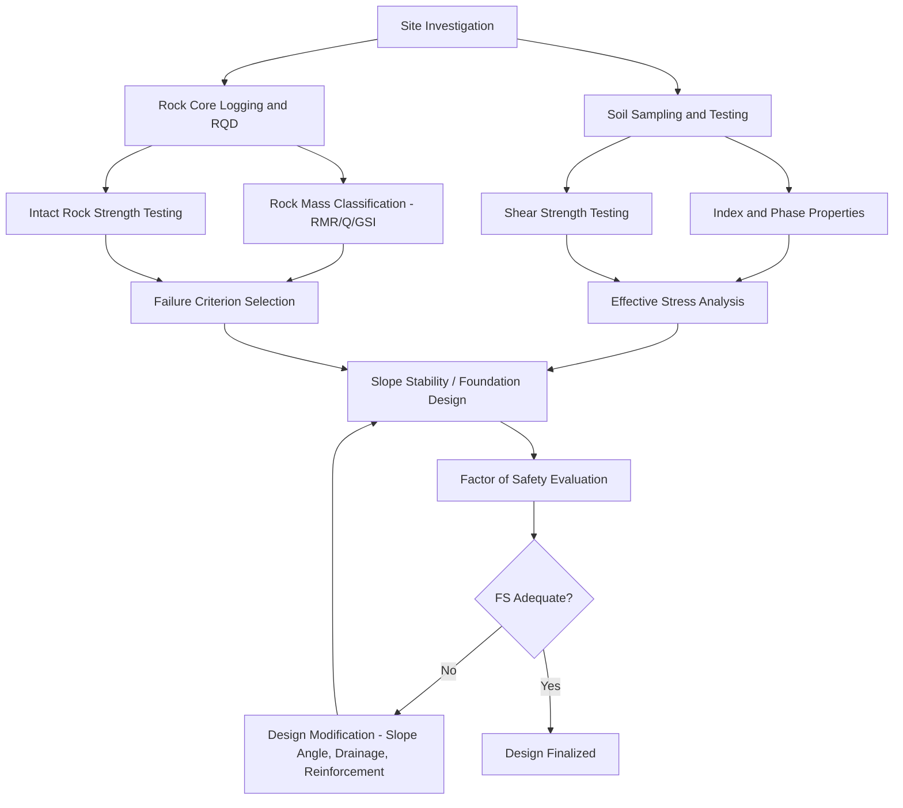

## Soil and Rock Mechanics

### Definition and Scope

Soil and rock mechanics is the branch of engineering geology and geotechnical engineering concerned with the physical and mechanical behavior of earth materials under applied stress, addressing deformation, strength, and failure characteristics relevant to foundations, slopes, tunnels, and excavations. Soil mechanics treats unconsolidated or weakly cemented particulate materials, while rock mechanics addresses intact rock and discontinuous rock masses. Both disciplines apply principles of continuum mechanics, particle physics, and hydromechanics to predict material response under natural and engineered loading conditions.

### Fundamental Soil Properties

**Index Properties**

- **Grain size distribution**: determined via sieve analysis (coarse fraction) and hydrometer analysis (fine fraction), classified per systems such as the Unified Soil Classification System (USCS)
- **Atterberg limits**: liquid limit ($LL$), plastic limit ($PL$), and plasticity index $PI = LL - PL$, characterizing fine-grained soil consistency across moisture states
- **Specific gravity** ($G_s$): ratio of solid particle density to water density, typically $2.65$–$2.75$ for common mineral soils

**Phase Relationships**

Soil is idealized as a three-phase system: solids, water, and air. Key derived parameters include:

$$e = \frac{V_v}{V_s}$$

where $e$ is void ratio, $V_v$ is volume of voids, and $V_s$ is volume of solids.

$$n = \frac{V_v}{V_T}$$

where $n$ is porosity and $V_T$ is total volume.

$$w = \frac{W_w}{W_s} \times 100\%$$

where $w$ is water content, $W_w$ is weight of water, and $W_s$ is weight of solids.

$$S = \frac{V_w}{V_v} \times 100\%$$

where $S$ is degree of saturation.

### Effective Stress Principle

Terzaghi's principle of effective stress is the foundational concept governing soil mechanical behavior, stating that soil deformation and strength are controlled not by total stress but by the stress transmitted through the soil skeleton:

$$\sigma' = \sigma - u$$

where $\sigma'$ is effective stress, $\sigma$ is total stress, and $u$ is pore water pressure. This relationship explains phenomena such as consolidation settlement, liquefaction, and slope instability triggered by pore pressure changes.

### Soil Strength

**Mohr-Coulomb Failure Criterion**

The standard framework for soil shear strength:

$$\tau_f = c' + \sigma' \tan\phi'$$

where $\tau_f$ is shear strength at failure, $c'$ is effective cohesion, $\sigma'$ is effective normal stress, and $\phi'$ is effective angle of internal friction.

**Key Points**

- **Cohesive soils** (clays): strength derives substantially from interparticle electrochemical bonding and can exhibit both drained ($c', \phi'$) and undrained ($c_u$, $\phi_u \approx 0$) shear strength parameters depending on loading rate relative to drainage capacity
- **Cohesionless soils** (sands, gravels): strength derives primarily from interparticle friction and interlocking, with $c' \approx 0$
- **Testing methods**: direct shear test, triaxial compression test (unconsolidated-undrained, consolidated-undrained, consolidated-drained), and unconfined compression test, each simulating different field drainage and loading scenarios

### Consolidation and Settlement

Fine-grained saturated soils under load undergo time-dependent volume reduction as pore water is expelled, described by Terzaghi's one-dimensional consolidation theory:

$$\frac{\partial u}{\partial t} = c_v \frac{\partial^2 u}{\partial z^2}$$

where $c_v$ is the coefficient of consolidation. Settlement magnitude is estimated using the compression index $C_c$ (normally consolidated soils) and recompression index $C_r$ (overconsolidated soils), derived from oedometer testing.

$$S_c = \frac{C_c H}{1+e_0} \log\left(\frac{\sigma'_0 + \Delta\sigma'}{\sigma'_0}\right)$$

where $H$ is layer thickness, $e_0$ is initial void ratio, and $\sigma'_0$ is initial effective overburden stress.

### Fundamental Rock Properties

**Intact Rock Properties**

- **Uniaxial compressive strength (UCS)**: determined via unconfined compression testing, ranging from <5 MPa (very weak rock) to >250 MPa (extremely strong rock) per ISRM classification
- **Elastic modulus and Poisson's ratio**: characterize deformability under stress
- **Point load index**: field-portable strength index correlated to UCS

**Rock Mass Characteristics**

Unlike intact rock specimens, in-situ rock mass behavior is dominated by discontinuities (joints, faults, bedding planes, foliation). Key discontinuity parameters include orientation, spacing, persistence, aperture, roughness, infill material, and weathering grade.

**Rock Mass Classification Systems**

- **Rock Mass Rating (RMR)**: composite index from UCS, RQD (Rock Quality Designation), discontinuity spacing/condition, groundwater condition, and discontinuity orientation
- **Q-system (Barton)**: used primarily for tunnel support design, incorporating RQD, joint set number, joint roughness/alteration, water reduction factor, and stress reduction factor
- **Geological Strength Index (GSI)**: links rock mass structure and discontinuity surface condition to strength/deformation parameters for use in the Hoek-Brown failure criterion

### Rock Failure Criteria

**Mohr-Coulomb (linear)** applies reasonably to rock at low confining stress. **Hoek-Brown criterion** is widely applied for rock masses across a broader stress range:

$$\sigma_1' = \sigma_3' + \sigma_{ci}\left(m_b \frac{\sigma_3'}{\sigma_{ci}} + s\right)^a$$

where $\sigma_1'$ and $\sigma_3'$ are major and minor effective principal stresses, $\sigma_{ci}$ is intact rock UCS, and $m_b$, $s$, $a$ are rock mass constants derived from GSI.

### Groundwater and Seepage

Water flow through soil and rock is governed by Darcy's Law:

$$q = -kA\frac{dh}{dl}$$

where $q$ is flow rate, $k$ is hydraulic conductivity, $A$ is cross-sectional area, and $dh/dl$ is hydraulic gradient. Seepage analysis (via flow nets or numerical modeling) informs seepage force calculations, critical for slope stability, dam design, and excavation dewatering. Excessive upward seepage gradients can trigger **piping** or **quick condition** failure when seepage force equals or exceeds buoyant unit weight.

### Slope Stability Analysis

**Limit Equilibrium Methods**

- **Infinite slope analysis**: applicable to shallow, planar failure surfaces parallel to the slope
- **Method of slices** (Ordinary/Fellenius, Bishop's Simplified, Janbu, Morgenstern-Price): applicable to rotational/circular or complex non-circular failure surfaces, computing a **factor of safety (FS)**:

$$FS = \frac{\text{Resisting Moment (or Force)}}{\text{Driving Moment (or Force)}}$$

A slope is generally considered marginally stable near $FS \approx 1.0$–$1.3$ depending on regulatory and consequence-based design standards; behavior may vary depending on soil variability, seismic loading, and pore pressure assumptions used in analysis.

**Failure Mode Classification**

- Falls, topples, slides (rotational and translational), lateral spreads, and flows, following the Varnes/Hungr landslide classification system

### Foundation and Excavation Applications

**Bearing Capacity**

Terzaghi's bearing capacity equation estimates ultimate soil bearing capacity beneath shallow foundations:

$$q_u = c'N_c + qN_q + 0.5\gamma B N_\gamma$$

where $N_c$, $N_q$, $N_\gamma$ are dimensionless bearing capacity factors dependent on $\phi'$, $q$ is surcharge, $\gamma$ is soil unit weight, and $B$ is footing width.

**Retaining Structure Design**

Lateral earth pressure theories (Rankine, Coulomb) estimate active, passive, and at-rest pressures for retaining wall, sheet pile, and excavation support design:

$$K_a = \tan^2\left(45° - \frac{\phi'}{2}\right), \quad K_p = \tan^2\left(45° + \frac{\phi'}{2}\right)$$

**Example**

A retaining wall backfilled with sand having $\phi' = 30°$ yields $K_a = \tan^2(30°) \approx 0.33$; for a wall height of $4\text{ m}$ and backfill unit weight $\gamma = 18\text{ kN/m}^3$, the active lateral force per unit length is approximately $\frac{1}{2}K_a\gamma H^2 \approx 47.5\text{ kN/m}$, informing structural design of the wall stem and base.

### Ground Improvement Techniques

- **Compaction** (mechanical densification, dynamic compaction, vibro-compaction) to increase density and strength of loose granular soils
- **Grouting** (permeation, compaction, jet grouting) to reduce permeability or increase strength
- **Soil reinforcement** (geosynthetics, soil nails, ground anchors) to improve tensile capacity of soil masses
- **Preloading and vertical drains** to accelerate consolidation settlement prior to construction

### Comparative Summary: Soil vs. Rock Mechanics Focus

| Aspect | Soil Mechanics | Rock Mechanics |
| --- | --- | --- |
| Governing behavior | Particulate/granular interaction | Intact material plus discontinuities |
| Primary strength model | Mohr-Coulomb (effective stress) | Hoek-Brown / Mohr-Coulomb |
| Key classification | USCS, Atterberg limits | RMR, Q-system, GSI |
| Dominant failure control | Pore pressure, effective stress | Discontinuity orientation and condition |
| Typical applications | Foundations, embankments, slopes | Tunnels, rock slopes, underground excavation |

### Related Topics

- Landslide Classification and Mass Wasting Processes
- Groundwater Hydrology and Seepage Analysis
- Foundation Engineering and Bearing Capacity Design
- Seismic Site Response and Liquefaction Potential
- Rock Mass Classification Systems (RMR, Q-system, GSI)
- Retaining Wall and Earth Pressure Theory
- Ground Improvement and Geosynthetics
- Engineering Geological Site Investigation Methods
- Tunneling and Underground Excavation Support Design