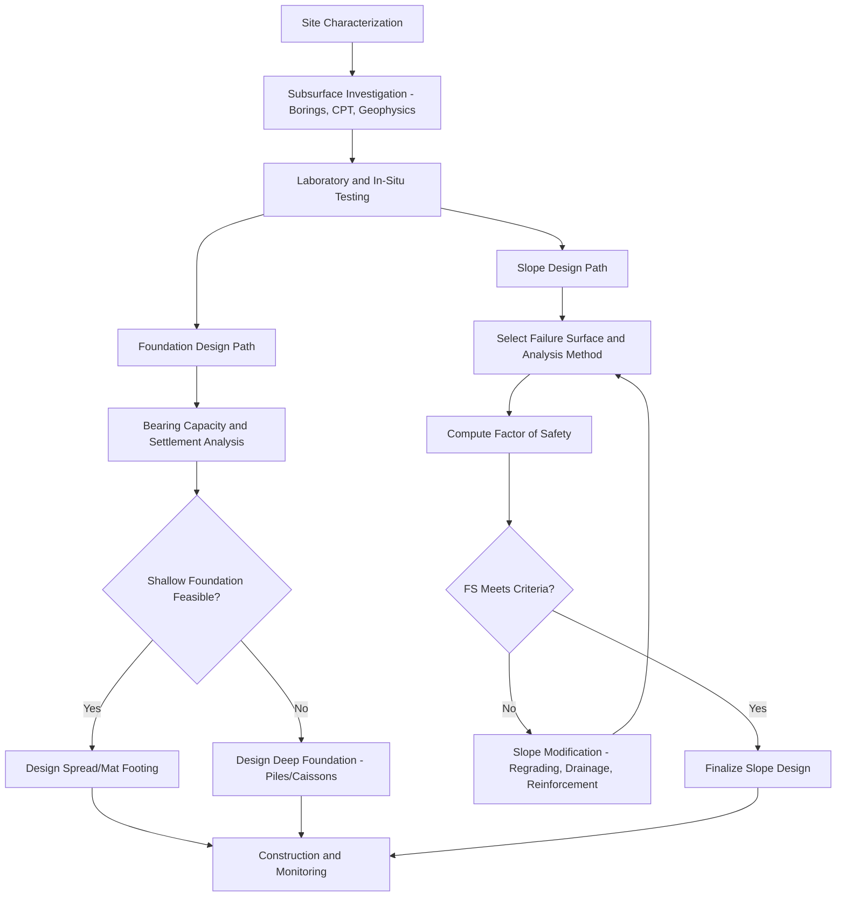

## Foundation and Slope Engineering

### Definition and Scope

Foundation and slope engineering is the applied discipline within geotechnical and engineering geology concerned with the design, analysis, and stabilization of structural support systems (foundations) and natural or engineered earth slopes. It integrates soil and rock mechanics principles with structural loading requirements, hydrogeological conditions, and site-specific geological hazards to ensure serviceability and safety of the ground-structure interface across the design life of a project.

### Foundation Engineering

**Classification of Foundation Types**

**Shallow Foundations**

Used when adequate bearing capacity exists near the surface and settlement is tolerable. Depth-to-width ratio is generally less than or equal to 1.

- **Spread (isolated) footings**: support individual columns
- **Combined footings**: support two or more columns where individual footings would overlap
- **Strip (wall) footings**: continuous support beneath load-bearing walls
- **Mat (raft) foundations**: single slab supporting the entire structure footprint, used where bearing capacity is low or loads are large relative to soil strength

**Deep Foundations**

Used when near-surface soils are unsuitable (low bearing capacity, high compressibility, presence of expansive or collapsible soils) and loads must be transferred to deeper, competent strata.

- **Pile foundations**: driven, bored (drilled shaft/caisson), or screw piles, deriving capacity from end bearing, skin friction, or a combination
- **Pier and caisson foundations**: large-diameter drilled shafts or open/pneumatic caissons for heavy structural loads
- **Micropiles**: small-diameter, high-capacity piles used in restricted access or retrofit conditions

### Foundation Design Principles

**Bearing Capacity**

Ultimate bearing capacity for shallow foundations is commonly estimated using Terzaghi's or Meyerhof's equations:

$$q_u = c'N_c s_c d_c + qN_q s_q d_q + 0.5\gamma B N_\gamma s_\gamma d_\gamma$$

where $N_c$, $N_q$, $N_\gamma$ are bearing capacity factors, $s$ terms are shape factors, $d$ terms are depth factors, $q$ is effective overburden at foundation depth, $\gamma$ is soil unit weight, and $B$ is footing width. Allowable bearing capacity is obtained by applying a factor of safety (typically 2.5–3.0) to the ultimate value.

**Pile Capacity**

Ultimate axial pile capacity is the sum of end-bearing and shaft friction components:

$$Q_u = Q_p + Q_s = q_p A_p + \sum f_s A_s$$

where $Q_p$ is end bearing resistance, $Q_s$ is total shaft friction resistance, $q_p$ is unit end bearing resistance, $f_s$ is unit skin friction, $A_p$ is pile tip area, and $A_s$ is shaft surface area per segment. Pile load tests (static load test, Osterberg cell test, dynamic pile testing with signal matching analysis) validate design capacity in the field.

**Settlement Analysis**

Foundation settlement comprises:

- **Immediate (elastic) settlement**: instantaneous deformation upon loading, significant in granular soils
- **Consolidation (primary) settlement**: time-dependent volume change in saturated fine-grained soils as pore pressure dissipates
- **Secondary compression (creep)**: long-term settlement under constant effective stress due to particle rearrangement

Differential settlement (unequal settlement between foundation elements) is typically more damaging to structures than uniform total settlement, as it induces additional structural stresses.

**Key Points**

- Foundation depth must extend below the zone affected by seasonal moisture fluctuation, frost penetration, and expansive soil activity
- Groundwater level relative to foundation depth affects both bearing capacity (via effective stress reduction) and constructability (dewatering requirements)
- Foundation selection depends on subsurface stratigraphy, load magnitude and type (static, dynamic, eccentric), allowable settlement, and cost

### Slope Engineering

**Natural vs. Engineered Slopes**

Natural slopes form through geological and geomorphic processes (fluvial incision, glacial action, tectonic uplift) and may exist in marginal stability. Engineered slopes (cuts, embankments, fills) are designed with defined geometry and material properties to meet stability criteria.

**Slope Stability Analysis Methods**

**Limit Equilibrium Method (LEM)**

The dominant conventional approach, computing factor of safety (FS) by comparing resisting and driving forces/moments along an assumed failure surface:

$$FS = \frac{\sum \tau_f}{\sum \tau_d}$$

Common LEM techniques include the Ordinary Method of Slices (Fellenius), Bishop's Simplified Method, Janbu's Method, and Morgenstern-Price Method, differing in the assumptions made regarding inter-slice forces.

**Finite Element and Finite Difference Methods**

Numerical methods (e.g., shear strength reduction technique) model stress-strain behavior and progressive failure mechanisms, offering advantages over LEM for complex geometry, heterogeneous materials, and staged construction sequences. [Inference: computational results are sensitive to constitutive model selection, mesh discretization, and input parameter calibration, and results should be validated against field observations where possible]

**Design Standards**

FS thresholds vary by application and regulatory jurisdiction, but static long-term slopes are commonly designed toward $FS \geq 1.5$, while temporary or construction-stage slopes may accept lower values; seismic (pseudo-static) analysis often targets separate, lower FS thresholds paired with deformation-based assessment. Actual acceptable values depend on consequence of failure, uncertainty in parameters, and applicable design code.

### Slope Failure Mechanisms and Triggers

- **Rainfall infiltration**: increases pore water pressure, reducing effective stress and shear strength (per Terzaghi's principle)
- **Rapid drawdown**: sudden reservoir or water level lowering removes confining water pressure faster than pore pressure within the slope can dissipate, temporarily reducing stability
- **Seismic loading**: cyclic stress can induce strength loss (particularly liquefaction in saturated loose sands) or exceed static stability margins
- **Toe erosion or excavation**: removal of passive resistance at the slope toe
- **Slope oversteepening or surcharge loading**: increased driving forces from construction, fill placement, or vegetation/structure loads

### Slope Stabilization Techniques

**Key Points**

- **Regrading**: flattening slope angle to reduce driving forces
- **Surface and subsurface drainage**: horizontal drains, trench drains, and surface diversion to lower pore water pressure
- **Retaining structures**: gravity walls, cantilever/counterfort walls, mechanically stabilized earth (MSE) walls, and soldier pile/lagging systems
- **Soil nailing and ground anchors**: passive or active tensile reinforcement installed into the slope face and surrounding rock/soil mass
- **Rock slope stabilization**: rock bolts, shotcrete, mesh/drapery systems, and scaling for discontinuity-controlled rock slopes
- **Vegetation and bioengineering**: root reinforcement and reduced surface infiltration/erosion, generally supplementary to structural measures for significant slopes

### Foundation-Slope Interaction Considerations

Structures situated on or near slopes require combined analysis addressing:

- Reduced effective bearing capacity due to proximity to a slope face (asymmetric failure surface geometry)
- Potential for foundation loads to trigger or accelerate slope instability
- Lateral spreading or slope movement inducing additional lateral loads on deep foundation elements

### Monitoring and Instrumentation

- **Inclinometers**: measure subsurface lateral deformation profiles within slopes and behind retaining structures
- **Piezometers**: monitor pore water pressure to track changes affecting effective stress and stability
- **Settlement plates and extensometers**: track foundation and ground surface settlement over time
- **Survey monitoring (total station, GNSS, InSAR)**: track surface displacement at point or regional scale

### Example

A cut slope in stiff clay ($c' = 10\text{ kPa}$, $\phi' = 24°$, $\gamma = 19\text{ kN/m}^3$) with height $8\text{ m}$ and slope angle $35°$ is analyzed using Bishop's Simplified Method, yielding an initial FS of $1.25$ under long-term drained conditions. Since this falls below the target FS of $1.5$, the design is revised by flattening the slope to $28°$ and installing horizontal drains to reduce pore pressure, raising the computed FS to approximately $1.55$, meeting the design criterion.

### Comparative Summary

| Aspect | Foundation Engineering | Slope Engineering |
| --- | --- | --- |
| Primary failure concern | Bearing capacity failure, excessive settlement | Shear failure along a slip surface |
| Key governing equation | Bearing capacity / pile capacity equations | Factor of safety (limit equilibrium) |
| Common triggers of distress | Overload, differential settlement, scour | Rainfall infiltration, seismic loading, toe erosion |
| Primary remediation | Underpinning, deep foundation retrofit | Regrading, drainage, reinforcement |
| Key monitoring tools | Settlement plates, load cells | Inclinometers, piezometers |

### Related Topics

- Soil and Rock Mechanics
- Landslide Classification and Mass Wasting Processes
- Groundwater Hydrology and Seepage Analysis
- Seismic Site Response and Liquefaction Potential
- Retaining Wall and Earth Pressure Theory
- Ground Improvement and Geosynthetics
- Engineering Geological Site Investigation Methods
- Geotechnical Instrumentation and Monitoring Systems
- Expansive and Collapsible Soil Behavior