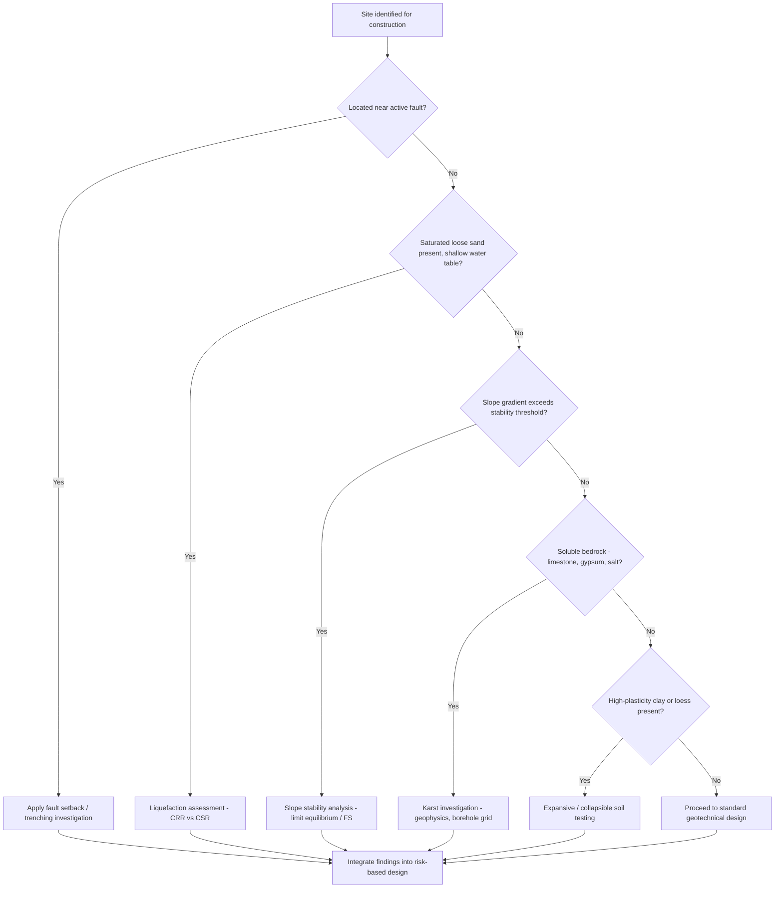

## Geologic Hazards in Construction

### Definition and Scope

Geologic hazards in construction refer to naturally occurring or human-induced geological conditions and processes that pose risks to the safety, stability, and serviceability of engineered structures, including buildings, dams, bridges, tunnels, slopes, and infrastructure networks. Engineering geologists and geotechnical engineers assess these hazards during site investigation, design, construction, and post-construction monitoring phases to mitigate risk to life, property, and long-term structural performance.

The discipline sits at the intersection of engineering geology, geotechnical engineering, and hazard/risk assessment, requiring characterization of subsurface materials, structural geology, hydrogeology, and dynamic earth processes.

### Classification of Geologic Hazards

#### By Origin

- **Endogenic hazards**: Originate from internal Earth processes — seismicity, volcanism, tectonic deformation
- **Exogenic hazards**: Originate from surface and near-surface processes — landslides, erosion, subsidence, weathering-driven collapse

#### By Temporal Behavior

- **Sudden-onset hazards**: Earthquakes, rockfalls, sinkhole collapse, liquefaction
- **Progressive/slow-onset hazards**: Land subsidence, creep, expansive soil movement, long-term slope deformation

#### Primary Hazard Categories for Construction

1. Seismic hazards (ground shaking, surface rupture, liquefaction, seismically induced landslides)
2. Slope instability (landslides, rockfalls, debris flows)
3. Subsidence and sinkholes (karst collapse, mining subsidence, groundwater withdrawal settlement)
4. Expansive and collapsible soils
5. Volcanic hazards (pyroclastic flows, lahars, ashfall loading, ground deformation)
6. Flooding and erosion-related hazards
7. Faulting and ground rupture
8. Tsunami and coastal hazards (for coastal infrastructure)

### Seismic Hazards

#### Ground Shaking

Ground shaking intensity depends on earthquake magnitude, distance to source, focal depth, and local site conditions (site amplification). Soft sediments amplify shaking relative to bedrock, a phenomenon central to microzonation studies.

Peak Ground Acceleration (PGA) is commonly used in design:

$$PGA = \frac{a_{max}}{g}$$

where $a_{max}$ is the maximum recorded or predicted horizontal acceleration and $g$ is gravitational acceleration.

**Key Points**

- Site response analysis accounts for local soil amplification using shear-wave velocity profiles ($V_{s30}$, the average shear-wave velocity in the top 30 m)
- Building codes (e.g., ASCE 7, National Structural Code of the Philippines) specify seismic design categories based on site class and seismic zone
- Soft soil sites (NEHRP Site Class E/F) require site-specific ground response analysis

#### Liquefaction

Liquefaction occurs when saturated, loose, granular soils lose shear strength during cyclic seismic loading as pore water pressure rises and approaches the total overburden stress, causing the soil to behave as a liquid.

The factor of safety against liquefaction is expressed as:

$$FS_{liq} = \frac{CRR}{CSR}$$

where $CRR$ is Cyclic Resistance Ratio (soil's resistance to liquefaction, derived from SPT/CPT correlations) and $CSR$ is Cyclic Stress Ratio (seismic demand imposed on the soil layer).

$$CSR = 0.65 \cdot \frac{a_{max}}{g} \cdot \frac{\sigma_v}{\sigma'_v} \cdot r_d$$

where $\sigma_v$ is total vertical stress, $\sigma'_v$ is effective vertical stress, and $r_d$ is a depth-dependent stress reduction factor.

**Susceptibility factors**: loose to medium-dense sands and silty sands, shallow groundwater table (typically <10–15 m), saturated conditions, low fines content, uniform grain size distribution, and recent (Holocene) unconsolidated deposits.

**Consequences**: loss of bearing capacity, lateral spreading, sand boils, settlement, flotation of buried structures (tanks, pipelines), and building tilting/sinking, as documented extensively in events such as the 1964 Niigata earthquake and 1989 Loma Prieta earthquake.

**Mitigation approaches**:

- Ground improvement (vibro-compaction, stone columns, deep dynamic compaction)
- Deep foundations bypassing liquefiable strata
- Drainage systems to lower pore pressure buildup (prefabricated vertical drains)
- Soil-cement mixing / jet grouting

#### Surface Fault Rupture

Active faults can produce direct ground displacement that no structural design can fully resist. Standard practice mandates fault setback zones (e.g., Alquist-Priolo Earthquake Fault Zoning Act in California) prohibiting construction of habitable structures across active fault traces.

**Key Points**

- Fault trenching investigations are used to characterize fault activity, slip rate, and recurrence interval
- "Active fault" classification typically requires evidence of movement within the Holocene (last ~11,700 years), though criteria vary by jurisdiction
- Setback distances typically range 15–50 m depending on fault complexity and local regulation

### Slope Instability

#### Landslide Classification (Varnes System)

Landslides are classified by movement type and material:

| Movement Type | Material: Rock | Material: Debris | Material: Earth |
| --- | --- | --- | --- |
| Fall | Rockfall | Debris fall | Earth fall |
| Topple | Rock topple | Debris topple | Earth topple |
| Slide (rotational) | Rock slump | Debris slump | Earth slump |
| Slide (translational) | Rock block slide | Debris slide | Earth slide |
| Flow | Rock avalanche | Debris flow | Earthflow |
| Spread | Rock spread | Debris spread | Earth spread |

#### Slope Stability Analysis

The Factor of Safety (FS) for a simple infinite slope is:

$$FS = \frac{c' + (\gamma - \gamma_w \cdot m) \cdot z \cdot \cos^2\beta \cdot \tan\phi'}{\gamma \cdot z \cdot \sin\beta \cdot \cos\beta}$$

where $c'$ is effective cohesion, $\gamma$ is unit weight of soil, $\gamma_w$ is unit weight of water, $m$ is the height ratio of the water table within the soil column, $z$ is depth to failure surface, $\beta$ is slope angle, and $\phi'$ is effective friction angle.

For more complex geometries, limit equilibrium methods are used:

- **Ordinary Method of Slices (Fellenius Method)**: Simplified, ignores inter-slice forces
- **Bishop's Simplified Method**: Accounts for normal inter-slice forces; more accurate for circular failure surfaces
- **Janbu's Method**: Applicable to non-circular failure surfaces
- **Morgenstern-Price / Spencer Method**: Rigorous methods satisfying both force and moment equilibrium

$FS > 1.0$ indicates theoretical stability; engineering practice typically requires $FS \geq 1.5$ for static conditions and $FS \geq 1.1$–$1.2$ for seismic (pseudo-static) conditions, though required values vary by code and consequence class.

**Triggering mechanisms**:

- Rainfall infiltration (pore pressure increase, reduction in matric suction for unsaturated slopes)
- Seismic loading (pseudo-static or dynamic analysis)
- Toe erosion/undercutting (rivers, coastal action, excavation)
- Slope oversteepening (cut slopes, quarrying)
- Freeze-thaw cycles
- Vegetation removal (loss of root reinforcement and increased infiltration)

#### Rockfall Hazard

Rockfall hazard assessment considers rock mass discontinuities (joints, bedding planes, faults), weathering degree, and slope geometry. The Rockfall Hazard Rating System (RHRS) and kinematic analysis (planar, wedge, toppling failure modes using stereonets) are standard tools.

**Key Points**

- Kinematic feasibility for planar failure requires the discontinuity dip to be less than the slope face dip and greater than the friction angle, and the discontinuity strike within ~20° of the slope strike
- Mitigation includes scaling, rock bolting, shotcrete, catch fences, rockfall barriers, and catch ditches sized using rockfall trajectory modeling (e.g., RocFall software)

#### Debris Flows

Debris flows are rapid, gravity-driven flows of poorly sorted sediment and water, often triggered by intense rainfall on steep slopes with abundant loose material, or by breach of landslide dams. They pose severe risk to infrastructure due to high velocity, impact force, and long runout distance.

**Example**

A residential subdivision constructed at the base of a steep, deforested watershed with volcaniclastic soils experiences a debris flow after a typhoon delivers >200 mm of rainfall in 24 hours; saturated colluvium mobilizes, and the flow travels several kilometers, burying structures — a scenario broadly consistent with events observed in volcanic terrains such as Mount Pinatubo lahar-affected areas in the Philippines.

### Subsidence and Sinkholes

#### Karst-Related Subsidence

Karst topography develops in soluble bedrock (limestone, dolomite, gypsum, salt) through dissolution by groundwater. Construction hazards include:

- **Cover-collapse sinkholes**: Sudden collapse of overlying soil into a void, often triggered by groundwater level changes or added surface load
- **Cover-subsidence sinkholes**: Gradual, less catastrophic settling as soil ravels into underlying rock fractures
- **Solution sinkholes**: Slow bedrock dissolution at the surface

**Investigation methods**: geophysical surveys (ground-penetrating radar, electrical resistivity tomography, microgravity surveys), borehole drilling grids, and dye-tracing for groundwater flow paths.

#### Anthropogenic Subsidence

- **Groundwater/hydrocarbon withdrawal**: Reduces pore pressure, increasing effective stress and causing compaction of unconsolidated aquifer sediments (e.g., historical subsidence in Mexico City, Jakarta, and parts of Metro Manila)
- **Underground mining**: Collapse or sagging above mined-out voids (longwall subsidence troughs, pillar collapse in room-and-pillar mines)
- **Peat and organic soil oxidation**: Drainage-induced subsidence in organic-rich soils

Subsidence rate can be estimated via repeated leveling surveys, GPS/GNSS monitoring, or InSAR (Interferometric Synthetic Aperture Radar) satellite data for regional-scale monitoring.

### Expansive and Collapsible Soils

#### Expansive Soils

Expansive soils (high-plasticity clays, particularly montmorillonite-rich smectite clays) undergo significant volume change with moisture fluctuation, generating swelling pressures that can crack foundations, slabs, and pavements.

**Key Points**

- Identified via Atterberg limits testing (high liquid limit and plasticity index), free swell tests, and swell pressure tests
- Classification often uses the plasticity index (PI) and clay activity, $A = PI / (\%\text{clay fraction} < 2\,\mu m)$
- Mitigation: moisture barriers, deep foundations below the active zone, chemical stabilization (lime or cement treatment), removal and replacement with non-expansive fill, post-tensioned slab design

#### Collapsible Soils

Collapsible soils (loess, certain residual and colluvial soils, poorly compacted fills) have a metastable, open structure held together by weak bonds (clay bridging, cementation) that collapse suddenly upon wetting, causing rapid settlement even under constant load.

**Identification**: Double oedometer test comparing settlement of a natural-moisture sample versus a saturated sample under the same load increment; collapse potential is calculated from the difference in void ratio.

### Volcanic Hazards Relevant to Construction

- **Pyroclastic density currents**: Extremely hazardous fast-moving flows of hot gas and volcanic material; construction avoidance via hazard zonation is the primary mitigation
- **Lahars**: Volcanic mudflows composed of remobilized volcanic debris and water, often triggered by rainfall on unconsolidated pyroclastic deposits; can travel far beyond the volcano itself along river valleys
- **Ashfall loading**: Roof structures must be designed for potential ash accumulation loads in active volcanic regions
- **Ground deformation**: Inflation/deflation cycles from magma movement can affect foundation performance near active calderas

### Site Investigation Framework

#### Phased Approach

1. **Desk study**: Review of geological maps, historical aerial photographs, previous site investigation reports, hazard maps, and seismic/fault databases
2. **Walkover survey**: Field reconnaissance for geomorphological indicators of hazards (scarps, tension cracks, hummocky terrain, seepage)
3. **Subsurface investigation**: Boreholes, test pits, cone penetration testing (CPT), standard penetration testing (SPT), geophysical surveys
4. **Laboratory testing**: Index properties, shear strength (direct shear, triaxial), consolidation, permeability
5. **Hazard-specific analysis**: Slope stability modeling, liquefaction assessment, seismic hazard analysis, subsidence prediction
6. **Risk characterization**: Combining hazard probability with exposure and vulnerability to estimate risk

#### Standard Investigation Techniques

| Technique | Primary Application |
| --- | --- |
| SPT (Standard Penetration Test) | Relative density, liquefaction susceptibility, empirical bearing capacity correlations |
| CPT (Cone Penetration Test) | Continuous stratigraphic profiling, soil behavior type, liquefaction assessment |
| Geophysical surveys (seismic refraction, resistivity, GPR) | Subsurface void detection, bedrock depth, karst mapping |
| Inclinometers | Monitoring subsurface lateral slope movement |
| Piezometers | Groundwater/pore pressure monitoring |
| InSAR / GNSS | Regional ground deformation and subsidence monitoring |
| LiDAR | High-resolution topographic mapping for landslide/fault scarp identification |

### Hazard Mitigation Strategies in Design and Construction

#### Avoidance

The most reliable mitigation is siting structures away from identified hazard zones entirely — fault setback zones, landslide-prone slopes, mapped floodplains, and active karst areas — guided by hazard zonation mapping.

#### Ground Improvement

- **Vibro-compaction/vibro-replacement**: Densifies loose granular soils, mitigating liquefaction
- **Deep soil mixing**: Improves strength and reduces permeability
- **Jet grouting**: Creates in-situ soil-cement columns for strengthening and void filling
- **Preloading/surcharging with wick drains**: Accelerates consolidation of soft, compressible soils

#### Structural and Foundation Measures

- Deep foundations (piles, drilled shafts) to bypass hazardous surface strata and transfer loads to competent bearing strata
- Base isolation and seismic dampers for critical structures in high-seismicity zones
- Flexible utility connections to accommodate differential ground movement
- Retaining structures and soil nailing for slope stabilization
- Drainage systems (surface and subsurface) to control pore pressure and reduce infiltration-driven instability

#### Monitoring and Early Warning

Instrumentation programs (inclinometers, extensometers, piezometers, tiltmeters, seismic accelerographs) combined with threshold-based alert systems support ongoing risk management during and after construction, particularly for large infrastructure projects (dams, tunnels, deep excavations) in hazard-prone terrain.

### Conceptual Hazard Assessment Workflow (svg_diagram)

<svg xmlns="http://www.w3.org/2000/svg" viewBox="0 0 900 460" font-family="Helvetica, Arial, sans-serif">
<text x="450" y="28" text-anchor="middle" font-size="18" font-weight="bold" fill="#1a1a1a">Geologic Hazard Assessment Workflow (svg_diagram)</text>
<rect x="30" y="60" width="180" height="60" rx="8" fill="#dde8f5" stroke="#2b4a6f" stroke-width="1.5" />
<text x="120" y="85" text-anchor="middle" font-size="13" font-weight="bold" fill="#1a1a1a">Desk Study</text>
<text x="120" y="103" text-anchor="middle" font-size="11" fill="#333">Maps, records, imagery</text>
<rect x="250" y="60" width="180" height="60" rx="8" fill="#dde8f5" stroke="#2b4a6f" stroke-width="1.5" />
<text x="340" y="85" text-anchor="middle" font-size="13" font-weight="bold" fill="#1a1a1a">Field Reconnaissance</text>
<text x="340" y="103" text-anchor="middle" font-size="11" fill="#333">Walkover, geomorphology</text>
<rect x="470" y="60" width="180" height="60" rx="8" fill="#dde8f5" stroke="#2b4a6f" stroke-width="1.5" />
<text x="560" y="85" text-anchor="middle" font-size="13" font-weight="bold" fill="#1a1a1a">Subsurface Investigation</text>
<text x="560" y="103" text-anchor="middle" font-size="11" fill="#333">Boreholes, CPT, geophysics</text>
<rect x="690" y="60" width="180" height="60" rx="8" fill="#dde8f5" stroke="#2b4a6f" stroke-width="1.5" />
<text x="780" y="85" text-anchor="middle" font-size="13" font-weight="bold" fill="#1a1a1a">Lab Testing</text>
<text x="780" y="103" text-anchor="middle" font-size="11" fill="#333">Index, strength, consolidation</text>
<line x1="210" y1="90" x2="250" y2="90" stroke="#555" stroke-width="1.5" marker-end="url(#arrow)" />
<line x1="430" y1="90" x2="470" y2="90" stroke="#555" stroke-width="1.5" marker-end="url(#arrow)" />
<line x1="650" y1="90" x2="690" y2="90" stroke="#555" stroke-width="1.5" marker-end="url(#arrow)" />
<line x1="780" y1="120" x2="780" y2="160" stroke="#555" stroke-width="1.5" marker-end="url(#arrow)" />
<line x1="780" y1="160" x2="450" y2="160" stroke="#555" stroke-width="1.5" />
<line x1="450" y1="160" x2="450" y2="180" stroke="#555" stroke-width="1.5" marker-end="url(#arrow)" />
<rect x="330" y="185" width="240" height="55" rx="8" fill="#f5e6cc" stroke="#8a5a1e" stroke-width="1.5" />
<text x="450" y="208" text-anchor="middle" font-size="13" font-weight="bold" fill="#1a1a1a">Hazard-Specific Analysis</text>
<text x="450" y="226" text-anchor="middle" font-size="11" fill="#333">Slope, liquefaction, seismic, subsidence</text>
<line x1="450" y1="240" x2="450" y2="270" stroke="#555" stroke-width="1.5" marker-end="url(#arrow)" />
<rect x="330" y="275" width="240" height="55" rx="8" fill="#f5e6cc" stroke="#8a5a1e" stroke-width="1.5" />
<text x="450" y="298" text-anchor="middle" font-size="13" font-weight="bold" fill="#1a1a1a">Risk Characterization</text>
<text x="450" y="316" text-anchor="middle" font-size="11" fill="#333">Hazard x Exposure x Vulnerability</text>
<line x1="450" y1="330" x2="450" y2="360" stroke="#555" stroke-width="1.5" marker-end="url(#arrow)" />
<rect x="150" y="365" width="180" height="60" rx="8" fill="#dcf0dc" stroke="#2f6b2f" stroke-width="1.5" />
<text x="240" y="390" text-anchor="middle" font-size="13" font-weight="bold" fill="#1a1a1a">Avoidance</text>
<text x="240" y="408" text-anchor="middle" font-size="11" fill="#333">Siting / setback zones</text>
<rect x="360" y="365" width="180" height="60" rx="8" fill="#dcf0dc" stroke="#2f6b2f" stroke-width="1.5" />
<text x="450" y="390" text-anchor="middle" font-size="13" font-weight="bold" fill="#1a1a1a">Ground Improvement</text>
<text x="450" y="408" text-anchor="middle" font-size="11" fill="#333">Densification, grouting</text>
<rect x="570" y="365" width="180" height="60" rx="8" fill="#dcf0dc" stroke="#2f6b2f" stroke-width="1.5" />
<text x="660" y="390" text-anchor="middle" font-size="13" font-weight="bold" fill="#1a1a1a">Structural Design</text>
<text x="660" y="408" text-anchor="middle" font-size="11" fill="#333">Deep foundations, isolation</text>
<line x1="450" y1="360" x2="240" y2="365" stroke="#555" stroke-width="1.5" />
<line x1="450" y1="360" x2="660" y2="365" stroke="#555" stroke-width="1.5" />
</svg>

### Decision Logic for Hazard Screening

### Case Considerations [Inference]

[Inference] In tropical, seismically and volcanically active settings such as the Philippines, construction projects frequently must address compound hazards simultaneously — for instance, a site may require concurrent evaluation of liquefaction potential, typhoon-triggered slope instability, and proximity to active fault systems (e.g., the Philippine Fault Zone), which increases the complexity of risk characterization relative to single-hazard settings and typically requires multi-disciplinary coordination among geologists, geotechnical engineers, and structural engineers.

### Regulatory and Standards Context

Design practice is generally governed by a combination of national building codes, geotechnical design standards, and hazard-specific guidelines:

- Seismic design provisions (e.g., ASCE 7, Eurocode 8, National Structural Code of the Philippines)
- Geotechnical investigation standards (e.g., ASTM standards for SPT/CPT, Eurocode 7)
- Local hazard zonation maps issued by geological surveys (e.g., PHIVOLCS hazard maps in the Philippines, USGS hazard maps in the United States)

[Unverified] Specific code provisions, factor-of-safety requirements, and setback distances vary significantly by jurisdiction and should be confirmed against the currently enforced local code prior to design finalization, as these are periodically revised.

**Related Topics**

- Geotechnical site investigation methods and reporting
- Soil mechanics: shear strength and consolidation theory
- Seismic microzonation and site response analysis
- Slope stability analysis software (Slope/W, GeoStudio, RocFall)
- Ground improvement techniques (deep foundations, grouting, soil mixing)
- Karst hydrogeology and sinkhole risk mapping
- Volcanic hazard zonation and lahar modeling
- Engineering properties of residual and tropical soils
- Building code seismic design provisions
- InSAR and remote sensing for ground deformation monitoring
- Landslide early warning systems
- Foundation engineering for problematic soils