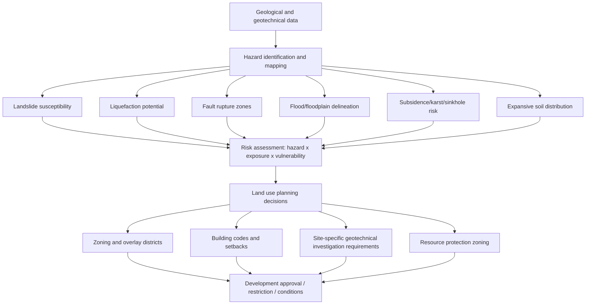

## Land Use Planning and Geology

### Overview

Land use planning and geology is the applied discipline of incorporating geological, geomorphological, and geotechnical information into decisions about how land is developed, zoned, and managed. It integrates hazard assessment, resource availability, and physical land constraints into planning frameworks so that development is sited, designed, and regulated in ways that reduce risk to life, property, and infrastructure while preserving access to geological resources (aggregate, groundwater, minerals) for future use. This field sits at the intersection of engineering geology, hydrogeology, geomorphology, and public policy.

### Rationale for Integrating Geology into Land Use Planning

Geological conditions influence land use suitability in ways that are often invisible at the surface but become critical once construction, excavation, or long-term occupancy begins.

- **Hazard avoidance**: Identifying areas prone to landslides, subsidence, liquefaction, flooding, or fault rupture before development occurs is far more cost-effective than retrofitting or remediating after the fact.
- **Foundation and infrastructure performance**: Bearing capacity, compressibility, and expansive soil behavior directly affect the design life and cost of buildings, roads, and utilities.
- **Resource protection**: Zoning that fails to account for economically significant mineral, aggregate, or groundwater resources can permanently sterilize access to them beneath incompatible land uses (e.g., housing built over a viable aggregate quarry site).
- **Environmental protection**: Geological factors control groundwater vulnerability, contaminant transport pathways, and the siting suitability of landfills, septic systems, and waste facilities.
- **Long-term cost avoidance**: Retrofitting hazard mitigation into existing developed areas is typically far more expensive than avoidance-based planning, though the specific cost multiplier varies widely by hazard type and jurisdiction. [Inference — this is a widely cited planning principle rather than a fixed, universally quantified ratio.]

### Geological Hazard Mapping

Geological hazard maps translate subsurface and surface geological data into spatial products that planners, engineers, and regulators use directly.

**Common Hazard Map Types**

- **Landslide susceptibility/hazard maps**: Classify terrain by landslide likelihood based on slope angle, geology, historical landslide inventories, hydrology, and land cover, often using weighted overlay or statistical/machine-learning susceptibility models.
- **Liquefaction susceptibility maps**: Identify areas with loose, saturated, granular sediments (common in young alluvial and fill deposits) vulnerable to strength loss during strong ground shaking.
- **Fault rupture hazard zones**: Delineate buffer zones around active or potentially active faults where surface rupture during an earthquake is possible, often codified into regulatory setback requirements (e.g., California's Alquist-Priolo Earthquake Fault Zoning Act).
- **Flood hazard maps**: Delineate floodplains by recurrence interval (e.g., the 100-year/1%-annual-chance floodplain), typically produced through hydrological and hydraulic modeling combined with topographic (often LiDAR-derived) data.
- **Subsidence and sinkhole hazard maps**: Identify areas underlain by karst (soluble carbonate or evaporite bedrock), abandoned mine workings, or compressible/organic soils prone to settlement.
- **Expansive soil maps**: Delineate areas underlain by high-plasticity clays (e.g., smectite-rich soils) subject to significant volume change with moisture fluctuation.
- **Volcanic hazard zonation maps**: Classify areas by hazard type and probability from lava flows, pyroclastic density currents, lahars, and ashfall around active volcanic centers.

### Risk Assessment Framework

Geological hazard information feeds into a broader risk framework typically expressed as:

$$\text{Risk} = \text{Hazard} \times \text{Exposure} \times \text{Vulnerability}$$

- **Hazard**: The probability and intensity of a geological event occurring (e.g., annual probability of a landslide of a given magnitude).
- **Exposure**: The population, structures, and infrastructure located within the hazard-affected area.
- **Vulnerability**: The susceptibility of exposed elements to damage or loss given the hazard's occurrence, influenced by construction type, design standards, and occupancy.

**Key Point**: Reducing risk can target any of the three factors — planners most directly control exposure (through zoning and land use restriction) and vulnerability (through building codes and engineering design), while hazard itself is largely a fixed geological condition, though it can occasionally be modified (e.g., slope stabilization, levee construction).

### Slope Stability and Landslide-Related Planning

Landslide-prone terrain requires specific planning tools:

- **Slope angle and geology overlays**: Steep slopes underlain by weak, weathered, or adversely-oriented bedding/joint planes are flagged for restricted development or mandatory geotechnical review.
- **Setback requirements**: Minimum distances from slope crests, toes, or existing landslide headscarps, calibrated to slope height and material properties.
- **Grading ordinances**: Regulate cut-and-fill slope angles, drainage control, and vegetation retention during site development to minimize slope-stability disruption.
- **Landslide inventory mapping**: Historical landslide locations, ages, and types (rotational, translational, debris flow, rockfall) inform susceptibility models, since past landslide activity is one of the strongest predictors of future activity in similar terrain.

### Seismic Hazard Considerations in Planning

- **Ground shaking (seismic microzonation)**: Local site conditions (soft sediment amplification, basin effects) can significantly amplify shaking intensity relative to bedrock sites, informing site-specific building code requirements (e.g., seismic site classes in building codes based on shear-wave velocity to 30 m, $V_{s30}$).
- **Liquefaction**: Loose, saturated, cohesionless soils (common in reclaimed land, young deltaic and alluvial deposits, and artificial fill) can lose shear strength during strong shaking, causing settlement, lateral spreading, and foundation failure; mapped liquefaction zones typically trigger mandatory site-specific geotechnical investigation.
- **Fault rupture avoidance**: Regulatory fault-avoidance zones prohibit or restrict habitable structures directly across active fault traces, since ground shaking mitigation (structural engineering) cannot practically address direct surface rupture displacement.
- **Tsunami inundation zones**: Coastal planning in seismically active subduction zone regions incorporates modeled tsunami inundation extents into evacuation planning and, in some jurisdictions, land use restriction.

### Groundwater and Geological Controls on Land Use

- **Aquifer recharge zone protection**: Zoning ordinances may restrict impervious surface coverage, industrial land uses, or septic system density over sensitive aquifer recharge areas to protect groundwater quality and quantity.
- **Wellhead protection areas**: Delineated zones around public water supply wells within which land use activities are restricted to reduce contamination risk, often defined using time-of-travel groundwater flow modeling.
- **Septic system suitability**: Soil permeability, depth to water table, and depth to bedrock determine whether on-site wastewater disposal is feasible, directly constraining rural and exurban development density.
- **Karst terrain management**: Areas underlain by soluble carbonate bedrock require specialized planning due to sinkhole formation risk, rapid and largely unfiltered groundwater contaminant transport, and unpredictable subsurface void development.

### Geological Resource Protection in Planning

A frequently underweighted aspect of land use planning is protecting future access to geological resources.

- **Mineral resource zoning / Mineral Resource Overlay Zones**: Some jurisdictions formally designate areas with significant aggregate, industrial mineral, or metallic mineral resources to prevent incompatible development from sterilizing future access, recognizing that aggregate resources in particular are inherently location-constrained (transport cost makes distant substitution expensive) and non-renewable at human timescales.
- **Buffer zoning around active and planned extraction sites**: Balances resource access against noise, dust, and traffic impacts on adjacent land uses.
- **Sequential land use planning**: Plans for extraction to precede other development, with agreed post-extraction reclamation to a specified end-use (agriculture, recreation, habitat, or eventual residential/commercial redevelopment).

### Planning and Regulatory Tools

- **Zoning ordinances and overlay districts**: Base zoning (residential, commercial, industrial) is supplemented by hazard-specific overlay districts (e.g., floodplain overlay, landslide overlay, seismic hazard overlay) imposing additional requirements within mapped hazard boundaries.
- **Building and grading codes**: Prescribe engineering design standards (foundation types, seismic design categories, slope grading limits) triggered by site-specific geological/geotechnical conditions.
- **Subdivision review and site-specific geotechnical investigation requirements**: Many jurisdictions require a geotechnical or engineering geology report as a condition of subdivision or building permit approval in mapped hazard zones, assessing site-specific soil, bedrock, and groundwater conditions.
- **Transfer of development rights (TDR) and conservation easements**: Non-regulatory tools that can redirect development away from hazard-prone or resource-significant land while compensating landowners.
- **Disclosure requirements**: Some jurisdictions mandate disclosure of known geological hazards (e.g., landslide history, fault zone location) to prospective property buyers.

### Geographic Information Systems (GIS) in Geological Land Use Planning

Modern land use planning relies heavily on GIS to integrate multiple geological data layers into composite hazard and suitability models.

- **Data layers commonly integrated**: Bedrock and surficial geology, slope (derived from digital elevation models), soil type and depth, groundwater depth, historical hazard event inventories, and land cover.
- **Overlay analysis / weighted overlay modeling**: Combines multiple hazard or suitability layers, often with weighted criteria, to produce composite susceptibility or suitability maps.
- **LiDAR-derived terrain analysis**: High-resolution digital elevation models, particularly bare-earth LiDAR that removes vegetation cover, have substantially improved landslide and fault-scarp identification in vegetated terrain compared to older topographic mapping methods.
- Limitations of GIS-based hazard modeling include data resolution constraints, the difficulty of capturing subsurface heterogeneity from surface-derived proxies, and the need for field verification (ground-truthing) of model outputs before they inform regulatory decisions. [Inference — these are widely recognized methodological caveats in applied geohazard mapping rather than claims specific to any single software platform.]

### Case Application Examples

**Example 1 — Landslide-Prone Hillside Community**: A municipality in mountainous terrain maps historical landslide deposits, steep slopes (>25–30°), and weak, poorly-consolidated bedrock units. Development is prohibited on active landslide deposits and their potential runout paths, restricted (requiring detailed geotechnical review and engineered mitigation) on marginally stable slopes, and permitted with standard review on stable terrain. Grading ordinances further regulate cut-slope angles and require subsurface drainage on approved sites.

**Example 2 — Coastal City with Liquefaction-Prone Fill**: A city built partly on historical reclaimed/filled tidelands maps liquefaction susceptibility using borehole logs, cone penetration test (CPT) data, and shear-wave velocity surveys. Zones of high liquefaction susceptibility trigger mandatory site-specific geotechnical investigation and, where necessary, ground improvement (e.g., soil densification, deep foundations) as a condition of building permit approval.

**Example 3 — Karst Region Wellhead Protection**: A rural county underlain by carbonate bedrock delineates wellhead protection areas around municipal wells using dye-tracing studies of karst groundwater flow paths, then restricts high-risk land uses (fuel storage, industrial waste handling, high-density septic systems) within these zones due to karst aquifers' typically rapid, poorly-filtered contaminant transport characteristics.

### Challenges and Limitations

- **Data gaps and uncertainty**: Subsurface geological conditions are inherently sampled sparsely (via boreholes, geophysical surveys, and outcrop mapping), requiring interpolation and inference between data points.
- **Balancing development pressure against hazard avoidance**: Land use planning must reconcile housing and economic development needs with hazard-informed restriction, which is frequently a source of political and economic tension.
- **Retrofitting existing development**: Land use planning tools are most effective proactively; substantial existing development in hazard-prone areas often predates modern hazard mapping and regulatory frameworks, requiring separate retrofit, insurance, or managed-retreat policy approaches.
- **Climate change and changing hazard baselines**: Evolving precipitation patterns, sea-level rise, and permafrost degradation (in cold regions) are shifting some hazard baselines (e.g., floodplain extents, coastal erosion rates, slope stability in thawing terrain) faster than some regulatory maps are updated. [Inference — the general direction of these shifts is well documented in the geoscience literature, though specific magnitudes and timelines remain subject to ongoing research and are region-dependent.]
- **Jurisdictional fragmentation**: Geological hazards often do not respect administrative boundaries (watersheds, fault zones, and aquifers commonly span multiple municipalities), complicating coordinated planning response.

### Related Topics

- Engineering geology and geotechnical site investigation methods
- Landslide classification, mechanics, and mitigation engineering
- Seismic hazard analysis and earthquake engineering
- Floodplain hydrology and hydraulic modeling
- Karst geomorphology and sinkhole hazard assessment
- GIS and remote sensing applications in geoscience
- Environmental impact assessment and site remediation
- Aggregate resource assessment and mineral resource zoning policy