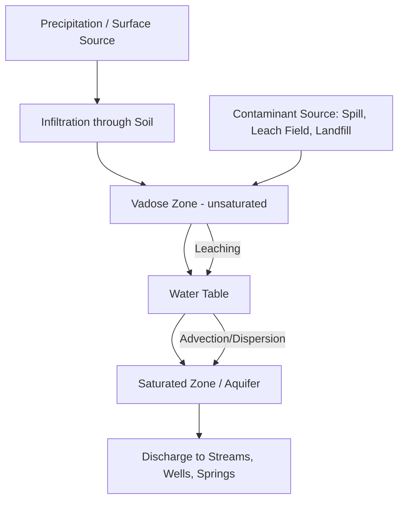
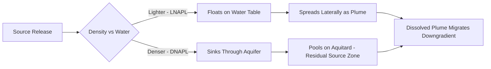
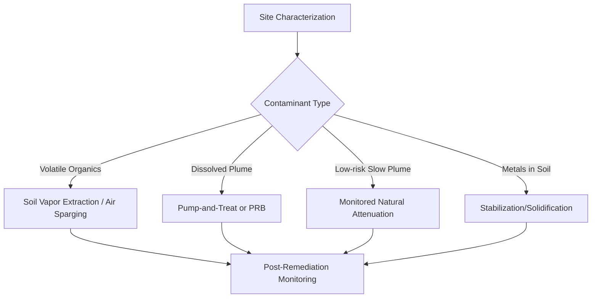

## Groundwater and Soil Contamination

### Overview

Groundwater and soil contamination refers to the introduction of pollutants into subsurface soil, unsaturated (vadose) zones, and saturated aquifer systems, degrading water quality and soil function below levels suitable for drinking, irrigation, ecological support, or engineering use. Because groundwater moves slowly and is hydraulically connected to soil, surface water, and the atmosphere, contamination is often persistent, difficult to detect early, and expensive to remediate.

### Subsurface Hydrogeologic Framework

**Key Points**

- The vadose zone (unsaturated zone) lies between the ground surface and the water table; pore spaces contain both air and water.
- The saturated zone lies below the water table, where all pore spaces are filled with water.
- An aquifer is a saturated geologic unit permeable enough to yield usable quantities of water; an aquitard restricts flow; an aquiclude is essentially impermeable.
- Confined aquifers are bounded above by an aquitard/aquiclude and are under pressure; unconfined (water table) aquifers are directly connected to the surface and generally more vulnerable to contamination.

Groundwater flow follows Darcy's Law:

$$q = -K\frac{dh}{dl}$$

Where $q$ is specific discharge (flux), $K$ is hydraulic conductivity, and $\frac{dh}{dl}$ is the hydraulic gradient.

### Sources of Contamination

**Key Points**

- **Point sources**: identifiable, localized origins — leaking underground storage tanks (LUSTs), landfills, septic systems, industrial spill sites, mine tailings, pipeline leaks.
- **Non-point sources**: diffuse, spatially distributed origins — agricultural fertilizer and pesticide runoff, urban stormwater, atmospheric deposition, road salt application.
- **Common contaminant classes**:
  - Petroleum hydrocarbons (BTEX: benzene, toluene, ethylbenzene, xylene)
  - Chlorinated solvents (TCE, PCE) — dense non-aqueous phase liquids (DNAPLs)
  - Nutrients (nitrate, phosphate) from fertilizers and septic effluent
  - Heavy metals (arsenic, lead, cadmium, chromium) from industrial and mining activity
  - Pathogens from sewage and livestock waste
  - Emerging contaminants: PFAS ("forever chemicals"), pharmaceuticals, personal care products

### Contaminant Transport Mechanisms

**Key Points**

- **Advection**: bulk movement of contaminant with flowing groundwater, governed by the average linear velocity.
- **Dispersion**: mechanical mixing and spreading due to variable flow paths at the pore scale, plus molecular diffusion.
- **Sorption/Retardation**: partitioning of contaminant between water and solid aquifer matrix (organic carbon, clay minerals), slowing contaminant migration relative to groundwater flow.
- **Degradation**: biotic (microbial) or abiotic (hydrolysis, redox reactions) transformation of contaminants over time.

The retardation factor is expressed as:

$$R = 1 + \frac{\rho_b K_d}{n}$$

Where $\rho_b$ is bulk density, $K_d$ is the distribution coefficient, and $n$ is porosity.

**DNAPL vs. LNAPL behavior**: Light non-aqueous phase liquids (LNAPLs, e.g., gasoline) float near the water table, forming a spreading plume atop the capillary fringe. Dense non-aqueous phase liquids (DNAPLs, e.g., chlorinated solvents) sink through the saturated zone, pooling on low-permeability layers and creating long-term source zones that are extremely difficult to fully remediate.

### Soil Contamination Processes

**Key Points**

- Soil acts as both a filter and a reactive medium; contaminants may be adsorbed onto clay and organic matter, degraded, or transmitted downward to groundwater.
- Soil contamination is influenced by texture (grain size distribution), organic matter content, cation exchange capacity (CEC), and pH.
- Fine-grained soils (clays) have low permeability but high sorption capacity, often retaining contaminants near the surface.
- Coarse-grained soils (sands, gravels) transmit contaminants rapidly with limited attenuation, increasing groundwater vulnerability.
- Contaminated soil vapor can migrate laterally and vertically, posing a vapor intrusion risk into overlying buildings.

### Site Characterization and Investigation

**Key Points**

- **Phase I Environmental Site Assessment (ESA)**: historical records review, site reconnaissance, interviews — identifies Recognized Environmental Conditions (RECs) without sampling.
- **Phase II ESA**: intrusive investigation — soil borings, monitoring well installation, soil and groundwater sampling, laboratory analysis.
- Monitoring wells are screened at target depths to collect representative groundwater samples and measure water table elevation.
- Geophysical methods (electrical resistivity, ground-penetrating radar, electromagnetic induction) help delineate contaminant plumes and subsurface stratigraphy non-invasively.
- Contaminant plume delineation typically involves iterative sampling rounds, groundwater flow direction mapping (via water table contour maps), and statistical/geostatistical interpolation.

**Example**

A gas station reports a suspected leaking underground storage tank. Investigators install a triangular array of at least three monitoring wells around the suspected source, measure static water levels to determine hydraulic gradient and flow direction, then sample for BTEX compounds to delineate the dissolved-phase plume boundary.

### Risk Assessment

**Key Points**

- Human health risk assessment evaluates exposure pathways: ingestion (drinking water), inhalation (vapor intrusion), and dermal contact.
- Risk is often expressed via **Hazard Quotient (HQ)** for non-carcinogens and **Incremental Lifetime Cancer Risk (ILCR)** for carcinogens.
- Regulatory frameworks set Maximum Contaminant Levels (MCLs) for drinking water (e.g., U.S. EPA National Primary Drinking Water Regulations) and soil cleanup standards vary by land use (residential vs. industrial).
- [Unverified] Specific numeric cleanup standards vary significantly by jurisdiction and are periodically revised; current regulatory limits should be confirmed against the applicable regulatory agency at the time of use.

### Remediation Technologies

**Key Points**

**Groundwater remediation:**

- **Pump-and-treat**: extraction wells remove contaminated groundwater for above-ground treatment; effective for plume containment but often slow for full aquifer restoration due to matrix diffusion and desorption.
- **Air sparging**: injecting air below the water table to volatilize and biodegrade dissolved contaminants, often paired with soil vapor extraction.
- **Permeable reactive barriers (PRBs)**: subsurface walls of reactive material (e.g., zero-valent iron) that intercept and treat a plume as it flows through.
- **In-situ chemical oxidation (ISCO)**: injection of oxidants (permanganate, persulfate, hydrogen peroxide) to chemically destroy contaminants.
- **Monitored natural attenuation (MNA)**: reliance on natural biodegradation, dilution, and sorption processes, verified through long-term monitoring; appropriate for low-risk, slowly migrating plumes.

**Soil remediation:**

- **Excavation and disposal**: physical removal of contaminated soil to a licensed facility.
- **Soil vapor extraction (SVE)**: vacuum-induced removal of volatile contaminants from the vadose zone.
- **Bioremediation**: stimulating indigenous or introduced microorganisms to degrade organic contaminants.
- **Soil washing**: physical/chemical separation of contaminants from soil particles.
- **Stabilization/solidification**: immobilizing contaminants (especially metals) within a solid matrix to reduce leachability.

### Preventive Engineering Controls

**Key Points**

- Double-walled underground storage tanks with leak detection systems.
- Engineered landfill liners (compacted clay + geomembrane) and leachate collection systems.
- Setback distances and design standards for septic systems relative to wells and water bodies.
- Wellhead protection areas and aquifer vulnerability mapping (e.g., DRASTIC index, incorporating Depth to water, net Recharge, Aquifer media, Soil media, Topography, Impact of vadose zone, and hydraulic Conductivity) to guide land-use planning.

### Groundwater–Soil Contamination Cross-Section (svg_diagram)

<svg xmlns="http://www.w3.org/2000/svg" viewBox="0 0 700 400">
<text x="350" y="25" text-anchor="middle" font-size="16" font-weight="bold" fill="#222">Groundwater and Soil Contamination Cross-Section (svg_diagram)</text>
<rect x="0" y="40" width="700" height="360" fill="#f4ecd8" />
<rect x="0" y="40" width="700" height="90" fill="#e8dcb5" />
<text x="10" y="60" font-size="12" fill="#333">Unsaturated (Vadose) Zone</text>
<rect x="0" y="130" width="700" height="15" fill="#a8c8e8" />
<text x="500" y="142" font-size="12" fill="#0a3d62">Water Table</text>
<rect x="0" y="145" width="700" height="215" fill="#cfe2f3" />
<text x="10" y="165" font-size="12" fill="#0a3d62">Saturated Zone (Aquifer)</text>
<rect x="0" y="360" width="700" height="40" fill="#7a5230" />
<text x="10" y="385" font-size="12" fill="#fff">Aquitard (low permeability)</text>
<rect x="100" y="45" width="40" height="20" fill="#555" />
<text x="60" y="45" font-size="11" fill="#222">Source (LUST)</text>
<circle cx="120" cy="65" r="4" fill="#333" />
<path d="M120,65 C118,90 122,110 120,130" stroke="#333" stroke-width="2" fill="none" stroke-dasharray="3,2" />
<ellipse cx="250" cy="200" rx="120" ry="30" fill="#f5a623" fill-opacity="0.5" stroke="#c9791a" stroke-width="1.5" />
<text x="200" y="205" font-size="11" fill="#5a3d00">Dissolved Contaminant Plume</text>
<line x1="80" y1="130" x2="80" y2="360" stroke="#333" stroke-width="3" />
<rect x="70" y="20" width="20" height="30" fill="#eee" stroke="#333" />
<text x="55" y="15" font-size="11" fill="#222">Monitoring Well</text>
<line x1="450" y1="130" x2="450" y2="360" stroke="#333" stroke-width="3" />
<rect x="440" y="20" width="20" height="30" fill="#eee" stroke="#333" />
<text x="415" y="15" font-size="11" fill="#222">Downgradient Well</text>
<path d="M300,180 L340,180 L330,170 M340,180 L330,190" stroke="#0a3d62" stroke-width="2" fill="none" />
<text x="345" y="185" font-size="11" fill="#0a3d62">Groundwater Flow</text>
</svg>

### Regulatory and Monitoring Frameworks

**Key Points**

- U.S. frameworks include the Resource Conservation and Recovery Act (RCRA), the Comprehensive Environmental Response, Compensation, and Liability Act (CERCLA/Superfund), and the Safe Drinking Water Act.
- Long-term groundwater monitoring programs track contaminant concentration trends, plume stability, and compliance with cleanup goals over multi-year to multi-decade timescales.
- [Inference] Institutional controls (land-use restrictions, deed notices) are frequently used as interim or permanent risk-management tools when full restoration is technically impractical or cost-prohibitive.

**Conclusion**

Groundwater and soil contamination is governed by the interplay of hydrogeologic setting, contaminant physicochemical properties, and subsurface transport and attenuation processes. Effective management requires accurate site characterization, appropriate risk assessment, and remediation strategies matched to contaminant behavior — particularly the persistent challenges posed by DNAPL source zones and emerging contaminants such as PFAS.

**Related Topics**

- Aquifer vulnerability mapping and the DRASTIC index
- Vapor intrusion pathway assessment
- PFAS fate, transport, and treatment technologies
- Karst hydrogeology and contamination in fractured/carbonate aquifers
- Landfill design and leachate management
- Brownfield redevelopment and institutional controls
- Geostatistical methods for plume delineation (kriging)
- Superfund site remediation case studies