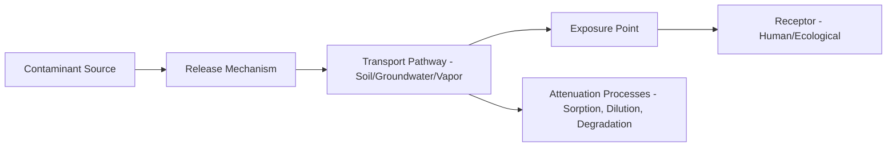
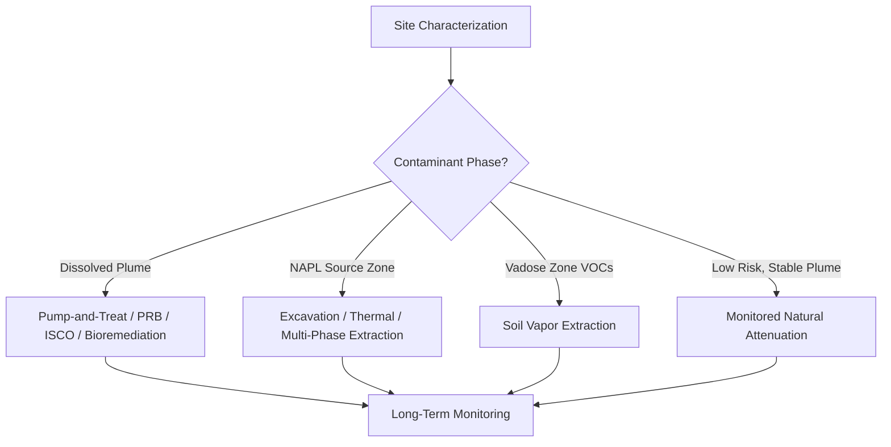

## Waste Disposal and Site Remediation

### Overview

Waste disposal and site remediation form a core applied domain within engineering and environmental geology, concerned with the safe containment of waste materials, the prevention of subsurface contamination, and the restoration of already-degraded land and groundwater. This field integrates hydrogeology, geotechnical engineering, geochemistry, and regulatory science to manage the lifecycle of waste from generation through long-term post-closure monitoring.

**Key Points**

- Waste disposal engineering focuses on isolating contaminants from the biosphere (especially groundwater) using engineered barriers.
- Site remediation addresses contamination that has already occurred, using physical, chemical, or biological methods to reduce risk to acceptable levels.
- Both fields rely heavily on characterizing subsurface geology: stratigraphy, hydraulic conductivity, groundwater flow direction, and geochemical conditions.
- Regulatory frameworks (e.g., RCRA and CERCLA/Superfund in the United States) drive much of the technical practice and terminology.

---

### Waste Classification

Understanding waste type dictates disposal and remediation strategy.

#### Municipal Solid Waste (MSW)

Household and commercial non-hazardous waste, disposed of primarily in engineered landfills.

#### Hazardous Waste

Waste that is ignitable, corrosive, reactive, or toxic. In the U.S., hazardous waste is regulated under the Resource Conservation and Recovery Act (RCRA), which classifies wastes by "listed" categories (F, K, P, U lists) or "characteristic" properties.

#### Industrial and Mining Waste

Includes tailings, slag, and process residues; often large in volume and can contain heavy metals or acid-generating minerals (e.g., pyrite leading to acid mine drainage).

#### Radioactive Waste

Classified by activity level (low-level, intermediate-level, high-level) and requires specialized geologic disposal considerations, such as deep geologic repositories in stable rock formations.

#### E-Waste and Special Wastes

Electronic waste, medical waste, and asbestos-containing materials, each with distinct handling and disposal protocols.

---

### Landfill Engineering

#### Site Selection Criteria

Geologic and hydrogeologic factors are central to selecting a landfill site:

- Low-permeability natural substrate (e.g., thick clay units)
- Depth to water table (greater depth reduces contamination risk)
- Distance from faults, floodplains, and wetlands
- Regional groundwater flow direction and downgradient receptors (wells, surface water)

#### Engineered Barrier Systems (Liner Systems)

Modern landfills use composite liner systems to prevent leachate migration into the subsurface.

**Typical components (bottom to top of a double composite liner):**

1. Compacted clay liner (CCL) — low hydraulic conductivity, typically $k \leq 1 \times 10^{-7}$ cm/s
2. Geomembrane (e.g., HDPE) — synthetic impermeable barrier
3. Geosynthetic clay liner (GCL) — bentonite-based composite
4. Leachate collection system — perforated piping in a drainage layer (gravel or geonet)
5. Protective soil/operational layer

**Leachate Management**

Leachate is the liquid generated as water percolates through waste, picking up dissolved organic and inorganic constituents. It is collected via a leachate collection and removal system (LCRS) and treated on-site or transported to a wastewater treatment facility.

**Landfill Gas Management**

Anaerobic decomposition of organic waste generates landfill gas (primarily methane and carbon dioxide). Gas collection systems (vertical wells or horizontal trenches) capture this gas for flaring or energy recovery, reducing explosion risk and greenhouse gas emissions.

#### Landfill Cross-Section Diagram

<svg xmlns="http://www.w3.org/2000/svg" viewBox="0 0 800 420" font-family="sans-serif">
<text x="400" y="25" font-size="16" text-anchor="middle" font-weight="bold">Composite Landfill Liner System (svg_diagram)</text>

<rect x="150" y="50" width="500" height="120" fill="#c9b48c" stroke="#333" stroke-width="1" />
<text x="400" y="115" font-size="14" text-anchor="middle">Municipal Solid Waste</text>

<line x1="400" y1="50" x2="400" y2="10" stroke="#555" stroke-width="4" />
<text x="400" y="8" font-size="11" text-anchor="middle">Gas Well</text>

<rect x="150" y="170" width="500" height="20" fill="#8b7355" stroke="#333" />
<text x="660" y="184" font-size="11">Protective Soil</text>

<rect x="150" y="190" width="500" height="20" fill="#a9a9a9" stroke="#333" />
<text x="660" y="204" font-size="11">Leachate Collection (gravel/geonet)</text>
<circle cx="200" cy="200" r="4" fill="#333" />
<circle cx="280" cy="200" r="4" fill="#333" />
<circle cx="360" cy="200" r="4" fill="#333" />
<text x="150" y="222" font-size="10">Perforated collection pipes</text>

<rect x="150" y="210" width="500" height="8" fill="#222" />
<text x="660" y="217" font-size="10">Primary Geomembrane (HDPE)</text>

<rect x="150" y="218" width="500" height="10" fill="#5a4632" stroke="#333" />
<text x="660" y="227" font-size="10">Geosynthetic Clay Liner</text>

<rect x="150" y="228" width="500" height="8" fill="#222" />
<text x="660" y="235" font-size="10">Secondary Geomembrane</text>

<rect x="150" y="236" width="500" height="14" fill="#c0c0c0" stroke="#333" />
<text x="660" y="246" font-size="10">Leak Detection Layer</text>

<rect x="150" y="250" width="500" height="40" fill="#7a5c3e" stroke="#333" />
<text x="400" y="274" font-size="12" text-anchor="middle" fill="white">Compacted Clay Liner (k ≤ 1×10⁻⁷ cm/s)</text>

<rect x="100" y="290" width="600" height="80" fill="#d2c29d" stroke="#333" />
<text x="400" y="335" font-size="12" text-anchor="middle">Native Low-Permeability Subsoil</text>

<line x1="100" y1="390" x2="700" y2="390" stroke="#2266cc" stroke-width="2" stroke-dasharray="6,3" />
<text x="105" y="405" font-size="11" fill="#2266cc">Water Table (monitored via downgradient wells)</text>
</svg>

---

### Deep-Well Injection and Secure Containment

For certain liquid hazardous wastes, deep-well injection places waste into isolated, confined geologic formations far below usable aquifers, bounded above and below by impermeable confining layers (aquitards). Site suitability requires:

- Confirmed absence of faults or fractures that could provide vertical migration pathways
- Sufficient formation porosity and injectivity
- Confining layers with proven integrity over geologic time

**[Inference]** Long-term seal integrity over multi-decade injection periods is generally supported by monitoring data at well-characterized sites, but induced seismicity risk from deep injection (notably associated with wastewater disposal from oil and gas operations) remains a site-specific and actively studied concern.

---

### Contaminated Site Characterization

Before remediation can begin, a site must be characterized to define the nature, extent, and behavior of contamination.

#### Phase I and Phase II Environmental Site Assessments (ESA)

- **Phase I ESA**: Historical records review, site reconnaissance, and interviews to identify recognized environmental conditions (RECs), without soil or groundwater sampling.
- **Phase II ESA**: Intrusive investigation involving soil borings, monitoring well installation, and sampling to confirm and quantify contamination.

#### Key Characterization Parameters

- **Hydraulic conductivity ($K$)**: Governs the rate of groundwater and contaminant movement, often estimated via slug tests or pumping tests.
- **Groundwater flow direction and gradient**: Determined from water level measurements across multiple wells, used to calculate seepage velocity:

$$v = \frac{K}{n_e} \frac{dh}{dl}$$

where $v$ is seepage velocity, $K$ is hydraulic conductivity, $n_e$ is effective porosity, and $dh/dl$ is the hydraulic gradient.

- **Contaminant plume delineation**: Mapping the horizontal and vertical extent of dissolved-phase and, where present, non-aqueous phase liquid (NAPL) contamination.
- **NAPL behavior**: Light NAPLs (LNAPLs, e.g., petroleum) float on the water table; dense NAPLs (DNAPLs, e.g., chlorinated solvents) sink through the aquifer and can pool on confining layers, forming persistent long-term source zones.

#### Conceptual Site Model (CSM)

A CSM integrates geology, hydrogeology, contaminant source, transport pathways, and receptors into a unified framework guiding remediation design.

---

### Contaminant Fate and Transport Mechanisms

#### Advection

Bulk movement of dissolved contaminants with flowing groundwater, following the seepage velocity equation above.

#### Dispersion

Spreading of the contaminant plume beyond the path predicted by advection alone, caused by mechanical mixing and molecular diffusion.

#### Sorption and Retardation

Contaminants partition between groundwater and aquifer solids, slowing their apparent migration relative to groundwater flow. The retardation factor is:

$$R = 1 + \frac{\rho_b K_d}{n_e}$$

where $\rho_b$ is bulk density, $K_d$ is the distribution coefficient, and $n_e$ is effective porosity.

#### Degradation

- **Biodegradation**: Microbial breakdown of organic contaminants (aerobic or anaerobic), central to natural attenuation and bioremediation.
- **Abiotic degradation**: Hydrolysis, chemical reduction (e.g., of chlorinated solvents by zero-valent iron).

---

### Remediation Technologies

#### Soil Remediation

**Excavation and Off-Site Disposal**

Physical removal of contaminated soil for treatment or disposal at a permitted facility. Effective but costly and disruptive for large volumes.

**Soil Vapor Extraction (SVE)**

Applies vacuum to unsaturated soil to volatilize and extract volatile organic compounds (VOCs), suited to LNAPL-impacted vadose zones.

**Solidification/Stabilization**

Mixing contaminated soil with binding agents (cement, fly ash) to immobilize contaminants, commonly used for heavy metals.

**Thermal Desorption**

Heating soil to volatilize organic contaminants, which are then captured and treated.

#### Groundwater Remediation

**Pump-and-Treat**

Extraction wells remove contaminated groundwater, which is treated above ground (e.g., air stripping, activated carbon) before discharge or reinjection. **[Unverified]** Pump-and-treat effectiveness for fully restoring aquifers to drinking-water standards is often limited in practice by rebound effects and back-diffusion from low-permeability zones, and cleanup timeframes at many sites have exceeded original design estimates.

**Permeable Reactive Barriers (PRBs)**

In-situ walls of reactive material (e.g., zero-valent iron) installed across a plume's flow path, treating contaminants as groundwater passes through.

**In-Situ Chemical Oxidation (ISCO)**

Injection of oxidants (permanganate, persulfate, hydrogen peroxide) to chemically destroy organic contaminants in place.

**In-Situ Chemical Reduction (ISCR)**

Injection of reductants to transform contaminants such as chlorinated solvents or hexavalent chromium into less toxic or less mobile forms.

**Enhanced Bioremediation**

Injection of electron donors (e.g., lactate, vegetable oil) or specific microbial cultures to stimulate biodegradation of contaminants such as chlorinated ethenes.

**Monitored Natural Attenuation (MNA)**

Relies on naturally occurring physical, chemical, and biological processes to reduce contaminant concentrations, verified through long-term groundwater monitoring rather than active treatment.

#### Remediation Technology Selection Factors

- Contaminant type and phase (dissolved, sorbed, NAPL)
- Geologic heterogeneity and hydraulic conductivity distribution
- Depth and areal extent of contamination
- Cost, timeframe, and regulatory cleanup goals
- Presence of sensitive receptors (drinking water wells, surface water)

---

### Regulatory and Risk Framework

#### RCRA (Resource Conservation and Recovery Act)

Governs the "cradle-to-grave" management of hazardous waste, including generation, transport, treatment, storage, and disposal (TSD facilities).

#### CERCLA / Superfund

Establishes liability and funding mechanisms for remediating abandoned or uncontrolled hazardous waste sites in the United States, following a structured process:

1. Preliminary Assessment/Site Inspection (PA/SI)
2. National Priorities List (NPL) listing (if warranted)
3. Remedial Investigation/Feasibility Study (RI/FS)
4. Record of Decision (ROD)
5. Remedial Design/Remedial Action (RD/RA)
6. Long-term monitoring and Five-Year Reviews

#### Risk-Based Corrective Action (RBCA)

A tiered framework that ties the intensity of remediation to site-specific risk to human health and the environment, rather than applying uniform cleanup standards everywhere.

**[Unverified]** Specific numeric cleanup standards vary substantially by jurisdiction and are periodically revised, so any specific regulatory threshold values should be verified against the current applicable regulations for the site's location.

---

### Site Closure and Post-Closure Care

Following active remediation or landfill closure:

- **Capping**: Placement of a low-permeability final cover system to minimize infiltration and prevent direct contact with waste.
- **Institutional controls**: Land-use restrictions, deed notices, and groundwater use prohibitions.
- **Long-term monitoring**: Periodic sampling of groundwater, landfill gas, and cap integrity, often required for 30 years or more post-closure.
- **Five-Year Reviews**: Under CERCLA, formal reassessment of remedy effectiveness at sites where contaminants remain above unrestricted-use levels.

**Example**

A former industrial site with a shallow dense non-aqueous phase liquid (DNAPL) source zone in fractured bedrock might combine source-zone excavation where feasible, a permeable reactive barrier along the downgradient plume edge, and long-term monitored natural attenuation for the dilute plume fringe, with institutional controls restricting groundwater use until concentrations meet regulatory standards.

---

**Related Topics**

- Hydrogeology and aquifer characterization
- Groundwater flow modeling (e.g., Darcy's Law applications)
- Geotechnical properties of clay liners and compaction testing
- Acid mine drainage and mine reclamation
- Vapor intrusion pathway assessment
- Brownfield redevelopment
- Geologic disposal of high-level radioactive waste
- Environmental geochemistry and contaminant sorption modeling