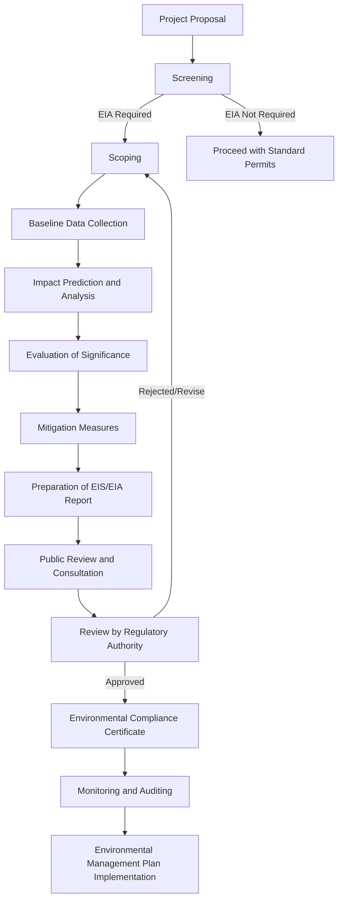

## Environmental Impact Assessment

### Definition and Purpose

**Definition**: Environmental Impact Assessment (EIA) is a systematic process used to identify, predict, evaluate, and mitigate the biophysical, social, and other relevant effects of proposed development actions or projects prior to major decisions being taken and commitments made.

**Purpose**:

- Inform decision-makers of the environmental consequences of a proposed action before approval
- Identify feasible alternatives, including a "no action" alternative
- Provide a mechanism for mitigating adverse impacts
- Promote transparency and public participation in environmental decision-making
- Establish a baseline against which future environmental changes can be monitored

### Historical and Legal Foundations

The modern EIA framework originated with the U.S. **National Environmental Policy Act (NEPA)** of 1969, which required federal agencies to prepare an **Environmental Impact Statement (EIS)** for major actions significantly affecting environmental quality. This model was subsequently adopted, in modified forms, by most countries worldwide, often through national legislation (e.g., the EU EIA Directive, India's Environment Impact Assessment Notification, the Philippine Environmental Impact Statement System under Presidential Decree 1586).

**[Inference]** Specific procedural thresholds, exemption categories, and screening criteria vary significantly by jurisdiction, so any given project's obligations must be checked against local regulation rather than assumed from general EIA theory.

### The EIA Process: Core Stages

#### 1. Screening

Determines whether a project requires a full EIA, a limited assessment, or none at all, based on project type, scale, location sensitivity, and potential magnitude of impact. Screening typically uses threshold lists (e.g., dam height, factory capacity) or case-by-case review.

#### 2. Scoping

Defines the boundaries of the assessment: which impacts will be studied, over what geographic and temporal range, and to what level of detail. Scoping identifies **Valued Environmental Components (VECs)** — the specific resources (e.g., groundwater quality, an endangered species population, air quality in a nearby settlement) that warrant focused analysis.

#### 3. Baseline Data Collection

Establishes the pre-project environmental and socioeconomic conditions. This includes:

- **Physical environment**: geology, soils, hydrology, climate, air quality
- **Biological environment**: flora, fauna, habitats, biodiversity indices
- **Socioeconomic environment**: demographics, land use, livelihoods, cultural heritage, public health baseline

#### 4. Impact Prediction and Analysis

Uses quantitative models (e.g., air dispersion models, hydrological models, noise propagation models) and qualitative expert judgment to forecast how the project will alter baseline conditions. Common analytical tools include:

- **Checklists** — simple lists of potential impact categories
- **Matrices** (e.g., Leopold Matrix) — cross-tabulate project activities against environmental factors
- **Network diagrams** — trace cause-effect chains of impacts
- **Overlay mapping / GIS analysis** — spatially combine impact layers

#### 5. Evaluation of Significance

Impacts are judged against criteria such as magnitude, duration (short-term vs. long-term), extent (local vs. regional), reversibility, and probability of occurrence. Significance determination often uses a rating scale (e.g., negligible, minor, moderate, major).

#### 6. Mitigation Hierarchy

**Key Points**:

- **Avoidance** — eliminate the impact by altering project design, siting, or timing
- **Minimization** — reduce the magnitude or duration of unavoidable impacts
- **Rectification/Restoration** — repair or restore affected environments
- **Reduction over time** — implement operational controls to lessen impacts during the project lifecycle
- **Compensation/Offsetting** — provide substitute resources (e.g., habitat banking, reforestation offsets) when residual impacts remain after the above steps

#### 7. Documentation: The EIS/EIA Report

A formal document synthesizing findings, typically containing: project description, baseline conditions, alternatives analysis, predicted impacts, mitigation measures, and an **Environmental Management Plan (EMP)**.

#### 8. Public Participation and Review

Draft reports are circulated for public comment, often including public hearings, particularly for projects affecting local communities. Regulatory agencies then review the document for completeness and technical adequacy before granting or denying approval.

#### 9. Monitoring and Auditing

Post-approval, compliance monitoring tracks actual impacts against predictions, while environmental audits periodically assess whether mitigation measures are functioning as intended. This stage closes the feedback loop and can trigger corrective action or adaptive management.

### Types of Impacts Assessed in Engineering Geology Contexts

**Key Points**:

- **Geotechnical impacts**: slope stability changes, subsidence from excavation or groundwater withdrawal, induced seismicity (e.g., from reservoir impoundment or deep injection wells)
- **Hydrological impacts**: altered surface runoff patterns, aquifer depletion or contamination, changes to flood regimes
- **Soil impacts**: erosion, compaction, contamination from spills or waste
- **Air quality impacts**: dust from earthworks, emissions from construction equipment and operational sources
- **Ecological impacts**: habitat fragmentation, loss of biodiversity, disruption of migration corridors
- **Cumulative impacts**: the combined effect of the proposed project with other past, present, and reasonably foreseeable future projects in the same region — often the most technically challenging component to assess

### Quantitative Tools in Impact Prediction

Dispersion and transport models frequently rely on basic conservation principles. For example, a simplified steady-state pollutant dispersion in a stream (mixing-zone approximation) can be expressed as:

$$C(x) = C_0 \, e^{-kx/u}$$

where $C(x)$ is pollutant concentration at distance $x$ downstream, $C_0$ is the initial concentration, $k$ is the first-order decay constant, and $u$ is the stream velocity.

For assessing induced seismicity risk near reservoirs or injection sites, engineers examine the change in pore pressure $\Delta p$ relative to the effective normal stress, since fault reactivation potential increases as $\Delta p$ approaches the critical value needed to reduce effective stress below the frictional resistance on a fault plane. **[Unverified]** The specific critical pore pressure threshold is highly site-dependent and requires local geomechanical data rather than a universal formula.

### Environmental Management Plan (EMP) Components

| Component | Function |
| --- | --- |
| Mitigation schedule | Specifies actions, responsible parties, and timelines |
| Monitoring program | Defines parameters, frequency, and methods for tracking impacts |
| Institutional arrangements | Assigns roles for implementation and oversight |
| Emergency response plan | Procedures for spills, structural failures, or unexpected impacts |
| Reporting protocol | Format and frequency of compliance reporting to regulators |

### Worked Example

**Example**: A proposed open-pit aggregate quarry near a rural watershed.

- **Screening**: Classified as requiring full EIA due to proximity (<1 km) to a perennial stream and total excavation volume exceeding the regulatory threshold.
- **Scoping**: VECs identified as stream water quality, groundwater table elevation, slope stability of adjacent hillslopes, and noise levels at the nearest residential cluster (300 m away).
- **Baseline**: Six months of pre-project water quality sampling shows turbidity averaging 5 NTU; groundwater level at 12 m depth; slope factor of safety of 1.8 under static conditions.
- **Prediction**: Modeling suggests quarry dewatering could lower the local water table by up to 3 m within a 500 m radius; sediment-laden runoff could raise turbidity to an estimated 150 NTU during wet-season operations without controls.
- **Mitigation**: Installation of sediment retention ponds and silt fences, a dewatering reinjection scheme to limit water table drawdown, and blast-vibration limits calibrated to structural safety thresholds for nearby buildings.
- **Monitoring**: Quarterly water quality sampling, continuous piezometer readings, and annual slope stability re-assessment throughout the quarry's operational life.

### Common Pitfalls and Criticisms

**Key Points**:

- **Scope narrowing**: Excluding cumulative or indirect impacts to streamline approval
- **Baseline inadequacy**: Insufficient duration or seasonal coverage of baseline monitoring, leading to unreliable impact predictions
- **Mitigation without enforcement**: EMPs that are approved on paper but not audited or enforced during operation
- **Post-decision assessment**: EIA conducted after key design decisions are already locked in, reducing its influence on avoidance-stage mitigation
- **Public participation as formality**: Consultation processes that do not meaningfully incorporate community input into final decisions

**[Inference]** These criticisms recur across many jurisdictions' EIA systems in the academic literature, though the severity and prevalence of each issue varies by country and regulatory enforcement capacity.

### Strategic Environmental Assessment (SEA) — Related Concept

While EIA evaluates individual projects, **Strategic Environmental Assessment** applies similar principles at the policy, plan, or program level (e.g., a national mining sector development plan), aiming to integrate environmental considerations earlier and at a broader scale than project-level EIA allows.

**Related Topics**:

- Strategic Environmental Assessment (SEA)
- Environmental Management Plans and compliance auditing
- Induced seismicity from reservoir and injection operations
- Slope stability analysis and factor of safety calculations
- Groundwater flow modeling and aquifer drawdown prediction
- Life Cycle Assessment (LCA) as a complementary sustainability tool
- Social Impact Assessment (SIA)
- Environmental risk assessment and hazard quantification methods
- Land use planning and zoning regulation
- Mine reclamation and closure planning