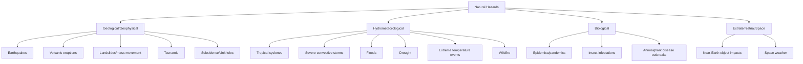
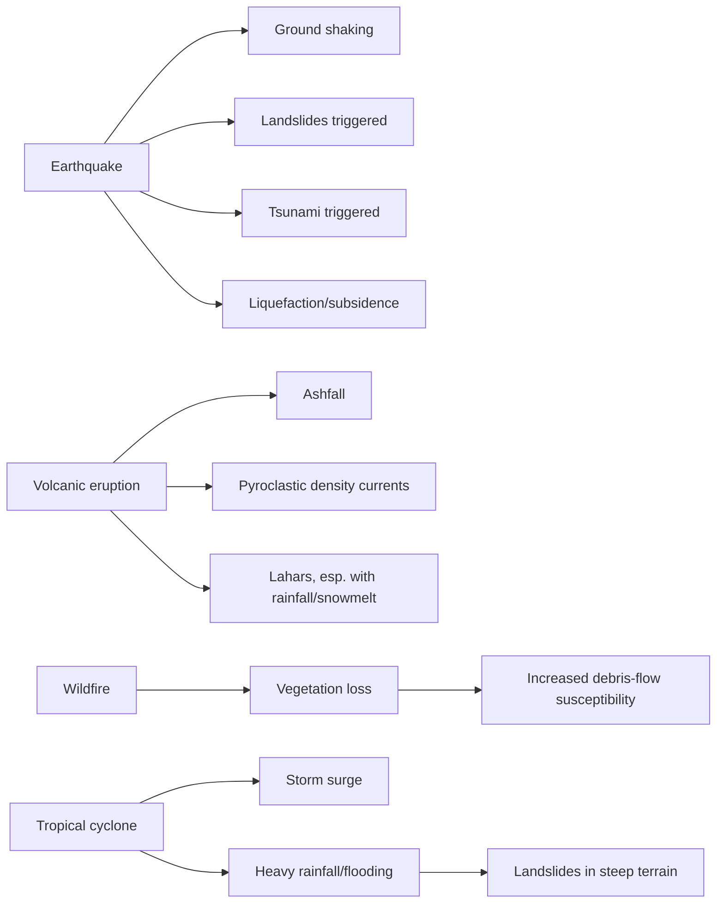

## Classification of Natural Hazards

### Overview

Classification of natural hazards provides the conceptual framework for organizing the diverse phenomena capable of causing loss of life, injury, property damage, or environmental disruption into systematic categories. A consistent classification scheme underlies hazard identification, risk assessment, early warning system design, and disaster risk reduction policy, allowing hazards with different physical origins to be compared, prioritized, and managed within common institutional and analytical frameworks.

### Defining Hazard, Disaster, and Risk

Precise terminology underlies hazard classification and is foundational to the broader field of disaster risk reduction:

- **Natural hazard**: A naturally occurring physical phenomenon with the potential to cause harm; the hazard itself exists independent of human presence (e.g., an earthquake occurring in an uninhabited region is still a hazard event, though it produces no disaster).
- **Vulnerability**: The characteristics of a community, structure, or system that determine its susceptibility to the damaging effects of a hazard (e.g., construction quality, socioeconomic factors, preparedness).
- **Exposure**: The people, property, and systems located in areas that could be adversely affected by a hazard.
- **Disaster**: The realized, harmful outcome that occurs when a hazard event interacts with a vulnerable and exposed population or system, exceeding the affected community's capacity to cope using its own resources.
- **Risk**: Commonly formalized as a function of hazard, exposure, and vulnerability (as used by frameworks such as the UNDRR and IPCC):

$$\text{Risk} = f(\text{Hazard}, \text{Exposure}, \text{Vulnerability})$$

**Key Point**: A hazard is a potential; a disaster is a realized, socially-mediated outcome. This distinction matters directly for classification, since hazard taxonomies classify the physical phenomenon, while risk and vulnerability assessments classify the human-system consequences.

### Classification by Origin (Genetic Classification)

The most common classification scheme groups hazards by their underlying physical/causal process.

**1. Geological (Geophysical) Hazards**

Originate from processes within the solid Earth (lithosphere).

- Earthquakes (tectonic, volcanic, induced/anthropogenic)
- Volcanic eruptions (effusive and explosive, and associated hazards: pyroclastic density currents, lahars, ashfall, volcanic gases)
- Landslides and other mass movements (rockfalls, debris flows, rotational/translational slides, slow earthflows)
- Tsunamis (most commonly triggered by submarine earthquakes, but also by volcanic collapse, submarine landslides, or rarely meteorite impact)
- Land subsidence and sinkholes (karst collapse, groundwater/hydrocarbon withdrawal-induced subsidence)

**2. Hydrometeorological (Atmospheric and Hydrological) Hazards**

Originate from atmospheric and hydrological processes; this is frequently the largest category by event frequency and economic loss globally.

- Tropical cyclones (hurricanes/typhoons/cyclones, regional naming varies)
- Severe convective storms (tornadoes, hailstorms, derechos, lightning)
- Floods (riverine/fluvial, flash, coastal/storm surge, pluvial/urban)
- Drought
- Extreme temperature events (heat waves, cold waves, extreme winter storms)
- Wildfire (often classed here due to strong meteorological/climatic drivers, though it also has significant biological and anthropogenic dimensions)
- Coastal erosion and sea-level related hazards

**3. Biological Hazards**

Originate from living organisms or biologically-derived processes.

- Epidemics and pandemics (infectious disease outbreaks)
- Insect infestations (e.g., locust plagues) affecting agriculture and food security
- Animal and plant disease outbreaks with significant ecological or economic impact

**4. Extraterrestrial (Space) Hazards**

Originate outside Earth's atmosphere.

- Near-Earth object (asteroid/comet) impacts
- Space weather (solar flares, coronal mass ejections, and resulting geomagnetic storms affecting power grids, satellites, and communications)

### Classification by Speed of Onset

Hazards are also usefully classified by how quickly they develop, which directly determines warning lead time and appropriate response strategy.

- **Rapid-onset hazards**: Develop within seconds to hours, offering minimal or no warning time. Examples: earthquakes, tsunamis, flash floods, tornadoes, rockfalls, volcanic explosive eruptions.
- **Slow-onset hazards**: Develop over weeks, months, or years, allowing for longer-term monitoring, forecasting, and mitigation planning. Examples: drought, sea-level rise, land subsidence, desertification, some slow-moving landslides (earthflows, creep).
- **Intermediate-onset hazards**: Develop over hours to days, allowing limited but meaningful warning time with adequate monitoring infrastructure. Examples: tropical cyclones (days of track forecasting), riverine floods (hours to days depending on catchment size and rainfall), some volcanic eruptions with pre-eruptive unrest phases.

**Key Point**: Onset speed is often more operationally significant for emergency management than genetic origin, since it directly determines whether evacuation, resource pre-positioning, or only post-event response is feasible.

### Classification by Spatial Extent

- **Localized hazards**: Affect a limited area (tens of meters to a few kilometers), e.g., individual landslides, sinkholes, tornadoes.
- **Regional hazards**: Affect areas spanning tens to hundreds of kilometers, e.g., tropical cyclones, large river floods, major earthquakes (via widespread shaking).
- **Global/transboundary hazards**: Affect multiple countries or continents, e.g., large explosive volcanic eruptions affecting global climate, pandemics, major asteroid impacts, large solar storms affecting global infrastructure.

### Classification by Frequency-Magnitude Relationship

Most natural hazard types exhibit an inverse relationship between event magnitude and frequency: small events occur far more often than large ones. This relationship is foundational to probabilistic hazard assessment and is formalized differently across hazard types:

- **Earthquakes**: The Gutenberg-Richter relation describes the frequency-magnitude relationship for a given region:

$$\log_{10} N = a - bM$$

where $N$ is the number of earthquakes with magnitude $\geq M$, and $a$ and $b$ are regionally-fitted constants (the $b$-value is typically close to 1.0 in many tectonic settings, though it varies with local stress conditions and faulting style).

- **Floods**: Characterized by **recurrence interval** (return period) and the associated annual exceedance probability, e.g., the "100-year flood" has a 1% probability of being equaled or exceeded in any given year (a statistical statement, not a claim that such floods occur exactly once every 100 years).
- **Landslides and other hazards**: Similarly often follow power-law or other statistically-fitted frequency-magnitude distributions, though data completeness and quality vary considerably across hazard types and regions. [Inference — while the general inverse frequency-magnitude relationship is well established across most natural hazard types, the specific functional form and fitted parameters are hazard- and region-specific rather than universal.]

### Classification by Predictability

- **Well-forecast hazards**: Benefit from mature monitoring networks and physical models allowing probabilistic or, in some cases, short-term deterministic prediction (tropical cyclone tracks, riverine floods with adequate gauge networks, some volcanic eruptions with clear precursory unrest).
- **Probabilistically-assessed but not short-term predictable hazards**: Long-term probability of occurrence can be estimated from historical/geological records, but the specific timing of individual events cannot currently be reliably predicted (most notably earthquakes, where seismic hazard maps express long-term probabilistic ground-shaking hazard rather than short-term prediction).
- **Largely unpredictable hazards at current scientific capability**: Events for which neither short-term timing nor, in some cases, reliable long-term probability can yet be robustly estimated (e.g., specific timing of large asteroid impacts beyond currently tracked objects, though the overall population-level probability is estimated).

### Multi-Hazard and Cascading Hazard Classification

Real disaster events frequently involve interactions between multiple hazard types, which classification schemes increasingly need to capture explicitly.

- **Concurrent hazards**: Multiple hazards occurring simultaneously but independently (e.g., a hurricane and an unrelated wildfire occurring in the same season in different regions).
- **Cascading hazards (hazard chains)**: One hazard event triggers a subsequent, causally-related hazard. Examples: an earthquake triggering landslides and/or a tsunami; a volcanic eruption triggering lahars when combined with heavy rainfall or snowmelt; a hurricane's heavy rainfall triggering landslides in steep terrain; wildfire removing vegetation cover, subsequently increasing debris-flow susceptibility in burned watersheds during following rainy seasons.
- **Compound hazards**: Multiple hazard drivers combine to produce impacts exceeding what any single hazard would cause alone (e.g., a storm surge coinciding with high river discharge and high tide, or drought coinciding with heat waves amplifying wildfire risk).

**Example**: The 2011 Tōhoku event in Japan illustrates a cascading hazard chain: a great subduction-zone earthquake generated a large tsunami, which in turn caused a severe accident at the Fukushima Daiichi nuclear power plant — extending a purely geophysical hazard chain into a technological/industrial hazard consequence, illustrating why modern hazard classification increasingly considers "natech" (natural hazard-triggered technological) events as a distinct interaction category.

### Institutional and Applied Classification Frameworks

Several international and national frameworks provide standardized hazard classification for policy, disaster loss databases, and risk financing purposes:

- **UNDRR (UN Office for Disaster Risk Reduction) Hazard Classification**: Provides a standardized hazard taxonomy used in Sendai Framework for Disaster Risk Reduction monitoring, distinguishing natural, biological, and human-induced/technological hazard categories with standardized codes for consistent reporting across countries.
- **EM-DAT (Emergency Events Database)**: Maintained by CRED (Centre for Research on the Epidemiology of Disasters), classifies disaster events into natural and technological categories with further subgroups (geophysical, meteorological, hydrological, climatological, biological) for global disaster loss tracking and analysis.
- **National hazard mitigation frameworks**: Many countries maintain their own standardized hazard classification as part of national risk assessment and disaster mitigation planning, generally structured around similar genetic categories adapted to national hazard profiles.

[Unverified — specific current category structures, definitions, and code sets in these frameworks are periodically revised by their maintaining institutions; consult current UNDRR and EM-DAT documentation directly for authoritative, up-to-date classification schema.]

### Natural vs. Anthropogenic and Hybrid Hazard Boundaries

Classification schemes must address hazards that blur the boundary between "natural" and human-caused:

- **Purely natural hazards**: Occur independent of human activity (e.g., a tectonic earthquake on a fault unrelated to human activity).
- **Anthropogenically-induced natural hazards**: Natural hazard processes triggered or intensified by human activity, such as induced seismicity from fluid injection (wastewater disposal, hydraulic fracturing, reservoir impoundment) or subsidence accelerated by groundwater/hydrocarbon extraction.
- **Technological/man-made hazards**: Hazards arising primarily from human systems (industrial accidents, infrastructure failure), sometimes triggered by a natural hazard (the "natech" category noted above) and sometimes entirely independent of natural processes.
- **Climate change as a hazard modifier**: Rather than a discrete hazard category itself, climate change is increasingly classified as a modifier that alters the frequency, magnitude, or spatial distribution of existing hydrometeorological hazards (e.g., shifting tropical cyclone intensity distributions, altering drought and flood frequency in specific regions). [Inference — the general scientific consensus supports climate change as a hazard-frequency/intensity modifier for several hydrometeorological hazard types, though the magnitude of influence on any single event or region remains an active area of attribution research.]

### Practical Applications of Hazard Classification

- **Early warning system design**: Classification by onset speed and predictability directly determines what type of monitoring network and warning lead time is achievable for a given hazard.
- **Insurance and risk financing**: Hazard classification underlies catastrophe risk modeling, reinsurance pricing, and parametric insurance product design, which depend on hazard-specific frequency-magnitude and loss models.
- **Land use and building code regulation**: Hazard-specific classification informs which regulatory tools (setbacks, hazard overlay zoning, seismic design categories) apply to a given area.
- **Disaster loss database standardization**: Consistent classification enables comparison of disaster impacts across countries and time periods, essential for tracking progress against international disaster risk reduction targets (e.g., the Sendai Framework's seven global targets).
- **Multi-hazard risk assessment**: Increasingly, risk assessment frameworks evaluate combined and cascading hazard exposure for a given location rather than assessing hazards in isolation, reflecting the reality that most locations face multiple, sometimes interacting hazard types.

### Related Topics

- Probabilistic seismic hazard analysis (PSHA)
- Volcanic hazard assessment and eruption forecasting
- Flood frequency analysis and floodplain mapping
- Landslide hazard and risk assessment methods
- Tropical cyclone climatology and forecasting
- Disaster risk reduction policy frameworks (Sendai Framework, Hyogo Framework)
- Vulnerability and resilience assessment methodologies
- Early warning system design and community-based disaster preparedness