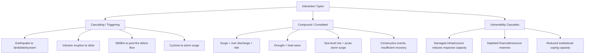
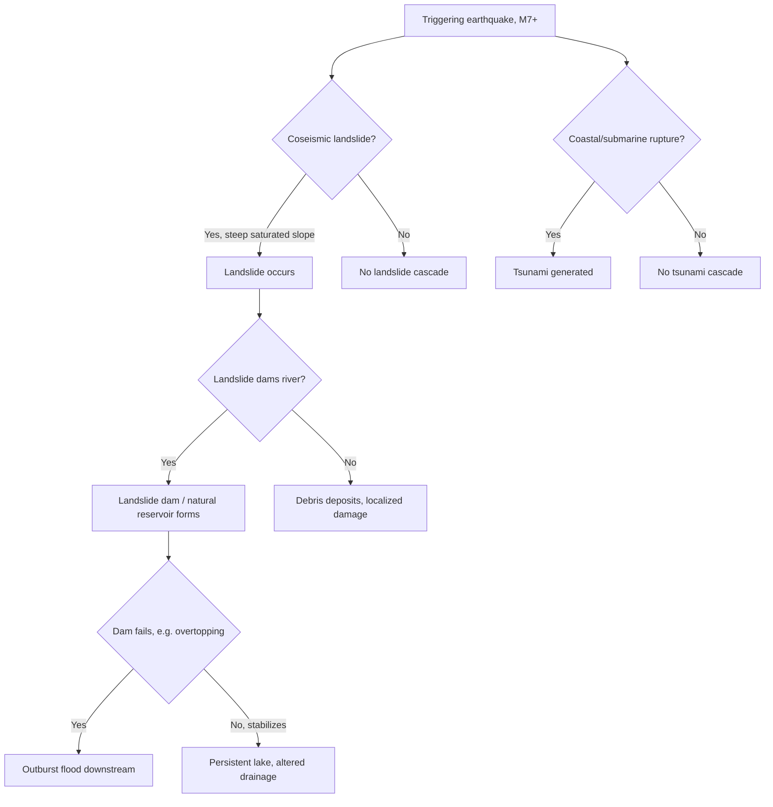

## Compound and Cascading Hazards

### Overview

Compound and cascading hazards describe situations where multiple hazard processes interact, combine, or trigger one another to produce impacts that differ substantially — usually far exceeding — what any single hazard acting alone would cause. Traditional hazard assessment historically treated hazards as independent, discrete events; the compound/cascading framework recognizes that real-world disasters frequently arise from interacting hazard chains, correlated hazard drivers, or the sequential vulnerability created by one event weakening a system's capacity to withstand a subsequent one. This is an increasingly central concept in modern disaster risk reduction, climate adaptation, and critical infrastructure resilience planning.

### Core Definitions

- **Compound hazard**: The combination of multiple hazard drivers or events — occurring simultaneously or in close succession — that together produce an impact greater than the sum of their individual effects, often because the drivers are physically correlated (share a common climatic or geological cause) or because their combined timing overwhelms a system's coping capacity.
- **Cascading hazard (hazard chain)**: A sequential process in which a primary hazard event triggers one or more secondary hazards through direct causal linkage, propagating impact through a chain of physical or systemic processes.
- **Multi-hazard**: A broader umbrella term encompassing any situation involving more than one hazard type at a location, including compound, cascading, and simply coincidental (independent, concurrent) hazards.
- **Natech events**: A specific and increasingly studied subclass of cascading hazard in which a natural hazard triggers a technological/industrial accident (e.g., an earthquake rupturing a chemical storage tank).

**Key Point**: The distinguishing feature between "compound" and "cascading" is the nature of the interaction — compound hazards typically involve correlated or coincident drivers acting together, while cascading hazards involve a clear causal trigger-and-response chain. In practice, many real events exhibit both dynamics simultaneously.

### Classification of Interaction Types

**1. Cascading (Triggering) Interactions**

A primary hazard directly causes a secondary hazard through physical process linkage.

- Earthquake → landslide (ground shaking destabilizes slopes)
- Earthquake → tsunami (seafloor displacement generates ocean waves)
- Earthquake → liquefaction → foundation/infrastructure failure
- Volcanic eruption → lahar (when combined with rainfall, snowmelt, or crater lake breach)
- Volcanic eruption → tsunami (via flank collapse or pyroclastic flow entering water)
- Wildfire → post-fire debris flow (loss of vegetation and soil water repellency dramatically increases runoff and erosion in subsequent rainfall)
- Hurricane/tropical cyclone → storm surge → coastal flooding
- Heavy rainfall → landslide → river damming → outburst flood upon dam failure

**2. Compound (Correlated/Coincident) Interactions**

Multiple hazard drivers share a common cause or coincide in time/space, jointly producing impact exceeding either alone.

- Storm surge + high river discharge + high astronomical tide, jointly producing coastal/estuarine flooding worse than any single driver
- Drought + heat wave, jointly amplifying wildfire risk and agricultural/water stress (often sharing a common atmospheric blocking-pattern driver)
- Sea-level rise (chronic, slow-onset) + storm surge (acute), where the elevated baseline amplifies the acute event's inundation extent
- Consecutive extreme events with insufficient recovery time between them (e.g., successive tropical cyclones in one season, or repeated flood events before infrastructure or communities can recover)

**3. Vulnerability Cascades (Impact Cascades)**

A hazard event degrades a system's capacity to withstand or respond to subsequent hazards or stresses, independent of any direct physical triggering relationship.

- An earthquake damaging hospitals and emergency infrastructure, reducing a community's capacity to respond to a subsequent disease outbreak or aftershock sequence
- A major flood damaging levees or flood-control infrastructure, elevating vulnerability to the next flood season even without any direct causal hazard link
- Compounding socioeconomic stress: a disaster depleting household or government financial reserves, reducing resilience to a subsequent unrelated hazard

### Physical Mechanisms Underlying Common Cascades

**Earthquake-Triggered Cascades**

Seismic energy release can simultaneously or sequentially trigger:

- Coseismic landslides in steep, saturated, or structurally weak terrain, with susceptibility governed by ground motion intensity, slope angle, and material strength
- Liquefaction in loose, saturated, granular soils, causing settlement, lateral spreading, and foundation damage
- Tsunami generation via vertical seafloor displacement in subduction zone or other thrust-faulting earthquakes
- Fault-related fires from ruptured gas lines and damaged electrical infrastructure, historically a major secondary loss driver in urban earthquakes

**Volcanic Cascades**

- Lahars form when volcanic ash and debris mix with water (from crater lakes, glacial/snow melt during eruption, or subsequent rainfall on unconsolidated ash deposits), producing fast-moving, highly destructive debris flows that can travel far beyond the immediate eruption zone and occur even years after an eruption when rainfall remobilizes ash deposits.
- Flank collapse of a volcanic edifice can generate debris avalanches and, if entering a water body, tsunamis.
- Ashfall can trigger cascading impacts including aviation disruption, roof collapse under ash loading (compounded if ash becomes wet and heavier), and agricultural/water supply contamination.

**Wildfire-Rainfall Cascades**

Wildfire fundamentally alters watershed hydrology:

- Combustion of vegetation and litter removes canopy interception and root-driven soil stabilization.
- Intense heat can create or intensify soil water repellency (hydrophobicity) near the surface, sharply reducing infiltration capacity.
- The combined effect dramatically increases surface runoff and erosion rates in subsequent rainfall, elevating debris-flow and flash-flood risk in burned watersheds for a period typically spanning one to several years post-fire, until vegetation recovery and soil structure are reestablished. [Inference — the general mechanism and post-fire risk elevation are well documented in hazard literature; the specific recovery timeline is watershed- and climate-specific rather than a fixed universal duration.]

**Coastal Compound Flooding**

Coastal flood severity often depends on the temporal alignment of multiple, partially independent drivers:

- Storm surge (wind- and pressure-driven ocean water elevation)
- Astronomical tide phase (spring vs. neap tide)
- River/fluvial discharge (especially where storms also produce heavy inland rainfall)
- Wave setup and runup
- Antecedent sea level (including the slow-onset influence of long-term sea-level rise raising the baseline upon which acute events act)

When several of these drivers peak simultaneously or in close succession, resulting flood levels can substantially exceed those predicted by considering any single driver in isolation — the core rationale for compound flood risk modeling approaches (e.g., joint probability methods) increasingly used in coastal engineering and floodplain management.

### Assessment and Modeling Approaches

**Event Tree / Hazard Chain Analysis**

Maps the branching sequence of possible cascading outcomes following a triggering event, assigning conditional probabilities to each branch (e.g., probability of landslide given a certain earthquake magnitude and slope condition, then probability of landslide damming a river given landslide volume and channel geometry).

**Joint Probability / Copula-Based Methods**

Statistical techniques used particularly in compound flood risk assessment to characterize the dependence structure between correlated hazard drivers (e.g., storm surge and river discharge), rather than assuming statistical independence, which would underestimate joint extreme event probability.

**Systemic Risk / Network-Based Approaches**

Model infrastructure and social systems as interconnected networks, allowing analysis of how failure propagates across sectors (e.g., power outage cascading into water treatment failure, communications failure, and healthcare system disruption) following an initiating hazard.

**Scenario-Based and Stress-Testing Approaches**

Given the complexity and relative data scarcity for many multi-hazard interactions compared to single-hazard statistics, many practical assessments rely on plausible worst-case or historically-informed scenario construction rather than fully probabilistic modeling. [Inference — this reflects a genuine methodological limitation frequently noted in the multi-hazard risk literature, since historical records of specific hazard-chain combinations are typically far sparser than single-hazard event records.]

### Case Examples

**Example 1 — 2011 Tōhoku, Japan**: A great subduction-zone earthquake generated massive ground shaking and a large tsunami; the tsunami subsequently disabled backup power and cooling systems at the Fukushima Daiichi nuclear power plant, triggering a severe nuclear accident — a textbook cascading chain spanning geophysical, hydrological, and technological (natech) hazard domains within a single event sequence.

**Example 2 — Post-Wildfire Debris Flows, Western United States**: Following large wildfires in steep terrain, subsequent intense rainfall events (even those that would be unremarkable in unburned terrain) have repeatedly triggered destructive debris flows in the following one to a few rainy seasons, illustrating a cascading hazard chain where the "trigger" (rainfall) is common but the consequence is entirely conditioned by the preceding hazard (fire) altering watershed response.

**Example 3 — Compound Coastal Flooding, Hurricane Landfall**: A landfalling hurricane producing both storm surge and heavy inland rainfall can generate compound flooding where coastal storm surge blocks river discharge from draining to the sea, backing up floodwaters inland — a compound interaction where two hazard drivers from the same storm system interact through a shared physical pathway (the river-ocean interface) rather than one directly triggering the other.

### Implications for Risk Assessment and Management

- **Single-hazard risk assessment can substantially underestimate true risk** at locations exposed to multiple, interacting hazard types, since independent-hazard assumptions miss correlated extremes and triggering relationships.
- **Infrastructure design standards** increasingly incorporate multi-hazard and cascading failure scenarios rather than designing against isolated hazard loads (e.g., considering combined seismic and liquefaction loading, or combined wind and storm-surge loading for coastal structures).
- **Early warning systems** benefit from explicitly monitoring for known cascade pathways (e.g., automatically escalating landslide and lahar monitoring following a significant regional earthquake or volcanic eruption).
- **Land use planning** in cascade-prone settings (e.g., burned watersheds, areas downstream of potential landslide-dam sites) may require temporary or long-term additional restriction beyond what standard single-hazard zoning would indicate.
- **Recovery and reconstruction planning** should explicitly account for reduced system resilience to subsequent hazards in the aftermath of a major event, particularly during multi-year post-disaster recovery windows when vulnerability may be temporarily elevated.

### Challenges in Compound and Cascading Hazard Science

- **Data scarcity**: Historical records of specific multi-hazard interaction sequences are far sparser than single-hazard catalogs, limiting statistical characterization of joint probabilities.
- **Modeling complexity**: Capturing the full range of physical interaction pathways (geophysical, hydrological, ecological, and technological) within a single integrated model remains computationally and conceptually demanding.
- **Institutional fragmentation**: Disaster management, monitoring, and regulatory institutions are frequently organized around single-hazard mandates (a seismology agency, a meteorological agency, a volcanological agency), which can create coordination gaps precisely where cascading interactions cross institutional boundaries.
- **Communicating compound risk to the public**: Warning messaging systems designed around single-hazard thresholds can struggle to convey the elevated risk posed by hazard combinations that individually might not trigger a warning.

### Related Topics

- Classification of natural hazards (single-hazard genetic taxonomy)
- Probabilistic seismic hazard analysis and induced landslide susceptibility
- Post-wildfire debris-flow hazard assessment
- Compound flood risk modeling and joint probability methods
- Critical infrastructure interdependency and systemic risk analysis
- Natech (natural hazard-triggered technological) risk assessment
- Disaster recovery, resilience, and "build back better" frameworks
- Climate change attribution and hazard-frequency modification