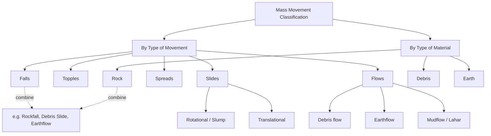
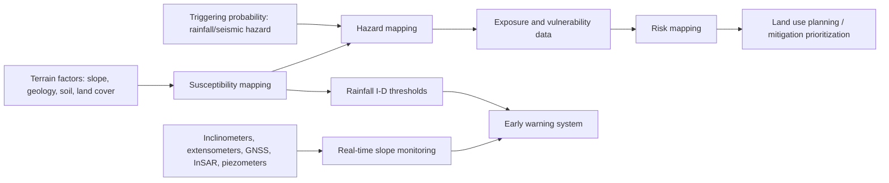

## Landslide and Mass Movement Hazards

### Overview

Landslide and mass movement hazards encompass the downslope movement of rock, soil, and debris under the influence of gravity, ranging from imperceptibly slow creep to catastrophic, high-velocity flows. Mass movements are among the most widespread geological hazards, occurring in virtually every mountainous and hilly terrain globally, and are frequently triggered or exacerbated by rainfall, seismic activity, human excavation, and other destabilizing factors. Understanding the classification, mechanics, triggering factors, and assessment methods for mass movements is fundamental to hazard mitigation, land use planning, and infrastructure design in susceptible terrain.

### Fundamental Concepts: Slope Stability Mechanics

Slope stability is governed by the balance between forces promoting movement (driving forces, primarily gravity acting on slope mass) and forces resisting movement (resisting forces, primarily shear strength of the slope material along a potential failure surface).

**Factor of Safety (FS)**

The standard quantitative expression of slope stability:

$$FS = \frac{\text{Resisting forces (shear strength)}}{\text{Driving forces (shear stress)}}$$

- $FS > 1$: Slope is theoretically stable (resisting forces exceed driving forces).
- $FS = 1$: Slope is at the threshold of failure (critical equilibrium).
- $FS < 1$: Slope failure is predicted.

In practice, slopes with $FS$ only marginally above 1.0 are considered to be at elevated risk, since natural variability in material properties, pore pressure, and loading conditions is not fully captured by a single deterministic value. [Inference — this is a standard geotechnical engineering practice consideration rather than a fixed numerical threshold, since acceptable margins vary by application, consequence of failure, and regulatory/design standard.]

**Mohr-Coulomb Shear Strength**

Shear strength along a potential failure surface is commonly modeled using the Mohr-Coulomb failure criterion:

$$\tau_f = c' + (\sigma_n - u)\tan\phi'$$

where $\tau_f$ is shear strength at failure, $c'$ is effective cohesion, $\sigma_n$ is total normal stress on the failure plane, $u$ is pore water pressure, and $\phi'$ is the effective angle of internal friction. This equation captures why increased pore water pressure (from rainfall infiltration or groundwater rise) directly reduces shear strength by reducing the effective normal stress term $(\sigma_n - u)$, without requiring any change in the material's intrinsic cohesion or friction angle.

**Key Point**: Because pore pressure enters the shear strength equation directly, rainfall-induced groundwater rise is one of the most common and best-understood landslide triggering mechanisms, even without any change in slope geometry or material strength.

### Classification of Mass Movements

Mass movements are classified using a framework (following Varnes' classification, widely adopted and refined in subsequent literature) based on **type of movement** and **type of material**.

**By Type of Movement**

- **Falls**: Rapid detachment and free-fall, bouncing, or rolling of rock or soil from a steep slope or cliff, with little to no shear displacement along a defined surface during descent (e.g., rockfall).
- **Topples**: Forward rotation of a rock or soil mass about a pivot point below its center of gravity, often controlled by pre-existing joint or bedding orientations.
- **Slides**: Movement of a coherent mass along one or more discrete failure surfaces (slip surfaces), with limited internal deformation.
  - **Rotational slides (slumps)**: Movement along a concave-upward (curved) failure surface, producing characteristic backward-tilted blocks and a headscarp.
  - **Translational slides**: Movement along a roughly planar failure surface, often controlled by a pre-existing weakness (bedding plane, joint, fault, or contact between rock types).
- **Spreads**: Lateral extension of a coherent mass over a weaker, often liquefiable or plastically-deforming underlying layer, common in sensitive clays or loose saturated sands (lateral spreads are a well-documented consequence of seismically-induced liquefaction).
- **Flows**: Movement as a viscous fluid, with internal deformation distributed throughout the moving mass rather than concentrated along a discrete surface.
  - **Debris flows**: Fast-moving mixtures of water, soil, rock, and organic material, often channelized, capable of very high velocities and long runout distances.
  - **Earthflows**: Slower-moving flows typically in fine-grained, clay-rich materials.
  - **Mudflows/lahars**: Flows with very high water content dominated by fine-grained material (lahars specifically referring to volcanic-derived debris/mudflows).
- **Complex/composite movements**: Combinations of two or more of the above movement types occurring within a single landslide event (e.g., a rotational slide that transitions into a debris flow downslope).

**By Type of Material**

- **Rock**: Intact or fractured bedrock.
- **Debris**: Coarse-grained, unconsolidated material (typically >20% coarser than 2 mm).
- **Earth**: Fine-grained, unconsolidated material (typically >80% finer than 2 mm).

Combining movement type and material type yields standard descriptive terms (e.g., "rockfall," "debris slide," "earth flow," "rock avalanche").

### Rate of Movement

Mass movements span an enormous range of velocities, which directly determines hazard character and appropriate mitigation strategy:

| Velocity Class | Approximate Rate | Example Hazard |
| --- | --- | --- |
| Extremely slow | <16 mm/year | Soil creep |
| Very slow | 16 mm/year–1.6 m/year | Some earthflows, slow slumps |
| Slow | 1.6 m/year–13 m/month | Active slow-moving slides |
| Moderate | 13 m/month–1.8 m/hour | Some translational slides |
| Rapid | 1.8 m/hour–3 m/minute | Debris flows (lower range) |
| Very rapid | 3 m/minute–3 m/second | Debris flows, rock avalanches |
| Extremely rapid | >3 m/second | Rockfalls, rock avalanches, flowslides |

[Unverified — these velocity class boundaries follow commonly cited landslide velocity scale frameworks in the geotechnical/geomorphological literature; exact boundary values vary somewhat between different published classification schemes.]

**Key Point**: Extremely slow to slow movements (soil creep, some earthflows) typically pose primarily a chronic structural/infrastructure damage hazard, while rapid to extremely rapid movements (debris flows, rockfalls, rock avalanches) pose acute life-safety hazards due to minimal or no warning time.

### Triggering Mechanisms

**Rainfall Infiltration**

The most common landslide trigger globally. Infiltrating rainwater raises pore water pressure (reducing effective stress and shear strength per the Mohr-Coulomb relation) and adds weight to the slope mass. Landslide susceptibility is often correlated with both rainfall **intensity** (rate) and **duration/antecedent moisture**, formalized in many regions through empirically-derived intensity-duration (I-D) rainfall threshold curves used for landslide early warning.

**Seismic Shaking**

Ground acceleration during earthquakes can directly exceed the shear strength of slope materials (particularly in already-marginal slopes), and can also generate excess pore pressure through cyclic loading, sometimes causing liquefaction-related flow failures in susceptible saturated granular soils.

**Undercutting and Erosion**

Removal of slope toe support through river/coastal erosion, wave action, or human excavation (road cuts, quarrying) removes a critical resisting force, steepening the effective slope and reducing stability.

**Volcanic Activity**

Volcanic eruptions can trigger mass movements through several pathways: edifice destabilization from magma intrusion, ground shaking from volcanic earthquakes, rapid ice/snowmelt generating lahars, and pyroclastic material deposition creating unstable, easily remobilized slopes.

**Freeze-Thaw and Other Weathering Processes**

Repeated freeze-thaw cycling progressively weakens rock mass strength along joints and fractures, particularly relevant for rockfall hazard in alpine and high-latitude/high-altitude terrain.

**Human Activity**

Slope excavation (road cuts, construction), loading (fill placement, building construction near slope crests), vegetation removal (reducing root-reinforcement of soil shear strength and increasing infiltration), and altered drainage patterns (e.g., leaking water/sewer infrastructure, redirected surface runoff) are widely documented anthropogenic triggering and preconditioning factors. [Inference — while individual case studies robustly document these mechanisms, the relative contribution of human versus natural factors is necessarily site-specific.]

### Landslide Susceptibility, Hazard, and Risk Assessment

- **Susceptibility mapping**: Identifies where landslides are likely to occur based on intrinsic terrain factors (slope angle, geology, soil type, land cover, and often historical landslide inventories used to calibrate statistical or machine-learning susceptibility models), without explicitly incorporating triggering probability or timing.
- **Hazard mapping**: Extends susceptibility assessment by incorporating the probability of a triggering event of given magnitude occurring within a specified time period, producing spatially and temporally explicit hazard estimates.
- **Risk mapping**: Further combines hazard with exposure (population, structures, infrastructure) and vulnerability to produce estimates of expected loss.
- **Rainfall threshold-based early warning systems**: Operational systems in many landslide-prone regions issue warnings when observed or forecast rainfall intensity-duration combinations exceed empirically-derived regional thresholds correlated with historical landslide occurrence.
- **Monitoring technologies**: Include inclinometers (measuring subsurface deformation), extensometers and crack gauges (measuring surface displacement), GPS/GNSS displacement monitoring, ground-based and satellite InSAR (Interferometric Synthetic Aperture Radar, detecting millimeter-scale ground deformation over wide areas), and piezometers (monitoring pore water pressure).

### Mitigation and Engineering Approaches

**Avoidance**

Zoning and setback regulations that direct development away from identified high-susceptibility terrain remain the most cost-effective mitigation strategy where feasible.

**Slope Stabilization**

- **Drainage measures**: Horizontal drains, drainage trenches, and surface water management reduce pore water pressure, directly increasing the factor of safety.
- **Retaining structures**: Retaining walls, soil nails, ground anchors, and reinforced earth structures provide additional resisting force.
- **Slope regrading**: Reducing slope angle or unloading the slide mass at the head while adding buttressing fill at the toe shifts the force balance toward stability.
- **Vegetation management**: Root systems provide mechanical reinforcement of near-surface soil shear strength and reduce infiltration through evapotranspiration, though vegetation alone is generally insufficient for deep-seated slope stability issues.

**Protective Structures**

- **Rockfall barriers, catch fences, and draped mesh**: Intercept and contain falling rock material before it reaches infrastructure or populated areas.
- **Debris flow barriers and check dams**: Slow flow velocity and trap sediment/debris in channelized flow paths.
- **Diversion structures**: Redirect flow paths away from vulnerable infrastructure or populated areas.

**Early Warning and Evacuation**

Where engineering mitigation is impractical or as a complement to structural measures, rainfall threshold-based or real-time deformation-monitoring warning systems trigger evacuation protocols ahead of anticipated failure.

### Case Examples

**Example 1 — Rainfall-Triggered Debris Flow**: Following an intense, short-duration rainfall event on a steep, previously wildfire-burned watershed, rapid infiltration (compounded by post-fire soil hydrophobicity) generates a fast-moving debris flow that travels down a stream channel, entraining additional sediment and debris, with minimal warning time due to the short lag between rainfall onset and flow initiation — illustrating the compound interaction between wildfire preconditioning and rainfall triggering discussed in cascading hazard frameworks.

**Example 2 — Slow-Moving Earthflow Affecting Infrastructure**: A slow-moving earthflow in clay-rich terrain, moving at rates of centimeters to a few meters per year, progressively damages a highway and utility corridor crossing its path; monitoring via periodic GNSS surveys and inclinometers informs ongoing maintenance and, eventually, a decision on realignment versus continued monitoring and repair, illustrating the chronic infrastructure-damage character of slow mass movements as distinct from acute life-safety hazards.

**Example 3 — Seismically-Triggered Landslide Damming**: A large earthquake triggers a massive rock avalanche that blocks a river valley, forming a landslide dam and impounding a rapidly rising lake behind it; engineers must rapidly assess dam stability and potential outburst flood risk to downstream communities, illustrating the cascading hazard chain connecting seismic, mass-movement, and flood hazard domains.

### Related Topics

- Slope stability analysis methods (limit equilibrium, finite element modeling)
- Rainfall intensity-duration threshold development for landslide early warning
- Compound and cascading hazards (wildfire-debris flow and seismic-landslide chains)
- Liquefaction and seismic geotechnical hazards
- InSAR and remote sensing for ground deformation monitoring
- Engineering geology site investigation methods
- Land use planning and hazard zoning regulation
- Volcanic hazard assessment (lahar generation and pathways)