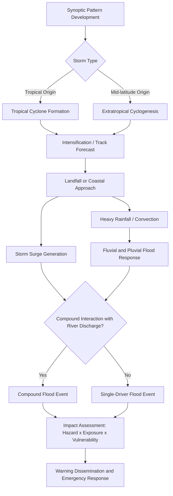

## Flood and Storm Hazards

### Definition and Scope

Flood and storm hazards encompass the meteorological and hydrological processes that generate excess water flow, storm surge, or wind-driven destruction capable of causing loss of life, property damage, and landscape modification. Floods result from the temporary inundation of normally dry land, while storm hazards include tropical cyclones, extratropical storms, thunderstorms, and their associated phenomena (high winds, storm surge, intense precipitation). These hazards are frequently coupled: storms are the primary meteorological driver of many flood events, making integrated risk assessment essential.

### Classification of Flood Types

**Fluvial (River) Floods**

Occur when river discharge exceeds channel capacity, causing water to spread into the floodplain. Driven by prolonged or intense rainfall, snowmelt, or a combination of both.

**Pluvial (Surface Water) Floods**

Result directly from rainfall intensity exceeding the infiltration and drainage capacity of the land surface, independent of an overflowing watercourse. Common in urban areas with high impervious surface coverage.

**Coastal Floods**

Caused by the inundation of land adjacent to the sea, driven by storm surge, high tides, wave action, or a combination (compound flooding). Often intensified by tropical or extratropical cyclones.

**Flash Floods**

Rapid-onset floods (typically within 6 hours of the causative rainfall) common in steep, small drainage basins, urbanized catchments, or arid regions with poor infiltration.

**Groundwater Floods**

Occur when the water table rises above the ground surface, typically in low-lying areas with permeable geology, following extended periods of above-average rainfall.

**Compound Floods**

Arise from the interaction of two or more flood drivers occurring simultaneously or in close succession (e.g., storm surge coinciding with heavy river discharge), producing impacts exceeding what either driver would cause alone.

### Storm Classification and Physical Mechanisms

**Tropical Cyclones**

Warm-core, low-pressure systems that form over tropical oceans with sea surface temperatures generally above 26.5°C. Classified by regional naming and intensity scales:

| Region | Term | Primary Intensity Scale |
| --- | --- | --- |
| North Atlantic, NE Pacific | Hurricane | Saffir-Simpson Scale (Categories 1–5) |
| NW Pacific | Typhoon | JMA/JTWC scales |
| South Pacific, Indian Ocean | Cyclone | Australian Bureau of Meteorology scale |

The Saffir-Simpson scale categorizes hurricanes by sustained wind speed:

$$V_{cat5} \geq 70 \text{ m/s} \, (157 \text{ mph})$$

Energy release in tropical cyclones is driven by latent heat exchange, formalized in Carnot heat engine models of cyclone intensification, where maximum potential intensity depends on the thermodynamic disequilibrium between the ocean surface and the outflow temperature aloft.

**Extratropical Cyclones**

Cold-core, mid-latitude low-pressure systems driven by baroclinic instability along temperature gradients (fronts). Responsible for major winter storms and windstorms in temperate latitudes, and can transition from or into tropical cyclones (extratropical transition).

**Mesoscale Convective Systems (MCS) and Thunderstorms**

Organized clusters of thunderstorms capable of producing flash flooding, damaging straight-line winds (derechos), hail, and tornadoes. Mesoscale Convective Complexes (MCCs) are a large, long-lived subtype often responsible for extreme rainfall totals.

**Storm Surge**

An abnormal rise of water generated by a storm, over and above predicted astronomical tides. Governed by:

$$\eta = \eta_{wind} + \eta_{pressure} + \eta_{wave setup}$$

where $\eta_{wind}$ (wind stress setup) is typically the dominant term in shallow coastal waters, $\eta_{pressure}$ arises from the inverse barometer effect (approximately 1 cm sea-level rise per 1 hPa pressure drop), and $\eta_{wave setup}$ results from wave breaking near the shoreline.

### Hydrological Fundamentals of Flooding

**Rainfall-Runoff Relationship**

The Rational Method, applicable to small catchments, estimates peak discharge:

$$Q_p = C \, i \, A$$

where $Q_p$ is peak discharge (m³/s), $C$ is a dimensionless runoff coefficient (dependent on land cover and soil), $i$ is rainfall intensity (mm/hr) for a duration equal to the time of concentration, and $A$ is catchment area (km², with unit conversion factor applied).

**Antecedent Moisture Condition (AMC)**

Soil saturation prior to a rainfall event strongly modulates flood response; saturated soils drastically reduce infiltration capacity, increasing the runoff coefficient.

**Return Period and Flood Frequency Analysis**

Flood magnitude is often expressed via the annual exceedance probability (AEP) and return period ($T$):

$$T = \frac{1}{P(X \geq x)}$$

A "100-year flood" denotes a flood magnitude with a 1% AEP in any given year — not a flood guaranteed to occur once every 100 years. Flood frequency analysis commonly fits observed annual maximum series to statistical distributions such as the Log-Pearson Type III or Gumbel extreme value distribution.

**Unit Hydrograph Theory**

A unit hydrograph represents the direct runoff response of a catchment to one unit of effective rainfall occurring uniformly over a specified duration, used to convert rainfall excess into a predicted discharge hydrograph via convolution.

### Hazard Assessment and Modeling Frameworks

**Flood Hazard Mapping**

Combines hydraulic modeling outputs (depth, velocity, extent) for defined return periods, typically using 2D hydrodynamic models solving the shallow water equations:

$$\frac{\partial h}{\partial t} + \frac{\partial (hu)}{\partial x} + \frac{\partial (hv)}{\partial y} = 0$$

$$\frac{\partial (hu)}{\partial t} + \frac{\partial}{\partial x}\left(hu^2 + \frac{1}{2}gh^2\right) + \frac{\partial (huv)}{\partial y} = -gh\frac{\partial z_b}{\partial x} - c_f u\sqrt{u^2+v^2}$$

These continuity and momentum equations underpin models such as HEC-RAS 2D, LISFLOOD-FP, and TELEMAC-2D.

**Risk Assessment Framework**

Standard hazard risk is conceptualized as:

$$\text{Risk} = \text{Hazard} \times \text{Exposure} \times \text{Vulnerability}$$

- **Hazard**: probability and intensity (depth, velocity, wind speed) of the physical event.
- **Exposure**: population, infrastructure, and assets located within the hazard zone.
- **Vulnerability**: susceptibility of exposed elements to damage, often expressed via depth-damage curves for flooding.

**Storm Track and Intensity Forecasting**

Numerical weather prediction (NWP) ensembles (e.g., ECMWF ENS, GEFS) provide probabilistic storm tracks and intensity forecasts. Ensemble spread is used to construct cone-of-uncertainty products for tropical cyclone forecasting.

### Key Points

- Flood generation mechanisms (fluvial, pluvial, coastal, flash, groundwater) require distinct hydrological and meteorological data inputs for hazard characterization.
- Storm surge is not solely a function of storm intensity; bathymetry, coastline shape (funneling in bays), forward speed, and angle of approach substantially modify surge height. [Inference: exact surge magnitude for a given storm is highly site-specific and not deterministically predictable from category alone.]
- Return period terminology is probabilistic, not deterministic; clustering of "100-year" events within short timeframes is statistically possible and increasingly observed. [Inference: attribution of clustering to climate nonstationarity versus natural variability requires site-specific statistical testing.]
- Compound and cascading hazards (e.g., surge plus fluvial discharge, or wind damage triggering secondary flooding from infrastructure failure) often produce disproportionate impacts relative to single-hazard assessments.

### Example: Storm Surge and Compound Flood Interaction Diagram

<svg xmlns="http://www.w3.org/2000/svg" viewBox="0 0 800 420">
<rect x="0" y="0" width="800" height="420" fill="#f7f9fb" />
<text x="400" y="28" text-anchor="middle" font-size="18" font-family="sans-serif" font-weight="bold" fill="#1a1a1a">Compound Flood Mechanism: Storm Surge Meets River Discharge (svg_diagram)</text>

<rect x="0" y="200" width="200" height="180" fill="#a9cce3" />
<text x="100" y="230" text-anchor="middle" font-size="13" font-family="sans-serif" fill="#1a1a1a">Ocean</text>

<path d="M200,200 Q350,180 500,220 Q650,250 800,200 L800,380 L200,380 Z" fill="#d4e6f1" />

<path d="M500,60 Q520,150 500,220 Q480,290 460,380" stroke="#5dade2" stroke-width="18" fill="none" />
<text x="560" y="90" font-size="12" font-family="sans-serif" fill="#1a1a1a">River discharge (Q)</text>

<path d="M120,260 L260,260" stroke="#c0392b" stroke-width="4" marker-end="url(#arrow1)" />
<text x="130" y="248" font-size="12" font-family="sans-serif" fill="#c0392b">Storm surge push inland</text>

<path d="M420,260 L340,260" stroke="#e67e22" stroke-width="4" marker-end="url(#arrow2)" />
<text x="330" y="248" font-size="12" font-family="sans-serif" fill="#e67e22" text-anchor="end">Backwater effect</text>

<rect x="380" y="300" width="90" height="50" fill="#7d6608" />
<text x="425" y="365" text-anchor="middle" font-size="12" font-family="sans-serif" fill="#1a1a1a">Low-lying town</text>

<ellipse cx="425" cy="300" rx="140" ry="60" fill="#e74c3c" opacity="0.25" />
<text x="425" y="300" text-anchor="middle" font-size="12" font-family="sans-serif" fill="#922b21">Compound flood extent</text>
</svg>

### Storm-Flood Sequence and Warning Chain

### Monitoring and Early Warning Systems

**Meteorological Monitoring**

- Weather radar (Doppler, dual-polarization) for real-time precipitation intensity and storm structure.
- Geostationary satellites (e.g., GOES-R series, Himawari) for storm tracking and cloud-top temperature analysis.
- Buoy networks and scatterometer data for wind field and wave measurement over open water.

**Hydrological Monitoring**

- Stream gauge networks measuring stage (water level) and discharge, often telemetered for real-time reporting.
- Tide gauges and coastal water level sensors for storm surge detection.
- Soil moisture and snowpack telemetry to assess flood-generation potential.

**Forecast-Based Early Action**

Modern flood early warning systems increasingly integrate impact-based forecasting, translating hazard forecasts (rainfall, surge height) into anticipated impacts (infrastructure at risk, population affected) rather than reporting meteorological variables alone.

### Mitigation and Structural Measures

**Structural Measures**

- Levees, floodwalls, and dikes to contain river or coastal flood extents.
- Storm surge barriers (e.g., movable gate systems) protecting estuaries and harbors.
- Detention and retention basins to attenuate peak flow in urban catchments.
- Channel modification (widening, dredging) to increase conveyance capacity.

**Non-Structural Measures**

- Floodplain zoning and land-use restrictions based on hazard mapping.
- Building codes requiring elevated foundations or flood-resistant construction in designated zones.
- Nature-based solutions: wetland restoration, mangrove conservation (surge attenuation), and upstream afforestation for peak flow reduction.
- Insurance mechanisms (e.g., national flood insurance programs) that also serve as risk-transfer and awareness tools.

### Climate Change Considerations

Rising sea surface temperatures increase the theoretical maximum potential intensity of tropical cyclones, and a warmer atmosphere holds more moisture per the Clausius-Clapeyron relation (approximately 7% increase in saturation vapor pressure per 1°C warming), which is physically expected to increase extreme precipitation intensity. [Inference: translating these thermodynamic trends into site-specific flood frequency shifts requires regional climate modeling and is subject to considerable uncertainty in storm track and frequency projections.] Sea-level rise independently increases the baseline water level upon which storm surge is superimposed, extending the inland reach and duration of coastal flooding for a given storm.

### Conclusion

Flood and storm hazards represent tightly coupled atmospheric and hydrological processes requiring multidisciplinary assessment spanning meteorology, hydrology, coastal engineering, and risk science. Effective hazard characterization depends on understanding the specific flood generation mechanism, applying appropriate hydraulic and statistical modeling frameworks, and integrating hazard, exposure, and vulnerability data into actionable risk products. The increasing recognition of compound and cascading hazard interactions has shifted modern practice toward integrated, multi-hazard assessment frameworks rather than isolated single-driver analysis.

### Related Topics

- Landslide and Mass Movement Hazards
- Drought and Hydrological Extremes
- Coastal Erosion and Shoreline Dynamics
- Climate Change Impacts on Extreme Weather
- Geographic Information Systems (GIS) for Hazard Mapping
- Earthquake and Seismic Hazard Assessment
- Disaster Risk Reduction (DRR) Frameworks
- Remote Sensing for Natural Hazard Monitoring