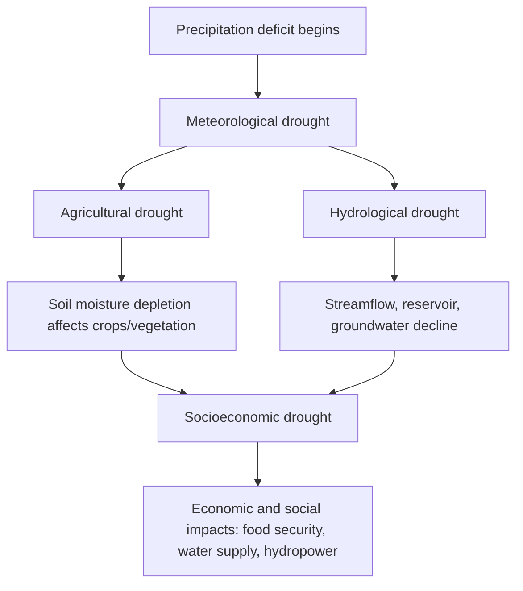
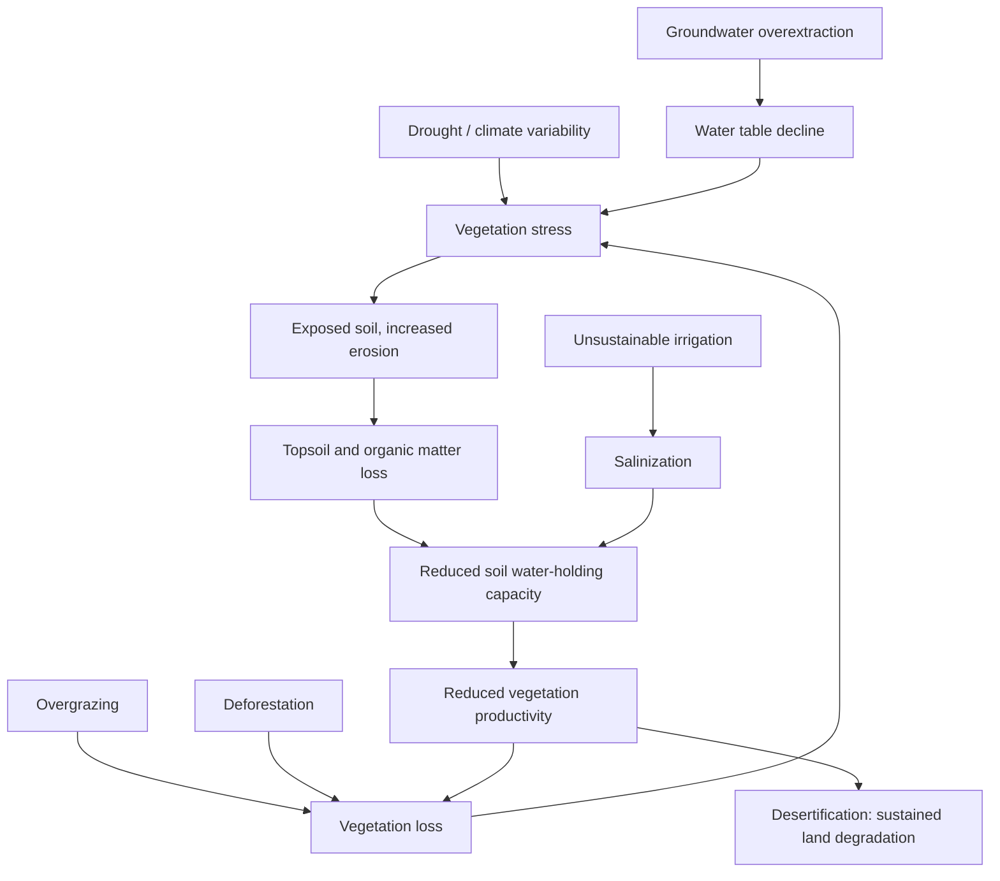

## Drought and Desertification

### Overview

Drought and desertification are slow-onset environmental hazards centered on the depletion and long-term degradation of water and land resources. Drought is a temporary, recurring departure from normal water availability driven primarily by precipitation deficits, while desertification is a longer-term process of land degradation in drylands, often (though not exclusively) linked to repeated or prolonged drought interacting with land use pressures. Both hazards develop gradually, complicate conventional early-warning and disaster-response frameworks built around rapid-onset events, and carry substantial implications for food security, water resources, ecosystems, and displacement.

### Defining Drought

Drought is fundamentally a relative condition — a deficit measured against a location-specific expected or normal baseline — rather than an absolute climatic state, which is why the same absolute rainfall total can constitute severe drought in one region and normal conditions in another.

**Types of Drought**

- **Meteorological drought**: A deficit in precipitation relative to a long-term average for a given region and time period, the most fundamental and typically first-manifesting drought type.
- **Agricultural drought**: Insufficient soil moisture to meet crop or vegetation water demand during the growing season, driven not only by precipitation deficit but also by evapotranspiration rates, soil characteristics, and crop-specific water requirements — meaning agricultural drought can emerge even without an extreme meteorological deficit if evaporative demand (heat, wind, low humidity) is unusually high.
- **Hydrological drought**: Below-normal streamflow, reservoir levels, lake levels, or groundwater levels, typically lagging meteorological drought onset since it reflects the cumulative depletion of water storage over time, and correspondingly often persisting longer after meteorological conditions have improved.
- **Socioeconomic drought**: Occurs when water shortage begins to affect the supply and demand of economic goods (agricultural output, hydropower generation, municipal water supply), linking physical water deficit to societal and economic impact.

**Key Point**: The sequential, lagged relationship between drought types is operationally important — meteorological drought can end (rainfall resumes) while hydrological drought persists for months afterward, since reservoirs, aquifers, and lake levels take time to recover even after precipitation returns to normal.

### Drought Indices and Monitoring

Quantitative drought monitoring relies on standardized indices that allow comparison across regions and time periods with differing baseline climates.

- **Standardized Precipitation Index (SPI)**: Expresses precipitation for a given accumulation period (commonly 1, 3, 6, 12, or 24 months) as a standardized deviation from the long-term precipitation distribution for that location and period, allowing comparison of drought severity across regions with very different absolute rainfall climatologies. SPI values below approximately -1.0 typically indicate moderate drought, below -1.5 severe drought, and below -2.0 extreme drought, based on standard normal distribution probability thresholds. [Unverified as universally fixed cutoffs — while these threshold conventions are widely used, some drought monitoring programs apply slightly different classification boundaries.]
- **Palmer Drought Severity Index (PDSI)**: An older, widely used index incorporating precipitation, temperature (via a simplified soil water balance), and antecedent moisture conditions, providing a longer historical record in many regions but with known limitations related to its underlying soil moisture model assumptions.
- **Standardized Precipitation Evapotranspiration Index (SPEI)**: Extends the SPI approach by incorporating potential evapotranspiration alongside precipitation, better capturing the influence of temperature-driven evaporative demand on drought severity — particularly relevant as background warming trends increase atmospheric evaporative demand independent of precipitation changes.
- **Vegetation and remote-sensing-based indices**: Satellite-derived indices such as NDVI (Normalized Difference Vegetation Index) and related vegetation health products provide indirect drought impact monitoring by tracking vegetation greenness and vigor anomalies, particularly valuable in data-sparse regions with limited ground-based meteorological networks.
- **Groundwater and reservoir storage monitoring**: Direct measurement of aquifer levels and reservoir storage provides the most direct indicator of hydrological drought severity, though with typically sparser spatial monitoring coverage than precipitation-based indices.

### Climatic and Oceanic Drivers of Drought

- **Precipitation deficit mechanisms**: Persistent atmospheric blocking patterns, shifted or weakened monsoon circulations, and anomalous high-pressure ridging can suppress storm tracks and moisture delivery to a region for extended periods.
- **El Niño-Southern Oscillation (ENSO)**: A major driver of interannual drought variability in many regions; El Niño phases are associated with drought in some regions (e.g., parts of Australia, Southeast Asia, and southern Africa) while La Niña phases are associated with drought in others (e.g., the southwestern United States, parts of South America), with the specific regional relationship depending on each area's typical position relative to ENSO-driven shifts in tropical convection and jet stream patterns.
- **Other ocean-atmosphere oscillations**: Additional recognized drivers of regional drought variability include the Indian Ocean Dipole, the Pacific Decadal Oscillation, and the North Atlantic Oscillation, each influencing regional precipitation patterns on interannual to multidecadal timescales.
- **Land-atmosphere feedback**: Once soil moisture becomes depleted, reduced evapotranspiration can further suppress local precipitation and increase surface heating, creating a self-reinforcing feedback that can prolong and intensify drought conditions independent of the original large-scale atmospheric driver.

### Defining and Understanding Desertification

Desertification is formally defined (following the UN Convention to Combat Desertification, UNCCD) as land degradation in arid, semi-arid, and dry sub-humid areas (collectively termed "drylands") resulting from various factors, including climatic variations and human activities. It is a process of degradation in already-dry regions, not the geographic expansion of existing hot deserts as sometimes popularly (and inaccurately) depicted.

**Key Point**: Desertification does not mean literal deserts "marching" across the landscape as an advancing front; it refers to progressive loss of biological and economic productivity in dryland ecosystems, which can occur in a patchy, non-contiguous pattern across a wide region rather than as a coherent advancing boundary. [Inference — this reflects the standard UNCCD conceptual framing, presented here as clarification of a commonly misunderstood distinction rather than as a claim about any single specific region's degradation pattern.]

**Mechanisms and Contributing Processes**

- **Vegetation loss**: Overgrazing, deforestation, and unsustainable agricultural practices remove protective vegetation cover, exposing soil to accelerated wind and water erosion.
- **Soil degradation**: Loss of topsoil, organic matter depletion, and compaction reduce soil water-holding capacity and fertility, creating a self-reinforcing cycle in which degraded soil supports less vegetation, which in turn provides less protection against further degradation.
- **Salinization**: Poor irrigation drainage in arid/semi-arid agricultural areas can cause salt accumulation in the root zone as irrigation water evaporates, progressively reducing soil productivity and, in severe cases, rendering land unsuitable for continued cultivation.
- **Water resource depletion**: Unsustainable groundwater extraction and surface water diversion for irrigation can lower water tables and reduce water availability for both agriculture and natural vegetation, compounding degradation pressure.
- **Climate variability and change**: Recurring or prolonged drought reduces vegetation cover and stresses dryland ecosystems, interacting with the land-management factors above; many researchers characterize desertification as most commonly arising from the interaction of climatic stress and unsustainable land management rather than either factor operating in isolation. [Inference — this characterization reflects a broadly represented position within desertification research; the relative weighting of climatic versus anthropogenic drivers remains an area of ongoing scientific discussion and is highly region-specific.]

### Drought and Desertification Impacts

- **Agricultural and food security impacts**: Crop failure, livestock losses, and reduced agricultural productivity, with cascading effects on food prices and food security, particularly severe in regions with limited irrigation infrastructure and high dependence on rain-fed agriculture.
- **Water resource impacts**: Reduced surface water and groundwater availability affecting municipal supply, industrial use, hydropower generation, and ecosystem water requirements.
- **Wildfire risk amplification**: Drought-stressed vegetation and reduced fuel moisture significantly elevate wildfire ignition and spread potential, a well-documented compound hazard interaction.
- **Economic impacts**: Agricultural losses, reduced hydropower generation, increased water supply costs, and broader economic disruption in drought/desertification-affected regions.
- **Population displacement and migration**: Severe, prolonged drought and desertification can act as one contributing driver among several (alongside economic, political, and social factors) in rural-to-urban and cross-border migration patterns, though attributing migration decisions to environmental factors alone is methodologically complex given the typically multi-causal nature of migration decisions. [Inference — the multi-causal character of environmentally-associated migration is a well-established position in migration and environmental studies literature, cautioning against attributing migration to drought/desertification as a sole or primary cause without careful case-specific analysis.]
- **Ecosystem impacts**: Loss of vegetation cover, biodiversity decline, and altered ecosystem function in affected drylands, sometimes persisting well beyond the immediate drought period.

### Drought and Desertification Management

**Monitoring and Early Warning**

- **Drought early warning systems**: Combine precipitation, soil moisture, streamflow, and vegetation health monitoring (often integrating the indices discussed above) to provide advance notice of developing drought conditions, supporting proactive rather than purely reactive response.
- **Seasonal climate forecasting**: Probabilistic seasonal outlooks, often informed by ENSO and other known climate driver states, provide lead time for agricultural and water resource planning decisions, though skill varies considerably by region and season.

**Water Resource Management**

- **Water conservation and efficiency measures**: Reduced-consumption irrigation technologies (drip irrigation, precision agriculture), municipal water conservation programs, and demand management reduce vulnerability to water shortage during drought periods.
- **Reservoir and groundwater management**: Coordinated surface water storage and conjunctive groundwater use can buffer against short-term precipitation deficits, though unsustainable groundwater "mining" during drought periods can itself contribute to longer-term water resource depletion and land subsidence in some settings.
- **Drought contingency planning**: Pre-established tiered response plans (specifying triggers for voluntary conservation, mandatory restrictions, and emergency measures) allow more effective, less improvised drought response than ad hoc measures developed during an active drought.

**Land Management for Desertification Prevention**

- **Sustainable grazing management**: Rotational grazing and stocking rate management aligned with land carrying capacity reduce overgrazing pressure on vegetation and soil.
- **Soil conservation practices**: Terracing, contour farming, windbreaks, and cover cropping reduce erosion and help maintain soil structure and organic matter.
- **Reforestation and afforestation programs**: Large-scale vegetation restoration initiatives (e.g., Africa's Great Green Wall initiative) aim to stabilize soil, restore degraded land productivity, and create windbreaks against erosion, though achieving sustained success at large scale involves substantial implementation, maintenance, and community-engagement challenges. [Unverified regarding specific program outcomes — large-scale reforestation/afforestation initiative effectiveness varies considerably by site conditions, species selection, and long-term maintenance capacity, and is an area of active monitoring and evaluation.]
- **Sustainable irrigation practices**: Proper drainage design and irrigation scheduling to prevent salinization, alongside water-efficient irrigation technology adoption.

### Case Examples

**Example 1 — Multi-Year Meteorological-to-Hydrological Drought Progression**: A region experiences several consecutive years of below-average rainfall (meteorological drought); initial impacts appear in reduced soil moisture and crop stress (agricultural drought) within the first growing season, while reservoir levels and groundwater tables continue declining progressively as cumulative deficits accumulate (hydrological drought), with reservoir and groundwater recovery lagging well behind the eventual return of normal precipitation — illustrating the sequential, lagged relationship between drought types.

**Example 2 — Compound Drought-Heat-Wildfire Interaction**: Extended drought conditions coincide with an unusually intense summer heat wave, jointly desiccating vegetation fuel moisture far below levels either factor alone would produce, substantially elevating wildfire ignition probability and potential fire spread rate — illustrating the compound hazard interaction between drought and extreme heat discussed in the compound/cascading hazards framework.

**Example 3 — Dryland Agricultural Salinization**: In an arid agricultural region relying on irrigation without adequate drainage infrastructure, repeated irrigation cycles combined with high evaporation rates progressively concentrate salts in the root zone over multiple growing seasons, gradually reducing crop yields and eventually rendering portions of the land unsuitable for continued cultivation without significant remediation investment — illustrating desertification driven primarily by land management practice rather than by drought or climatic change alone.

### Related Topics

- Compound and cascading hazards (drought-heat-wildfire interactions)
- Classification of natural hazards (slow-onset hazard category)
- Wildfire hazard assessment and fuel moisture dynamics
- ENSO and other climate driver teleconnections
- Groundwater hydrology and sustainable aquifer management
- Soil science and land degradation processes
- Climate change adaptation in water resource management
- Environmental migration and displacement studies