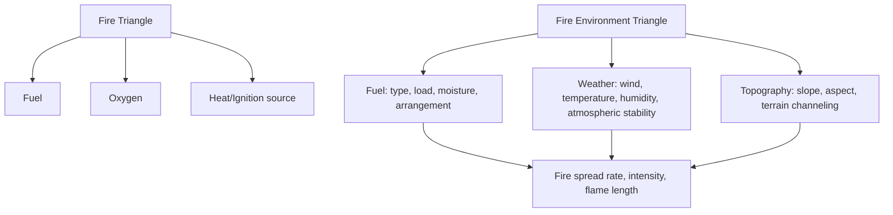
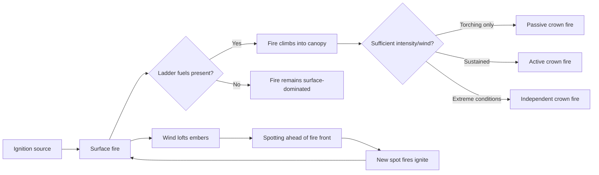

## Wildfire Hazards

### Overview

Wildfire hazards encompass the ignition, spread, and behavior of uncontrolled fire in vegetated landscapes, along with the ecological, atmospheric, and land-management factors that govern fire risk. Wildfire is unusual among natural hazards in occupying a genuinely dual role: fire is a natural, often ecologically essential process in many ecosystems, yet it also poses acute threats to life, property, air quality, and downstream hazard susceptibility (notably post-fire debris flows) when it interacts with human development or exceeds the historical range of frequency and intensity a landscape has adapted to. Understanding fire behavior physics, the fire triangle/environment, fuel and weather controls, and the wildland-urban interface is central to modern wildfire risk assessment and management.

### The Fire Triangle and Fire Behavior Fundamentals

Combustion requires three simultaneous elements, classically represented as the **fire triangle**:

- **Fuel**: Combustible vegetation and organic material (live and dead), whose quantity, type, arrangement, and moisture content govern ignition probability and fire intensity.
- **Oxygen**: Generally not a limiting factor in open wildland settings given ambient atmospheric oxygen concentration, though local combustion efficiency can be affected by fire geometry and wind-driven oxygen supply to the flame front.
- **Heat**: An ignition source (lightning, human-caused ignition) sufficient to raise fuel to its ignition temperature, and subsequently the ongoing heat released by combustion that sustains fire spread into adjacent unburned fuel.

Extended fire behavior analysis typically incorporates a **fire environment triangle** (or "fire behavior triangle") of **fuel, weather, and topography**, which together determine fire spread rate, intensity, and flame length once ignition has occurred.

### Fuel Characteristics

**Fuel Classification**

- **Ground fuels**: Duff, buried roots, and organic soil layers, capable of smoldering combustion that can persist for extended periods, including underground, and is comparatively difficult to detect and extinguish.
- **Surface fuels**: Litter, grasses, shrubs, and downed woody debris at or near ground level, the primary driver of surface fire spread rate.
- **Ladder fuels**: Vegetation (shrubs, small trees, low tree branches) that bridges the vertical gap between surface fuels and tree canopies, enabling fire to transition from a surface fire into tree crowns.
- **Canopy (crown) fuels**: Live and dead tree canopy material, whose ignition produces high-intensity crown fire behavior.

**Fuel Moisture**

- **Live fuel moisture**: Water content of living vegetation, generally declining through the growing season as plants senesce or experience drought stress, directly influencing ignition probability and fire intensity in shrub- and grass-dominated ecosystems.
- **Dead fuel moisture**: Water content of dead, cured vegetation and woody debris, which responds to ambient relative humidity, temperature, and precipitation on characteristic timescales ("time-lag" classes: 1-hour, 10-hour, 100-hour, and 1000-hour fuels, referring to fine to coarse woody material and how quickly each equilibrates with changing atmospheric moisture conditions).
- **Fuel moisture of extinction**: The dead fuel moisture threshold above which a given fuel type will generally not sustain fire spread, a key parameter in fire behavior modeling.

**Fuel Load and Arrangement**

Total fuel mass per unit area (fuel load) and its vertical/horizontal continuity (arrangement) strongly influence fire behavior; densely packed, continuous fuels support faster spread and higher intensity than sparse or discontinuous fuel beds, all else being equal.

### Weather Controls on Fire Behavior

- **Wind**: The single most influential weather variable for fire spread rate, both through direct flame-front advection and through pre-heating and drying of fuels ahead of the fire; strong, sustained winds are associated with the most extreme and dangerous fire behavior, including rapid spread and spotting (ember transport ahead of the main fire front, igniting new spot fires).
- **Temperature and relative humidity**: High temperature and low relative humidity accelerate fuel drying and increase ignition probability and fire intensity; the combination is often captured in fire weather indices.
- **Atmospheric stability**: Unstable atmospheric conditions can promote strong vertical fire plume development and erratic fire behavior, including fire-generated pyrocumulus clouds and, in extreme cases, pyrocumulonimbus development capable of producing fire-generated lightning and even localized fire-induced wind phenomena.
- **Drought and antecedent moisture conditions**: Prolonged precipitation deficit (as discussed in drought hazards) desiccates both live and dead fuel moisture well below typical seasonal levels, substantially elevating both ignition probability and potential fire severity — a well-documented compound hazard interaction between drought and wildfire risk.
- **Foehn-type downslope winds**: Regionally-named strong, warm, dry downslope wind events (e.g., Santa Ana winds in Southern California, Diablo winds in Northern California, Foehn winds in the European Alps) are associated with some of the most extreme and rapidly-spreading wildfire events in their respective regions, combining strong sustained wind with severe fuel-drying conditions.

### Topographic Controls

- **Slope**: Fire generally spreads faster upslope than downslope or on flat terrain, since upslope fuel is pre-heated by convective and radiant heat from the fire below, shortening the time to ignition; spread rate increases progressively with slope steepness.
- **Aspect**: South-facing slopes (in the Northern Hemisphere) typically receive more solar radiation, producing drier fuels and generally higher fire risk than north-facing slopes at comparable elevation and vegetation type.
- **Terrain channeling and chimney effects**: Narrow canyons, saddles, and other terrain features can locally accelerate and intensify fire behavior through wind channeling and convective column interactions, historically associated with some of the most dangerous fire behavior scenarios for firefighter safety.

### Fire Behavior Types

- **Ground fire**: Smoldering combustion within organic soil/duff layers, typically low-intensity but potentially long-duration and difficult to fully extinguish.
- **Surface fire**: Fire spreading through surface fuels, the most common and generally most manageable fire type, though intensity varies substantially with fuel and weather conditions.
- **Crown fire**: Fire spreading through tree canopy fuels, generally the most intense and difficult-to-control fire behavior type, further subdivided into:
  - **Passive crown fire**: Individual or small groups of tree crowns torch (ignite) due to intense surface fire beneath them, without sustained independent crown-to-crown spread.
  - **Active crown fire**: Sustained fire spread through the canopy, dependent on and generally moving in coordination with the surface fire beneath it.
  - **Independent crown fire**: Fire spread through the canopy that outpaces and becomes at least partially decoupled from the surface fire below, associated with the most extreme fire behavior and spread rates.
- **Spotting**: Wind-lofted burning embers ignite new spot fires ahead of the main fire front, sometimes at considerable distance (up to several kilometers in extreme events), a major mechanism by which fires cross firebreaks, roads, and other barriers that would otherwise halt surface fire spread.

### Fire Regimes and Ecological Role

A **fire regime** describes the characteristic pattern of fire frequency, intensity, seasonality, and size for a given ecosystem over time, shaped by climate, vegetation type, and (in many landscapes) historical human fire management practices, including extensive Indigenous cultural burning traditions in many regions prior to and, in some areas, continuing alongside colonial-era fire suppression policy.

- **Fire-adapted/fire-dependent ecosystems**: Many ecosystems (e.g., many pine forests, chaparral shrublands, savannas, and prairies) have evolved with recurring fire and depend on periodic burning for processes such as seed germination (some pine species require fire-triggered cone opening), nutrient cycling, and maintaining structural/successional diversity.
- **Fire exclusion and fuel accumulation**: Decades of fire suppression policy in many fire-adapted forest ecosystems has, in numerous well-documented cases, allowed fuel loads to accumulate substantially beyond historical norms, contributing to increased potential for high-severity, difficult-to-control fire when ignition eventually occurs. [Inference — this fire-exclusion/fuel-accumulation relationship is well supported in fire ecology literature for many specific forest types (particularly historically frequent-fire, low-to-moderate severity regimes such as some ponderosa pine forests), though the relationship's applicability and magnitude vary by ecosystem type and are not universal across all fire-adapted vegetation types.]
- **Prescribed fire and cultural burning**: Deliberately planned and controlled burning under specified conditions, used to reduce fuel loads, restore ecological fire function, and reduce wildfire severity risk; increasingly recognized as complementing or, in many regions, restoring long-practiced Indigenous cultural burning approaches.

### Wildland-Urban Interface (WUI)

The WUI refers to areas where human development is adjacent to or intermixed with wildland vegetation, representing the zone of greatest wildfire risk to life and property due to the direct juxtaposition of ignitable structures and wildland fuel.

- **Interface WUI**: Development directly bordering a contiguous area of wildland vegetation.
- **Intermix WUI**: Development interspersed within wildland vegetation, with structures and wildland fuel closely intermingled.
- **Structure ignition mechanisms in WUI fires**: Direct flame contact, radiant heat exposure from nearby burning vegetation or structures, and (frequently the dominant mechanism in destructive WUI fire events) ember/firebrand ignition of vulnerable structural components (roofing, vents, decking, and adjacent combustible landscaping), often occurring well ahead of the main fire front's arrival. [Inference — ember ignition as a frequently dominant WUI structure-loss mechanism is a well-documented finding across multiple post-fire damage assessments, though the precise proportional contribution of ember versus direct-flame versus radiant-heat ignition varies by specific fire event and structure characteristics.]
- **Defensible space**: Managed vegetation clearance and fuel reduction in the zone immediately surrounding a structure, designed to reduce direct flame contact and radiant heat exposure and to provide safer conditions for firefighting operations.
- **Home hardening**: Structural modifications (fire-resistant roofing and siding materials, ember-resistant vents, enclosed eaves) that reduce structure vulnerability to ember ignition specifically, increasingly emphasized alongside defensible space in WUI fire risk reduction guidance.

### Fire Danger Rating and Forecasting

- **Fire danger rating systems**: Operational systems (varying by country/region) integrate fuel moisture, weather, and other inputs into standardized indices used for resource allocation, public fire restrictions, and, in extreme categories, red-flag or fire-weather-warning type public alerts.
- **Fire weather forecasting**: Meteorological forecasting specifically focused on the wind, humidity, temperature, and instability conditions most relevant to fire ignition and spread potential, often issued as specific fire-weather watches/warnings distinct from general weather forecasts.
- **Fire behavior modeling**: Physics- and empirically-based models predict fire spread rate, intensity, and flame length given specified fuel, weather, and topography inputs, used both for operational fire management decision support and for landscape-scale fire risk assessment and planning.
- **Satellite fire detection**: Thermal-band satellite sensors provide near-real-time active fire detection and burned-area mapping, particularly valuable for monitoring remote or rapidly-evolving fire events.

### Post-Fire Hazards and Cascading Effects

Wildfire fundamentally alters watershed and slope conditions in ways that elevate several secondary hazards, as discussed in the compound and cascading hazards framework:

- **Post-fire debris flows**: Combustion-induced soil hydrophobicity and loss of vegetative cover dramatically increase runoff and erosion potential, elevating debris-flow risk in burned, steep terrain for a period typically spanning one to several years following a fire, until vegetation and soil structure recover.
- **Post-fire flooding**: Reduced infiltration capacity in burned watersheds can generate significantly elevated flood peaks for a given rainfall event compared to pre-fire, unburned conditions.
- **Air quality impacts**: Wildfire smoke, containing fine particulate matter (PM2.5) and other pollutants, can degrade air quality across large downwind areas, sometimes spanning hundreds to thousands of kilometers from the fire itself, with documented public health impacts extending well beyond the immediate fire perimeter.
- **Erosion and soil productivity loss**: Severe fire can consume soil organic matter and destabilize slopes, with long-term implications for soil fertility and revegetation success.

### Wildfire Risk Management

- **Fuel reduction treatments**: Prescribed burning, mechanical thinning, and fuel break construction reduce fuel load and continuity in strategically prioritized locations to moderate potential fire behavior and improve suppression opportunities.
- **Land use planning in WUI areas**: Development regulations addressing building materials, defensible space requirements, and, in some jurisdictions, restrictions on development in the highest-hazard zones.
- **Fire suppression resource allocation**: Fire danger rating and behavior forecasting inform pre-positioning of firefighting resources ahead of anticipated high-risk periods.
- **Community evacuation planning**: Given the potential for rapid fire spread under extreme weather conditions, effective evacuation route planning and early warning systems are critical components of WUI community wildfire risk management.
- **Climate change considerations**: Changes in temperature, precipitation patterns, and fuel moisture dynamics are documented to be altering fire season length and, in numerous studied regions, fire activity/severity in various ways, though the specific magnitude and direction of change vary substantially by region, vegetation type, and the relative influence of climate versus land-management/fuel-accumulation factors discussed above. [Inference — this reflects the substantial body of fire-climate research documenting regionally-variable relationships between changing climate conditions and fire activity, while cautioning against attributing observed trends in any specific region solely to climate change without accounting for concurrent land-management factors.]

### Case Examples

**Example 1 — Wind-Driven WUI Fire Event**: A wildfire ignites during a period of strong, dry downslope wind and low relative humidity; rapid fire spread combined with extensive ember spotting ignites numerous structures well ahead of the visible flame front, with many structure losses attributable to ember ignition of vulnerable roofing and vent components rather than direct flame contact — illustrating both extreme wind-driven fire behavior and the ember-dominant WUI structure-loss mechanism.

**Example 2 — Fuel Accumulation and High-Severity Fire in a Historically Frequent-Fire Forest**: A forest ecosystem historically adapted to frequent, low-to-moderate severity fire experiences decades of fire suppression, allowing surface and ladder fuels to accumulate substantially; when fire eventually occurs under severe fire-weather conditions, the elevated fuel load and continuity support unusually extensive crown fire behavior and high-severity fire effects atypical of the ecosystem's historical fire regime.

**Example 3 — Post-Fire Debris Flow Following Seasonal Rainfall**: Several months after a severe wildfire denudes a steep watershed, an intense but not historically extreme rainfall event on the burned slopes generates a fast-moving debris flow that would have been highly unlikely under pre-fire vegetated conditions, illustrating the cascading hazard relationship between wildfire and subsequent mass-movement risk.

### Related Topics

- Compound and cascading hazards (drought-wildfire and wildfire-debris flow interactions)
- Drought and desertification (fuel moisture and fire risk interactions)
- Landslide and mass movement hazards (post-fire debris flow mechanics)
- Fire ecology and fire regime restoration
- Wildland-urban interface planning and building codes
- Air quality and public health impacts of wildfire smoke
- Fire weather forecasting and fire danger rating systems
- Climate change and shifting fire regime research