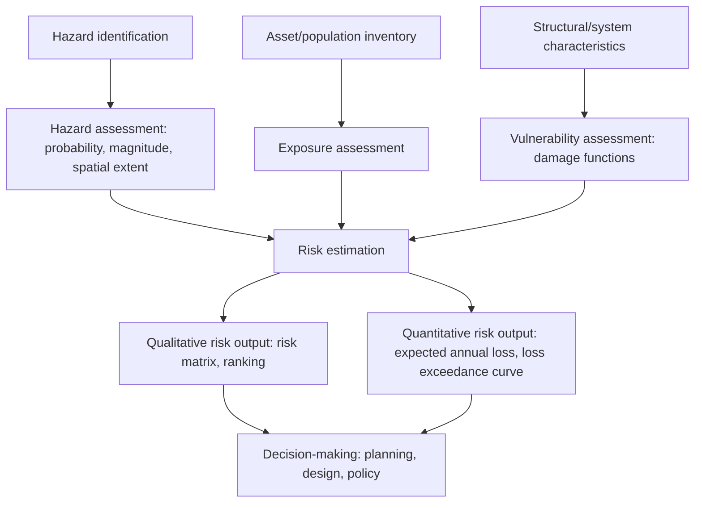
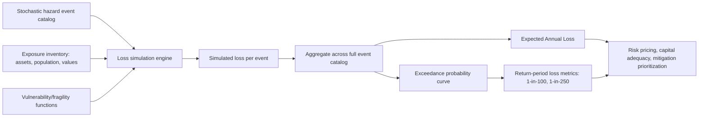

## Hazard Risk Assessment Methods

### Overview

Hazard risk assessment methods comprise the systematic analytical frameworks used to identify, characterize, and quantify the likelihood and consequences of natural hazard events, providing the technical foundation for land use planning, engineering design, insurance pricing, emergency management, and disaster risk reduction policy. Risk assessment translates raw hazard science (the physical probability and intensity of an event) into decision-relevant information by explicitly incorporating exposure and vulnerability, and spans a spectrum from purely qualitative expert-judgment approaches to fully quantitative probabilistic models.

### The Risk Assessment Framework

Risk assessment is built on the same foundational relationship introduced in hazard classification, but risk assessment methods are specifically the techniques used to estimate each component and combine them into actionable output:

$$\text{Risk} = f(\text{Hazard}, \text{Exposure}, \text{Vulnerability})$$

- **Hazard assessment**: Characterizes the probability, magnitude, and spatial/temporal distribution of the physical phenomenon itself.
- **Exposure assessment**: Inventories the population, structures, infrastructure, and economic assets located within hazard-affected areas.
- **Vulnerability assessment**: Characterizes the susceptibility of exposed elements to damage or loss, typically expressed through damage/loss functions relating hazard intensity to expected damage.
- **Risk estimation**: Combines hazard, exposure, and vulnerability into quantitative or qualitative risk metrics suitable for decision-making.

### Qualitative and Semi-Quantitative Assessment Methods

**Risk Matrices**

A widely used semi-quantitative tool that plots hazard likelihood (often on an ordinal scale such as rare/unlikely/possible/likely/almost certain) against consequence severity (often ordinal, such as negligible/minor/moderate/major/catastrophic), with matrix cells color-coded or ranked to indicate overall risk priority. Risk matrices are valued for their transparency and ease of communication to non-technical stakeholders but have well-documented methodological limitations, including subjective category boundaries, potential inconsistency when different assessors apply the same categories, and difficulty capturing the true underlying probability distribution of rare, high-consequence events. [Inference — these limitations are widely discussed in the risk analysis literature as general critiques of ordinal risk matrix methods, rather than claims specific to any single implementation or standard.]

**Expert Elicitation**

Structured processes for eliciting probability and consequence judgments from subject-matter experts, particularly valuable where historical data is sparse or where the hazard/risk system is too complex for purely data-driven quantification (e.g., volcanic eruption forecasting, novel or rapidly-evolving hazard scenarios). Formal elicitation protocols (e.g., structured expert judgment methods with defined weighting schemes for combining multiple experts' estimates) aim to reduce individual cognitive biases and improve the defensibility and reproducibility of resulting estimates compared to informal consultation.

**Hazard Ranking and Prioritization**

Comparative ranking of multiple hazard types affecting a given jurisdiction or asset, typically used in hazard mitigation planning to allocate limited mitigation resources toward the hazards posing greatest combined likelihood and consequence, often informed by historical loss records supplemented with qualitative or semi-quantitative judgment for hazards with limited local historical occurrence.

### Quantitative Probabilistic Risk Assessment

**Probabilistic Hazard Assessment**

Characterizes hazard occurrence and intensity using probability distributions derived from historical records, physical models, or a combination of both, rather than deterministic scenario assumptions. The most mature and widely referenced example is **Probabilistic Seismic Hazard Analysis (PSHA)**, which integrates over all possible earthquake sources, magnitudes, and ground-motion attenuation relationships (accounting for their respective uncertainties) to produce hazard curves expressing the annual probability of exceeding specified ground-shaking intensity levels at a given site. Analogous probabilistic frameworks exist for flood hazard (return period/exceedance probability analysis), volcanic hazard (probabilistic eruption forecasting and hazard footprint modeling), and increasingly for compound/multi-hazard scenarios.

**Vulnerability and Fragility Functions**

Relate hazard intensity (e.g., peak ground acceleration for earthquakes, flood depth for floods, wind speed for storms) to the probability or expected degree of damage for a given structure type or exposure class.

- **Fragility functions**: Express the probability of reaching or exceeding a specified damage state (e.g., minor, moderate, severe, collapse) as a function of hazard intensity, typically derived from a combination of engineering analysis, laboratory/structural testing, and observed post-event damage data.
- **Vulnerability functions (damage/loss functions)**: Express expected loss (often as a fraction of replacement value, the "damage ratio") as a continuous function of hazard intensity, sometimes derived by combining fragility functions across damage states with associated repair/replacement cost estimates for each state.

**Loss Estimation and Catastrophe Modeling**

Combines probabilistic hazard, exposure inventory, and vulnerability/fragility functions in an integrated computational framework, most extensively developed and operationally applied in the insurance and reinsurance industry as **catastrophe (CAT) models**.

$$\text{Expected Annual Loss (EAL)} = \sum_{i} P_i \times L_i$$

where the summation runs over a stochastic event set of possible hazard events $i$, $P_i$ is each event's annual occurrence probability, and $L_i$ is the estimated loss given that event's occurrence, incorporating exposure and vulnerability. CAT models typically generate a large stochastic event catalog (often tens of thousands of simulated events spanning the full range of plausible magnitude, location, and intensity combinations) to characterize the full loss distribution rather than relying on a small number of discrete scenarios.

- **Exceedance probability (EP) curve**: A core CAT model output, plotting loss magnitude against the annual probability of exceeding that loss level, from which key risk metrics (e.g., the 1-in-100-year loss, or 1-in-250-year loss) are derived for insurance pricing, reinsurance structuring, and capital adequacy assessment.

### Deterministic and Scenario-Based Assessment

**Design-Basis Scenario Approach**

Engineering design standards frequently specify a deterministic design-basis event (e.g., the design earthquake for a given seismic design category, the design flood for a given structure classification) derived from underlying probabilistic hazard assessment but expressed as a single representative scenario for practical design application, since designing directly against a full probability distribution is often impractical for individual structure-level engineering decisions.

**Maximum Credible/Probable Event Scenarios**

Used particularly for critical infrastructure and high-consequence facilities (dams, nuclear facilities, major industrial sites), where a "maximum credible earthquake," "probable maximum flood," or "probable maximum precipitation" scenario is defined as a conservative upper-bound planning basis, reflecting the greater consequence tolerance threshold appropriate for infrastructure whose failure would produce catastrophic, wide-ranging impact.

**Historical Event Reconstruction and Analogue Scenarios**

Using well-documented historical events (either from the assessment area itself or an analogous setting elsewhere) as concrete scenario benchmarks for stress-testing current exposure and vulnerability, particularly valuable for communicating risk to stakeholders in ways that abstract probabilistic outputs sometimes struggle to convey.

### Multi-Hazard and Cascading Risk Assessment Methods

As discussed in the compound and cascading hazards framework, single-hazard risk assessment can substantially underestimate total risk at locations exposed to multiple, interacting hazard types. Specific methodological approaches for multi-hazard assessment include:

- **Event tree analysis**: Maps branching conditional probability sequences from an initiating hazard through potential cascading secondary hazards, assigning probabilities to each branch based on physical process understanding and/or historical analogue frequency.
- **Joint probability/copula methods**: Statistical techniques characterizing the dependence structure between correlated hazard drivers (e.g., storm surge and river discharge in compound coastal flooding) rather than assuming independence, which would understate the true joint probability of simultaneous extremes.
- **Systemic/network risk models**: Represent interconnected infrastructure and social systems as networks, enabling analysis of cascading failure propagation across sectors following an initiating hazard event.
- **Integrated multi-hazard risk platforms**: Increasingly, risk assessment tools attempt to combine hazard-specific probabilistic models within a unified computational framework capable of representing at least the most well-understood cascading and compound interactions, though full integration across all hazard-pair combinations remains a significant ongoing methodological challenge given the combinatorial complexity and variable data maturity across different hazard types. [Inference — this reflects a widely acknowledged frontier challenge in current multi-hazard risk assessment research and practice, rather than a claim about the capability of any specific named platform or model.]

### Vulnerability and Social Risk Assessment Methods

Beyond physical/structural vulnerability, comprehensive risk assessment increasingly incorporates social vulnerability dimensions:

- **Social vulnerability indices**: Composite indices (combining variables such as poverty, age structure, disability prevalence, housing quality, and social capital/connectedness) used to identify populations disproportionately susceptible to hazard impacts or with reduced capacity to prepare for, respond to, and recover from disaster events, independent of the physical hazard intensity itself.
- **Capacity and resilience assessment**: Evaluates a community's or system's adaptive and coping capacity (institutional capacity, early warning system coverage, emergency response infrastructure, financial reserves) as a factor moderating realized risk and recovery trajectory following a hazard event.
- **Participatory risk assessment**: Engages local communities directly in hazard and vulnerability identification, often surfacing locally-specific vulnerability factors and coping mechanisms that purely technical/remote assessment methods may overlook, increasingly recognized as an important complement to technical risk assessment particularly in data-sparse or resource-constrained settings.

### Uncertainty Characterization in Risk Assessment

- **Aleatory uncertainty**: Inherent randomness in the natural process itself (e.g., the fundamentally stochastic nature of earthquake occurrence timing), which cannot be reduced through additional data collection or improved understanding, only better characterized statistically.
- **Epistemic uncertainty**: Uncertainty arising from incomplete scientific knowledge or model limitations (e.g., uncertainty in ground-motion attenuation relationships, incomplete understanding of a specific fault's rupture history), which can in principle be reduced through further research, data collection, or model refinement.
- **Logic tree methods**: A standard technique (particularly prominent in PSHA) for propagating epistemic uncertainty through a risk assessment by representing alternative plausible model choices (e.g., different ground-motion models, different fault recurrence models) as branches with assigned weights, producing a final hazard/risk estimate that reflects the combined influence of multiple credible scientific interpretations rather than a single model's output.
- **Sensitivity analysis**: Systematically varying key input assumptions to identify which parameters most strongly influence final risk estimates, informing where additional data collection or research investment would most valuably reduce overall assessment uncertainty.

### GIS and Spatial Risk Assessment Tools

Modern hazard and risk assessment relies extensively on Geographic Information Systems to integrate spatially-distributed hazard, exposure, and vulnerability data:

- **Overlay analysis**: Combines multiple spatial data layers (hazard zones, exposure inventories, vulnerability indicators) to produce composite risk maps, as discussed in land use planning applications.
- **Spatial interpolation of hazard data**: Techniques for estimating hazard intensity at unsampled locations from sparse point observations or model output grids (e.g., interpolating ground-motion intensity between seismic stations, or interpolating flood depth across a modeled floodplain).
- **Exposure database development**: Systematic cataloging of building stock, infrastructure, and population distribution, often the most resource-intensive component of a comprehensive risk assessment given the need for detailed, geographically-referenced asset-level data.
- **Web-based and open risk assessment platforms**: Increasingly, national and international agencies provide publicly accessible hazard and risk mapping tools (varying substantially in methodology, resolution, and hazard coverage across different platforms and jurisdictions), improving general public and practitioner access to at least baseline hazard information even where full quantitative risk assessment capacity is limited.

### Applications Across Sectors

- **Land use planning and building codes**: As discussed in engineering/environmental geology applications, hazard and risk assessment directly informs zoning, setback, and design standard requirements.
- **Insurance and reinsurance**: Catastrophe model output directly underlies premium pricing, reinsurance treaty structuring, and regulatory capital adequacy requirements for insurers exposed to natural hazard risk.
- **Emergency management and disaster preparedness**: Risk assessment prioritizes resource allocation for preparedness, response planning, and pre-positioning of emergency resources ahead of anticipated high-risk periods or locations.
- **Critical infrastructure design**: High-consequence facilities apply more conservative, often deterministic maximum-credible-event design standards reflecting elevated societal risk tolerance thresholds for infrastructure failure.
- **Development finance and international disaster risk reduction**: Risk assessment increasingly informs development lending criteria, disaster risk financing instruments (e.g., parametric insurance, catastrophe bonds), and international disaster risk reduction policy tracking (e.g., against Sendai Framework targets).

### Case Examples

**Example 1 — Regional Seismic Risk Assessment for Building Code Development**: A national engineering agency conducts PSHA across the country to produce probabilistic ground-shaking hazard maps, then combines these with a national building exposure inventory and empirically-derived fragility functions for common construction types to estimate regional expected annual loss, directly informing regionally-differentiated seismic design categories in the national building code.

**Example 2 — Coastal Flood Catastrophe Model for Insurance Pricing**: An insurer commissions a catastrophe model combining a stochastic tropical cyclone event catalog, detailed coastal exposure data (property values, construction types, elevation), and storm-surge/wind vulnerability functions to generate an exceedance probability curve for its coastal property portfolio, directly informing premium rates and reinsurance purchasing decisions for the upcoming policy period.

**Example 3 — Community-Level Multi-Hazard Risk Assessment**: A municipal hazard mitigation planning process combines a semi-quantitative risk matrix (ranking flood, wildfire, and earthquake hazards by likelihood and consequence for local prioritization purposes) with a more detailed quantitative flood loss estimation for the specific highest-priority hazard, illustrating how qualitative and quantitative methods are frequently combined within a single practical risk assessment process depending on data availability and decision-making needs for each risk component.

### Related Topics

- Classification of natural hazards and compound/cascading hazard frameworks
- Probabilistic seismic hazard analysis (PSHA) methodology
- Catastrophe modeling and insurance/reinsurance risk pricing
- Social vulnerability and disaster resilience assessment
- Land use planning and hazard-informed zoning
- Fragility and vulnerability function development
- Uncertainty quantification methods in geoscience
- Disaster risk reduction policy frameworks (Sendai Framework)