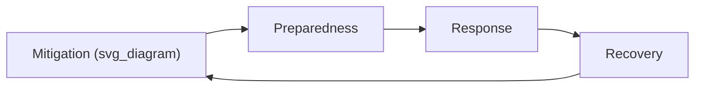
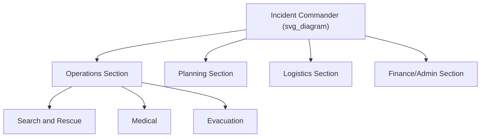

## Disaster Preparedness and Emergency Management

### Definition and Scope

Disaster preparedness and emergency management constitute the systematic process of planning, organizing, and coordinating resources and responsibilities to reduce vulnerability to hazards, respond effectively during crises, and support recovery afterward. It integrates earth science hazard knowledge (seismology, meteorology, hydrology, volcanology) with policy, engineering, logistics, and social science to reduce loss of life, injury, and property damage from natural and human-induced hazards.

**Key Points**

- Emergency management is hazard-agnostic in structure but hazard-specific in content — the same command framework applies to earthquakes, floods, or hurricanes, but mitigation actions differ.
- Preparedness sits within a larger cycle, not as an isolated activity.
- Effectiveness depends on the accuracy of underlying hazard and risk assessments (see prior chapter topics on hazard mapping and risk quantification).

### The Disaster Management Cycle

The standard conceptual model divides activities into four (sometimes five) phases, often depicted as a continuous loop rather than a linear sequence.

1. **Mitigation** — Actions that eliminate or reduce the probability or impact of a hazard (e.g., building codes, land-use zoning, levees).
2. **Preparedness** — Planning, training, and resource pre-positioning conducted before an event to enable effective response (e.g., drills, early warning systems, stockpiling supplies).
3. **Response** — Actions taken during and immediately after an event to save lives, protect property, and meet basic human needs (e.g., search and rescue, evacuation, emergency medical care).
4. **Recovery** — Short- and long-term actions to restore affected communities to normal or improved functioning (e.g., temporary housing, infrastructure rebuilding, psychosocial support).

Some frameworks (e.g., FEMA) treat mitigation and preparedness as pre-disaster phases and response/recovery as post-disaster, with the cycle continuously feeding lessons learned back into mitigation.

### Risk Assessment as the Foundation

Preparedness planning depends on prior hazard identification and risk assessment (probability × consequence), typically expressed as:

$$R = P(H) \times V \times E$$

Where $R$ is risk, $P(H)$ is the probability of the hazard occurring, $V$ is vulnerability of the exposed population/infrastructure, and $E$ is the exposed value (population, assets). This is a widely used conceptual formulation rather than a strict physical equation; the exact functional form varies by methodology (additive vs. multiplicative models exist in practice). [Inference — specific weighting/aggregation schemes vary substantially by agency and are not standardized globally.]

Risk assessment outputs (hazard maps, vulnerability indices, exposure inventories) directly inform:

- Which areas require evacuation planning
- Structural mitigation priorities (retrofitting, building codes)
- Warning system thresholds

### Core Components of Preparedness

#### 1. Hazard and Vulnerability Analysis

Identifying which hazards threaten a region (seismic zones, floodplains, storm tracks, volcanic hazard zones) and which populations/structures are most vulnerable (elderly, low-income housing, critical infrastructure, unreinforced masonry buildings).

#### 2. Early Warning Systems (EWS)

Systems designed to detect a hazard and disseminate alerts with sufficient lead time for protective action. The UNDRR/WMO "four pillars" framework describes a complete EWS:

1. Risk knowledge (systematic data collection)
2. Monitoring and warning service (detection and forecasting)
3. Dissemination and communication (getting alerts to at-risk populations)
4. Response capability (public and institutional ability to act on warnings)

**Example**

- Seismic EWS (e.g., Japan's Earthquake Early Warning, ShakeAlert in the US West Coast): detects P-waves and issues alerts seconds before damaging S-waves arrive.
- Tsunami warning systems: combine seismic detection with DART (Deep-ocean Assessment and Reporting of Tsunamis) buoy networks.
- Meteorological warnings: NEXRAD radar and satellite data feeding into tornado/hurricane warnings.
- Flood forecasting: stream gauge networks feeding hydrological models.

A warning system is only as effective as its weakest pillar — accurate detection is useless without reliable last-mile communication.

#### 3. Emergency Operations Planning

Written plans specifying roles, responsibilities, communication protocols, and resource allocation. Common standardized structure in the U.S. is the Incident Command System (ICS), part of the National Incident Management System (NIMS).

ICS provides a scalable, modular management structure applicable to incidents of any size, from a localized structure fire to a multi-state disaster, enabling interoperability between agencies (a design goal established after coordination failures in large U.S. wildfires in the 1970s).

#### 4. Public Education and Community Preparedness

Drills (earthquake "Drop, Cover, Hold On"; fire evacuation; tornado sheltering), household emergency kits, family communication plans, and community-based disaster risk reduction (CBDRR) programs that build local capacity rather than relying solely on top-down government response.

#### 5. Structural and Non-Structural Mitigation

- **Structural**: seismic retrofitting, levees, seawalls, building codes (e.g., IBC seismic provisions), fire-resistant construction.
- **Non-structural**: land-use planning, zoning restrictions in floodplains, insurance mechanisms, forest management for wildfire fuel reduction.

#### 6. Resource and Logistics Pre-positioning

Stockpiling supplies (water, medical materials, shelter equipment), pre-arranging mutual aid agreements between jurisdictions, and establishing evacuation routes and shelter locations in advance.

### Response Phase Mechanics

During an active event, priorities generally follow this order:

1. Life safety
2. Incident stabilization
3. Property/environmental conservation

Key response functions include search and rescue (SAR), emergency medical services triage (commonly using START — Simple Triage and Rapid Treatment), mass care/shelter operations, and damage assessment.

**Triage Categories (START method)**

| Category | Color | Description |
| --- | --- | --- |
| Immediate | Red | Life-threatening, needs immediate care |
| Delayed | Yellow | Serious but stable |
| Minor | Green | "Walking wounded" |
| Deceased/Expectant | Black | No respiration after airway repositioning |

### Recovery Phase

Divided into:

- **Short-term recovery**: restoring critical services (power, water, transportation), temporary sheltering.
- **Long-term recovery**: permanent reconstruction, economic revitalization, and often policy revision incorporating lessons learned — closing the loop back into mitigation.

Recovery frequently reveals **build-back-better** opportunities, where reconstruction incorporates improved hazard-resistant design rather than simply restoring pre-disaster conditions.

### Institutional Frameworks

- **International**: UNDRR's Sendai Framework for Disaster Risk Reduction (2015–2030) sets global targets emphasizing reducing mortality, affected persons, economic loss, and infrastructure damage, while increasing multi-hazard early warning coverage and national/local DRR strategies.
- **National (example, U.S.)**: FEMA operates under the Stafford Act, coordinating federal assistance to states; NIMS/ICS standardizes response structure.
- **Local**: Municipal emergency operations centers (EOCs) implement locally-tailored plans consistent with national frameworks.

### Common Analytical Tools

- **GIS-based hazard mapping**: overlaying hazard zones with population/infrastructure data to identify high-risk areas.
- **HAZUS** (FEMA's loss estimation methodology): models potential losses from earthquakes, floods, and hurricanes.
- **Evacuation modeling**: simulates clearance times given road capacity and population distribution.
- **Cost-benefit analysis of mitigation**: studies (e.g., by the National Institute of Building Sciences) have found that mitigation investment yields a favorable benefit-cost ratio, though the specific multiplier cited varies by study methodology and hazard type. [Unverified — exact ratios are frequently cited in secondary sources but depend heavily on assumptions in the underlying model.]

### Diagram: Early Warning System Chain (svg_diagram)

<svg xmlns="http://www.w3.org/2000/svg" viewBox="0 0 800 220" font-family="sans-serif">
<text x="400" y="20" text-anchor="middle" font-size="16" font-weight="bold">Early Warning System Chain (svg_diagram)</text>
<rect x="20" y="60" width="150" height="60" rx="8" fill="none" stroke="black" />
<text x="95" y="85" text-anchor="middle" font-size="12">Hazard Detection</text>
<text x="95" y="102" text-anchor="middle" font-size="10">(sensors, gauges,</text>
<text x="95" y="114" text-anchor="middle" font-size="10">seismographs)</text>
<rect x="220" y="60" width="150" height="60" rx="8" fill="none" stroke="black" />
<text x="295" y="85" text-anchor="middle" font-size="12">Analysis &amp;</text>
<text x="295" y="100" text-anchor="middle" font-size="12">Forecasting</text>
<rect x="420" y="60" width="150" height="60" rx="8" fill="none" stroke="black" />
<text x="495" y="85" text-anchor="middle" font-size="12">Alert</text>
<text x="495" y="100" text-anchor="middle" font-size="12">Dissemination</text>
<rect x="620" y="60" width="150" height="60" rx="8" fill="none" stroke="black" />
<text x="695" y="85" text-anchor="middle" font-size="12">Public/Institutional</text>
<text x="695" y="100" text-anchor="middle" font-size="12">Response Action</text>
<line x1="170" y1="90" x2="220" y2="90" stroke="black" marker-end="url(#arrow)" />
<line x1="370" y1="90" x2="420" y2="90" stroke="black" marker-end="url(#arrow)" />
<line x1="570" y1="90" x2="620" y2="90" stroke="black" marker-end="url(#arrow)" />

<text x="400" y="160" text-anchor="middle" font-size="11" font-style="italic">Failure at any single link reduces overall system lead time and effectiveness</text>

</svg>

### Challenges and Limitations

- **Warning fatigue**: repeated false alarms or overly broad warnings can reduce public compliance over time. [Inference — well-documented in social science literature, though magnitude varies by population and hazard type.]
- **Equity gaps**: preparedness resources and evacuation capacity are often unevenly distributed, disproportionately affecting low-income and marginalized communities.
- **Compound and cascading hazards**: single events triggering secondary hazards (earthquake → tsunami → nuclear incident, as in the 2011 Tōhoku event) strain planning frameworks built around single-hazard scenarios.
- **Climate change amplification**: shifting baseline frequencies/intensities of hydrometeorological hazards complicate historical-data-based risk models. [Inference — directionally well-supported by climate science, though quantitative preparedness-planning implications are still an active area of methodological development.]

### Related Topics

- Hazard Mapping and GIS in Risk Assessment
- Seismic Risk and Earthquake Engineering
- Flood Risk Modeling and Floodplain Management
- Tsunami Warning Systems and DART Buoy Networks
- Volcanic Hazard Monitoring
- Climate Change and Extreme Weather Risk
- Community-Based Disaster Risk Reduction (CBDRR)
- Cost-Benefit Analysis of Mitigation Investments
- Incident Command System (ICS) and NIMS in Depth
- Sendai Framework for Disaster Risk Reduction