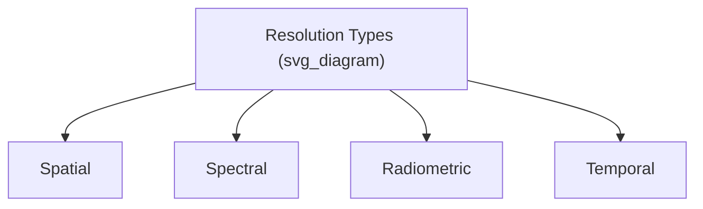

## Principles of Remote Sensing

### Definition and Scope

Remote sensing is the science of acquiring information about an object, area, or phenomenon without physical contact, typically by detecting and measuring electromagnetic radiation (EMR) that is reflected, emitted, or scattered by the target. In Earth science, this underpins satellite and airborne observation of land, ocean, atmosphere, and cryosphere.

**Key Points**

- Remote sensing systems require an energy source, a path through a medium, interaction with a target, a sensor, and a means of processing/interpreting the data.
- Systems are broadly classified as **passive** (relying on external energy, usually solar radiation) or **active** (emitting their own energy, e.g., radar, lidar).
- All remote sensing rests on the physics of the electromagnetic spectrum and how different materials interact with different wavelengths.

### The Remote Sensing Process

This seven-element chain (adapted from Canada Centre for Remote Sensing / NASA educational frameworks) is a standard pedagogical model describing energy source, propagation, target interaction, sensor detection, data transmission/processing, interpretation, and end-use application.

### Electromagnetic Spectrum Fundamentals

Electromagnetic radiation is characterized by wavelength ($\lambda$) and frequency ($\nu$), related by:

$$c = \lambda \nu$$

where $c$ is the speed of light ($3 \times 10^8$ m/s). Energy of a photon is given by the Planck relation:

$$E = h\nu = \frac{hc}{\lambda}$$

where $h$ is Planck's constant. This inverse relationship between wavelength and energy explains why shorter-wavelength radiation (e.g., gamma, X-ray) carries more energy per photon than longer-wavelength radiation (e.g., microwave, radio).

**Spectral Regions Used in Earth Observation**

| Region | Approx. Wavelength | Common Use |
| --- | --- | --- |
| Visible | 0.4–0.7 µm | Land cover, true-color imagery |
| Near-Infrared (NIR) | 0.7–1.3 µm | Vegetation health, biomass |
| Shortwave Infrared (SWIR) | 1.3–3 µm | Mineral mapping, moisture content |
| Thermal Infrared (TIR) | 3–14 µm | Surface temperature, heat mapping |
| Microwave (Radar) | 1 mm–1 m | All-weather imaging, soil moisture, ice |

### Passive vs. Active Sensing

**Passive Remote Sensing**

Detects naturally occurring energy — typically reflected sunlight or emitted thermal radiation. Requires illumination (daytime for reflected solar bands) and is affected by atmospheric conditions (cloud cover, aerosols).

Examples: Landsat (multispectral), MODIS, Sentinel-2.

**Active Remote Sensing**

The sensor emits its own energy pulse and measures the returned signal, enabling day/night and often all-weather operation.

Examples:

- **Radar (SAR — Synthetic Aperture Radar)**: microwave pulses; measures backscatter; penetrates cloud cover; used for surface deformation (InSAR), flood mapping, sea ice monitoring.
- **Lidar**: laser pulses; measures time-of-flight to compute distance/elevation; used for high-resolution topography (e.g., digital elevation models), canopy height, bathymetry.

$$d = \frac{c \cdot t}{2}$$

where $d$ is distance to target, $c$ is the speed of light, and $t$ is the two-way travel time of the pulse.

### Interaction of EMR with Earth Surface Materials

When radiation strikes a surface, it can be reflected, absorbed, or transmitted, governed by conservation of incident energy:

$$E_I(\lambda) = E_R(\lambda) + E_A(\lambda) + E_T(\lambda)$$

where $E_I$, $E_R$, $E_A$, $E_T$ represent incident, reflected, absorbed, and transmitted energy respectively, all as functions of wavelength.

Different materials exhibit characteristic **spectral signatures** — reflectance patterns across wavelengths that allow identification.

**Example**

- Healthy vegetation: low reflectance in visible red (chlorophyll absorption), high reflectance in NIR (leaf cell structure scattering) — the basis of vegetation indices like NDVI:

$$NDVI = \frac{NIR - Red}{NIR + Red}$$

- Water: high absorption across NIR/SWIR, generally low overall reflectance, making water bodies appear dark in NIR imagery.
- Dry soil vs. moist soil: moisture content lowers overall reflectance and shifts absorption features in SWIR.

### Atmospheric Effects and Windows

The atmosphere selectively absorbs and scatters EMR. **Atmospheric windows** are wavelength ranges where radiation passes through with minimal attenuation, and sensors are typically designed to operate within these windows.

- Scattering types:
  - **Rayleigh scattering**: dominant for particles much smaller than wavelength (gas molecules); inversely proportional to $\lambda^4$; responsible for blue sky appearance and haze in short-wavelength imagery.
  - **Mie scattering**: particles comparable in size to wavelength (aerosols, smoke, dust); affects visible/NIR.
  - **Non-selective scattering**: particles much larger than wavelength (water droplets); causes clouds/fog to appear white.

### Resolution Concepts

Four types of resolution characterize a remote sensing system, and they generally trade off against each other in practice given fixed sensor budget/bandwidth constraints:

1. **Spatial resolution** — smallest distinguishable ground feature (pixel size), e.g., Landsat 30 m, Sentinel-2 10 m, commercial systems <1 m.
2. **Spectral resolution** — number and width of spectral bands; hyperspectral sensors (e.g., Hyperion, EnMAP) capture hundreds of narrow contiguous bands vs. multispectral sensors' broader, fewer bands.
3. **Radiometric resolution** — sensitivity to differences in signal intensity, expressed in bits (e.g., 8-bit = 256 levels, 12-bit = 4096 levels).
4. **Temporal resolution** — revisit frequency of a sensor over the same location (e.g., Landsat ~16 days, MODIS ~1–2 days, geostationary weather satellites ~continuous).

### Platforms

- **Ground-based**: field spectroradiometers, weather stations.
- **Airborne**: aircraft-mounted cameras, lidar, hyperspectral scanners — high spatial detail, limited coverage per flight.
- **Spaceborne**:
  - **Polar-orbiting/sun-synchronous satellites** (e.g., Landsat, Sentinel): consistent lighting conditions, global coverage over repeat cycles.
  - **Geostationary satellites** (e.g., GOES, Himawari): fixed position relative to Earth at ~35,786 km altitude, providing continuous monitoring of a fixed hemisphere — used heavily in meteorology.

### Image Interpretation Elements

Manual/visual interpretation relies on recognized elements:

- Tone/color
- Texture
- Shape
- Size
- Pattern
- Shadow
- Association (contextual relationship to surroundings)

Digital image analysis extends this through **image classification** (supervised and unsupervised), where pixel spectral values are statistically grouped into land cover classes using algorithms such as maximum likelihood, random forest, or (increasingly) deep learning-based classifiers.

### Common Applications in Earth Science

- Land cover/land use mapping and change detection
- Vegetation health monitoring (NDVI, EVI time series)
- Natural hazard assessment (flood extent mapping, burn severity, landslide detection)
- Cryosphere monitoring (ice sheet extent, glacier retreat via repeat imagery)
- Bathymetry and coastal change
- Atmospheric composition monitoring (aerosols, greenhouse gases via sensors like OCO-2, Sentinel-5P)
- Surface deformation via InSAR (e.g., volcanic inflation, land subsidence, earthquake displacement fields)

### Diagram: Passive vs. Active Sensing Geometry (svg_diagram)

<svg xmlns="http://www.w3.org/2000/svg" viewBox="0 0 800 260" font-family="sans-serif">
<text x="400" y="20" text-anchor="middle" font-size="16" font-weight="bold">Passive vs. Active Sensing (svg_diagram)</text>

<text x="150" y="50" text-anchor="middle" font-size="13" font-weight="bold">Passive</text>

<circle cx="80" cy="80" r="18" fill="yellow" stroke="black" />

<text x="80" y="85" text-anchor="middle" font-size="10">Sun</text>

<line x1="95" y1="95" x2="150" y2="150" stroke="black" marker-end="url(#a1)" />

<rect x="130" y="180" width="80" height="20" fill="none" stroke="black" />

<text x="170" y="194" text-anchor="middle" font-size="9">Surface</text>

<line x1="160" y1="180" x2="220" y2="90" stroke="black" stroke-dasharray="4" marker-end="url(#a1)" />

<rect x="200" y="60" width="40" height="25" fill="none" stroke="black" />

<text x="220" y="76" text-anchor="middle" font-size="8">Sensor</text>

<text x="600" y="50" text-anchor="middle" font-size="13" font-weight="bold">Active</text>

<rect x="560" y="60" width="60" height="25" fill="none" stroke="black" />

<text x="590" y="76" text-anchor="middle" font-size="8">Sensor (SAR/Lidar)</text>

<line x1="590" y1="85" x2="590" y2="150" stroke="black" marker-end="url(#a1)" />

<line x1="600" y1="150" x2="610" y2="85" stroke="black" stroke-dasharray="4" marker-end="url(#a1)" />

<rect x="550" y="180" width="80" height="20" fill="none" stroke="black" />

<text x="590" y="194" text-anchor="middle" font-size="9">Surface</text>

<text x="400" y="240" text-anchor="middle" font-size="11" font-style="italic">Passive depends on external illumination; active supplies its own energy pulse</text>

</svg>

### Limitations and Considerations

- **Cloud cover** severely limits optical/passive sensors; radar is largely unaffected. [Well-established, standard sensor characteristic.]
- **Atmospheric correction** is required to convert at-sensor radiance to surface reflectance for quantitative analysis; correction accuracy depends on aerosol/water vapor modeling assumptions. [Inference — correction quality varies by algorithm and atmospheric conditions at time of acquisition.]
- **Mixed pixels**: a single pixel may contain multiple land cover types, complicating classification at coarser spatial resolutions.
- **Orbit and revisit trade-offs**: higher spatial resolution sensors typically have narrower swath widths and thus longer revisit times, though this is a general engineering tendency rather than a strict physical law. [Inference]

### Related Topics

- Satellite Platforms and Sensor Systems (Landsat, Sentinel, MODIS)
- Synthetic Aperture Radar (SAR) and InSAR Techniques
- Lidar and Digital Elevation Model Generation
- Image Classification and Machine Learning in Remote Sensing
- Vegetation Indices and Time-Series Analysis
- GIS Integration with Remote Sensing Data
- Atmospheric Correction Methods
- Hyperspectral Remote Sensing