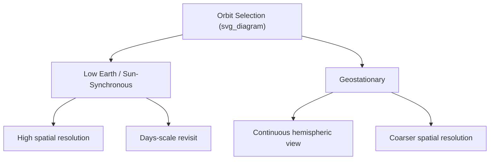
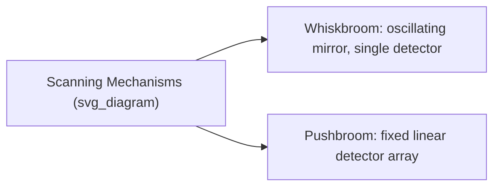

## Satellite Platforms and Sensors

### Definition and Scope

Satellite platforms and sensors comprise the hardware systems that carry Earth-observing instruments into orbit and the instruments themselves that detect and record electromagnetic radiation. Platform design (orbit type, altitude, attitude control) and sensor design (spectral bands, resolution, scanning mechanism) jointly determine what phenomena a mission can observe and at what scale.

**Key Points**

- Orbit selection is driven by the trade-off between coverage area, revisit frequency, and spatial resolution.
- Sensors are classified by scanning mechanism (whiskbroom vs. pushbroom), spectral capability (multispectral, hyperspectral, panchromatic), and energy type (passive optical, thermal, active radar/lidar).
- Mission design must balance data volume, downlink bandwidth, and onboard power/storage constraints.

### Orbit Types

#### Low Earth Orbit (LEO)

Altitude roughly 160–2,000 km. Most Earth observation satellites use LEO for higher spatial resolution due to proximity to the surface.

#### Sun-Synchronous Orbit (SSO)

A near-polar LEO orbit (typically 700–800 km altitude, inclination ~98°) precessing at the same rate the Earth orbits the Sun, so the satellite crosses the equator at approximately the same local solar time on every pass. This ensures consistent illumination conditions for comparable imagery across dates — critical for change detection and time-series analysis.

$$T = 2\pi \sqrt{\frac{a^3}{GM}}$$

where $T$ is orbital period, $a$ is semi-major axis, $G$ is the gravitational constant, and $M$ is Earth's mass. This is the standard Keplerian orbital period formula governing satellite revisit geometry.

#### Geostationary Orbit (GEO)

Altitude ~35,786 km directly above the equator, with an orbital period matching Earth's rotation (~24 hours), making the satellite appear stationary relative to a fixed point on Earth. Used for continuous monitoring of a fixed hemisphere — dominant for weather satellites (GOES, Himawari, Meteosat).

#### Comparison Table

| Orbit Type | Altitude | Coverage | Revisit | Typical Use |
| --- | --- | --- | --- | --- |
| LEO/Sun-synchronous | 700–800 km | Global (strips) | Days | Landsat, Sentinel-2, MODIS |
| Geostationary | ~35,786 km | Fixed hemisphere | Minutes (continuous) | GOES, Himawari, Meteosat |
| Highly Elliptical | Varies | High-latitude focus | Varies | Molniya-type, some polar comms |

### Major Earth Observation Missions

#### Landsat Program (USGS/NASA)

Longest continuous Earth observation record (since 1972). Landsat 8/9 carry the Operational Land Imager (OLI) and Thermal Infrared Sensor (TIRS): 30 m multispectral resolution, 15 m panchromatic, 16-day revisit per satellite (8-day combined).

#### Sentinel Program (ESA Copernicus)

- **Sentinel-1**: C-band Synthetic Aperture Radar (SAR), all-weather day/night imaging, used for flood mapping, ship detection, ice monitoring, and InSAR-based deformation studies.
- **Sentinel-2**: multispectral optical imager, 13 bands, 10/20/60 m resolution, 5-day revisit (twin-satellite constellation), widely used for agriculture and land cover.
- **Sentinel-3**: ocean and land color, sea/land surface temperature.
- **Sentinel-5P**: atmospheric composition monitoring (NO₂, SO₂, CH₄, aerosols).

#### MODIS (Terra and Aqua, NASA)

36 spectral bands, resolutions of 250 m, 500 m, and 1 km depending on band; near-daily global coverage. Widely used for large-scale vegetation, fire, ocean color, and atmospheric monitoring despite coarser spatial resolution than Landsat/Sentinel.

#### Commercial High-Resolution Systems

Operators such as Maxar (WorldView series) and Planet Labs provide sub-meter to few-meter resolution imagery with high revisit frequency via large satellite constellations, primarily serving defense, urban planning, and disaster response markets.

#### Weather and Atmospheric Satellites

- **GOES-R series** (NOAA): geostationary, Advanced Baseline Imager (ABI) with 16 spectral bands, sub-15-minute full-disk scans, used for real-time storm tracking.
- **Himawari-8/9** (JMA, Japan): geostationary coverage of Asia-Pacific with comparable imaging capability to GOES-R.

### Sensor Scanning Mechanisms

#### Whiskbroom Scanners

Use a single detector (or small array) with an oscillating mirror sweeping perpendicular to flight direction, building an image line by line. Historically used in early Landsat sensors (MSS, TM).

#### Pushbroom Scanners

Use a linear array of detectors spanning the across-track swath, with along-track motion of the satellite providing the second imaging dimension. No moving mirror needed, generally offering better radiometric performance and reduced mechanical complexity. Used in most modern sensors (SPOT, Sentinel-2 MSI, Landsat OLI).

### Active Microwave and Lidar Sensors

- **SAR (Synthetic Aperture Radar)**: synthesizes a large effective antenna aperture by combining signals received as the satellite moves along its orbit, achieving fine spatial resolution despite a physically small antenna. Operates in bands such as X, C, and L, each offering different penetration depth and sensitivity to surface roughness/moisture.
- **Spaceborne Lidar**: e.g., ICESat-2 (photon-counting lidar for ice sheet/vegetation height), GEDI (Global Ecosystem Dynamics Investigation, mounted on the ISS, measuring forest canopy structure).

### Sensor Design Trade-offs

Sensor and platform design involves several coupled trade-offs, generally following standard remote sensing engineering practice, though the specific balance depends on mission objectives:

- **Swath width vs. spatial resolution**: wider swaths generally require coarser resolution given fixed detector array size and optics.
- **Spectral bands vs. signal-to-noise ratio**: narrower spectral bands (as in hyperspectral sensors) receive less energy per band, requiring longer integration time or larger aperture optics.
- **Revisit frequency vs. resolution**: achieving both fine resolution and frequent revisit typically requires satellite constellations (multiple satellites in coordinated orbits) rather than a single platform. [Inference — a general design tendency rather than an absolute constraint, since constellation approaches like Planet Labs' "Doves" demonstrate one path around single-satellite limits.]

### Data Downlink and Ground Segment

Satellites transmit collected data to ground stations via direct downlink (when in view of a receiving station) or relay through geostationary data relay satellites (e.g., NASA's TDRSS) for near-continuous data return. Onboard data storage buffers observations between downlink opportunities, and onboard compression is commonly applied to manage bandwidth constraints.

### Diagram: Sun-Synchronous Orbit Geometry (svg_diagram)

<svg xmlns="http://www.w3.org/2000/svg" viewBox="0 0 800 300" font-family="sans-serif">
<text x="400" y="20" text-anchor="middle" font-size="16" font-weight="bold">Sun-Synchronous Orbit (svg_diagram)</text>
<circle cx="400" cy="170" r="90" fill="none" stroke="black" />
<text x="400" y="175" text-anchor="middle" font-size="10">Earth</text>
<ellipse cx="400" cy="170" rx="180" ry="90" fill="none" stroke="black" stroke-dasharray="4" />
<circle cx="220" cy="170" r="5" fill="black" />
<text x="220" y="155" text-anchor="middle" font-size="9">Satellite (polar path)</text>
<line x1="0" y1="170" x2="800" y2="170" stroke="orange" stroke-dasharray="2" />
<text x="750" y="185" font-size="10">Sunlight direction</text>
<text x="400" y="280" text-anchor="middle" font-size="11" font-style="italic">Near-polar orbit maintains consistent local solar time at equator crossing</text>
</svg>

### Applications by Platform Type

| Platform Category | Representative Use |
| --- | --- |
| Sun-synchronous optical | Land cover, agriculture, vegetation monitoring |
| Sun-synchronous SAR | Flood mapping, deformation (InSAR), sea ice |
| Geostationary optical/IR | Storm tracking, severe weather warning |
| Lidar (spaceborne) | Ice sheet elevation, forest canopy structure |
| Commercial high-res | Urban mapping, disaster damage assessment, defense |

### Limitations and Considerations

- Cloud cover blocks optical sensors regardless of platform; SAR sensors are largely unaffected but interpretation requires different expertise (speckle noise, geometric distortions like layover and foreshortening).
- Sensor degradation and calibration drift over a mission's lifetime require periodic on-orbit calibration (e.g., using known ground targets or onboard calibration lamps) to maintain data quality. [Well-established operational practice across major missions.]
- Orbital debris and end-of-life deorbiting are increasing operational and regulatory considerations for satellite operators. [Inference — an evolving area shaped by growing satellite constellation deployment.]

### Related Topics

- Principles of Remote Sensing (spectral signatures, EMR interaction)
- Synthetic Aperture Radar (SAR) and InSAR Techniques
- Image Classification and Machine Learning in Remote Sensing
- GIS Data Integration and Spatial Analysis
- Satellite-Based Vegetation and Agricultural Monitoring
- Atmospheric and Weather Satellite Applications
- Spaceborne Lidar and Canopy Structure Mapping