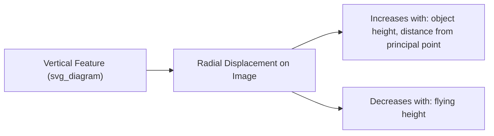
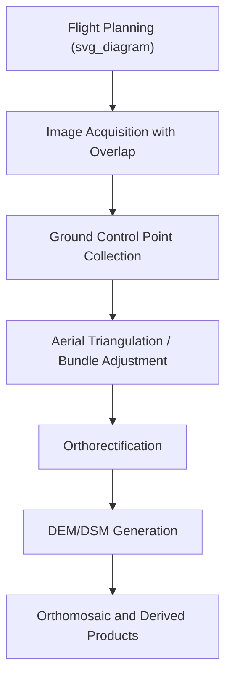

## Aerial Photography and Photogrammetry

### Definition and Scope

Aerial photography is the acquisition of images of the Earth's surface from an airborne platform (aircraft, balloon, kite, or drone), while photogrammetry is the science of making precise measurements — distances, elevations, areas, volumes — from those photographs. Together they form one of the oldest branches of remote sensing, predating satellite systems by decades and remaining central to large-scale mapping, surveying, and terrain modeling.

**Key Points**

- Aerial photography historically used analog film cameras; modern systems are almost entirely digital, including UAV (drone)-mounted sensors.
- Photogrammetry relies on the geometric principle of parallax — the apparent displacement of an object viewed from two different positions — to extract three-dimensional information from two-dimensional images.
- The field splits into metric photogrammetry (precise measurement) and interpretive photogrammetry (feature identification and classification).

### Camera Systems and Image Geometry

#### Frame Cameras

Capture an entire scene in a single instantaneous exposure, with a well-defined **principal point** (intersection of the optical axis with the image plane) and known **focal length** ($f$), forming the basis of the collinearity equations used in photogrammetric processing.

#### Vertical vs. Oblique Photography

- **Vertical photographs**: camera axis pointed as close to straight down (nadir) as practically achievable, minimizing geometric distortion — standard for mapping.
- **Oblique photographs**: camera angled away from nadir, showing the horizon; useful for reconnaissance and visualization but requiring more complex geometric correction for measurement purposes.

#### Scale of an Aerial Photograph

For a vertical photograph over flat terrain, photographic scale is expressed as:

$$S = \frac{f}{H}$$

where $S$ is scale, $f$ is camera focal length, and $H$ is flying height above the terrain. This relationship means scale varies with terrain relief — features at higher elevation appear at a slightly larger scale than features at lower elevation within the same photograph, a phenomenon central to **relief displacement**.

### Relief Displacement

Vertical features (buildings, trees, terrain relief) appear radially displaced from the principal point in a vertical photograph, proportional to their height and distance from the photo center:

$$d = \frac{h \cdot r}{H}$$

where $d$ is the displacement, $h$ is the object's height, $r$ is the radial distance from the principal point to the top of the object, and $H$ is flying height. This effect is the basis for extracting building/tree heights from single images and is also the source of geometric distortion that orthorectification is designed to remove.

### Stereoscopy and Parallax

Overlapping photographs taken from two different exposure stations (typically with ~60% forward overlap along a flight line and ~30% side overlap between adjacent flight lines) allow stereoscopic viewing — the same principle underlying human binocular vision.

**Parallax** is the apparent shift in position of an object between two overlapping images due to the change in viewpoint. The parallax equation relates this shift to elevation:

$$h = H - \frac{f \cdot B}{p}$$

where $h$ is elevation of a point, $H$ is flying height, $f$ is focal length, $B$ is the air base (distance between exposure stations), and $p$ is the absolute stereoscopic parallax of the point. [Note: exact formulations vary slightly depending on whether elevation is measured relative to the datum or to flying height; this is the standard textbook form.]

Stereoscopic pairs, viewed through a stereoscope or processed digitally, allow analysts to perceive and measure terrain in three dimensions — the foundation of topographic mapping before digital elevation models became widespread.

### Photogrammetric Workflow

1. **Flight Planning**: determining flight lines, altitude, and overlap percentages to ensure complete stereo coverage at the desired resolution.
2. **Image Acquisition**: capturing overlapping photographs, often supplemented by onboard GPS/IMU (Inertial Measurement Unit) data recording camera position and orientation at each exposure.
3. **Ground Control Points (GCPs)**: surveyed points of known coordinates visible in the imagery, used to anchor the photogrammetric model to a real-world coordinate system.
4. **Aerial Triangulation (Bundle Adjustment)**: a least-squares optimization process that simultaneously solves for the exterior orientation (position and attitude) of every camera exposure and the 3D coordinates of tie points, minimizing reprojection error across the entire image block.
5. **Orthorectification**: removing geometric distortions (relief displacement, camera tilt, lens distortion) to produce an **orthophoto** with uniform, map-accurate scale throughout.
6. **DEM/DSM Generation**: Digital Elevation Models (bare-earth terrain) and Digital Surface Models (terrain plus vegetation/structures) are derived through dense image matching across stereo pairs.
7. **Orthomosaic**: individual orthophotos are seamlessly blended into a single continuous, geometrically accurate image covering the full survey area.

### Structure from Motion (SfM) — Modern Digital Photogrammetry

Contemporary UAV-based photogrammetry relies heavily on **Structure from Motion**, a computer vision technique that reconstructs 3D scene geometry and camera positions simultaneously from a large set of overlapping 2D images, without requiring precisely known camera positions in advance (though GCPs still improve absolute accuracy).

Key algorithmic components:

- **Feature detection and matching** (e.g., SIFT — Scale-Invariant Feature Transform) identifies common points across overlapping images.
- **Bundle adjustment** refines camera poses and 3D point positions jointly.
- **Dense multi-view stereo (MVS)** matching generates a dense point cloud from the sparse SfM point cloud.
- **Meshing and texturing** produce a 3D model or orthomosaic/DEM output.

SfM-based workflows (implemented in software such as Pix4D, Agisoft Metashape, and OpenDroneMap) have substantially lowered the cost and technical barrier to photogrammetric mapping compared to traditional analog/analytical photogrammetry, enabling widespread use of consumer and prosumer drones for surveying. [Inference — this is a well-documented industry trend, though relative accuracy compared to traditional aerial triangulation depends on GCP density, camera calibration, and flight design.]

### UAV (Drone) Photogrammetry Considerations

- **Flight altitude and ground sample distance (GSD)**: lower altitude yields finer spatial resolution but reduced area coverage per flight.
- **RTK/PPK positioning**: Real-Time Kinematic or Post-Processed Kinematic GNSS systems on modern drones can achieve centimeter-level position accuracy for each image, reducing dependence on dense GCP networks.
- **Regulatory constraints**: UAV operations are generally subject to national aviation authority regulations (e.g., FAA Part 107 in the United States) governing altitude limits, visual line-of-sight requirements, and airspace restrictions. [Regulatory specifics vary by country and change over time; treat as jurisdiction-dependent.]

### Applications in Earth Science

- Topographic mapping and contour generation
- Coastal erosion and shoreline change monitoring
- Landslide and slope stability assessment via repeat DEM differencing
- Volcanic terrain monitoring (crater morphology change, lava flow volume estimation)
- Glacier surface elevation change (via repeat photogrammetric surveys)
- Precision agriculture (crop height, canopy structure from UAV surveys)
- Forestry inventory (canopy height models from photogrammetric point clouds)
- Archaeological site documentation and change detection

### Diagram: Stereo Overlap Geometry (svg_diagram)

<svg xmlns="http://www.w3.org/2000/svg" viewBox="0 0 800 260" font-family="sans-serif">
<text x="400" y="20" text-anchor="middle" font-size="16" font-weight="bold">Stereo Overlap Geometry (svg_diagram)</text>
<circle cx="250" cy="60" r="5" fill="black" />
<text x="250" y="45" text-anchor="middle" font-size="9">Exposure 1</text>
<circle cx="450" cy="60" r="5" fill="black" />
<text x="450" y="45" text-anchor="middle" font-size="9">Exposure 2</text>
<line x1="250" y1="60" x2="450" y2="60" stroke="black" stroke-dasharray="3" />
<text x="350" y="50" text-anchor="middle" font-size="9">Air Base (B)</text>
<rect x="150" y="180" width="500" height="20" fill="none" stroke="black" />
<text x="400" y="215" text-anchor="middle" font-size="10">Ground Surface</text>
<polygon points="250,60 150,180 550,180" fill="lightgray" fill-opacity="0.3" stroke="black" />
<polygon points="450,60 250,180 650,180" fill="lightgray" fill-opacity="0.3" stroke="black" />

<text x="400" y="150" text-anchor="middle" font-size="10" font-style="italic">Overlap Zone (Stereo Coverage)</text>

</svg>

### Limitations and Considerations

- **Weather dependency**: cloud cover, haze, and poor lighting conditions degrade image quality and are a fundamental constraint on optical aerial photography acquisition.
- **Terrain occlusion**: steep terrain or dense vegetation can create shadow zones not visible from any camera position, leaving gaps in derived DSMs.
- **Accuracy dependence on GCP distribution**: absolute positional accuracy of photogrammetric products is strongly influenced by the number, distribution, and survey accuracy of ground control points. [Inference — well-supported by photogrammetric literature, though the specific accuracy achieved varies by project design and equipment.]
- **Processing intensity**: dense point cloud generation and bundle adjustment for large image blocks are computationally demanding, though this has become progressively less limiting as consumer hardware and cloud-processing options have improved. [Inference]

### Related Topics

- Principles of Remote Sensing
- Digital Elevation Models and Terrain Analysis
- Structure from Motion and Computer Vision Techniques
- UAV/Drone Applications in Earth Science
- LiDAR vs. Photogrammetry Comparison
- GIS Integration of Orthomosaic and DEM Products
- Coastal and Geomorphological Change Detection