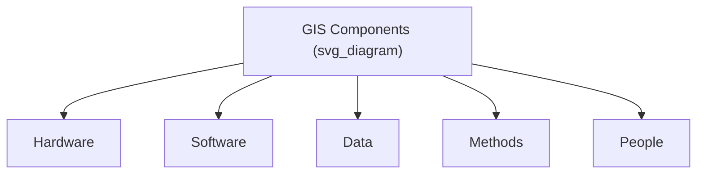
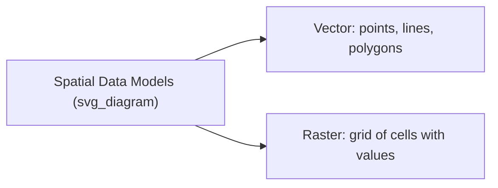
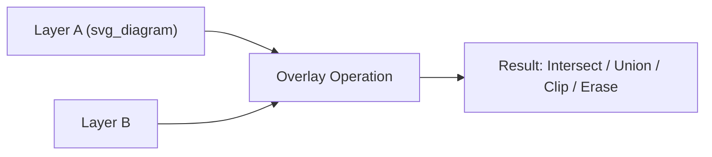

## Geographic Information Systems

### Definition and Scope

A Geographic Information System (GIS) is a computer-based system for capturing, storing, managing, analyzing, and visualizing spatially referenced data — information tied to specific locations on Earth. GIS integrates hardware, software, data, methods, and personnel to answer questions involving "where" alongside "what," enabling spatial analysis that purely tabular databases cannot support.

**Key Points**

- GIS distinguishes itself from simple digital mapping by supporting spatial *analysis* — querying, overlaying, and modeling relationships between features based on their locations.
- Spatial data is represented using one of two fundamental data models: **vector** or **raster**.
- Every spatial dataset requires a defined **coordinate reference system (CRS)** to be meaningfully combined with other data.

### Core Components of a GIS

- **Hardware**: computers, servers, GPS receivers, scanners/digitizers.
- **Software**: platforms such as ArcGIS, QGIS (open-source), GRASS GIS, and increasingly cloud/web-based systems (Google Earth Engine, ArcGIS Online).
- **Data**: spatial (geometric) and attribute (descriptive) data, plus metadata describing accuracy, source, and currency.
- **Methods**: analytical workflows and models applied to answer specific spatial questions.
- **People**: analysts, cartographers, and domain experts who design and interpret GIS workflows.

### Vector vs. Raster Data Models

#### Vector Data Model

Represents features as discrete geometric objects:

- **Points**: zero-dimensional (e.g., a seismic station, a city location).
- **Lines**: one-dimensional (e.g., rivers, roads, fault traces).
- **Polygons**: two-dimensional enclosed areas (e.g., watersheds, floodplain boundaries, administrative units).

Each feature carries an **attribute table** — a relational database of descriptive information linked to the geometry by a unique identifier.

#### Raster Data Model

Represents space as a continuous grid of cells (pixels), each holding a value representing a measured or classified quantity (elevation, temperature, land cover class, reflectance). Well-suited to continuous phenomena and remote sensing imagery.

| Aspect | Vector | Raster |
| --- | --- | --- |
| Best for | Discrete features (roads, parcels, boundaries) | Continuous surfaces (elevation, temperature, imagery) |
| Storage efficiency | Efficient for sparse/discrete features | Can be storage-intensive at fine resolution |
| Topological relationships | Explicit (adjacency, connectivity) | Implicit (via cell location) |
| Common formats | Shapefile, GeoJSON, GeoPackage | GeoTIFF, ASCII grid, NetCDF |

### Coordinate Reference Systems (CRS)

A CRS defines how two-dimensional (or three-dimensional) coordinates relate to actual locations on Earth's surface. Two broad categories exist:

- **Geographic Coordinate Systems (GCS)**: use angular units (latitude/longitude) referenced to a specified **datum** — a mathematical model of Earth's shape (e.g., WGS84, NAD83).
- **Projected Coordinate Systems (PCS)**: apply a mathematical transformation (map projection) to convert the curved Earth's surface to a flat plane, using linear units (meters, feet). Examples include UTM (Universal Transverse Mercator) and various national/regional projections (e.g., State Plane Coordinate System in the U.S.).

All map projections introduce some distortion, since it is mathematically impossible to flatten a sphere without distorting at least one of area, shape, distance, or direction. Projections are classified by which property they preserve:

- **Conformal** projections preserve local shape/angles (e.g., Mercator).
- **Equal-area** projections preserve area (e.g., Albers Equal Area).
- **Equidistant** projections preserve distance from certain points/lines.

**Key Points**

- Mismatched or undefined CRS between datasets is one of the most common sources of spatial analysis errors — features may appear correctly within a single layer but misalign entirely when overlaid with another dataset in a different CRS.
- GIS software typically performs **on-the-fly reprojection** for display, but analytical operations generally require datasets to share a common CRS for accurate results.

### Spatial Data Structures and Topology

**Topology** refers to the explicit representation of spatial relationships between features — adjacency, connectivity, and containment — independent of their exact coordinates. Topological data structures enable operations such as:

- Ensuring polygon boundaries between adjacent parcels share exact edges (no gaps or overlaps)
- Validating that a river network is properly connected for hydrological flow modeling
- Detecting dangling nodes or unclosed polygons as data quality checks

### Core GIS Analytical Operations

#### Spatial Overlay

Combining two or more layers to create a new dataset based on their spatial relationship. Common overlay operations include:

- **Intersect**: retains only the overlapping area of input layers.
- **Union**: combines all features and areas from both layers.
- **Clip**: extracts features from one layer that fall within the boundary of another.
- **Erase**: removes areas of one layer that overlap with another.

#### Buffering

Creates a zone of a specified distance around a point, line, or polygon feature — commonly used for proximity analysis (e.g., identifying all structures within a flood hazard buffer of a river, or all population within an evacuation radius of a volcanic vent).

#### Spatial Query and Selection

Selecting features based on spatial relationships (e.g., "select all wells within 500 m of a fault line") as opposed to purely attribute-based (tabular) queries.

#### Network Analysis

Modeling movement or flow along connected linear features (e.g., optimal evacuation routing along a road network, watershed flow accumulation along a stream network).

#### Interpolation

Estimating values at unsampled locations based on known point measurements, used to generate continuous surfaces from discrete samples (e.g., a rainfall surface from weather station points). Common methods:

- **Inverse Distance Weighting (IDW)**: weights nearby points more heavily, with weight decreasing as a function of distance.
- **Kriging**: a geostatistical method that models spatial autocorrelation explicitly, producing both an interpolated surface and an estimate of prediction uncertainty.

$$\hat{Z}(x_0) = \sum_{i=1}^{n} \lambda_i Z(x_i)$$

where $\hat{Z}(x_0)$ is the estimated value at an unsampled location, $Z(x_i)$ are known values at sample points, and $\lambda_i$ are weights determined by the interpolation method (distance-based for IDW, based on a fitted semivariogram for kriging).

#### Terrain Analysis

Derivative products calculated from a Digital Elevation Model (DEM), including:

- **Slope**: rate of elevation change.
- **Aspect**: compass direction a slope faces.
- **Hillshade**: simulated illumination for visualization.
- **Watershed delineation**: identifying drainage basins based on flow direction/accumulation algorithms.
- **Viewshed analysis**: determining areas visible from a given observation point.

### Raster Analysis: Map Algebra

Raster-based GIS analysis frequently uses **map algebra**, applying mathematical operations across corresponding cells of one or more raster layers to produce a new raster.

$$Z_{out}(i,j) = f\big(Z_1(i,j), Z_2(i,j), ..., Z_n(i,j)\big)$$

where $Z_{out}(i,j)$ is the output cell value at row $i$, column $j$, and $f$ is a defined function combining input raster values at that same location (e.g., a weighted overlay for multi-criteria suitability analysis, or calculating NDVI from red and NIR bands as covered in remote sensing).

### Database Management in GIS

Modern GIS relies on relational or object-relational spatial databases (e.g., PostGIS extension for PostgreSQL, Esri Geodatabase) that store geometry alongside attributes and support Structured Query Language (SQL) extended with spatial functions (`ST_Intersects`, `ST_Buffer`, `ST_Distance`, etc.) for combined attribute and spatial querying.

### Web GIS and Cloud Platforms

Contemporary GIS increasingly operates through web-based and cloud platforms:

- **Google Earth Engine**: a cloud computing platform providing access to petabyte-scale satellite imagery archives with a JavaScript/Python API for large-scale geospatial analysis without local data storage.
- **ArcGIS Online / Living Atlas**: cloud-hosted mapping, sharing, and analysis tools.
- **Open standards**: WMS (Web Map Service), WFS (Web Feature Service), and WCS (Web Coverage Service) enable interoperable sharing of spatial data across platforms via the Open Geospatial Consortium (OGC) standards.

### Applications in Earth Science

- Hazard mapping and multi-criteria risk assessment (overlaying seismic, flood, and landslide susceptibility layers)
- Watershed delineation and hydrological modeling
- Land use/land cover change analysis over time
- Site suitability analysis (e.g., renewable energy siting, waste facility placement)
- Environmental monitoring and habitat connectivity modeling
- Emergency response planning (evacuation routing, resource allocation) — directly supporting the disaster preparedness workflows covered earlier in this course
- Geologic mapping and structural analysis

### Diagram: Layer-Based GIS Data Model (svg_diagram)

<svg xmlns="http://www.w3.org/2000/svg" viewBox="0 0 700 320" font-family="sans-serif">
<text x="350" y="20" text-anchor="middle" font-size="16" font-weight="bold">GIS Layer Stack (svg_diagram)</text>
<rect x="150" y="60" width="400" height="50" fill="none" stroke="black" />
<text x="350" y="90" text-anchor="middle" font-size="11">Roads (Vector - Lines)</text>
<rect x="130" y="120" width="400" height="50" fill="none" stroke="black" />
<text x="330" y="150" text-anchor="middle" font-size="11">Parcels (Vector - Polygons)</text>
<rect x="110" y="180" width="400" height="50" fill="none" stroke="black" />
<text x="310" y="210" text-anchor="middle" font-size="11">Land Cover (Raster)</text>
<rect x="90" y="240" width="400" height="50" fill="none" stroke="black" />
<text x="290" y="270" text-anchor="middle" font-size="11">Elevation / DEM (Raster)</text>

<text x="350" y="310" text-anchor="middle" font-size="11" font-style="italic">Layers share a common coordinate reference system for valid overlay analysis</text>

</svg>

### Limitations and Considerations

- **Data quality and currency**: analysis outputs are only as reliable as the input data's positional accuracy, attribute accuracy, and temporal currency ("garbage in, garbage out" is a standard cautionary principle in GIS practice).
- **Modifiable Areal Unit Problem (MAUP)**: statistical results derived from aggregated spatial units (e.g., census tracts, grid cells) can vary depending on how boundaries are drawn or how data is aggregated, a well-documented methodological concern in spatial statistics.
- **Scale dependency**: the appropriate spatial resolution and level of generalization depends on the analytical question; conclusions valid at one scale may not hold at another. [Inference — a widely recognized issue in geography but one whose practical impact varies by application.]
- **Computational cost of raster operations at fine resolution over large extents** can be significant, though cloud-based platforms have substantially reduced this barrier for many use cases. [Inference]

### Related Topics

- Principles of Remote Sensing
- Satellite Platforms and Sensors
- Digital Elevation Models and Terrain Analysis
- Spatial Statistics and Geostatistics (Kriging, Spatial Autocorrelation)
- Hazard Mapping and Multi-Criteria Risk Assessment
- Web GIS and Cloud-Based Geospatial Platforms (Google Earth Engine)
- Cartographic Design and Map Projections