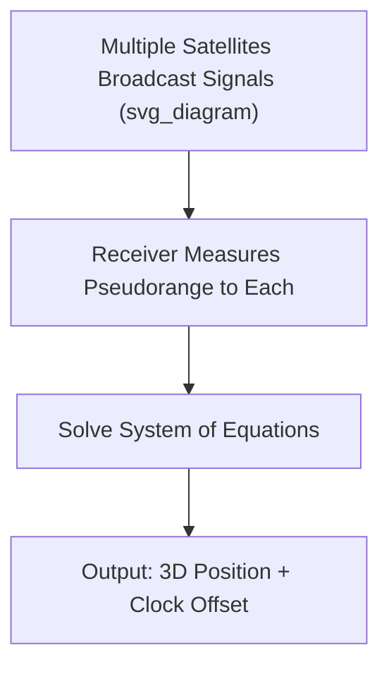
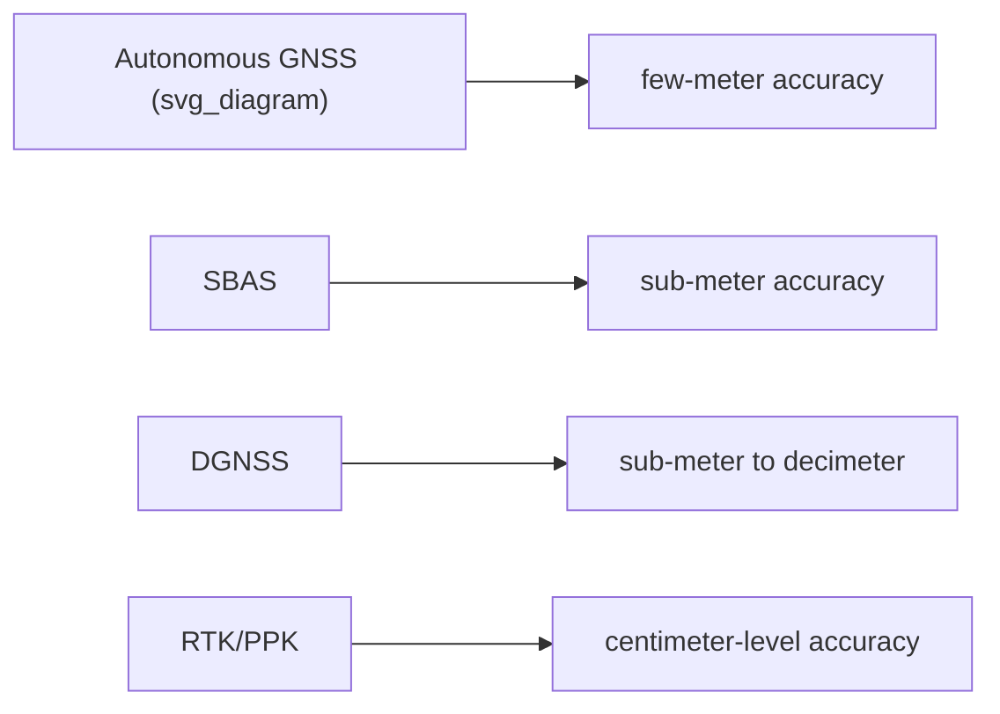

## Global Navigation Satellite Systems

### Definition and Scope

Global Navigation Satellite Systems (GNSS) are satellite-based positioning systems that provide autonomous geospatial positioning, enabling receivers to determine their location (latitude, longitude, altitude) and precise time anywhere on or near Earth's surface with a clear view of the sky. GNSS is an umbrella term encompassing multiple independent constellations, of which GPS is the most widely known.

**Key Points**

- All GNSS constellations operate on the same fundamental principle: **trilateration** using precisely timed radio signals from multiple satellites.
- Accurate positioning requires signals from at least four satellites simultaneously, due to the need to solve for both position (3D) and receiver clock error.
- GNSS underpins not only navigation but critical Earth science applications including crustal deformation monitoring, atmospheric sounding, and precision timing for other sensor systems.

### Major GNSS Constellations

| System | Operator | Status |
| --- | --- | --- |
| GPS (NAVSTAR) | United States | Fully operational, ~31 operational satellites |
| GLONASS | Russia | Fully operational |
| Galileo | European Union | Fully operational |
| BeiDou (BDS) | China | Fully operational (global since 2020) |
| NavIC (IRNSS) | India | Regional (South Asia) |
| QZSS | Japan | Regional augmentation (Asia-Oceania) |

Modern multi-constellation GNSS receivers can track satellites from several systems simultaneously, improving accuracy, availability, and performance in signal-obstructed environments (urban canyons, dense forest canopy). [Well-established capability of contemporary receiver hardware; specific performance gains vary by receiver design and environment.]

### Positioning Principle: Trilateration

Each satellite continuously broadcasts a signal encoding its precise orbital position (ephemeris data) and the exact time of transmission, derived from an onboard atomic clock. A receiver measures the time delay between transmission and reception to calculate the distance (**pseudorange**) to each satellite:

$$\rho = c \cdot (t_r - t_s)$$

where $\rho$ is the pseudorange, $c$ is the speed of light, $t_r$ is the signal reception time (receiver clock), and $t_s$ is the signal transmission time (satellite clock). It is termed "pseudorange" rather than true range because receiver clocks are far less precise than satellite atomic clocks, introducing a clock bias term that must be solved for.

With distances to four or more satellites of known position, the receiver solves a system of equations for four unknowns — three spatial coordinates ($x, y, z$) and the receiver clock offset ($\delta t$):

$$\rho_i = \sqrt{(x - x_i)^2 + (y - y_i)^2 + (z - z_i)^2} + c \cdot \delta t$$

for each satellite $i$, where $(x_i, y_i, z_i)$ is the known position of satellite $i$.

### Sources of Positioning Error

| Error Source | Description |
| --- | --- |
| Satellite clock/orbit errors | Small deviations in broadcast ephemeris/timing |
| Ionospheric delay | Signal refraction passing through the ionosphere; frequency-dependent |
| Tropospheric delay | Signal refraction/delay in the lower atmosphere; affected by humidity, pressure |
| Multipath | Signal reflecting off nearby surfaces (buildings, terrain) before reaching receiver |
| Receiver noise | Limitations of receiver hardware precision |
| Satellite geometry (DOP) | Poor spatial distribution of visible satellites reduces solution accuracy |

**Dilution of Precision (DOP)** quantifies how satellite geometry affects positioning accuracy — a low DOP value (satellites well-spread across the sky) yields more accurate positioning than a high DOP value (satellites clustered together), independent of individual measurement precision.

### Differential and Augmentation Techniques

Standalone (autonomous) GNSS positioning typically achieves accuracy on the order of a few meters. Several correction techniques improve this substantially:

#### Differential GNSS (DGNSS)

Uses a fixed base station at a precisely known location to compute the error between its known position and its GNSS-derived position, broadcasting this correction to nearby rover receivers to cancel out common-mode errors (atmospheric delay, satellite clock/orbit errors).

#### Real-Time Kinematic (RTK)

Uses carrier-phase measurements (rather than just the coded signal) along with real-time corrections from a base station, achieving centimeter-level accuracy. Requires a continuous radio or internet link between base and rover for real-time correction.

#### Post-Processed Kinematic (PPK)

Similar principle to RTK, but corrections are applied after data collection rather than in real time, removing the need for a continuous live link during survey — commonly used in UAV photogrammetric surveys (as covered in the aerial photography/photogrammetry topic).

#### Satellite-Based Augmentation Systems (SBAS)

Regional geostationary satellite-based correction services (e.g., WAAS in North America, EGNOS in Europe, MSAS in Japan) broadcasting correction and integrity data over wide areas, improving accuracy to sub-meter levels without requiring a local base station.

### GNSS in Earth Science Applications

#### Geodesy and Crustal Deformation Monitoring

Continuously operating GNSS reference stations (CORS networks) measure millimeter-to-centimeter scale ground displacement over time, used to monitor:

- Tectonic plate motion and interseismic strain accumulation
- Coseismic and postseismic displacement following earthquakes
- Volcanic edifice deformation (inflation/deflation associated with magma movement)
- Land subsidence from groundwater extraction or resource extraction

#### GNSS Reflectometry (GNSS-R)

An emerging technique using reflected GNSS signals (rather than direct signals) to remotely sense surface properties such as soil moisture, sea surface roughness/wind speed, and snow depth, effectively repurposing existing GNSS infrastructure as a bistatic radar source. [Inference — an active and growing research area; specific accuracy and operational maturity vary by application and are still developing in the literature.]

#### GNSS Meteorology

Atmospheric water vapor content can be estimated from the delay GNSS signals experience passing through the troposphere, providing a valuable data source for numerical weather prediction models (a technique often termed GPS meteorology or GNSS tomography).

#### Precision Timing

GNSS provides the precise timing reference used to synchronize other sensor networks (seismometer arrays, tide gauges) and critical infrastructure (power grid synchronization, telecommunications networks) — a widely relied-upon but often under-appreciated role of GNSS beyond positioning itself.

#### Support for Other Remote Sensing Systems

GNSS/IMU integration provides the precise position and orientation data needed for direct georeferencing in aerial photogrammetry and airborne lidar surveys, and orbit determination for Earth observation satellites.

### Diagram: GNSS Trilateration Concept (svg_diagram)

<svg xmlns="http://www.w3.org/2000/svg" viewBox="0 0 700 320" font-family="sans-serif">
<text x="350" y="20" text-anchor="middle" font-size="16" font-weight="bold">GNSS Trilateration (svg_diagram)</text>
<circle cx="150" cy="80" r="8" fill="black" />
<text x="150" y="65" text-anchor="middle" font-size="9">Satellite 1</text>
<circle cx="550" cy="80" r="8" fill="black" />
<text x="550" y="65" text-anchor="middle" font-size="9">Satellite 2</text>
<circle cx="350" cy="50" r="8" fill="black" />
<text x="350" y="35" text-anchor="middle" font-size="9">Satellite 3</text>
<circle cx="350" cy="220" r="6" fill="red" />
<text x="350" y="245" text-anchor="middle" font-size="10">Receiver</text>
<line x1="150" y1="80" x2="350" y2="220" stroke="black" stroke-dasharray="3" />
<line x1="550" y1="80" x2="350" y2="220" stroke="black" stroke-dasharray="3" />
<line x1="350" y1="50" x2="350" y2="220" stroke="black" stroke-dasharray="3" />
<circle cx="150" cy="80" r="170" fill="none" stroke="gray" stroke-opacity="0.4" />
<circle cx="550" cy="80" r="170" fill="none" stroke="gray" stroke-opacity="0.4" />
<circle cx="350" cy="50" r="185" fill="none" stroke="gray" stroke-opacity="0.4" />

<text x="350" y="300" text-anchor="middle" font-size="11" font-style="italic">Position is the intersection of range spheres from multiple satellites</text>

</svg>

### Limitations and Considerations

- **Signal obstruction**: dense urban environments ("urban canyons"), tunnels, and dense forest canopy degrade or block signals, reducing accuracy or causing complete signal loss.
- **Ionospheric variability**: space weather events (solar storms) can significantly increase ionospheric delay errors, particularly affecting single-frequency receivers; dual-frequency receivers can largely correct for this since ionospheric delay is frequency-dependent.
- **Vertical accuracy is typically lower than horizontal accuracy** in standard GNSS positioning, a well-documented characteristic arising from satellite geometry (limited satellites are typically visible below the horizon).
- **Spoofing and jamming vulnerabilities**: GNSS signals are relatively weak by the time they reach Earth's surface, making them susceptible to interference — an increasingly discussed operational security concern. [Inference — a recognized and growing concern in the GNSS security literature, though the practical scope of the threat varies by region and application.]

### Related Topics

- Aerial Photography and Photogrammetry (GNSS/IMU integration)
- Geographic Information Systems (spatial referencing)
- Crustal Deformation and Geodetic Monitoring of Earthquakes and Volcanoes
- GNSS Reflectometry for Soil Moisture and Sea State
- Atmospheric Sounding via GNSS Meteorology
- Satellite Platforms and Sensors