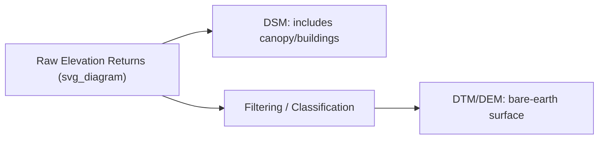
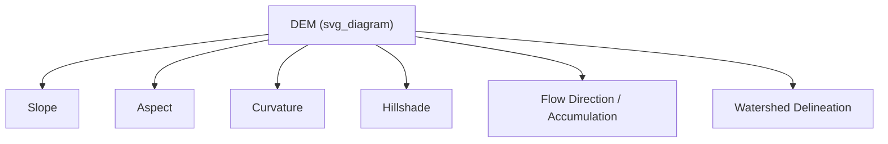

## Digital Elevation Models and Terrain Analysis

### Definition and Scope

A Digital Elevation Model (DEM) is a digital representation of the topographic surface of the Earth, encoding elevation values across a spatial grid or set of points. Terrain analysis encompasses the derivative computations and interpretive methods applied to DEMs to extract meaningful geomorphological, hydrological, and structural information.

**Key Points**

- DEM is often used as an umbrella term, but precise usage distinguishes between DEM (bare-earth terrain), DSM (Digital Surface Model, including vegetation/buildings), and DTM (Digital Terrain Model, often used interchangeably with DEM in bare-earth contexts).
- DEMs can be structured as raster grids (regularly spaced elevation values) or as Triangulated Irregular Networks (TINs).
- Terrain analysis derivatives (slope, aspect, curvature, flow accumulation) form the foundation for hazard assessment, hydrological modeling, and geomorphological interpretation.

### DEM vs. DSM vs. DTM

| Term | Represents | Typical Source |
| --- | --- | --- |
| DEM (Digital Elevation Model) | Generic term; often bare-earth elevation | Various |
| DSM (Digital Surface Model) | Top of all surface features (canopy, buildings, bare earth) | Lidar first returns, photogrammetry |
| DTM (Digital Terrain Model) | Bare-earth surface, vegetation/structures removed | Lidar last returns (filtered), interpolation |

The difference between DSM and DTM at a given location — the **canopy height model (CHM)** when applied to vegetation — is itself a useful derived product for forestry and ecological applications:

$$CHM = DSM - DTM$$

### Data Structures: Raster Grid vs. TIN

#### Raster (Grid) DEM

Elevation stored as a regular grid of cells, each holding a single elevation value. Simple to process computationally and compatible with standard raster GIS operations (as covered in the GIS topic), but resolution is fixed uniformly across the entire extent regardless of terrain complexity.

#### Triangulated Irregular Network (TIN)

Elevation represented as a network of non-overlapping triangles connecting irregularly spaced elevation points, with triangle density adapting to terrain complexity — more triangles in areas of high relief variability, fewer in flat areas. TINs preserve breaklines (ridges, streams) more precisely than uniform grids but are more complex to process for many standard raster-based analyses.

### Sources of DEM Data

- **Photogrammetry**: stereo image matching, as covered in the aerial photography topic, producing DSMs (and DTMs after filtering).
- **Lidar (Light Detection and Ranging)**: airborne or spaceborne laser scanning; multiple returns per pulse allow separation of canopy (first returns) from ground (last returns), making lidar particularly effective for generating accurate bare-earth DTMs even under forest canopy.
- **Radar interferometry (InSAR)**: e.g., the SRTM (Shuttle Radar Topography Mission) dataset, providing near-global coverage at ~30 m resolution.
- **Global DEM products**: SRTM, ASTER GDEM, and Copernicus DEM are widely used freely available global datasets, each with different resolution, vertical accuracy, and coverage gaps (e.g., SRTM has limited coverage at extreme latitudes).

### Core Terrain Derivatives

#### Slope

The rate of change of elevation, typically expressed in degrees or percent, calculated from the elevation gradient between a cell and its neighbors:

$$S = \arctan\left(\sqrt{\left(\frac{\partial z}{\partial x}\right)^2 + \left(\frac{\partial z}{\partial y}\right)^2}\right)$$

where $\frac{\partial z}{\partial x}$ and $\frac{\partial z}{\partial y}$ are the elevation gradients in the east-west and north-south directions, commonly estimated using a finite-difference algorithm (e.g., Horn's method) applied to a 3×3 neighborhood of cells.

#### Aspect

The compass direction that a slope faces, calculated from the same gradient components:

$$A = \arctan2\left(\frac{\partial z}{\partial y}, -\frac{\partial z}{\partial x}\right)$$

Aspect is critical for solar radiation modeling, snowmelt timing, and microclimate/vegetation studies, since slopes facing different directions receive substantially different solar exposure.

#### Curvature

Describes the rate of change of slope, distinguishing convex, concave, and planar terrain forms:

- **Profile curvature**: curvature in the direction of maximum slope, affecting acceleration/deceleration of flow.
- **Plan curvature**: curvature perpendicular to the slope direction, affecting convergence/divergence of flow.

Curvature is used to identify ridges, valleys, and terrain features relevant to landslide susceptibility and drainage network characterization.

#### Hillshade

A simulated illumination raster generated by modeling how light from a specified sun position would illuminate the terrain surface, widely used as a cartographic visualization base layer beneath other thematic layers.

### Hydrological Terrain Analysis

#### Flow Direction

For each cell, determines the direction water would flow based on the steepest descent to a neighboring cell — the most common algorithm is the **D8 method**, which assigns flow to one of eight possible neighboring cells (though multi-flow-direction algorithms exist and better represent flow dispersal on gentle terrain).

#### Flow Accumulation

Computes, for each cell, the number of upstream cells that drain into it, effectively identifying channel networks — cells with high flow accumulation values correspond to streams and rivers.

#### Watershed Delineation

Identifies the drainage basin boundary contributing flow to a specified outlet point, derived by tracing all cells whose flow paths converge to that outlet — fundamental for hydrological modeling, flood risk assessment, and water resource management.

$$A_{contributing} = \sum_{i} a_i \quad \text{for all cells } i \text{ draining to the outlet}$$

where $a_i$ is the area of each contributing cell.

#### Stream Network Extraction

Applying a threshold to the flow accumulation raster (cells exceeding a minimum contributing area) extracts a vector or raster representation of the stream network, whose density and pattern reflect the underlying geology and climate. [Inference — threshold selection is somewhat subjective and affects resulting stream network density; standard practice but with some methodological variability.]

### DEM-Derived Applications in Hazard Assessment

- **Landslide susceptibility mapping**: slope, aspect, and curvature are standard input variables in statistical and machine-learning landslide susceptibility models.
- **Flood modeling**: DEMs provide the terrain input for hydraulic and hydrological models estimating inundation extent.
- **Viewshed and line-of-sight analysis**: used in volcanic hazard communication (visibility of warning signage), wildfire lookout siting, and telecommunications planning.
- **Volumetric change detection**: repeat DEM differencing (DEM of Difference, DoD) quantifies volume change from erosion, deposition, landslide mass movement, or volcanic eruption products:

$$\Delta V = \sum_{i} (z_{2,i} - z_{1,i}) \times A_{cell}$$

where $z_{2,i}$ and $z_{1,i}$ are elevations at cell $i$ from two time periods and $A_{cell}$ is the area of a single cell.

### DEM Accuracy Considerations

- **Vertical accuracy** is typically reported as RMSE (Root Mean Square Error) against independent survey checkpoints, and varies substantially by data source (sub-decimeter for high-density lidar vs. several meters for SRTM-derived products).
- **Resolution vs. terrain representation**: coarser DEM resolution can smooth out fine-scale terrain features relevant to certain analyses (small landslide scarps, narrow drainage channels), while finer resolution increases file size and processing demand.
- **Void filling and artifacts**: radar-derived DEMs (e.g., SRTM) can contain data voids in steep terrain or areas of radar shadow/layover, requiring interpolation-based void filling that introduces some uncertainty in affected areas. [Well-documented characteristic of SRTM-class data.]

### Diagram: Slope and Aspect Concept (svg_diagram)

<svg xmlns="http://www.w3.org/2000/svg" viewBox="0 0 700 300" font-family="sans-serif">
<text x="350" y="20" text-anchor="middle" font-size="16" font-weight="bold">Slope and Aspect (svg_diagram)</text>
<polygon points="150,220 350,80 550,220" fill="none" stroke="black" />
<text x="350" y="240" text-anchor="middle" font-size="10">Hillslope Profile</text>
<line x1="350" y1="80" x2="350" y2="220" stroke="gray" stroke-dasharray="3" />
<text x="370" y="150" font-size="9">Slope angle</text>
<circle cx="580" cy="150" r="60" fill="none" stroke="black" />
<text x="580" y="95" text-anchor="middle" font-size="9">N</text>
<text x="580" y="215" text-anchor="middle" font-size="9">S</text>
<text x="520" y="153" text-anchor="middle" font-size="9">W</text>
<text x="640" y="153" text-anchor="middle" font-size="9">E</text>
<line x1="580" y1="150" x2="620" y2="115" stroke="red" marker-end="url(#a2)" />
<text x="640" y="110" font-size="8" fill="red">Aspect (facing)</text>
</svg>

### Related Topics

- Aerial Photography and Photogrammetry (DEM/DSM generation)
- Geographic Information Systems (raster analysis, map algebra)
- Landslide Susceptibility Modeling
- Flood Modeling and Floodplain Delineation
- Volcanic Hazard Monitoring (volumetric change detection)
- Geomorphology and Drainage Basin Analysis
- Lidar Systems and Point Cloud Processing