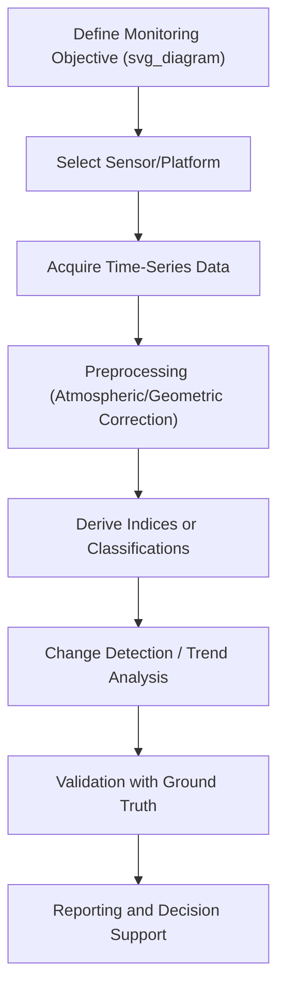
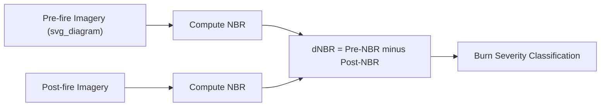

## Applications in Environmental Monitoring

### Definition and Scope

Environmental monitoring applications integrate remote sensing, GIS, and geospatial technologies covered earlier in this chapter into operational and research workflows that track the condition and change of Earth's land, water, atmosphere, and ecosystems over time. This topic synthesizes the preceding technical foundations (spectral principles, satellite platforms, photogrammetry, GNSS, DEMs) into applied use cases.

**Key Points**

- Most environmental monitoring relies on **time-series analysis** — repeated observations over consistent spatial and spectral parameters — to detect change, rather than single-date snapshots.
- Effective monitoring programs combine multiple data sources (satellite, airborne, in-situ/ground-truth) to balance spatial coverage against measurement accuracy.
- Change detection, index-based analysis, and multi-criteria spatial modeling are the dominant analytical approaches across most environmental monitoring domains.

### General Monitoring Workflow

### Land Cover and Land Use Change Monitoring

Uses multi-temporal classified imagery (from platforms like Landsat or Sentinel-2, as covered previously) to quantify changes in categories such as forest, urban, agricultural, and water over time.

**Example**

- Deforestation tracking: comparing classified land cover maps between two dates to quantify forest loss area, often supplemented by near-real-time alert systems such as Global Forest Watch, which uses automated change detection algorithms on frequently updated satellite imagery.
- Urban expansion analysis: tracking impervious surface growth over decadal time series to inform infrastructure and water resource planning.

Common change detection methods include:

- **Post-classification comparison**: classifying each date independently, then comparing resulting maps cell-by-cell.
- **Image differencing**: subtracting spectral index values (e.g., NDVI) between two dates directly.
- **Change vector analysis**: measuring both the magnitude and direction of spectral change in multi-dimensional feature space.

### Vegetation and Agricultural Monitoring

Builds on the spectral index principles introduced in the remote sensing principles topic (NDVI and related indices) to monitor vegetation health, phenology, and productivity.

| Index | Formula | Primary Use |
| --- | --- | --- |
| NDVI | $(NIR - Red)/(NIR + Red)$ | General vegetation vigor |
| EVI (Enhanced Vegetation Index) | Corrects for atmospheric and canopy background effects | Dense canopy monitoring |
| NDWI (Normalized Difference Water Index) | $(Green - NIR)/(Green + NIR)$ | Surface water/moisture detection |
| NDMI (Normalized Difference Moisture Index) | $(NIR - SWIR)/(NIR + SWIR)$ | Vegetation/fuel moisture content |

Applications include crop yield estimation, drought stress detection, precision agriculture (variable-rate input application guided by within-field NDVI variability), and phenological monitoring (tracking green-up and senescence timing across growing seasons).

### Water Resources Monitoring

- **Surface water extent mapping**: using NDWI or SAR backscatter (which strongly contrasts smooth water surfaces against rougher land surfaces) to delineate water bodies and track seasonal/interannual variation.
- **Reservoir and lake level monitoring**: combining satellite altimetry (radar/lidar measurement of water surface elevation) with optical extent mapping to estimate storage volume changes.
- **Water quality indicators**: chlorophyll-a concentration and turbidity can be estimated from ocean/water color sensors (e.g., Sentinel-3 OLCI, MODIS ocean color bands), supporting harmful algal bloom detection.
- **Groundwater-related subsidence**: GNSS and InSAR-based deformation monitoring (as covered in the GNSS topic) detect land subsidence associated with groundwater over-extraction.

### Cryosphere Monitoring

- **Glacier extent and mass balance**: repeat optical imagery tracks terminus position change; repeat DEM differencing (as introduced in the terrain analysis topic) quantifies ice volume/mass change.
- **Sea ice extent and concentration**: passive microwave sensors (e.g., SSM/I, AMSR2) provide daily, all-weather sea ice monitoring exploiting the strong contrast in microwave emissivity between ice and open water.
- **Snow cover mapping**: optical sensors (MODIS Snow Cover product) provide near-daily snow extent, informing water resource forecasting and avalanche hazard assessment.

### Atmospheric and Air Quality Monitoring

Dedicated atmospheric composition sensors (e.g., Sentinel-5P TROPOMI, OCO-2/3 for CO₂) measure trace gas concentrations, aerosol optical depth, and greenhouse gas columns, supporting:

- Air quality assessment (NO₂, SO₂, particulate matter proxies)
- Wildfire smoke plume tracking
- Greenhouse gas emission monitoring and verification
- Volcanic SO₂ plume detection, directly supporting the volcanic hazard monitoring applications covered under natural hazards

### Coastal and Marine Environmental Monitoring

- **Shoreline change analysis**: combining historical aerial photography, satellite imagery, and photogrammetric/lidar-derived DEMs (as covered earlier) to quantify erosion/accretion rates over time.
- **Coral reef and seagrass mapping**: using high-resolution multispectral imagery with specialized water-column correction algorithms to classify benthic habitats.
- **Ocean color and sea surface temperature**: tracking phytoplankton productivity and thermal anomalies (e.g., marine heatwave detection) relevant to ecosystem and fisheries management.

### Wildfire and Burn Severity Monitoring

- **Active fire detection**: thermal infrared sensors (MODIS, VIIRS) detect fire hotspots in near-real time based on anomalously high thermal emission.
- **Burn severity mapping**: the Normalized Burn Ratio (NBR), calculated from NIR and SWIR bands, quantifies fire impact when compared pre- and post-fire:

$$NBR = \frac{NIR - SWIR}{NIR + SWIR}$$

$$dNBR = NBR_{prefire} - NBR_{postfire}$$

Higher $dNBR$ values indicate greater burn severity, a widely used standard metric in post-fire assessment and recovery monitoring.

### Multi-Criteria Environmental Suitability and Risk Modeling

Combines multiple GIS layers (as covered in the GIS topic) using weighted overlay or map algebra to model composite environmental conditions — for example, combining slope, land cover, proximity to water, and soil type to model erosion risk or habitat suitability. This approach directly extends the hazard-mapping applications discussed under natural hazards and risk assessment, applying the same overlay logic to purely environmental (non-hazard) questions such as species habitat modeling or conservation prioritization.

### In-Situ and Ground-Truth Integration

Remote and airborne observations are typically validated and calibrated against ground-based measurements:

- Weather stations and stream gauges for meteorological/hydrological validation
- Field vegetation surveys for land cover classification accuracy assessment
- Water quality sampling for satellite-derived water quality product calibration

**Accuracy assessment** of classified products commonly uses a **confusion matrix**, from which overall accuracy, producer's accuracy, user's accuracy, and the Kappa coefficient are calculated to quantify classification reliability against independent reference data.

### Diagram: Integrated Monitoring Data Sources (svg_diagram)

<svg xmlns="http://www.w3.org/2000/svg" viewBox="0 0 800 260" font-family="sans-serif">
<text x="400" y="20" text-anchor="middle" font-size="16" font-weight="bold">Integrated Environmental Monitoring (svg_diagram)</text>
<rect x="40" y="60" width="160" height="50" fill="none" stroke="black" />
<text x="120" y="90" text-anchor="middle" font-size="10">Satellite Imagery</text>
<rect x="240" y="60" width="160" height="50" fill="none" stroke="black" />
<text x="320" y="90" text-anchor="middle" font-size="10">Airborne/UAV Data</text>
<rect x="440" y="60" width="160" height="50" fill="none" stroke="black" />
<text x="520" y="90" text-anchor="middle" font-size="10">In-Situ Sensors</text>
<rect x="640" y="60" width="120" height="50" fill="none" stroke="black" />
<text x="700" y="90" text-anchor="middle" font-size="10">GNSS Network</text>
<rect x="300" y="170" width="200" height="50" fill="none" stroke="black" />
<text x="400" y="200" text-anchor="middle" font-size="11">GIS Integration and Analysis</text>
<line x1="120" y1="110" x2="380" y2="170" stroke="black" />
<line x1="320" y1="110" x2="390" y2="170" stroke="black" />
<line x1="520" y1="110" x2="410" y2="170" stroke="black" />
<line x1="700" y1="110" x2="420" y2="170" stroke="black" />
</svg>

### Limitations and Considerations

- **Temporal and spatial resolution trade-offs** (as discussed in the remote sensing principles topic) constrain which monitoring questions a given sensor can practically address.
- **Cross-sensor consistency**: combining data from different sensors/missions over long time series requires careful radiometric cross-calibration to avoid introducing spurious trends. [Inference — well-recognized methodological concern, especially significant for multi-decadal climate/environmental trend studies.]
- **Cloud and atmospheric contamination** in optical time series requires gap-filling or compositing techniques (e.g., maximum-value compositing for NDVI time series) to produce usable continuous records.
- **Validation cost and logistics**: ground-truth data collection remains resource-intensive, and many monitoring products in remote or inaccessible regions carry higher uncertainty due to limited validation coverage. [Inference]

### Related Topics

- Principles of Remote Sensing
- Satellite Platforms and Sensors
- Geographic Information Systems
- Digital Elevation Models and Terrain Analysis
- Natural Hazards and Risk Assessment (hazard mapping applications)
- Climate Change Indicators and Long-Term Environmental Trend Analysis
- Machine Learning Approaches to Land Cover Classification