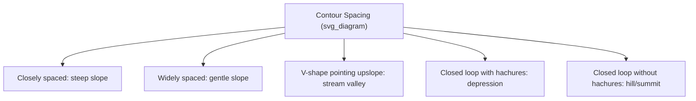
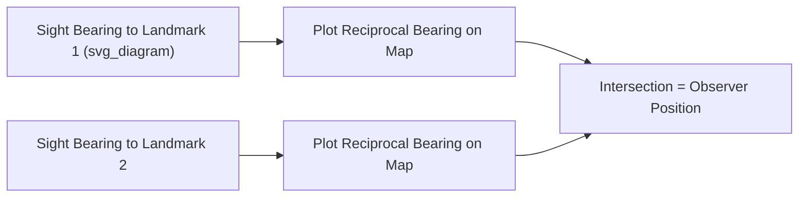

## Topographic Map Interpretation

### Definition and Scope

Topographic map interpretation is the skill of reading and analyzing maps that represent the three-dimensional shape of Earth's surface on a two-dimensional plane, primarily through contour lines, alongside symbolic representation of natural and cultural features. It is a foundational field skill bridging cartographic representation and physical landscape understanding, complementing the digital terrain analysis methods covered in the remote sensing chapter.

**Key Points**

- Topographic maps encode elevation, distance, direction, and feature type simultaneously through a standardized symbol and contour system.
- Contour lines are the primary mechanism for representing three-dimensional relief on a flat map, and interpreting their spacing and shape is the core analytical skill.
- Map scale, datum, and coordinate grid systems must be understood together to make accurate measurements from a topographic map.

### Map Scale

Scale expresses the ratio between distance on the map and corresponding distance on the ground, commonly represented three ways:

- **Representative Fraction (RF)**: e.g., 1:24,000, meaning one unit on the map equals 24,000 of the same unit on the ground.
- **Verbal scale**: e.g., "one inch equals 2,000 feet."
- **Graphic (bar) scale**: a physical ruler-like graphic on the map, which remains accurate even if the map is enlarged or reduced (unlike RF or verbal scale, which become inaccurate under reproduction).

$$RF = \frac{1}{\text{ground distance in map units}}$$

A "large-scale" map (e.g., 1:24,000) shows a small area in great detail; a "small-scale" map (e.g., 1:250,000) shows a large area with less detail — a common point of confusion since the RF fraction's numerical value is inversely related to the level of detail shown.

### Contour Lines

A contour line connects points of equal elevation above a reference datum (commonly mean sea level). Interpreting contour patterns is the central skill of topographic map reading.

**Fundamental Rules of Contour Lines**

- Every point on a single contour line has the same elevation.
- Contour lines never cross (except in the rare case of an overhanging cliff, depicted with a special notation).
- Contour lines close on themselves, either within the map extent or by extending off the map edge.
- Evenly spaced contours indicate a uniform slope; closely spaced contours indicate steep terrain; widely spaced contours indicate gentle terrain.
- Contour lines form a "V" pointing upstream/upslope when crossing a valley or stream (the "rule of Vs").
- Concentric closed contours with no other contours around them, marked with hachures (short perpendicular tick marks), indicate a depression rather than a hill.

**Contour Interval**: the constant elevation difference between adjacent contour lines, specified in the map legend (e.g., 20-foot or 10-meter intervals). Every fifth contour line is typically drawn bolder and labeled with its elevation value (an **index contour**) to aid reading.

$$\text{Elevation at line } n = \text{Base elevation} + (n \times \text{Contour Interval})$$

### Slope Calculation from Contours

Slope (gradient) between two points can be calculated directly from contour information:

$$\text{Slope (\%)} = \frac{\text{Elevation Change}}{\text{Horizontal Distance}} \times 100$$

$$\text{Slope (degrees)} = \arctan\left(\frac{\text{Elevation Change}}{\text{Horizontal Distance}}\right)$$

**Example**

If two points are separated by 4 contour lines at a 20-foot contour interval (80 feet of elevation change) over a measured map distance of 1,000 feet horizontal distance:

$$\text{Slope} = \frac{80}{1000} \times 100 = 8\%$$

### Landform Recognition from Contour Patterns

| Contour Pattern | Landform Indicated |
| --- | --- |
| Closed loops, elevation increasing inward | Hill or summit |
| Closed loops with hachures, elevation decreasing inward | Depression/sinkhole |
| "V" shapes pointing upslope (higher elevation) | Stream valley/drainage |
| "V" or "U" shapes pointing downslope | Ridge or spur |
| Contours forming an hourglass/saddle shape | Saddle or pass (col) between two higher points |
| Tightly packed contours forming a near-vertical pattern | Cliff or escarpment |

### Coordinate and Grid Reference Systems

Topographic maps typically display one or more coordinate reference grids overlaid on the map:

- **Geographic coordinates (latitude/longitude)**: displayed as tick marks or a graticule along map margins.
- **UTM (Universal Transverse Mercator) grid**: a metric grid system dividing the Earth into 60 zones, commonly overlaid on topographic maps (e.g., USGS quadrangles) to allow precise metric coordinate reading and measurement.
- **State Plane Coordinate System** (U.S.): a regional projected coordinate system sometimes used on more localized maps.

Reading a UTM grid reference typically follows the convention of reading right (easting) then up (northing) — informally remembered as "read right, then up."

### Map Symbols and Legend Conventions

Topographic maps use standardized symbols (varying somewhat by national mapping agency, e.g., USGS in the United States, Ordnance Survey in the United Kingdom) to represent:

- **Hydrographic features**: rivers, lakes, wetlands (often shown in blue)
- **Vegetation**: forested areas, cleared land (often shown in green/white)
- **Cultural features**: roads, buildings, boundaries, railways (often shown in black/red)
- **Relief features**: contour lines (typically brown), spot elevations, benchmarks

**Key Points**

- Always consult the specific map's legend, since symbol conventions can vary between mapping agencies, editions, and countries.
- Map **declination** information (the angular difference between true north and magnetic north at the map's location) is typically provided in the margin and is essential for accurate compass navigation using the map.

### Determining Position and Direction

#### Bearing and Azimuth

Direction on a topographic map is typically expressed as an azimuth (0–360°, measured clockwise from north) or as a quadrant bearing (e.g., N 45° E).

#### Triangulation/Resection

A traditional field technique for determining one's position using a map and compass by taking bearings to two or more identifiable landmarks, then plotting the reciprocal bearings on the map — their intersection indicates the observer's location.

### Cross-Section Construction

A topographic profile (cross-section) visualizes the terrain shape along a chosen line on the map, constructed by plotting elevation (from each contour crossing along the line) against horizontal distance, then connecting the points into a smoothed profile — a manual analog to the DEM-derived slope profiles covered in the terrain analysis topic.

### Integration with Digital and Field Methods

Traditional paper-map interpretation skills remain foundational even as digital tools (GPS/GNSS receivers, GIS software, DEM-derived contour generation) have become standard in professional practice. Field scientists commonly cross-reference GNSS-derived position (as covered in the GNSS topic) against topographic map features for navigation and site location, and use printed or digital topographic maps alongside aerial imagery for field mapping of geological, ecological, or hydrological features.

### Diagram: Contour Line Landform Patterns (svg_diagram)

<svg xmlns="http://www.w3.org/2000/svg" viewBox="0 0 800 300" font-family="sans-serif">
<text x="400" y="20" text-anchor="middle" font-size="16" font-weight="bold">Contour Landform Patterns (svg_diagram)</text>

<text x="130" y="50" text-anchor="middle" font-size="11" font-weight="bold">Hill</text>

<circle cx="130" cy="130" r="70" fill="none" stroke="black" />

<circle cx="130" cy="130" r="45" fill="none" stroke="black" />

<circle cx="130" cy="130" r="20" fill="none" stroke="black" />

<text x="400" y="50" text-anchor="middle" font-size="11" font-weight="bold">Valley (V points upslope)</text>

<path d="M 300 90 Q 400 150 300 210" fill="none" stroke="black" />

<path d="M 320 80 Q 420 150 320 220" fill="none" stroke="black" />

<path d="M 340 70 Q 440 150 340 230" fill="none" stroke="black" />

<text x="650" y="50" text-anchor="middle" font-size="11" font-weight="bold">Depression</text>

<circle cx="650" cy="130" r="70" fill="none" stroke="black" />

<circle cx="650" cy="130" r="45" fill="none" stroke="black" />

<line x1="650" y1="85" x2="650" y2="75" stroke="black" />

<line x1="650" y1="175" x2="650" y2="185" stroke="black" />

<line x1="605" y1="130" x2="595" y2="130" stroke="black" />

<line x1="695" y1="130" x2="705" y2="130" stroke="black" />

<text x="400" y="280" text-anchor="middle" font-size="11" font-style="italic">Hachures (tick marks) distinguish depressions from hills on closed contours</text>

</svg>

### Limitations and Considerations

- **Contour interval limits detail**: features with vertical relief smaller than the contour interval (small gullies, minor knolls) may not be represented at all, a fundamental limitation of the contour method regardless of map quality.
- **Map currency**: printed topographic maps reflect conditions at their survey/revision date and may not capture subsequent landscape change (river course shifts, new construction, coastal erosion), making cross-referencing with current imagery advisable for time-sensitive applications.
- **Interpretation skill dependency**: accurate landform interpretation from contours requires practice and familiarity with regional terrain types; novice misreadings of similar-looking patterns (e.g., distinguishing a ridge from a valley without checking elevation labels) are a common and well-documented learning challenge. [Inference — this is a widely noted pedagogical observation in field methods instruction, though not a strictly quantifiable claim.]

### Related Topics

- Digital Elevation Models and Terrain Analysis
- Geographic Information Systems
- Global Navigation Satellite Systems (field navigation integration)
- Field Mapping Techniques and Geological Compass Use
- Cross-Section Construction and Structural Geology Interpretation
- Cartographic Design and Map Projections