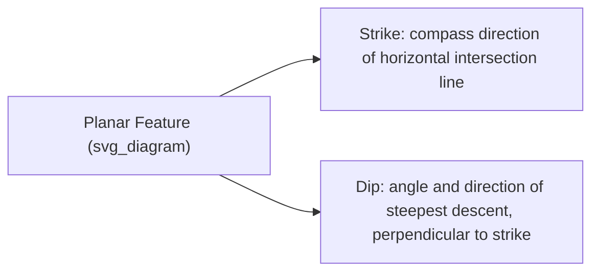
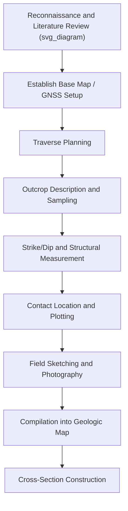

## Geologic Field Mapping Techniques

### Definition and Scope

Geologic field mapping is the systematic process of observing, recording, and spatially representing the distribution, orientation, and relationships of rock units, structures, and geologic contacts across a landscape. It remains one of the foundational methods in geology, producing the primary data from which stratigraphic, structural, and tectonic interpretations are built.

**Key Points**

- Field mapping combines direct observation, measurement of structural orientation, and spatial plotting onto a base map (traditionally topographic, increasingly GIS/GNSS-integrated).
- The fundamental measured quantities in structural field mapping are **strike and dip** for planar features and **trend and plunge** for linear features.
- A geologic map is an interpretation, not merely a data record — contacts between mapped units are typically inferred and extrapolated between actual observation points.

### Essential Field Equipment

- **Geologic (Brunton) compass**: measures strike, dip, trend, plunge, and bearing; many models incorporate a clinometer for angle measurement.
- **Topographic base map** (as covered in the prior topic) or GNSS-enabled field tablet with GIS software.
- **Hand lens**: for close examination of mineral and rock texture in the field.
- **Rock hammer**: for obtaining fresh rock surfaces and samples.
- **Field notebook**: for recording observations, sketches, and measurements systematically.
- **GNSS receiver** (handheld or integrated into a field tablet): for precise location recording, as covered in the GNSS topic.

### Strike and Dip

**Strike** is the compass direction of the line formed by the intersection of an inclined planar geologic feature (bedding, fault, foliation) with a horizontal plane. **Dip** is the angle of steepest descent of that plane, measured perpendicular to strike, along with the compass direction it dips toward (dip direction).

$$\text{Strike} \perp \text{Dip Direction}$$

Strike and dip are recorded together, e.g., "N45°E, 30°SE," meaning the strike trends N45°E and the plane dips 30° toward the southeast.

**Standard map symbol**: a strike-and-dip symbol consists of a long line oriented along the strike direction with a short perpendicular tick mark on the dip-direction side, labeled with the dip angle.

### Trend and Plunge

For linear geologic features (fold axes, lineations, mineral lineations), orientation is described using **trend** (the compass direction of the line's horizontal projection) and **plunge** (the angle the line makes below horizontal).

### Stereographic Projection

Structural orientation data (strike/dip, trend/plunge) are commonly plotted and analyzed using **stereonets** (equal-area or equal-angle stereographic projections), which allow visualization and statistical analysis of large populations of orientation measurements — for example, identifying preferred fold axis orientations or fault plane clustering.

**Key Points**

- Planes plot as great circles (or their poles as single points) on a stereonet; lines plot as single points directly.
- Pole plotting is generally preferred for analyzing large datasets since it avoids the visual clutter of many overlapping great circles.

### Recording Geologic Contacts

A **contact** is the boundary between two different rock units. Field mapping involves locating contacts at outcrops and inferring their subsurface/covered trace between observation points, guided by:

- Topographic expression (differential erosion often creates recognizable landform breaks at contacts)
- Structural continuity (strike projection between known points, accounting for dip and terrain relief — the "rule of Vs" for contacts crossing valleys operates analogously to the contour rule of Vs covered in the topographic map topic)
- Vegetation and soil changes that often reflect underlying lithologic differences

Contact types are classified and symbolized differently on a map:

- **Depositional/stratigraphic contact**: solid line, representing conformable or unconformable deposition.
- **Fault contact**: solid line with additional symbols indicating fault type (e.g., ball-and-bar for normal fault hanging wall, triangles for thrust fault hanging wall).
- **Intrusive contact**: solid line, often with a distinct symbol style where igneous rock cuts across older units.
- **Inferred/approximate contact**: dashed line, used where the contact location is inferred rather than directly observed.
- **Concealed contact**: dotted line, used where the contact is covered by younger deposits or vegetation but its presence is inferred.

### Field Mapping Workflow

1. **Reconnaissance**: preliminary review of existing geologic literature, prior maps, and remote sensing/aerial imagery (as covered in earlier chapter topics) to plan field traverses efficiently.
2. **Traverse planning**: selecting routes that maximize exposure to outcrops and cross geologic contacts perpendicular to strike where possible, to observe the maximum stratigraphic/structural variation.
3. **Outcrop description**: systematically recording lithology, texture, color, fossil content, sedimentary/igneous/metamorphic structures, and weathering characteristics at each stop.
4. **Structural measurement**: recording strike/dip, trend/plunge, and fault kinematic indicators (slickenlines, offset markers) using the geologic compass.
5. **Sample collection**: collecting hand samples for later laboratory analysis (petrographic thin sectioning, geochemical analysis, geochronology).
6. **Photography and sketching**: field sketches often capture spatial relationships and scale relationships that photographs alone do not adequately convey.
7. **Plotting**: transferring field observations onto the base map at their precise located position (traditionally via pace-and-compass or triangulation methods, now typically via GNSS coordinates).

### Constructing Cross-Sections from Map Data

A geologic cross-section is a vertical slice interpretation showing subsurface structure inferred from surface mapping data, constructed by:

1. Selecting a section line (ideally perpendicular to regional strike, to show true dip rather than apparent dip).
2. Projecting surface contacts and structural measurements down-dip using trigonometric relationships.
3. Applying the **apparent dip formula** when the section line is not perpendicular to strike:

$$\tan(\text{apparent dip}) = \tan(\text{true dip}) \times \cos(\theta)$$

where $\theta$ is the angle between the section line and the true dip direction.

### Stratigraphic Thickness Calculation

True stratigraphic thickness of a dipping unit, measured from map width and dip angle:

$$T = W \times \sin(\delta)$$

where $T$ is true thickness, $W$ is the horizontal map width of the outcrop belt (measured perpendicular to strike), and $\delta$ is the dip angle — this assumes flat topography; corrections are required where significant topographic relief exists across the outcrop belt. [Standard structural geology formula; the flat-topography assumption is a well-known simplification requiring correction in high-relief terrain.]

### Modern Digital Field Mapping

Field mapping increasingly integrates digital tools:

- **GNSS-enabled tablets** running mobile GIS software (e.g., ArcGIS Field Maps, QField) allow direct digital plotting of observations with automatically recorded coordinates, reducing transcription error compared to traditional paper-and-compass methods.
- **Digital compass/clinometer apps** using smartphone sensors can supplement (though generally not fully replace) traditional geologic compasses, with accuracy depending on device calibration. [Inference — smartphone sensor accuracy for structural measurement is an active area of methodological comparison in the geoscience education/field methods literature, with results varying by device and calibration.]
- **UAV-based photogrammetry** (as covered in the aerial photography topic) increasingly supplements traditional mapping in inaccessible or hazardous terrain, generating high-resolution orthomosaics and DEMs for remote structural interpretation.
- **Integration with GIS** (as covered in the geospatial technology chapter) allows field-collected point/line/polygon data to be directly incorporated into a georeferenced digital geologic map database.

### Diagram: Strike and Dip Symbol Convention (svg_diagram)

<svg xmlns="http://www.w3.org/2000/svg" viewBox="0 0 600 300" font-family="sans-serif">
<text x="300" y="20" text-anchor="middle" font-size="16" font-weight="bold">Strike and Dip Symbol (svg_diagram)</text>
<line x1="150" y1="150" x2="350" y2="150" stroke="black" stroke-width="2" />
<text x="250" y="135" text-anchor="middle" font-size="10">Strike Line</text>
<line x1="250" y1="150" x2="250" y2="200" stroke="black" stroke-width="2" />
<text x="290" y="195" text-anchor="middle" font-size="10">Dip Tick</text>
<text x="250" y="220" text-anchor="middle" font-size="11">30°</text>
<text x="250" y="240" text-anchor="middle" font-size="9">(Dip Angle Label)</text>

<text x="450" y="150" text-anchor="middle" font-size="9">N</text>

<line x1="450" y1="145" x2="450" y2="100" stroke="gray" stroke-dasharray="3" />

<text x="300" y="280" text-anchor="middle" font-size="11" font-style="italic">Tick mark points in the dip direction, perpendicular to strike</text>

</svg>

### Applications and Downstream Uses

- Constructing geologic maps used for resource exploration (mineral, groundwater, hydrocarbon)
- Structural analysis for seismic hazard assessment (fault mapping, as connected to the earlier natural hazards chapter)
- Engineering geology assessments for infrastructure siting (slope stability, foundation conditions)
- Stratigraphic correlation across regions for basin analysis and paleogeographic reconstruction
- Baseline geologic data for environmental site assessments

### Limitations and Considerations

- **Outcrop exposure limits data density**: vegetation cover, soil, and urbanization can severely limit outcrop availability, requiring greater reliance on inference and indirect evidence (float, geophysical data, drilling) between observation points.
- **Interpretive uncertainty**: the same field data can sometimes support multiple valid structural interpretations, particularly in complex or poorly exposed terrain — a well-recognized characteristic of geologic mapping rather than a flaw in method. [Inference — this is a widely acknowledged epistemic feature of structural geology, though the degree of ambiguity is highly area- and complexity-dependent.]
- **Measurement precision**: traditional compass-based strike/dip readings carry inherent operator and instrument precision limits (commonly cited as a few degrees), which can matter for detailed structural analysis. [Inference — general instrument precision characteristic; exact figures vary by compass model and operator technique.]

### Related Topics

- Topographic Map Interpretation
- Structural Geology and Stereographic Projection Analysis
- Global Navigation Satellite Systems (field positioning integration)
- Aerial Photography and Photogrammetry (UAV field mapping support)
- Geographic Information Systems (digital geologic database integration)
- Stratigraphy and Cross-Section Construction
- Seismic Hazard Assessment and Fault Mapping