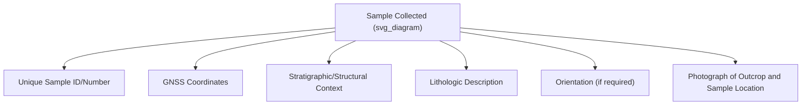

## Rock and Mineral Sample Collection

### Definition and Scope

Rock and mineral sample collection is the systematic process of obtaining, documenting, and preserving physical geologic specimens from the field for subsequent laboratory analysis. Proper collection protocol directly determines the scientific value of downstream analyses (petrographic, geochemical, geochronological), making it a critical companion skill to the field mapping techniques covered in the preceding topic.

**Key Points**

- Sample value depends as much on accurate documentation (location, orientation, geologic context) as on the physical specimen itself — an undocumented sample has substantially reduced scientific utility.
- Different downstream analyses (thin sectioning, geochemistry, geochronology, paleomagnetism) impose different collection requirements regarding sample size, freshness, and orientation.
- Contamination avoidance protocols vary significantly by analysis type, with geochemical and geochronological sampling generally requiring the most stringent field and handling procedures.

### General Sample Collection Principles

#### Representativeness

Samples should be selected to represent the rock unit or feature of interest, avoiding unrepresentative weathered rinds, veins, or localized alteration unless those features are specifically the subject of study.

#### Freshness

Where possible, samples are collected from the freshest available exposure (removing weathered outer surfaces), since surface weathering can significantly alter mineralogy and geochemistry relative to the unweathered protolith.

#### Sample Size

Minimum sample size depends on grain size and intended analysis — a general field guideline is that a hand sample should be large enough to contain a representative volume of all mineral phases present, particularly important for coarse-grained rocks (e.g., pegmatites, coarse granites) where a small sample may not capture the full mineralogical diversity. [Inference — this is a widely taught field heuristic rather than a strictly quantified rule, since minimum adequate size varies with grain size and rock heterogeneity.]

### Standard Field Documentation

Each sample requires paired documentation, typically recorded in a field notebook and/or digital field data collection system:

- **Unique sample identifier**: a systematic numbering scheme (often incorporating date, field area code, and sequential number) to avoid ambiguity across a field season or project.
- **Precise location**: GNSS coordinates (as covered in the GNSS topic), supplemented by a description relative to mapped features.
- **Lithologic description**: rock type, color, texture, grain size, mineral composition, and any distinguishing features observed in the field.
- **Structural context**: strike/dip of the sampled unit, position relative to mapped contacts or structures (as covered in the field mapping topic).
- **Photographic documentation**: outcrop-scale and sample-scale photographs with a scale reference object (rock hammer, coin, or dedicated scale card) included in frame.

### Orientation Marking for Structural/Paleomagnetic Samples

Certain analyses require the sample's original spatial orientation to be preserved and marked in the field before removal:

- **Paleomagnetic sampling**: requires precise orientation marking (typically an arrow or line marked on the sample surface with recorded strike and dip, or plunge and trend if drilled as a core) so the sample's original magnetic orientation can be reconstructed in the laboratory.
- **Oriented structural samples**: used to preserve fabric orientation (foliation, lineation) for later microstructural analysis.

Orientation is typically marked using a permanent marker directly on the rock surface before extraction, with the orientation line's strike and dip (or an equivalent reference) recorded immediately in the field notebook.

### Sampling Methods by Rock Type

#### Igneous Rocks

Typically sampled as fresh hand specimens from outcrop, avoiding weathered surfaces; samples for geochronology (e.g., zircon U-Pb dating) require sufficient volume to yield adequate mineral separates during laboratory processing.

#### Sedimentary Rocks

Sampling often targets specific bedding units or facies of interest; paleontological samples (fossils) require additional care regarding extraction technique to avoid damage, and may require specialized tools (chisels, chemical preparation) rather than a standard rock hammer.

#### Metamorphic Rocks

Sampling frequently prioritizes capturing the full mineral assemblage and fabric (foliation, lineation) relevant to metamorphic grade and deformation history interpretation; oriented sampling is common where fabric analysis is planned.

#### Ore and Economic Mineral Samples

Often require systematic sampling grids or channel sampling along an exposure to statistically characterize grade distribution, following protocols specific to mineral exploration and resource estimation standards (e.g., adherence to reporting codes such as JORC or NI 43-101 in professional exploration contexts). [Inference — specific sampling protocol requirements vary by regulatory jurisdiction and reporting standard.]

### Contamination Avoidance

Geochemical and geochronological sampling requires particular attention to contamination sources:

- **Tool contamination**: steel rock hammers can introduce trace metal contamination; some geochemical sampling protocols specify using non-metallic tools or cleaning/discarding the outer surface that contacted metal tools.
- **Cross-contamination between samples**: cleaning tools between samples and using individual sample bags to prevent rock dust or fragments transferring between specimens.
- **Handling contamination**: for very sensitive analyses (e.g., trace element or isotopic work), handling with clean gloves and avoiding contact with skin oils may be specified.

### Sample Bagging, Labeling, and Chain of Custody

- Samples are typically placed in individually labeled bags (cloth or plastic, depending on rock type and analysis) with the sample ID marked both on the bag exterior and on a label placed inside.
- A **chain of custody** record — particularly important for legally or commercially sensitive samples (e.g., mineral exploration, forensic geology) — documents who collected, handled, and transported each sample.
- Permits may be required for sample collection depending on land ownership and jurisdiction (private land permission, protected area regulations, export permits for international fieldwork). [Regulatory requirements are jurisdiction-specific and subject to change; always verify current local requirements before fieldwork.]

### Laboratory Preparation Overview

Following field collection, samples typically undergo initial laboratory preparation before analysis:

- **Cutting and thin sectioning**: rock slabs are cut, mounted on glass slides, and ground to a standard 30-micron thickness for petrographic microscopy.
- **Crushing and pulverizing**: for bulk geochemical analysis, samples are progressively crushed and powdered, often using a jaw crusher followed by a ring mill, with care taken to avoid cross-contamination between samples processed in shared equipment.
- **Mineral separation**: techniques such as heavy liquid separation, magnetic separation, and hand-picking under a binocular microscope isolate specific mineral phases (e.g., zircon, apatite) for targeted analyses like geochronology.

### Diagram: Sample Documentation Chain (svg_diagram)

<svg xmlns="http://www.w3.org/2000/svg" viewBox="0 0 800 260" font-family="sans-serif">
<text x="400" y="20" text-anchor="middle" font-size="16" font-weight="bold">Sample Documentation Chain (svg_diagram)</text>
<rect x="30" y="70" width="150" height="60" fill="none" stroke="black" />
<text x="105" y="100" text-anchor="middle" font-size="10">Outcrop</text>
<text x="105" y="115" text-anchor="middle" font-size="10">Observation</text>
<rect x="230" y="70" width="150" height="60" fill="none" stroke="black" />
<text x="305" y="95" text-anchor="middle" font-size="10">Sample ID +</text>
<text x="305" y="110" text-anchor="middle" font-size="10">GNSS Coordinates</text>
<rect x="430" y="70" width="150" height="60" fill="none" stroke="black" />
<text x="505" y="95" text-anchor="middle" font-size="10">Labeled Bag +</text>
<text x="505" y="110" text-anchor="middle" font-size="10">Field Notebook</text>
<rect x="630" y="70" width="140" height="60" fill="none" stroke="black" />
<text x="700" y="95" text-anchor="middle" font-size="10">Lab Accession</text>
<text x="700" y="110" text-anchor="middle" font-size="10">and Analysis</text>
<line x1="180" y1="100" x2="230" y2="100" stroke="black" marker-end="url(#a3)" />
<line x1="380" y1="100" x2="430" y2="100" stroke="black" marker-end="url(#a3)" />
<line x1="580" y1="100" x2="630" y2="100" stroke="black" marker-end="url(#a3)" />

<text x="400" y="200" text-anchor="middle" font-size="11" font-style="italic">A break anywhere in this chain reduces or eliminates the sample's scientific value</text>

</svg>

### Applications and Downstream Uses

- Petrographic analysis for rock classification and textural interpretation
- Geochemical analysis (major/trace element, isotopic) for petrogenesis and provenance studies
- Geochronology (radiometric dating) for establishing absolute ages of geologic events
- Paleomagnetic analysis for reconstructing tectonic plate motion history
- Economic geology assessment (ore grade, mineral resource characterization)
- Environmental baseline characterization (background geochemistry for contamination studies)

### Limitations and Considerations

- **Sampling bias toward accessible outcrops**: collection is inherently constrained to exposed, safely accessible rock, potentially biasing datasets away from covered or inaccessible portions of a study area — a well-recognized limitation in field-based geoscience.
- **Weathering effects on geochemistry**: even "fresh" hand samples may retain some degree of surface alteration not always visually obvious, which can affect geochemical results if not accounted for in sample preparation (e.g., removing outer rinds before powdering). [Inference — a standard precaution in geochemical sampling protocols, though the practical significance depends on rock type and weathering intensity.]
- **Export and permitting restrictions**: increasingly, countries regulate geologic sample export for research purposes, which can affect international field programs. [Regulatory landscape varies by country and changes over time; verify current requirements for any specific project.]

### Related Topics

- Geologic Field Mapping Techniques
- Petrographic Microscopy and Thin Section Analysis
- Geochronology and Radiometric Dating Methods
- Geochemical Analysis Techniques (XRF, ICP-MS)
- Paleomagnetism and Plate Tectonic Reconstruction
- Global Navigation Satellite Systems (field location documentation)