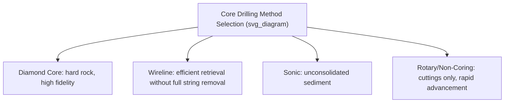
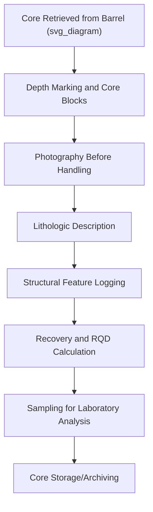

## Core Drilling and Sample Description

### Definition and Scope

Core drilling is the process of extracting continuous cylindrical rock or sediment samples from the subsurface using rotary drilling equipment with a hollow bit, preserving stratigraphic and structural relationships that surface sampling cannot capture. Core description is the systematic logging of these recovered samples to build a continuous subsurface record used in stratigraphy, resource exploration, paleoclimatology, and engineering geology.

**Key Points**

- Core drilling preserves depth-continuous, spatially oriented subsurface information unavailable from surface outcrop mapping alone.
- Core recovery — the percentage of the drilled interval actually retrieved intact — is a critical quality metric affecting data reliability, particularly in fractured or poorly consolidated formations.
- Systematic, standardized core logging (lithology, structures, contacts, sedimentary features) is essential for the resulting dataset to be comparable and useful across a project or between different geologists.

### Core Drilling Methods

#### Diamond Core Drilling

The dominant method for hard rock coring, using a diamond-impregnated drill bit that cuts an annular groove, leaving an intact cylindrical core to pass up through the hollow drill string into a core barrel.

- **Standard core diameters** follow an internationally recognized sizing convention (e.g., common wireline sizes include NQ, ~47.6 mm; HQ, ~63.5 mm; PQ, ~85 mm), with larger diameters providing more material for analysis but requiring more powerful and costly drilling equipment.

#### Wireline Coring

A method allowing the inner core barrel (containing the retrieved core) to be retrieved via a cable through the drill string without removing the entire drill string from the hole, substantially improving drilling efficiency compared to conventional (non-wireline) coring methods that require full string removal for each core run.

#### Sonic Drilling

Uses high-frequency vibration combined with rotation to advance the drill string, particularly effective in unconsolidated sediments (sand, gravel, clay) where diamond coring is less effective; commonly used in environmental and geotechnical investigations.

#### Rotary (Non-Coring) Drilling

Produces rock cuttings rather than intact core, used primarily for rapid hole advancement (e.g., oil and gas exploration wells) where continuous core is not required for the full interval, often supplemented by targeted coring at intervals of specific interest.

### Core Recovery and Quality Metrics

**Core Recovery** is the percentage of a drilled interval successfully retrieved as intact core:

$$\text{Recovery (\%)} = \frac{\text{Length of Core Recovered}}{\text{Length of Interval Drilled}} \times 100$$

Recovery below 100% typically indicates loss of material due to fracturing, poor consolidation, or drilling-induced disturbance, and is recorded for every core run as a standard quality indicator.

**Rock Quality Designation (RQD)** is a widely used index quantifying rock mass fracturing, calculated from the core:

$$RQD = \frac{\sum \text{Length of Core Pieces} \geq 10 \text{ cm}}{\text{Total Length of Core Run}} \times 100$$

Only pieces of sound, unweathered core measuring 10 cm or longer (measured along the core axis) are counted in the numerator. RQD is widely used in geotechnical and mining engineering as a first-order indicator of rock mass quality, with published classification ranges (e.g., commonly cited bands from "very poor" below 25% to "excellent" above 90%). [Widely used standard engineering geology index; specific quality-band boundaries can vary slightly between reference sources/standards.]

### Core Orientation

Preserving the original spatial orientation of structural features (bedding, fractures, foliation) observed in core requires specialized orientation tools during drilling, since a standard core barrel does not by itself record which way the core was oriented in the ground:

- **Mechanical orientation tools**: scribe a reference line on the core surface correlated to a known compass direction as it is cut.
- **Electronic orientation tools**: use downhole sensors (accelerometers, magnetometers, or gyroscopic systems in magnetically disturbed environments) to record orientation continuously during drilling.

Without orientation data, structural measurements from core can typically only report the **angle relative to the core axis** (apparent dip relative to drilling direction) rather than true geographic strike and dip.

### Standard Core Logging Procedure

1. **Depth marking**: core is laid out in sequential order in labeled core trays or boxes immediately upon retrieval, with depth markers placed at the top and bottom of each run to prevent depth-position errors.
2. **Photography**: standard practice is to photograph core (wet and/or dry) before extensive handling, providing a permanent visual record and cross-check against the written log.
3. **Lithologic description**: systematically recording rock type, color (often using standardized color charts, e.g., Munsell), grain size, mineralogy, texture, and any diagnostic features at each interval.
4. **Structural logging**: fractures, bedding planes, faults, and veins are logged with their apparent angle to the core axis and, if orientation data is available, converted to true strike/dip.
5. **Contact logging**: recording the precise depth of lithologic contacts, noting whether the contact is sharp, gradational, or structurally disrupted.
6. **Sampling intervals**: selecting specific depth intervals for laboratory analysis (geochemistry, geochronology, petrophysical testing) based on the logged description and project objectives.

### Standard Core Log Format

A core log typically presents information in parallel depth-indexed columns or tracks, a format also standard in wireline geophysical logging:

| Depth (m) | Recovery/RQD | Lithology | Structures | Sample Interval | Description |
| --- | --- | --- | --- | --- | --- |
| 10.0–10.5 | 95% / 80% | Sandstone | Fractures @ 45° to axis | — | Fine-grained, well-sorted, quartz-rich |
| 10.5–11.2 | 88% / 65% | Shale | Bedding parallel to axis | Geochem-014 | Dark gray, fissile, minor pyrite |

### Sedimentary and Stratigraphic Features in Core

Core description places particular emphasis on features informative for depositional environment interpretation:

- **Grain size trends**: fining-upward or coarsening-upward sequences indicative of specific depositional systems (e.g., fluvial channel fill vs. deltaic progradation).
- **Sedimentary structures**: cross-bedding, ripple lamination, bioturbation intensity, and their preservation in the cylindrical core geometry (often only a partial cross-section of a 3D structure is visible).
- **Diagenetic features**: cementation, dissolution features, and secondary mineralization observed in core, relevant to reservoir quality assessment in hydrocarbon and groundwater applications.

### Core-to-Log Correlation

In many subsurface investigation contexts (particularly petroleum and groundwater exploration), recovered core is correlated against downhole geophysical logs (gamma ray, resistivity, density logs) run in the same borehole, since geophysical logs provide continuous depth coverage even across intervals of poor core recovery, while core provides direct lithologic ground-truth for interpreting the geophysical signal.

### Diagram: RQD Calculation Concept (svg_diagram)

<svg xmlns="http://www.w3.org/2000/svg" viewBox="0 0 800 220" font-family="sans-serif">
<text x="400" y="20" text-anchor="middle" font-size="16" font-weight="bold">RQD Calculation Concept (svg_diagram)</text>
<rect x="50" y="70" width="700" height="30" fill="none" stroke="black" />
<text x="400" y="60" text-anchor="middle" font-size="10">1.0 m Core Run</text>
<rect x="50" y="70" width="150" height="30" fill="lightgray" stroke="black" />
<text x="125" y="90" text-anchor="middle" font-size="8">15 cm (counts)</text>
<rect x="200" y="70" width="60" height="30" fill="white" stroke="black" />
<text x="230" y="90" text-anchor="middle" font-size="7">6cm (broken)</text>
<rect x="260" y="70" width="200" height="30" fill="lightgray" stroke="black" />
<text x="360" y="90" text-anchor="middle" font-size="8">20 cm (counts)</text>
<rect x="460" y="70" width="290" height="30" fill="lightgray" stroke="black" />
<text x="605" y="90" text-anchor="middle" font-size="8">29 cm (counts)</text>

<text x="400" y="140" text-anchor="middle" font-size="11">RQD = (15+20+29)/100 × 100 = 64%</text>

<text x="400" y="165" text-anchor="middle" font-size="10" font-style="italic">Only intact pieces ≥ 10 cm are counted toward RQD</text>

</svg>

### Applications

- Petroleum and natural gas reservoir characterization
- Groundwater aquifer characterization and hydrogeologic investigation
- Mineral exploration and resource/reserve estimation (grade continuity, ore geometry)
- Geotechnical site investigation for foundation design and slope stability (RQD-based rock mass classification)
- Paleoclimate reconstruction (lake sediment cores, marine sediment cores, ice cores — noting that ice coring involves substantially different equipment and handling protocols than rock coring)
- Stratigraphic correlation across a basin using multiple boreholes

### Limitations and Considerations

- **Core loss and disturbance**: poor recovery in fractured, unconsolidated, or highly weathered intervals introduces data gaps precisely where subsurface conditions may be most geologically significant (e.g., fault zones), a well-recognized limitation in core-based investigation.
- **Orientation ambiguity without dedicated tools**: standard (non-oriented) coring cannot by itself provide true geographic strike and dip of structural features, limiting structural interpretation unless orientation equipment is used.
- **Core-log depth mismatch**: minor depth discrepancies between recovered core and geophysical logs can occur due to core stretch, driller's depth recording error, or incomplete recovery, requiring careful depth-shifting/correlation during integration. [Inference — a well-documented practical challenge in subsurface data integration, with magnitude varying by drilling conditions and formation type.]
- **Cost and access constraints**: core drilling is substantially more expensive and time-intensive than rotary cuttings drilling or surface mapping, generally limiting the density of coring within a given project budget. [Inference — a widely understood industry cost trade-off, though relative costs vary by region, depth, and drilling method.]

### Related Topics

- Rock and Mineral Sample Collection
- Geologic Field Mapping Techniques
- Petrographic Microscopy and Thin Section Analysis
- Geophysical Well Logging Methods
- Stratigraphy and Sedimentary Depositional Environments
- Groundwater Aquifer Characterization
- Paleoclimate Reconstruction from Sediment and Ice Cores