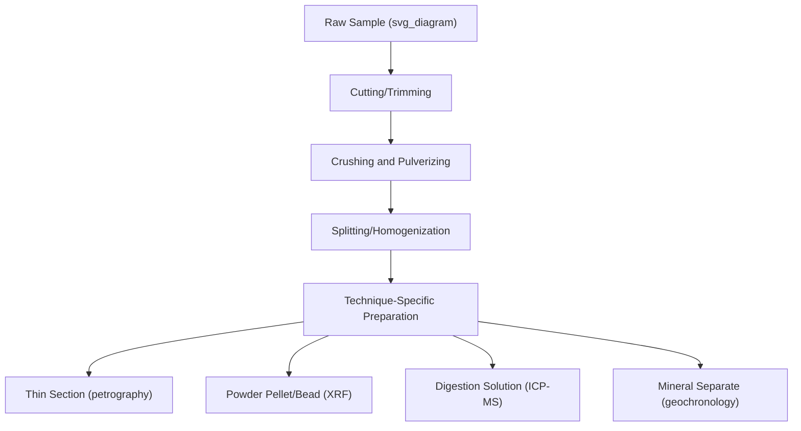
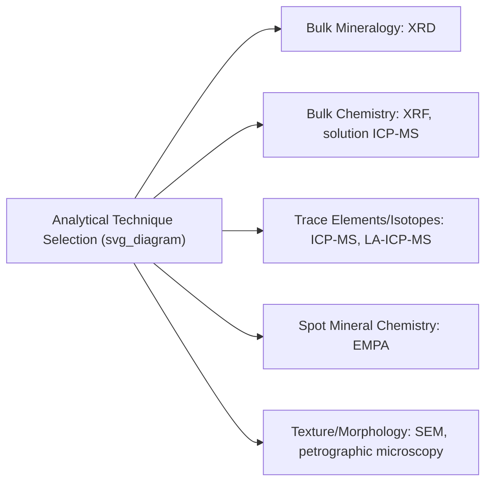

## Analytical Laboratory Techniques

### Definition and Scope

Analytical laboratory techniques comprise the instrumental and procedural methods used to characterize the mineralogical, chemical, isotopic, and physical properties of geologic samples following field collection (as covered in the preceding rock/mineral sampling and core drilling topics). These techniques transform raw physical specimens into quantitative and qualitative data used across virtually all subdisciplines of Earth science.

**Key Points**

- Analytical technique selection depends on the target information (bulk composition, trace elements, isotopic ratios, crystal structure, absolute age) and the required precision, sensitivity, and spatial resolution.
- Sample preparation quality is frequently as important as instrument capability in determining final data quality — poor preparation can introduce errors no instrument can correct for.
- Most modern geochemical and geochronological techniques rely on mass spectrometry in some form, differing primarily in ionization method and mass analyzer configuration.

### Sample Preparation Overview

Building on the field collection and core logging workflows covered previously, laboratory preparation typically proceeds through:

### Petrographic Microscopy

Uses a **polarizing (petrographic) microscope** to examine thin sections (rock slices ground to a standard 30-micron thickness) under transmitted and reflected polarized light, exploiting the optical properties of minerals (birefringence, pleochroism, extinction angle, relief) to identify mineral phases and textural relationships.

- **Plane-polarized light (PPL)**: reveals color, relief, and cleavage.
- **Cross-polarized light (XPL)**: reveals birefringence colors and extinction behavior, critical for mineral identification.

Petrography remains foundational for rock classification (e.g., QAPF diagram classification of igneous rocks based on modal mineral proportions) and textural/paragenetic interpretation, despite being a comparatively low-cost, well-established technique relative to instrumental methods below.

### X-Ray Diffraction (XRD)

Determines mineral phases present in a sample by measuring the diffraction pattern produced when X-rays interact with the periodic atomic structure of crystalline minerals, governed by **Bragg's Law**:

$$n\lambda = 2d\sin\theta$$

where $n$ is an integer (diffraction order), $\lambda$ is the X-ray wavelength, $d$ is the spacing between crystal lattice planes, and $\theta$ is the angle of incidence. Each mineral produces a characteristic diffraction pattern (a set of peaks at specific $2\theta$ angles), allowing phase identification by comparison against reference databases — particularly valuable for fine-grained or clay-rich materials where individual grains cannot be optically resolved.

### X-Ray Fluorescence (XRF)

Measures bulk major and trace element chemistry by exciting a sample with a primary X-ray beam and measuring the characteristic secondary (fluorescent) X-rays emitted by each element as electrons return to lower energy states — the emitted energy is element-specific, enabling both identification and quantification.

- **Wavelength-dispersive XRF (WD-XRF)**: higher precision, generally used for major element analysis of fused glass beads.
- **Energy-dispersive XRF (ED-XRF)**: faster, often portable (handheld XRF units are increasingly used for rapid field or core-side screening), generally offering somewhat lower precision than WD-XRF. [Inference — relative precision comparison is a general instrumentation characteristic; specific performance depends on instrument model and calibration.]

### Inductively Coupled Plasma Mass Spectrometry (ICP-MS)

A highly sensitive technique for trace element and isotopic analysis, in which a liquid sample (from acid digestion of powdered rock) is nebulized and introduced into an argon plasma torch (~6,000–10,000 K), ionizing constituent elements, which are then separated and detected by mass-to-charge ratio ($m/z$) in a mass spectrometer.

- **Solution ICP-MS**: requires full sample digestion, providing high-precision bulk trace element/isotopic data.
- **Laser Ablation ICP-MS (LA-ICP-MS)**: uses a focused laser to ablate a small spot directly from a solid sample (thin section, mineral grain), enabling spatially resolved in-situ analysis without full digestion — widely used for trace element mapping and geochronology (e.g., U-Pb dating of zircon).

ICP-MS is capable of detecting trace elements at parts-per-billion or lower concentrations, making it the dominant technique for modern trace element geochemistry. [Well-established capability of the technique; specific detection limits vary by element and instrument configuration.]

### Electron Microprobe Analysis (EMPA / EPMA)

Uses a focused electron beam to excite characteristic X-rays from a polished sample surface (similar physical principle to XRF but at micron-scale spatial resolution), enabling precise quantitative major and minor element analysis of individual mineral grains — the standard technique for determining mineral chemistry (e.g., garnet zoning, feldspar composition) at the scale of individual crystals.

### Scanning Electron Microscopy (SEM)

Produces high-resolution images of sample surfaces using a focused electron beam, typically paired with an **Energy-Dispersive X-ray Spectroscopy (EDS)** detector for simultaneous qualitative-to-semiquantitative elemental analysis. Widely used for textural imaging (grain morphology, fracture surfaces, microfossil examination) and rapid mineral identification via combined imaging and spectral analysis.

### Geochronology (Radiometric Dating)

Determines absolute ages of geologic materials based on the known decay rates of radioactive isotopes, applying the fundamental radioactive decay equation:

$$N = N_0 e^{-\lambda t}$$

where $N$ is the number of parent atoms remaining, $N_0$ is the initial number of parent atoms, $\lambda$ is the decay constant, and $t$ is elapsed time.

**Common Methods**

| Method | Isotope System | Typical Application |
| --- | --- | --- |
| U-Pb | Uranium-238 → Lead-206; Uranium-235 → Lead-207 | Zircon dating, very long timescales (Ma to Ga) |
| K-Ar / Ar-Ar | Potassium-40 → Argon-40 | Volcanic rocks, metamorphic cooling ages |
| Rb-Sr | Rubidium-87 → Strontium-87 | Whole-rock and mineral isochron dating |
| Sm-Nd | Samarium-147 → Neodymium-143 | Long-lived isotope system, crustal evolution studies |
| Radiocarbon (¹⁴C) | Carbon-14 → Nitrogen-14 | Organic material, up to ~50,000 years |

**Isochron Method**: for systems like Rb-Sr, multiple cogenetic mineral/whole-rock samples with varying parent/daughter ratios but the same age and initial isotopic composition plot along a line (isochron) whose slope gives the age directly, providing an internal check on whether the closed-system assumption is valid.

### Stable Isotope Analysis

Measures ratios of stable (non-radioactive) isotopes of light elements (oxygen, carbon, hydrogen, nitrogen, sulfur), typically via Isotope Ratio Mass Spectrometry (IRMS), expressed in delta notation relative to a standard:

$$\delta^{18}O = \left(\frac{R_{sample}}{R_{standard}} - 1\right) \times 1000\ (\text{‰})$$

where $R$ is the ratio of the heavy to light isotope (e.g., $^{18}O/^{16}O$). Applications include paleoclimate reconstruction (ice core and speleothem oxygen isotopes as temperature proxies), paleoceanography (foraminifera oxygen isotopes), and provenance/diagenesis studies.

### Grain Size and Physical Property Analysis

- **Sieve analysis**: mechanical separation of sediment into size fractions using a stack of progressively finer mesh sieves, standard for sand-to-gravel-sized material.
- **Laser diffraction particle size analysis**: measures grain size distribution of fine-grained sediment (silt/clay) based on light scattering patterns.
- **Physical property testing**: porosity, permeability, density, and magnetic susceptibility measurements, particularly relevant to reservoir characterization and paleomagnetic studies.

### Quality Control and Standards

Rigorous laboratory practice requires:

- **Reference standards**: analyzing certified reference materials alongside unknowns to verify instrument accuracy and calibration.
- **Blanks**: processing procedural blanks (no sample) to quantify background contamination introduced during preparation.
- **Duplicates/replicates**: repeat analysis of a subset of samples to quantify analytical precision and reproducibility.
- **Inter-laboratory comparison**: participation in round-robin testing programs to verify consistency of results across different laboratories using nominally the same method. [Standard practice in analytical geochemistry and geochronology communities; specific participation and reporting requirements vary by field and journal.]

### Diagram: Isochron Dating Concept (svg_diagram)

<svg xmlns="http://www.w3.org/2000/svg" viewBox="0 0 700 320" font-family="sans-serif">
<text x="350" y="20" text-anchor="middle" font-size="16" font-weight="bold">Isochron Dating Concept (svg_diagram)</text>
<line x1="80" y1="270" x2="650" y2="270" stroke="black" />
<line x1="80" y1="270" x2="80" y2="50" stroke="black" />
<text x="360" y="300" text-anchor="middle" font-size="10">Parent/Daughter Ratio (e.g., ⁸⁷Rb/⁸⁶Sr)</text>
<text x="40" y="160" text-anchor="middle" font-size="10" transform="rotate(-90 40,160)">Daughter Ratio (⁸⁷Sr/⁸⁶Sr)</text>
<line x1="100" y1="240" x2="600" y2="90" stroke="black" stroke-width="2" />
<circle cx="150" cy="228" r="5" fill="black" />
<circle cx="280" cy="190" r="5" fill="black" />
<circle cx="400" cy="155" r="5" fill="black" />
<circle cx="530" cy="115" r="5" fill="black" />

<text x="600" y="80" text-anchor="middle" font-size="9">Slope = age-dependent</text>

<text x="100" y="255" text-anchor="middle" font-size="9">Initial ratio (y-intercept)</text>

</svg>

### Applications Across Earth Science Subdisciplines

- Igneous and metamorphic petrology (mineral chemistry, geochronology, thermobarometry)
- Sedimentary provenance and diagenesis studies (detrital zircon geochronology, isotope geochemistry)
- Paleoclimatology and paleoceanography (stable isotope proxies)
- Economic geology (ore geochemistry, alteration mineral identification via XRD/SEM)
- Environmental geochemistry (contaminant characterization, background geochemical baselines)
- Planetary geology (analytical techniques applied to meteorite and returned extraterrestrial samples)

### Limitations and Considerations

- **Closed-system assumptions in geochronology**: radiometric dating methods generally assume no parent or daughter isotope gain/loss after system closure; violation of this assumption (through later heating, alteration, or weathering) can produce inaccurate ages, which is precisely why multi-method and isochron approaches are valued for internal consistency checking.
- **Detection limits and matrix effects**: analytical sensitivity and accuracy can be affected by the chemical matrix of the sample, requiring matrix-matched standards or correction procedures for reliable quantification. [Inference — a well-recognized general analytical chemistry principle, though its practical significance varies substantially by technique and sample type.]
- **Cost and turnaround time**: high-precision techniques (e.g., ICP-MS, EMPA, geochronology) generally involve significant per-sample cost and lead time compared to routine techniques like XRF or petrography, influencing sampling density decisions in project design. [Inference — general and widely understood resource trade-off in geoscience research design.]

### Related Topics

- Rock and Mineral Sample Collection
- Core Drilling and Sample Description
- Geochronology and Radiometric Dating Methods (extended treatment)
- Stable Isotope Geochemistry and Paleoclimate Proxies
- Igneous and Metamorphic Petrology
- Economic Geology and Ore Deposit Characterization