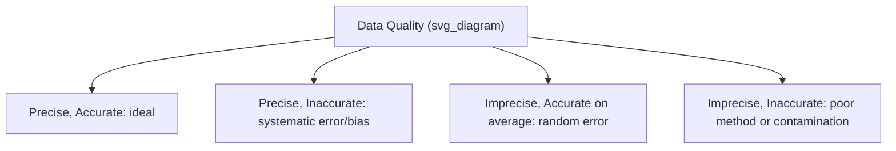
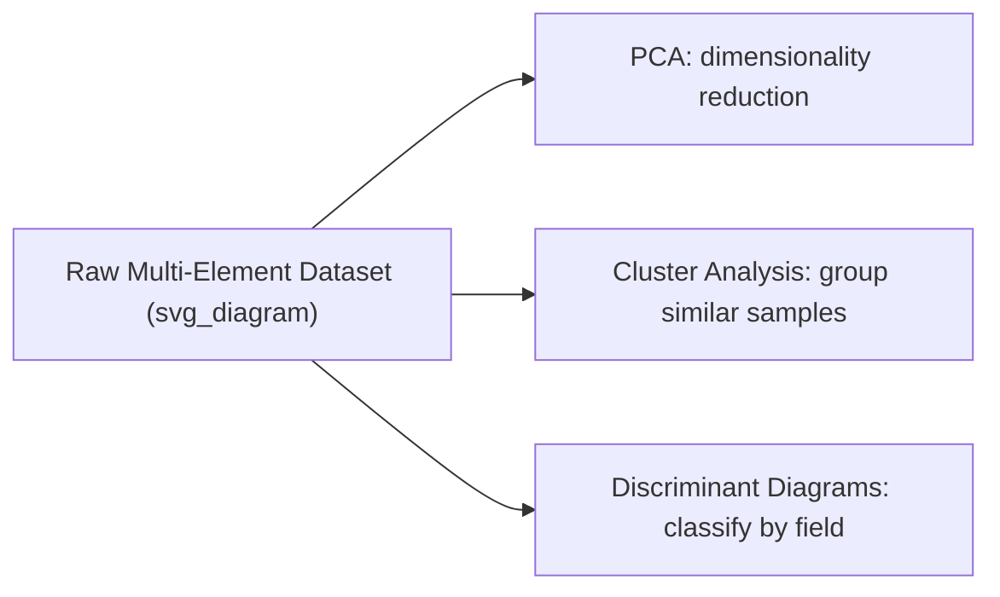
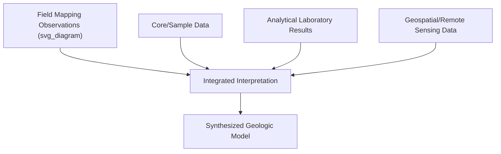

## Data Analysis and Interpretation

### Definition and Scope

Data analysis and interpretation is the process of transforming raw field and laboratory measurements — collected through the techniques covered throughout this chapter (field mapping, sample collection, core logging, analytical laboratory methods) — into statistically sound, geologically meaningful conclusions. It encompasses quality control, statistical treatment, uncertainty quantification, and the synthesis of multiple independent lines of evidence into a coherent interpretation.

**Key Points**

- Raw analytical output (an instrument reading, a field measurement) is not itself a scientific conclusion — interpretation requires statistical context, uncertainty assessment, and integration with other evidence.
- Distinguishing precision (reproducibility) from accuracy (closeness to true value) is fundamental to evaluating any geologic dataset.
- Multiple independent methods converging on a consistent interpretation substantially strengthens confidence, while a single unconfirmed dataset warrants more cautious interpretation.

### Data Quality Concepts

#### Precision vs. Accuracy

- **Precision**: the reproducibility of repeated measurements of the same quantity, regardless of whether they are correct — often quantified as standard deviation or relative standard deviation (RSD) of replicate analyses.
- **Accuracy**: the closeness of a measurement to the true (or accepted reference) value, typically assessed by analyzing certified reference materials alongside unknowns (as discussed under quality control in the previous laboratory techniques topic).

$$RSD (\%) = \frac{\sigma}{\bar{x}} \times 100$$

where $\sigma$ is the standard deviation of replicate measurements and $\bar{x}$ is the mean.

#### Error Types

- **Systematic (bias) error**: a consistent offset affecting all measurements in the same direction, often traceable to instrument calibration, a flawed procedure, or an uncorrected matrix effect.
- **Random error**: unpredictable variation arising from inherent measurement noise, generally reducible (in terms of the mean's uncertainty) by increasing the number of replicate measurements.

### Uncertainty Quantification

Every reported geologic measurement should carry an associated uncertainty estimate, since a value without stated uncertainty provides limited information about its reliability.

#### Propagation of Uncertainty

When a derived quantity is calculated from multiple measured inputs, uncertainties propagate through the calculation. For a function $f(x, y)$ with independent, uncorrelated uncertainties $\sigma_x$ and $\sigma_y$:

$$\sigma_f = \sqrt{\left(\frac{\partial f}{\partial x}\sigma_x\right)^2 + \left(\frac{\partial f}{\partial y}\sigma_y\right)^2}$$

**Example**

A radiometric age calculated from a decay equation depends on both the measured isotopic ratio and the decay constant, each with their own uncertainty; the reported age's uncertainty must incorporate both sources, which is why geochronological ages are conventionally reported with an explicit $\pm$ uncertainty (e.g., "$452.3 \pm 1.8$ Ma") rather than as a bare number.

#### Confidence Intervals

A confidence interval expresses the range within which the true value is expected to fall with a stated probability (commonly 95%), calculated from the sample standard deviation and sample size using the appropriate statistical distribution (commonly the t-distribution for small sample sizes).

### Statistical Treatment of Geologic Data

#### Descriptive Statistics

Mean, median, mode, standard deviation, and range are used to summarize datasets such as geochemical concentrations, grain size distributions, or structural orientation measurements. Geochemical concentration data (spanning several orders of magnitude) is often better summarized using a **log-normal** rather than normal (Gaussian) statistical treatment, since many natural geochemical processes produce approximately log-normal distributions. [Well-established observation in geochemistry; the degree to which any specific dataset follows log-normal behavior should still be checked rather than assumed.]

#### Outlier Identification

Statistical tests (e.g., the Grubbs' test, or simple visual inspection via box plots) help identify anomalous data points, though outliers should be evaluated for a plausible geologic or analytical cause before exclusion — an outlier removed without justification risks discarding genuine (if unusual) geologic signal rather than analytical error.

#### Correlation and Regression

Bivariate and multivariate statistical relationships (e.g., correlating trace element ratios to identify magmatic differentiation trends, or regressing isotopic ratios for isochron age calculation as covered in the geochronology topic) are foundational tools for identifying geologically meaningful patterns within a dataset.

$$r = \frac{\sum (x_i - \bar{x})(y_i - \bar{y})}{\sqrt{\sum (x_i - \bar{x})^2 \sum (y_i - \bar{y})^2}}$$

where $r$ is the Pearson correlation coefficient, quantifying the strength and direction of a linear relationship between two variables.

### Multivariate and Compositional Data Analysis

Geochemical datasets are inherently **compositional** (values expressed as parts of a whole, such as weight percent oxides summing to 100%), which introduces statistical constraints not present in unconstrained data — a well-recognized methodological consideration in modern geochemistry, since standard statistical techniques designed for unconstrained data can produce spurious correlations when applied naively to compositional data. Specialized approaches (e.g., log-ratio transformations) are increasingly used to address this. [Inference — the compositional data problem is well-established in the geochemistry/geostatistics literature, though adoption of specialized log-ratio methods varies across the discipline and by subfield.]

Common multivariate techniques applied to geochemical and mineralogical datasets:

- **Principal Component Analysis (PCA)**: reduces dimensionality of multi-element datasets to identify dominant patterns of geochemical variation.
- **Cluster analysis**: groups samples with similar geochemical or mineralogical characteristics, useful for classifying rock populations or identifying distinct geochemical facies.
- **Discriminant diagrams**: bivariate or ternary plots with empirically or theoretically defined fields (e.g., tectonic discrimination diagrams for basalt geochemistry) used to classify samples by inferred origin.

### Integrating Multiple Data Sources

Robust geologic interpretation typically synthesizes multiple independent lines of evidence rather than relying on a single dataset:

**Example**

Interpreting the tectonic setting of an ancient volcanic sequence might combine: field-mapped stratigraphic relationships and structural orientation data, whole-rock geochemistry plotted on tectonic discrimination diagrams, zircon U-Pb ages establishing the eruption timing, and regional GIS-based structural mapping — with confidence in the final interpretation increasing where these independent datasets are mutually consistent, and requiring closer scrutiny where they conflict.

### Data Visualization Principles

Effective geologic data visualization choices depend on data type:

- **Bivariate/ternary plots**: for compositional or two/three-variable relationships (e.g., QAPF or AFM diagrams).
- **Stratigraphic columns**: depth/time-ordered lithologic and structural data (directly extending the core logging format covered earlier).
- **Stereonets**: for structural orientation data (as covered in the field mapping topic).
- **Spatial maps (GIS-based)**: for geographically distributed data, allowing overlay with other spatial layers as covered in the geospatial technology chapter.
- **Time-series plots**: for temporally sequential data (e.g., paleoclimate proxy records, monitoring data).

### Reporting Standards and Reproducibility

- **Explicit methodology reporting**: documenting analytical methods, instrument parameters, reference standards used, and detection limits allows other researchers to evaluate data quality and attempt reproduction.
- **Raw data archiving**: increasingly expected practice (and often required by journals and funding agencies) to deposit raw analytical data in public repositories, supporting reanalysis and meta-analysis by other researchers. [Inference — this is a clear and growing trend in geoscience publishing norms, though specific requirements vary by journal, funding body, and subdiscipline.]
- **Distinguishing observation from interpretation**: field notes and lab reports should clearly separate directly observed/measured data from the interpretations drawn from them, preserving the ability for future re-interpretation as new evidence or methods become available.

### Diagram: Convergent Lines of Evidence (svg_diagram)

<svg xmlns="http://www.w3.org/2000/svg" viewBox="0 0 700 300" font-family="sans-serif">
<text x="350" y="20" text-anchor="middle" font-size="16" font-weight="bold">Convergent Lines of Evidence (svg_diagram)</text>
<circle cx="200" cy="120" r="70" fill="none" stroke="black" fill-opacity="0.1" />
<text x="200" y="120" text-anchor="middle" font-size="10">Field Data</text>
<circle cx="350" cy="80" r="70" fill="none" stroke="black" fill-opacity="0.1" />
<text x="350" y="80" text-anchor="middle" font-size="10">Geochemistry</text>
<circle cx="500" cy="120" r="70" fill="none" stroke="black" fill-opacity="0.1" />
<text x="500" y="120" text-anchor="middle" font-size="10">Geochronology</text>

<text x="350" y="230" text-anchor="middle" font-size="12" font-weight="bold">Overlap Region = Higher Confidence Interpretation</text>

<text x="350" y="270" text-anchor="middle" font-size="10" font-style="italic">Interpretations resting on a single dataset warrant more caution than those supported by convergent evidence</text>

</svg>

### Common Pitfalls in Geologic Data Interpretation

- **Overinterpreting small sample sizes**: drawing strong conclusions from a small number of samples or measurements, without acknowledging the correspondingly wide uncertainty.
- **Confirmation bias**: selectively emphasizing data consistent with a preferred hypothesis while downplaying inconsistent results — a general risk in any interpretive science, mitigated by transparent reporting of all data (including inconsistent measurements) and explicit consideration of alternative interpretations.
- **Ignoring closed-system or steady-state assumptions**: many geochemical and geochronological interpretive frameworks rest on underlying assumptions (as discussed under geochronology in the prior topic) that should be explicitly evaluated for each dataset rather than assumed to universally hold.
- **Conflating correlation with causation**: statistical correlation between two geologic variables does not by itself establish a causal or genetic relationship; a plausible geologic mechanism should support any inferred relationship, an important general principle in interpretive geoscience. [Well-established general scientific reasoning principle, applicable here as elsewhere.]

### Related Topics

- Analytical Laboratory Techniques
- Geologic Field Mapping Techniques
- Core Drilling and Sample Description
- Geographic Information Systems (spatial data integration)
- Geochronology and Radiometric Dating Methods
- Statistical Methods in the Geosciences (Compositional Data Analysis)