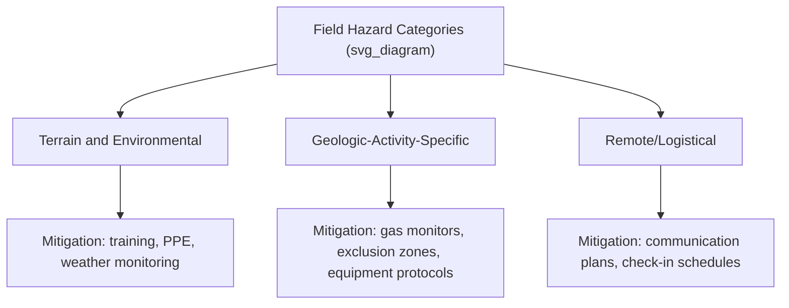
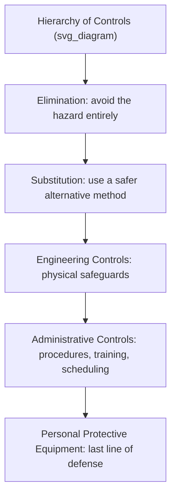

## Fieldwork Safety and Ethics

### Definition and Scope

Fieldwork safety and ethics encompasses the risk management practices, protocols, and professional conduct standards governing geologic and Earth science field activities. It integrates physical safety planning (hazard identification, emergency preparedness — directly connecting to the disaster preparedness principles covered earlier in this course) with the ethical obligations geoscientists hold toward research subjects, host communities, colleagues, and the environments they study.

**Key Points**

- Field safety planning follows a hazard-identification-and-mitigation logic directly analogous to the natural hazards risk assessment framework covered earlier in this course, applied at the scale of an individual field program.
- Ethical obligations in fieldwork extend beyond data integrity to include informed consent, land access rights, cultural sensitivity, and equitable treatment of field team members.
- Both safety and ethics considerations are increasingly formalized through institutional review processes, professional codes of conduct, and funding agency requirements rather than left to individual discretion alone.

### Physical Field Hazards

#### Environmental and Terrain Hazards

- Falls from height, slope failure, and rockfall in steep or unstable terrain
- Extreme heat, cold, and altitude-related conditions (heat exhaustion/stroke, hypothermia, altitude sickness)
- Flash flooding, tidal hazards, and river crossing dangers
- Wildlife encounters (venomous animals, large mammals) and vector-borne disease risk (ticks, mosquitoes) depending on region

#### Geologic-Activity-Specific Hazards

- Active volcanic hazards (gas exposure, sudden eruption, unstable crater terrain) when working near active or dormant volcanic systems
- Underground/mine hazards (unstable workings, poor ventilation, confined space risk) during mine or cave-based fieldwork
- Drilling and heavy equipment hazards during core drilling operations (as covered in the prior topic), including moving machinery and pressurized systems

#### Remote and Logistical Hazards

- Isolation from emergency medical services, particularly relevant to fieldwork in remote regions
- Vehicle and off-road travel hazards
- Communication failure risk in areas without reliable cellular or satellite connectivity

### Risk Assessment Framework for Fieldwork

Applying the same conceptual risk model introduced in the natural hazards chapter ($R = P(H) \times V \times E$), field safety planning typically proceeds through a structured process:

1. **Hazard identification**: cataloging all reasonably foreseeable hazards specific to the field area, season, and planned activities.
2. **Risk assessment**: evaluating likelihood and severity of each identified hazard for the specific personnel and activities involved.
3. **Mitigation planning**: identifying controls to reduce risk — following the standard **hierarchy of controls** used broadly in occupational safety:

4. **Emergency response planning**: establishing evacuation procedures, communication protocols, and designated emergency contacts before fieldwork begins — directly paralleling the preparedness-phase planning covered in the disaster management topic.
5. **Ongoing monitoring**: reassessing conditions throughout the field program, since weather, terrain, and other conditions can change significantly during an extended field season.

### Standard Field Safety Protocols

- **Pre-departure planning**: filing a detailed field itinerary and check-in schedule with a designated contact who is not part of the field team.
- **Communication equipment**: satellite communicators or personal locator beacons (PLBs) for areas without cellular coverage, providing emergency alerting capability independent of terrestrial networks.
- **First aid preparedness**: appropriate first aid training (often wilderness-specific first aid certification for remote fieldwork) and a stocked first aid kit scaled to the remoteness and duration of the field program.
- **Buddy system**: conducting higher-risk field activities with at least two people rather than working alone, particularly in remote or hazardous terrain.
- **Weather and hazard monitoring**: checking forecasts and relevant hazard advisories (flood warnings, volcanic activity alerts) before and during fieldwork.
- **Institutional safety training**: many academic and government field programs require documented safety training (wilderness first aid, defensive driving, specific hazard training) before fieldwork authorization.

### Site-Specific Considerations

- **Volcanic and seismically active areas**: monitoring official hazard status/alert levels from responsible monitoring agencies, maintaining awareness of designated exclusion zones, and carrying appropriate gas detection equipment where relevant.
- **Mine and underground fieldwork**: adherence to mine safety regulations, use of appropriate respiratory and structural safety equipment, and awareness of ventilation and structural stability conditions.
- **Marine and coastal fieldwork**: tide table awareness, appropriate flotation/safety equipment, and communication protocols for vessel-based work.
- **International fieldwork**: additional considerations including political stability, required visas/permits, vaccination requirements, medical evacuation insurance, and local emergency service availability. [Specifics are jurisdiction- and time-dependent; always verify current conditions and requirements before departure.]

### Ethical Considerations in Fieldwork

#### Land Access and Permission

Obtaining proper permission before conducting fieldwork on private, indigenous, or protected land is both a legal and ethical obligation. This includes:

- Securing necessary permits from land management agencies (as referenced in the sample collection topic regarding collection permits)
- Respecting indigenous land rights and, where applicable, engaging in free, prior, and informed consent processes with indigenous communities whose land or cultural sites may be affected by fieldwork

#### Cultural Sensitivity and Community Engagement

Fieldwork conducted in or near local communities carries ethical obligations regarding:

- Respect for local customs, sacred sites, and cultural heritage
- Fair and transparent communication with local communities about the purpose and potential impacts of research
- Equitable collaboration with local researchers and institutions, avoiding "parachute science" practices where foreign researchers extract data or samples without meaningful local partnership, credit, or capacity-building. [Inference — this concern is increasingly and explicitly discussed in geoscience professional ethics literature and journal policies, reflecting a genuine and evolving disciplinary conversation, though practice varies across institutions and projects.]

#### Environmental Responsibility

- Minimizing physical disturbance to field sites, particularly in ecologically sensitive or protected areas
- Adhering to sample collection limits and permit conditions (as covered in the sample collection topic)
- Practicing "leave no trace" principles where applicable to minimize environmental footprint

#### Data Integrity and Research Ethics

- Accurate, honest recording and reporting of field observations, resisting the temptation to adjust data to fit an expected or preferred outcome (directly connecting to the confirmation bias concern raised in the data interpretation topic)
- Proper attribution and credit for contributions from field assistants, local guides, and collaborating researchers
- Compliance with institutional review requirements where fieldwork involves human subjects (e.g., interviews with local communities as part of hazard vulnerability studies)

#### Team Welfare and Equity

- Ensuring safe and equitable working conditions for all field team members, including attention to power dynamics between supervisors and students/junior staff that can affect willingness to report safety concerns or misconduct
- Awareness that field conditions can disproportionately affect team members differently depending on individual circumstances, and that inclusive planning benefits overall team safety and effectiveness. [Inference — this reflects a growing and well-documented area of discussion in geoscience field safety literature, though specific institutional practices and policies vary considerably.]

### Diagram: Field Safety Planning Cycle (svg_diagram)

<svg xmlns="http://www.w3.org/2000/svg" viewBox="0 0 700 300" font-family="sans-serif">
<text x="350" y="20" text-anchor="middle" font-size="16" font-weight="bold">Field Safety Planning Cycle (svg_diagram)</text>
<circle cx="350" cy="160" r="120" fill="none" stroke="black" stroke-dasharray="2" />

<text x="350" y="60" text-anchor="middle" font-size="10">Hazard ID</text>

<text x="500" y="120" text-anchor="middle" font-size="10">Risk Assessment</text>

<text x="480" y="240" text-anchor="middle" font-size="10">Mitigation Planning</text>

<text x="220" y="240" text-anchor="middle" font-size="10">Emergency Response Plan</text>

<text x="200" y="120" text-anchor="middle" font-size="10">Ongoing Monitoring</text>

<text x="350" y="290" text-anchor="middle" font-size="10" font-style="italic">Continuous cycle revisited throughout a field program, not a one-time exercise</text>

</svg>

### Institutional and Professional Frameworks

- Many universities and research institutions require formal field safety plans and risk assessments approved before fieldwork can proceed, particularly for international or high-hazard fieldwork.
- Professional geoscience organizations (e.g., the American Geosciences Institute, national geological societies) have published field safety and ethics guidance documents addressing both physical safety and professional conduct standards. [General landscape description; specific current guidance documents should be consulted directly, as content and organizations issuing guidance can change over time.]
- Occupational health and safety regulations (varying by country and jurisdiction) may impose legal requirements on employer-sponsored fieldwork beyond institutional policy. [Regulatory specifics are jurisdiction-dependent and subject to change; verify current requirements for any specific program.]

### Limitations and Considerations

- **Inherent unpredictability of field conditions**: even thorough planning cannot eliminate all risk in remote or hazardous natural environments; safety planning aims to reduce and manage risk rather than guarantee its complete elimination.
- **Resource constraints**: robust safety measures (satellite communication equipment, comprehensive training, adequate staffing for buddy-system protocols) require funding and institutional support that is not always equally available across research programs, which can create disparities in field safety capacity between well-funded and under-resourced projects. [Inference — a recognized structural concern in field science more broadly, though its scope and severity vary widely by institution, region, and funding source.]
- **Balancing scientific access with ethical/environmental constraints**: some scientifically valuable field sites carry significant restrictions (protected status, indigenous land rights, permit limitations) that appropriately constrain research access, requiring researchers to work within these boundaries rather than treating them as obstacles to be minimized.

### Related Topics

- Disaster Preparedness and Emergency Management (parallel risk/mitigation framework)
- Geologic Field Mapping Techniques
- Rock and Mineral Sample Collection (permitting and collection ethics)
- Core Drilling and Sample Description (drilling site safety)
- Research Ethics and Data Integrity in the Geosciences
- Volcanic Hazard Monitoring (site-specific field safety)