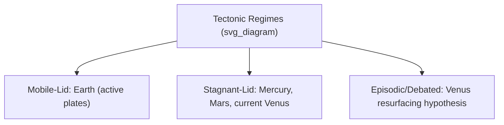

## Comparative Geology of Terrestrial Planets

### Definition and Scope

Comparative planetary geology examines the terrestrial (rocky) planets — Mercury, Venus, Earth, and Mars — alongside relevant moons, applying the same physical and chemical principles governing Earth's geology (covered throughout this course) to understand how differing initial conditions, size, and evolutionary history produced dramatically different planetary surfaces and interiors.

**Key Points**

- All terrestrial planets share a broadly similar bulk composition (silicate mantle, metallic core) but differ enormously in thermal evolution, tectonic style, and surface geology due to differences in size, distance from the Sun, and accretionary history.
- Planetary size strongly controls thermal evolution: smaller planets lose internal heat faster relative to their volume, directly affecting geologic activity duration.
- Impact cratering record and surface age dating (crater counting) provide a comparative chronological framework usable across all terrestrial bodies, in the absence of radiometrically dated in-situ samples for most of them.

### Bulk Planetary Comparison

| Property | Mercury | Venus | Earth | Mars |
| --- | --- | --- | --- | --- |
| Radius (km) | ~2,440 | ~6,052 | ~6,371 | ~3,390 |
| Mean density (g/cm³) | ~5.43 | ~5.24 | ~5.51 | ~3.93 |
| Core size (relative) | Very large (~85% of radius) | Moderate | Moderate (~55% of radius) | Moderate-small |
| Active plate tectonics | No | No | Yes | No |
| Global magnetic field | Weak, present | Absent (no internal dynamo) | Strong, present | Absent (residual crustal magnetism only) |
| Atmosphere | Negligible | Dense CO₂ (~92 bar surface pressure) | N₂-O₂ (~1 bar) | Thin CO₂ (~0.006 bar) |

### Planetary Thermal Evolution and Size Effects

Planetary heat loss rate depends on the surface-area-to-volume ratio, which scales inversely with radius:

$$\frac{A}{V} \propto \frac{1}{R}$$

Smaller bodies (Mercury, Mars) have proportionally larger surface area relative to their volume, cooling faster than larger bodies (Earth, Venus) for a given internal heat production rate. This is a primary reason Mercury and Mars are widely inferred to have effectively ceased major internal tectonic/volcanic activity earlier than Earth, though the precise thermal history of each body involves additional factors (core composition, radiogenic heat production, presence/absence of a persistent dynamo). [Inference — the general size-cooling relationship is well-established physics; the specific timing and completeness of each planet's thermal shutdown remains an active area of planetary science research with some uncertainty.]

### Tectonic Styles

#### Earth: Plate Tectonics

Earth is the only terrestrial planet confirmed to exhibit active plate tectonics — a mobile lithosphere broken into rigid plates that move relative to one another, driven by mantle convection, with new crust generated at mid-ocean ridges and recycled at subduction zones. The mechanisms permitting plate tectonics on Earth but not (currently) on the other terrestrial planets remain a subject of ongoing research, though water's role in weakening lithospheric strength is commonly cited as a contributing factor. [Inference — plate tectonics initiation and maintenance conditions are an active research topic; the water-weakening hypothesis is a prominent but not universally agreed-upon explanation.]

#### Venus: Stagnant-Lid with Possible Episodic Resurfacing

Venus's surface shows relatively few impact craters and an apparently young average surface age (commonly cited as several hundred million years based on crater counting statistics), leading to hypotheses of episodic, catastrophic resurfacing events rather than steady plate tectonics, alongside a currently dominant "stagnant lid" regime where the lithosphere behaves as a single immobile shell. [The relatively young/uniform crater-derived surface age of Venus is a long-standing observation from Magellan-era data; the specific resurfacing mechanism remains debated among competing hypotheses in the planetary science literature.]

#### Mercury and Mars: Stagnant-Lid Regimes with Ancient Tectonic Features

Both show evidence of past tectonic and volcanic activity (Mercury's global contractional fault scarps termed "lobate scarps," attributed to global cooling and interior contraction; Mars's Tharsis volcanic province and associated rifting) but currently exist in a stagnant-lid regime without active plate motion.

### Volcanism

- **Mercury**: extensive smooth plains interpreted as ancient volcanic flood basalts, with volcanism largely ceased for billions of years based on crater density.
- **Venus**: extensive volcanic plains covering most of the surface, with tens of thousands of volcanic edifices identified; whether any volcanism remains active today is an unresolved question, with some recent studies proposing evidence for ongoing activity based on surface changes detected in historical spacecraft data. [Unverified/Inference — active Venusian volcanism claims are recent and have generated significant scientific discussion but are not yet universally confirmed or resolved in the literature; treat as an evolving research question.]
- **Earth**: ongoing volcanism concentrated along plate boundaries (mid-ocean ridges, subduction-zone arcs) and hotspots, directly linked to plate tectonic processes.
- **Mars**: hosts the largest known volcano in the solar system (Olympus Mons, part of the Tharsis volcanic province), with volcanism believed to have persisted intermittently over much of Martian history, though current activity level is uncertain and generally considered low to absent. [Inference — Martian volcanic chronology relies heavily on crater-counting age estimates, which carry inherent uncertainty in the absence of returned samples with independently measured radiometric ages.]

### Impact Cratering and Surface Age Dating

Since only Earth (and to a limited extent the Moon, via returned Apollo samples) has directly radiometrically dated surface materials, planetary scientists rely heavily on **crater counting** to estimate relative and absolute surface ages across the solar system: older surfaces accumulate more impact craters over time, following a broadly predictable cratering rate calibrated against the lunar sample record.

$$N(D) \propto A \times t$$

where $N(D)$ is the number of craters larger than diameter $D$ per unit area, $A$ is a size-frequency-dependent cratering rate constant, and $t$ is surface age — this is a simplified conceptual relationship; actual crater chronology functions used in planetary science are considerably more complex, incorporating crater production and saturation effects. [Standard planetary science methodology; specific chronology functions vary by research group and are periodically revised as new calibration data becomes available.]

**Key Points**

- Earth's surface is comparatively young in crater-count terms not because it formed later, but because active plate tectonics, erosion, and volcanic resurfacing continuously destroy and recycle crust, erasing most ancient craters.
- Mercury's heavily cratered terrain (comparable in density to the lunar highlands) indicates an ancient surface largely unmodified since the era of heavy bombardment early in solar system history.

### Atmospheres and Surface Environment

| Feature | Mercury | Venus | Earth | Mars |
| --- | --- | --- | --- | --- |
| Greenhouse effect | Negligible (essentially no atmosphere) | Extreme (runaway greenhouse, surface ~465°C) | Moderate, life-sustaining | Weak (thin atmosphere, surface averaging well below freezing) |
| Surface liquid water | None | None (evaporated/lost) | Abundant | None currently (strong evidence for ancient liquid water) |
| Erosional agents | Impact cratering, some space weathering | Volcanism, minimal wind erosion | Water, wind, ice, tectonics, biological processes | Wind, ancient fluvial/glacial features, some current processes |

Venus's extreme surface conditions are attributed to a runaway greenhouse effect, in which an early ocean (if present, as widely hypothesized) evaporated, and subsequent loss of hydrogen to space combined with volcanic CO₂ outgassing produced the current dense CO₂ atmosphere. [Inference — the runaway greenhouse and early-ocean-loss narrative for Venus is a well-supported and widely cited hypothesis in planetary science, though direct empirical confirmation of an early Venusian ocean remains indirect.]

### Magnetic Fields and Core Dynamics

- **Earth and Mercury** possess active internal magnetic dynamos (Earth's substantially stronger), generated by convective motion in an electrically conductive liquid outer core.
- **Venus** lacks a global magnetic field despite having a likely similar core composition to Earth, possibly related to its slow rotation rate or differing thermal history affecting core convection. [Inference — the specific reason for Venus's absent dynamo remains an open research question with multiple competing hypotheses.]
- **Mars** lacks a present-day global field but shows strong localized crustal magnetization in its ancient southern highlands, indicating an active dynamo existed early in Martian history before shutting down.

### Water and Astrobiological Relevance

Comparative geology directly informs astrobiological assessment by identifying where liquid water — considered a key requirement for life as currently understood — may have existed or could persist:

- **Mars**: extensive geomorphological evidence (valley networks, outflow channels, lacustrine and deltaic deposits identified by rover and orbital missions) indicates significant liquid water activity in its early history (commonly associated with the Noachian period), motivating substantial astrobiological interest in ancient Martian sedimentary deposits.
- **Venus**: possible early ocean (as discussed above) makes it relevant to understanding habitability limits and the runaway greenhouse threshold, though its current surface is considered inhospitable to life as currently understood.
- **Icy moons** (beyond strictly terrestrial planets but relevant to comparative planetology, e.g., Europa, Enceladus): subsurface liquid water oceans beneath ice shells represent a different habitability paradigm than surface-water-based terrestrial planet models. [Broad astrobiology context; specific findings for individual icy moons continue to be refined by ongoing and planned missions.]

### Diagram: Terrestrial Planet Interior Structure Comparison (svg_diagram)

<svg xmlns="http://www.w3.org/2000/svg" viewBox="0 0 800 260" font-family="sans-serif">
<text x="400" y="20" text-anchor="middle" font-size="16" font-weight="bold">Terrestrial Planet Interiors (svg_diagram)</text>
<circle cx="120" cy="150" r="50" fill="none" stroke="black" />
<circle cx="120" cy="150" r="38" fill="lightgray" stroke="black" />
<text x="120" y="220" text-anchor="middle" font-size="10">Mercury</text>
<text x="120" y="235" text-anchor="middle" font-size="8">Large core (~85% radius)</text>
<circle cx="300" cy="150" r="80" fill="none" stroke="black" />
<circle cx="300" cy="150" r="42" fill="lightgray" stroke="black" />
<text x="300" y="250" text-anchor="middle" font-size="10">Venus</text>
<circle cx="500" cy="150" r="85" fill="none" stroke="black" />
<circle cx="500" cy="150" r="47" fill="lightgray" stroke="black" />
<text x="500" y="255" text-anchor="middle" font-size="10">Earth</text>
<circle cx="680" cy="150" r="55" fill="none" stroke="black" />
<circle cx="680" cy="150" r="26" fill="lightgray" stroke="black" />
<text x="680" y="225" text-anchor="middle" font-size="10">Mars</text>
<text x="680" y="240" text-anchor="middle" font-size="8">Smaller core (relative)</text>
</svg>

### Applications and Broader Significance

- Informs understanding of Earth's own geologic evolution by providing comparative "control" and "contrast" cases
- Guides mission target selection for astrobiology and sample-return missions
- Improves crater-chronology and surface-dating methods applicable across the solar system
- Supports models of planetary habitability limits relevant to exoplanet characterization

### Limitations and Considerations

- **Sparse ground-truth data**: apart from Earth and limited lunar/Martian samples, most comparative planetology relies on remote sensing and orbital/rover data rather than laboratory-analyzed samples with the precision achievable for terrestrial rocks (as covered in the analytical techniques topic), introducing greater interpretive uncertainty.
- **Crater-chronology uncertainty**: absolute age estimates derived from crater counting depend on assumed impact flux models calibrated primarily from lunar samples, introducing systematic uncertainty when extrapolated to other bodies. [Well-recognized methodological limitation in planetary science literature.]
- **Rapidly evolving research area**: several claims noted above (active Venusian volcanism, precise Venus dynamo absence explanation, exact Martian water history timeline) remain active areas of ongoing research and could be revised as new mission data becomes available. [Explicitly flagged as evolving/uncertain throughout this content where applicable.]

### Related Topics

- Plate Tectonics and Earth's Interior Structure
- Volcanic Hazard Monitoring
- Impact Cratering and Solar System Chronology
- Astrobiology and Habitability Criteria
- Mars Geology and Evidence for Ancient Water
- Planetary Magnetic Fields and Dynamo Theory
- Digital Elevation Models and Terrain Analysis (applied to planetary topography)