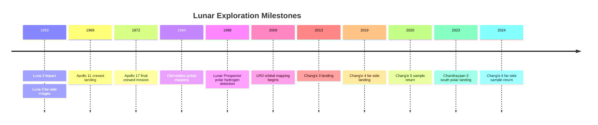

## Lunar Geology and Exploration

### Overview

The Moon is Earth's only natural satellite and the most extensively studied extraterrestrial body, serving as a natural laboratory for understanding planetary differentiation, impact processes, and the early history of the solar system. Unlike Earth, the Moon lacks active plate tectonics, a substantial atmosphere, and liquid water at its surface, which means its geological record extends back nearly 4.5 billion years with minimal erosion or resurfacing. This preservation makes lunar geology a critical reference point for reconstructing the bombardment history of the inner solar system.

### Formation and Early Differentiation

**Giant-Impact Hypothesis**

The dominant model for lunar origin proposes that a Mars-sized protoplanet, often referred to as Theia, collided with the proto-Earth approximately 4.5 billion years ago. Debris from this collision coalesced in orbit to form the Moon.

- Explains the Moon's relatively small iron core compared to Earth (core material from the impactor is inferred to have merged with Earth's core)
- Consistent with similar oxygen isotope ratios between lunar and terrestrial rocks
- [Inference] The exact impact geometry and Theia's original composition remain actively debated, with some models proposing multiple smaller impacts rather than a single giant collision

**Lunar Magma Ocean (LMO)**

Following accretion, the Moon is understood to have been largely molten, forming a global magma ocean.

- As the LMO cooled, dense minerals (olivine, pyroxene) crystallized and sank, forming the mantle
- Less dense plagioclase feldspar crystals floated, forming the anorthositic crust
- Incompatible elements concentrated in a final residual layer called KREEP (Potassium, Rare Earth Elements, Phosphorus)

$$\text{LMO crystallization sequence: Mg-rich olivine/pyroxene (mantle)} \rightarrow \text{plagioclase (crust)} \rightarrow \text{KREEP (residual liquid)}$$

### Major Geological Provinces

**Highlands (Terrae)**

- Composed primarily of anorthosite, a rock dominated by calcium-rich plagioclase feldspar
- Older and more heavily cratered than the maria, with surface ages generally exceeding 4 billion years
- Represent the original floating crust from the lunar magma ocean

**Maria (Basaltic Plains)**

- Dark, relatively smooth plains formed by basaltic lava flows that filled large impact basins
- Composed of iron- and magnesium-rich basalt, younger than the highlands (roughly 3.0–3.8 billion years old, with some flows younger)
- Concentrated heavily on the near side of the Moon due to greater crustal thinness there

**Near Side vs. Far Side Asymmetry**

| Feature | Near Side | Far Side |
| --- | --- | --- |
| Mare coverage | ~31% of surface | ~2% of surface |
| Crustal thickness | Thinner | Thicker |
| Visibility from Earth | Always visible (tidal locking) | Never directly visible |

[Inference] The asymmetry is commonly attributed to differences in crustal thickness affecting magma ascent, though the precise cause (e.g., a giant impact on the far side, or thermal effects from Earth) remains an open research question.

### Diagram: Lunar Cross-Section (svg_diagram)

<svg xmlns="http://www.w3.org/2000/svg" viewBox="0 0 600 400">
<title>Lunar Internal Structure Cross-Section (svg_diagram)</title>
<circle cx="300" cy="220" r="150" fill="#1a1a2e" stroke="#888" stroke-width="2" />
<circle cx="300" cy="220" r="150" fill="none" stroke="#555" stroke-width="1" />
<circle cx="300" cy="220" r="60" fill="#e94560" opacity="0.9" />
<circle cx="300" cy="220" r="30" fill="#f5a623" opacity="0.95" />
<circle cx="300" cy="220" r="150" fill="none" stroke="#cccccc" stroke-width="3" />
<circle cx="300" cy="220" r="145" fill="none" stroke="#8d99ae" stroke-width="6" />
<text x="300" y="30" text-anchor="middle" font-size="18" fill="#000">Lunar Internal Structure (svg_diagram)</text>
<line x1="300" y1="220" x2="300" y2="70" stroke="#000" stroke-width="1" />
<text x="310" y="80" font-size="12" fill="#000">Crust (~50 km avg)</text>
<line x1="300" y1="220" x2="200" y2="120" stroke="#000" stroke-width="1" />
<text x="30" y="115" font-size="12" fill="#000">Mantle (silicate, ~1330 km)</text>
<line x1="300" y1="220" x2="330" y2="180" stroke="#000" stroke-width="1" />
<text x="335" y="175" font-size="12" fill="#fff">Partial Melt Zone</text>
<line x1="300" y1="220" x2="300" y2="200" stroke="#fff" stroke-width="1" />
<text x="230" y="330" font-size="12" fill="#000">Outer Core (liquid Fe, ~330 km radius)</text>
<line x1="300" y1="220" x2="300" y2="220" stroke="#000" stroke-width="1" />
<text x="255" y="360" font-size="12" fill="#000">Inner Core (solid Fe, ~240 km radius)</text>
</svg>

### Regolith and Surface Processes

**Regolith Formation**

The lunar surface is covered by a fine, unconsolidated layer called regolith, produced by billions of years of micrometeorite bombardment and cosmic ray exposure ("gardening").

- Thickness varies: roughly 4–5 m on mare surfaces, 10–15 m on older highland surfaces
- Contains agglutinates (glassy welded aggregates formed by micrometeorite impacts)
- Fine-grained regolith particles are abrasive and electrostatically charged, posing engineering challenges for equipment and spacesuits

**Impact Cratering**

Craters are the dominant landform and serve as a chronometer for surface ages via crater-counting statistics (more craters generally indicate an older surface).

- Crater morphology transitions with size: simple bowl-shaped craters at small diameters, complex craters with central peaks and terraces at larger diameters
- Major basins (e.g., South Pole–Aitken, Imbrium) formed during intense early bombardment, with the "Late Heavy Bombardment" hypothesis proposing a spike in impact rates around 3.9 billion years ago [Inference] — this hypothesis is debated, with some researchers proposing a more gradual decline in impact flux instead

### Volatiles and Polar Ice

- Permanently shadowed regions (PSRs) near the lunar poles, particularly in craters like Shackleton (south pole) and Cabeus, maintain extremely low temperatures (below 110 K)
- Neutron spectrometry (Lunar Prospector) and radar/spectral data (Chandrayaan-1's Moon Mineralogy Mapper, LCROSS impact experiment) provided evidence for water ice mixed within regolith in these regions
- Volatile sources are inferred to include cometary and asteroidal impacts and solar wind-implanted hydrogen reacting with lunar oxygen [Inference]
- These deposits are a primary target for future In-Situ Resource Utilization (ISRU) for life support and propellant production

### Lunar Samples and Rock Types

**Sample Return Missions**

| Mission Program | Country/Agency | Sample Mass Returned | Notes |
| --- | --- | --- | --- |
| Apollo (11, 12, 14–17) | USA/NASA | ~382 kg | Crewed missions, 1969–1972 |
| Luna (16, 20, 24) | USSR | ~326 g | Robotic sample return |
| Chang'e 5 | China/CNSA | ~1,731 g | Robotic, 2020, young mare basalts |
| Chang'e 6 | China/CNSA | ~1,935 g | Robotic, 2024, first far-side samples |

**Key Rock Types**

- **Basalts**: Mare-forming, iron/titanium-rich; classified by titanium content (high-Ti, low-Ti)
- **Anorthosites (Ferroan Anorthosite, FAN)**: Ancient highland crust samples, among the oldest known lunar materials (~4.4–4.5 Ga)
- **Breccias**: Fragmented and re-lithified rock from impact events, common in highland samples
- **KREEP basalts**: Enriched in incompatible trace elements, linked to late-stage magma ocean residue

### Exploration History

**Robotic Era (Pre-Apollo)**

- Luna 2 (1959): First human-made object to reach the lunar surface
- Luna 3 (1959): First images of the lunar far side
- Ranger and Surveyor programs (USA): Impact and soft-landing reconnaissance for Apollo site selection

**Apollo Program**

- Apollo 11 (1969): First crewed landing, Mare Tranquillitatis
- Apollo 15–17: "J-missions" with Lunar Roving Vehicle, extended surface stays, and greater sample diversity
- Delivered the majority of geochemical ground truth used to calibrate remote sensing data

**Post-Apollo and Modern Missions**

- Clementine (1994) and Lunar Prospector (1998): Global mineralogical and neutron spectrometer mapping, first strong evidence for polar hydrogen
- Lunar Reconnaissance Orbiter (LRO, 2009–present): High-resolution imaging, topography (LOLA), and temperature mapping (Diviner)
- Chang'e program (China): Chang'e 3/4 landers and rovers (Chang'e 4 achieved first far-side landing in 2019), Chang'e 5/6 sample returns
- Chandrayaan program (India): Chandrayaan-1 volatile detection, Chandrayaan-3 (2023) south polar region landing
- Artemis program (NASA-led, international partners): Aims to return crewed missions to the lunar south polar region, targeting permanently shadowed regions for resource assessment

### Diagram: Lunar Exploration Timeline (Mermaid)

### Techniques in Lunar Geological Analysis

- **Crater counting/chronology**: Uses crater density calibrated against radiometrically dated Apollo/Luna samples to estimate surface ages of unsampled regions
- **Remote spectroscopy**: Reflectance spectroscopy (e.g., M3 instrument) identifies mineral absorption features (e.g., pyroxene, olivine, water/hydroxyl bands near 3 μm)
- **Gravity mapping**: GRAIL mission (2011–2012) mapped lunar gravity field at high resolution, revealing crustal thickness variations and subsurface structures like dikes
- **Seismology**: Apollo Passive Seismic Experiment network detected moonquakes, providing the primary direct evidence for internal layering (though signal duration and scattering differ notably from terrestrial seismograms due to dry, fractured regolith) — behavior may vary depending on instrument sensitivity and moonquake source depth

### Relevance to Astrobiology and Planetary Science

- The Moon preserves an impact record relevant to reconstructing bombardment history that likely affected early Earth's habitability conditions
- Lack of a lunar atmosphere/magnetosphere makes it a natural recorder of solar wind particles and cosmic ray exposure, useful for reconstructing solar activity history
- South Pole–Aitken basin material is a candidate for sampling to constrain the timing and intensity of early solar system bombardment relevant to the origin-of-life timeline on Earth [Inference]

### Related Topics

- Formation and differentiation of terrestrial planets
- Impact cratering mechanics and shock metamorphism
- Planetary magnetism and paleomagnetism (lunar paleointensity studies)
- In-Situ Resource Utilization (ISRU) architectures for space exploration
- Comparative planetology: Mercury's geology as an airless-body analog
- Radiometric dating techniques (Ar-Ar, U-Pb) applied to extraterrestrial samples
- Solar wind implantation and space weathering processes
- Artemis program architecture and lunar south pole site selection