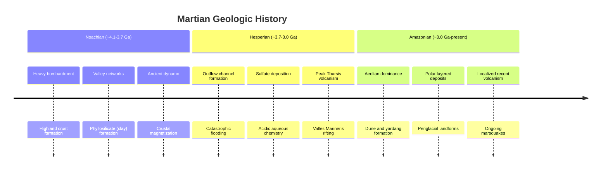

## Geology of Mars

### Overview

Mars is a small, differentiated terrestrial planet whose geologic record spans roughly 4.5 billion years, preserved with far less erosion and plate-tectonic overprinting than on Earth. Its surface exhibits a stark hemispheric dichotomy, the largest volcanic and canyon systems in the Solar System, abundant evidence of past liquid water, extensive aeolian and periglacial modification, and a thin, cold atmosphere that today limits active geologic processes largely to wind, ice, and minor mass wasting.

### Planetary Structure and Interior

**Bulk properties**

- Radius: ~3,389.5 km (about 0.53 Earth radii)
- Mass: ~6.42 × 10²³ kg (about 0.107 Earth masses)
- Mean density: ~3,933 kg/m³, lower than Earth's, consistent with a smaller metallic core and less mantle compression
- Surface gravity: ~3.71 m/s² (about 38% of Earth's)

**Internal layering**, largely constrained by NASA's InSight seismometer (2018–2022):

- **Crust**: Average thickness roughly 24–72 km, thinner beneath the northern lowlands and thicker beneath the southern highlands. Likely composed of two to three layers formed by early magmatism and impact gardening. [Inference: exact layer count and boundaries remain model-dependent]
- **Mantle**: Silicate mantle extending to a core-mantle boundary estimated near 1,560 km radius; seismic data suggest a relatively thick lithosphere (>500 km in places), consistent with limited or absent plate tectonics.
- **Core**: Liquid iron-nickel-sulfur core with a radius of approximately 1,830 km, larger and less dense than earlier models predicted, implying a significant light-element (sulfur, and possibly hydrogen/oxygen) content. The core appears entirely liquid today; no present-day global dynamo magnetic field exists, though strong remanent crustal magnetism (particularly in the southern highlands) records an ancient dynamo active in the first several hundred million years.

### Global Tectonic Framework: The Martian Dichotomy

The most fundamental first-order feature of Mars geology is the **crustal dichotomy**: the northern hemisphere is a low-elevation, smooth, sparsely cratered plain (likely resurfaced by volcanism, sedimentation, and possibly ancient oceanic processes), while the southern hemisphere is heavily cratered, ancient highland terrain standing several kilometers higher on average.

Leading explanatory hypotheses:

- **Giant impact hypothesis**: A single oblique impact in the early Noachian created the northern lowland basin (sometimes called the Borealis basin). [Inference: consistent with basin geometry modeling, but not universally accepted]
- **Endogenic (mantle convection) hypothesis**: Degree-1 mantle convection produced a long-wavelength crustal thickness asymmetry without a single impact.
- **Multiple-impact hypothesis**: Superposition of several large early basins produced the observed asymmetry.

Unlike Earth, Mars lacks active plate tectonics; its lithosphere behaves as a single rigid shell ("stagnant lid" regime), though evidence of past localized tectonic and possibly proto-plate-like crustal movement has been proposed for specific regions. [Speculation: degree of early plate-like mobility is actively debated]

### Volcanic Provinces

**Tharsis Bulge**

A continent-sized volcanic rise (~5,000 km across, up to ~10 km high) dominating the western hemisphere, hosting the Solar System's largest shield volcanoes. Tharsis loading is thought to have influenced global stress patterns, including the orientation of Valles Marineris.

- **Olympus Mons**: The largest known volcano in the Solar System — roughly 22 km high and ~600 km in basal diameter, with a summit caldera complex ~80 km across. Its low-viscosity basaltic lava flows and gentle slopes (average ~5°) resemble terrestrial shield volcanoes but on a far larger scale, permitted by Mars's lack of plate tectonics (the crust does not move away from the mantle plume/hotspot, allowing prolonged vertical growth) and lower gravity.
- **Tharsis Montes**: Arsia Mons, Pascani Mons (Pavonis Mons), and Ascraeus Mons, a chain of three large shield volcanoes aligned along the Tharsis rise.
- **Alba Mons**: A broad, low-relief shield volcano north of the main Tharsis complex, notable for its enormous areal extent relative to height.

**Elysium Rise**: A secondary volcanic province in the northern hemisphere, including Elysium Mons, Hecates Tholus, and Albor Tholus, with some of the geologically youngest volcanic and possibly cryovolcanic/fluvial features on Mars, including the Athabasca Valles outflow channel and Cerberus Fossae fracture system, associated with some of the most recent seismic activity (marsquakes) detected by InSight.

**Volcanic style**: Predominantly basaltic shield and plains volcanism with minor evidence for more evolved (silicic) volcanism in isolated locations (e.g., some highland paterae). Eruption styles evolved over time from more explosive early activity to effusive, long-lived shield-building.

### Valles Marineris and Tectonic Rifting

Valles Marineris is a vast canyon system stretching approximately 4,000 km long, up to 200 km wide, and up to 7 km deep — far exceeding Earth's Grand Canyon in every dimension. It is primarily interpreted as a tectonic rift/graben system related to Tharsis-induced crustal stresses, subsequently widened by mass wasting (landslides), fluvial erosion, and possibly ancient lake formation within interior basins. Layered sedimentary deposits within the canyon (informally called interior layered deposits) record complex depositional and erosional histories, including possible aeolian, lacustrine, and evaporite components.

### Impact Cratering Record and Chronology

Mars's surface age and stratigraphy are established primarily through **crater size-frequency distribution counting**, calibrated against lunar sample radiometric ages and cratering-rate models, since no Mars samples have yet been returned for direct radiometric dating (a key goal of the Mars Sample Return campaign).

Three major geologic/chronologic periods, defined by crater density and characteristic mineralogy/morphology:

1. **Noachian** (~4.1–3.7 Ga): Heavily cratered highlands terrain; era of highest erosion and valley network formation; phyllosilicate (clay) mineral formation indicating widespread aqueous alteration under neutral-to-alkaline conditions.
2. **Hesperian** (~3.7–3.0 Ga): Transitional period; widespread plains volcanism; formation of large outflow channels; sulfate mineral deposition indicating more acidic, evaporative aqueous environments.
3. **Amazonian** (~3.0 Ga–present): Youngest period; dominated by aeolian processes, periglacial/ice-related landforms, minor volcanism (locally into the last ~10s of millions of years), and limited but ongoing surface modification.

Notable impact basins include Hellas Planitia (one of the largest and deepest impact basins in the Solar System, ~2,300 km diameter, ~7 km deep) and Argyre Planitia, both southern highland features with associated ejecta and possible ancient lacustrine deposits.

### Hydrological and Fluvial Geomorphology

Extensive geomorphic evidence indicates that liquid water was present at or near the surface for substantial periods, particularly during the Noachian and early Hesperian:

- **Valley networks**: Dendritic, branching channel systems concentrated in ancient highland terrain, most consistent with precipitation-fed or groundwater sapping runoff during the Noachian, implying a warmer, wetter early climate. [Inference: the precise climate mechanism — "warm and wet" vs. episodic "cold and icy with transient melting" — remains actively debated]
- **Outflow channels**: Enormous, catastrophic flood-carved channels (e.g., Kasei Valles, Ares Vallis, Athabasca Valles) formed by sudden release of groundwater or subsurface ice melt, likely triggered by volcanic or impact heating, primarily during the Hesperian.
- **Paleolake basins and deltas**: Closed depressions with inlet/outlet channels and fan-delta deposits (e.g., Jezero Crater, the Perseverance rover landing site) record standing bodies of water and sediment transport, providing key astrobiology targets due to preserved fine-grained, potentially organic-bearing sediments.
- **Possible ancient ocean**: The northern lowlands have been proposed as the site of an ancient ocean (sometimes termed Oceanus Borealis) based on putative shoreline features and elevation data, though this remains contested due to ambiguous and discontinuous shoreline morphology. [Speculation/Unverified: ocean hypothesis lacks unambiguous confirmation]

### Cryosphere, Ground Ice, and Periglacial Geology

Mars today hosts substantial water ice in its polar caps and subsurface:

- **Polar ice caps**: The north polar cap is dominantly water ice with a thin seasonal CO₂ frost veneer; the south polar cap has a perennial CO₂ ice component overlying a water-ice-rich cap, with layered deposits (polar layered deposits) recording orbital-driven climate cycles analogous to Earth's ice-age stratigraphy.
- **Subsurface ground ice**: Detected via neutron/gamma-ray spectroscopy (Mars Odyssey) and directly imaged in fresh impact craters and scarps at mid-to-high latitudes; ice tables lie close to the surface poleward of roughly ±50–60° latitude.
- **Periglacial landforms**: Polygonal patterned ground, thermal contraction crack networks, and possible relict glacial landforms (lobate debris aprons, concentric crater fill, lineated valley fill) in the mid-latitudes suggest buried glacier-like ice deposits, some potentially decameters thick and geologically recent.
- **Recurring slope lineae (RSL)**: Dark, seasonally recurring streaks on steep slopes, historically debated between briny liquid water seepage and dry granular flow mechanisms; current consensus favors dry flow of granular material as the dominant explanation for most observed RSL, though the debate over any liquid-water contribution is not fully closed. [Inference: mechanism remains an active area of investigation]

### Surface Mineralogy and Aqueous Alteration History

Orbital spectroscopy (CRISM, OMEGA) and in-situ rover analysis (APXS, ChemCam, PIXL, SHERLOC) reveal a mineralogical sequence tied to changing water chemistry through time:

- **Phyllosilicates (clays)**: Noachian-age, indicating prolonged water-rock interaction under neutral pH; found extensively in ancient highland terrain (e.g., Nili Fossae, Mawrth Vallis).
- **Sulfates**: Hesperian-age, indicating acidic, evaporative conditions with limited water availability; prominent in layered deposits such as those in Meridiani Planum examined by the Opportunity rover.
- **Iron oxides**: Widespread ferric oxide (hematite-related) weathering products give Mars its characteristic red color; formed by oxidative weathering of basaltic material.
- **Silica and carbonate deposits**: Localized occurrences (e.g., opaline silica detected by Spirit rover, carbonates at Nili Fossae and analyzed by Curiosity/Perseverance) provide additional constraints on past aqueous chemistry and potential biosignature preservation environments.

### Aeolian Geology

Wind is the dominant active geomorphic agent on present-day Mars, given the thin (~6 mbar mean surface pressure) but persistently active atmosphere:

- **Dune fields**: Barchan, transverse, and linear dunes are common in craters, the north polar erg, and other basins, with migration rates measurable across repeated orbital imaging.
- **Yardangs**: Wind-eroded ridges carved into friable sedimentary or pyroclastic material, notably in the Medusae Fossae Formation, a vast, enigmatic, low-density deposit interpreted as ignimbrite, paleopolar ice-rich, or loess-like material. [Unverified: precise origin of Medusae Fossae Formation remains unresolved]
- **Dust devils and global dust storms**: Convective vortices continually redistribute fine dust; periodically, planet-encircling dust storms occur (e.g., the 2018 global dust storm that ended the Opportunity rover mission), representing the most dramatic short-timescale atmospheric-surface interaction on Mars.

### Mass Wasting and Slope Processes

Landslides within Valles Marineris and crater walls, boulder tracks on dune and dust-mantled slopes, and gully systems on poleward-facing crater walls (some showing evidence of recent activity, possibly linked to CO₂ frost sublimation processes rather than liquid water) represent ongoing, if geologically minor, surface modification. [Inference: CO₂ sublimation gully mechanism is well-supported for many sites but not confirmed as universal]

### Seismicity and Present-Day Activity

InSight's seismometer (SEIS) recorded over 1,300 marsquakes between 2018 and 2022, with:

- Magnitudes generally below Mw 5, the largest recorded near Mw 4.7
- Concentrated seismicity near the Cerberus Fossae region, suggesting ongoing tectonic or volcanic-related stress release
- Detection of meteorite impact seismic signals, providing an independent calibration for surface age dating
- Evidence supporting a still-warm, partially active interior, challenging the view of Mars as entirely geologically dead

### Astrobiological Relevance

Mars geology underpins astrobiology through the identification and characterization of environments with past habitability potential:

- **Habitability indicators**: Neutral-pH lacustrine and fluvial deposits (e.g., Gale Crater, studied by Curiosity; Jezero Crater delta, studied by Perseverance) show evidence of long-lived, chemically favorable aqueous environments.
- **Biosignature preservation**: Fine-grained mudstones, evaporite sequences, and silica/carbonate deposits are considered high-priority targets for organic molecule and potential biosignature preservation.
- **Sample caching**: Perseverance has cached rock cores from Jezero Crater's delta and crater floor for eventual return to Earth under the Mars Sample Return program, enabling laboratory-precision geochronology, isotopic, and biosignature analysis unattainable remotely.

### Simplified Cross-Sectional Structure

<svg xmlns="http://www.w3.org/2000/svg" viewBox="0 0 700 420">
<text x="350" y="30" text-anchor="middle" font-size="18" font-weight="bold" fill="#1a1a1a">Interior Structure of Mars (svg_diagram)</text>
<circle cx="350" cy="240" r="170" fill="#c9713b" stroke="#5a3018" stroke-width="2" />
<circle cx="350" cy="240" r="140" fill="#d98f52" stroke="#5a3018" stroke-width="1.5" />
<circle cx="350" cy="240" r="80" fill="#e8b64f" stroke="#5a3018" stroke-width="1.5" />
<circle cx="350" cy="240" r="45" fill="#f2d675" stroke="#5a3018" stroke-width="1.5" />
<text x="350" y="130" text-anchor="middle" font-size="13" fill="#1a1a1a">Crust (~24-72 km)</text>
<text x="350" y="175" text-anchor="middle" font-size="13" fill="#1a1a1a">Lithosphere/Mantle</text>
<text x="350" y="205" text-anchor="middle" font-size="13" fill="#1a1a1a">Lower Mantle</text>
<text x="350" y="245" text-anchor="middle" font-size="13" fill="#1a1a1a">Liquid Fe-Ni-S Core</text>
<text x="350" y="262" text-anchor="middle" font-size="11" fill="#1a1a1a">(~1,830 km radius)</text>
<line x1="350" y1="70" x2="350" y2="30" stroke="none" />
<line x1="180" y1="240" x2="30" y2="240" stroke="#333" stroke-width="1" />
<text x="20" y="235" text-anchor="end" font-size="12" fill="#1a1a1a">R ≈ 3,389.5 km</text>
</svg>

### Major Geologic Timeline (Mermaid)

### Key Points

- Mars preserves a ~4.5-billion-year geologic record with minimal plate-tectonic overprinting, unlike Earth.
- The crustal dichotomy, Tharsis volcanic complex, and Valles Marineris are the dominant first-order tectonic/volcanic features.
- Three chronologic periods (Noachian, Hesperian, Amazonian) are defined by crater density and correlate with distinct aqueous mineralogical regimes (clays → sulfates → oxides/ice).
- Extensive fluvial, lacustrine, and outflow channel geomorphology indicates substantial past liquid water activity, with implications for early habitability.
- Present-day activity is limited mainly to aeolian processes, minor mass wasting, ground-ice dynamics, and low-level seismicity, indicating a geologically quiescent but not entirely dead planet.

### Related Topics

- Martian polar layered deposits and orbital climate forcing (Milankovitch-analog cycles)
- Jezero Crater and Gale Crater astrobiology case studies
- Mars Sample Return mission architecture and geochronology goals
- Comparative planetology: Mars vs. Venus vs. Earth tectonic regimes
- Martian meteorites (SNC group) and their geochemical constraints
- Habitability of the Martian subsurface and potential extant microbial niches
- Medusae Fossae Formation origin hypotheses
- InSight seismic data and Martian interior modeling