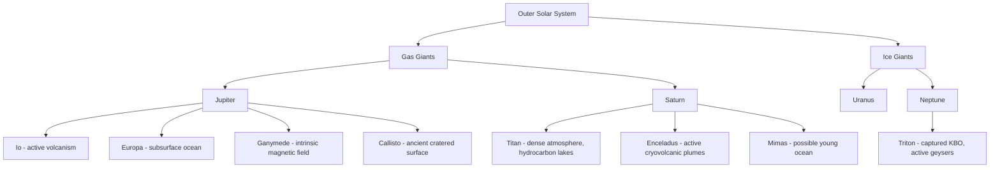

## Outer Planets and Their Moons

### Overview

The outer Solar System comprises four giant planets — Jupiter, Saturn, Uranus, and Neptune — divided into the gas giants (Jupiter, Saturn) and ice giants (Uranus, Neptune), along with an extensive system of natural satellites, ring systems, and small bodies. This region hosts several of the most promising astrobiological targets in the Solar System, primarily due to subsurface liquid water oceans within icy moons maintained by tidal heating.

### Gas Giants: Jupiter and Saturn

**Jupiter**

- Mass: ~1.898 × 10²⁷ kg (2.5× the mass of all other planets combined)
- Composition: Primarily hydrogen (~90% by molecule count) and helium, with a possible dilute or eroded core of heavier elements
- **Internal structure**: Molecular hydrogen envelope transitioning with depth and pressure into metallic hydrogen (electrically conductive liquid metal state) around ~0.8 Jupiter radii, surrounding a central core region. Juno gravity science indicates the core may be "fuzzy" or diluted rather than sharply defined. [Inference: exact core structure remains model-dependent, constrained by Juno gravitational moment measurements]
- **Atmosphere**: Banded zonal jet structure (alternating light zones and dark belts) driven by internal heat flux and rapid rotation (~9.9 hour day); the Great Red Spot is a long-lived anticyclonic storm, larger than Earth, that has persisted for at least ~150–190 years of continuous observation and is gradually shrinking. [Fact: shrinkage trend well-documented via long-term imaging]
- **Magnetosphere**: The strongest planetary magnetic field in the Solar System, generated by the metallic hydrogen dynamo, producing intense radiation belts that pose significant challenges for spacecraft and moon habitability assessment (particularly for Europa).
- **Rings**: Faint, dusty ring system, primarily sourced from micrometeoroid impacts on small inner moons.

**Saturn**

- Mass: ~5.68 × 10²⁶ kg; lowest mean density of any planet (less than water)
- **Internal structure**: Similar layered hydrogen/helium envelope to Jupiter but with a less pronounced metallic hydrogen layer due to lower internal pressure at a given depth; helium rain (helium immiscibility and downward migration) is invoked to explain Saturn's excess internal heat output relative to simple radiative cooling models.
- **Ring system**: The most extensive and visually prominent ring system in the Solar System, composed primarily of water ice with trace rocky material, organized into main rings (D, C, B, A) separated by gaps (e.g., Cassini Division) maintained by resonances with moons and embedded moonlets; ring particle sizes range from micrometers to tens of meters. Ring age remains debated between primordial (formed with Saturn) and relatively young (~100s of millions of years, from a disrupted moon or comet) origins. [Unverified: Cassini's Grand Finale gravity data favor a younger ring age in some analyses, but this is not fully settled]
- **Atmosphere**: Hexagonal jet stream feature at the north pole, a persistent, six-sided polar vortex pattern unique among observed planetary atmospheres in the Solar System.

### Ice Giants: Uranus and Neptune

**Uranus**

- Distinguishing feature: Extreme axial tilt (~98°), causing the planet to essentially roll along its orbital plane, producing extreme seasonal variation over its 84-year orbit
- **Internal structure**: "Icy" mantle (a hot, dense fluid of water, ammonia, and methane ices, not water ice in the conventional sense) surrounding a rocky core, beneath a hydrogen-helium outer envelope
- **Magnetic field**: Highly tilted (~59° from the rotation axis) and offset from the planet's center, suggesting a dynamo generated in a shell region rather than the deep interior
- **Rings**: Narrow, dark ring system, discovered via stellar occultation in 1977
- Notably low internal heat flux compared to the other giant planets, the cause of which remains an open problem in comparative planetology. [Unverified: leading hypotheses include a giant impact disrupting internal convection, but no consensus explanation exists]

**Neptune**

- Most distant giant planet; strongest sustained winds in the Solar System (locally exceeding 2,000 km/h)
- **Internal structure**: Similar icy-mantle composition to Uranus, with a rocky core
- **Great Dark Spot**: Analogous anticyclonic storm system observed by Voyager 2 (1989), which had disappeared by later Hubble observations, with new dark spots subsequently appearing and dissipating, indicating a more dynamic, shorter-lived storm regime than Jupiter's Great Red Spot
- Largest moon Triton is discussed below as a major astrobiological/geological target

### Galilean Moons of Jupiter

- **Io**: The most volcanically active body in the Solar System, driven by intense tidal heating from Jupiter's gravity and orbital resonance with Europa and Ganymede (Laplace resonance). Surface dominated by sulfur and sulfur dioxide deposits, with active silicate volcanism producing lava fountains and plumes detected by multiple spacecraft.
- **Europa**: Ice-crust-covered moon with strong evidence (magnetometer data from Galileo, surface geology, and induced magnetic field signatures) for a global subsurface saltwater ocean beneath a several-to-tens-of-kilometers-thick ice shell. Surface exhibits linear cracks (lineae), chaos terrain, and possible cryovolcanic plume activity (tentatively detected by Hubble, not yet confirmed by in-situ measurement). Considered one of the highest-priority astrobiology targets; NASA's Europa Clipper mission (launched 2024) is en route to characterize habitability. [Fact: mission status current as of most recent trajectory data; confirm launch/arrival timeline via updated sources for real-time status]
- **Ganymede**: Largest moon in the Solar System, larger than Mercury; the only moon known to generate its own intrinsic magnetic field, implying an internally generated dynamo, likely from a partially liquid iron core. Also believed to host a subsurface ocean, potentially sandwiched between layers of high-pressure ice.
- **Callisto**: Heavily cratered, geologically ancient surface with minimal resurfacing; possible subsurface ocean inferred from induced magnetic field data, though less strongly constrained than Europa or Ganymede.

### Major Moons of Saturn

- **Titan**: Second-largest moon in the Solar System, unique for possessing a dense nitrogen-methane atmosphere (surface pressure ~1.5 bar) and stable surface liquid hydrocarbon lakes/seas (methane/ethane), making it the only known body besides Earth with standing liquid on its surface. Exhibits an active hydrological cycle analogous to Earth's water cycle but based on methane. Subsurface liquid water ocean is inferred beneath an icy shell. NASA's Dragonfly rotorcraft mission is planned to explore Titan's surface and prebiotic chemistry. [Inference: Dragonfly launch/arrival dates should be verified against current mission status due to potential schedule revisions]
- **Enceladus**: Small icy moon exhibiting active cryovolcanic plumes erupting from the south polar "tiger stripe" fractures, directly sampled by the Cassini spacecraft, revealing water vapor, salts, silica nanoparticles (indicating hydrothermal activity), and organic molecules including complex organics. Provides strong direct evidence for a subsurface global ocean in contact with a rocky core, making it a premier astrobiology target.
- **Mimas**: Recently (2024) found via libration analysis to likely host a young, possibly still-forming subsurface ocean beneath its heavily cratered surface, a notable and relatively unexpected finding given its small size and lack of obvious surface disruption. [Unverified: interpretation and ocean age estimates remain an active area of research; verify against most recent published analyses]
- **Iapetus**: Notable for extreme albedo dichotomy (one hemisphere much darker than the other) and a prominent equatorial ridge of unclear origin.

### Major Moons of Uranus and Neptune

- **Uranian major moons** (Miranda, Ariel, Umbriel, Titania, Oberon): Icy bodies with varied geologic histories; Miranda shows extreme, chaotic surface terrain (coronae) suggestive of past intense tidal heating or partial disruption and reassembly. [Speculation: exact formation mechanism for Miranda's terrain remains debated]
- **Triton** (Neptune's largest moon): Likely a captured Kuiper Belt object based on its retrograde orbit; exhibits active nitrogen geyser-like plumes observed by Voyager 2, a young, sparsely cratered surface indicating ongoing or recent resurfacing, and a probable subsurface ocean. Its capture is expected to eventually lead to tidal disruption or collision with Neptune on very long timescales. [Inference: long-term orbital fate based on tidal dynamics modeling]

### Ring Systems Comparative Summary

All four giant planets host ring systems, though of vastly different prominence:

| Planet | Ring Prominence | Primary Composition | Notable Feature |
| --- | --- | --- | --- |
| Jupiter | Faint, dusty | Silicate dust | Sourced from small inner moons |
| Saturn | Extensive, bright | Water ice | Cassini Division, spokes, resonant gaps |
| Uranus | Narrow, dark | Dark, carbon-rich material | Discovered via stellar occultation |
| Neptune | Faint, arc-like | Dust with clumped arcs | Partial "ring arcs" (uneven particle distribution) |

### Tidal Heating Mechanism

A central geophysical mechanism for outer moon habitability is tidal heating, arising from orbital eccentricity maintained by mean-motion resonances (e.g., the Io-Europa-Ganymede Laplace resonance). Time-varying tidal flexing generates internal frictional heat, driving volcanism (Io), maintaining subsurface liquid oceans (Europa, Enceladus, Ganymede, Titan), and powering hydrothermal activity at rocky-ice interfaces — a process directly analogous to terrestrial hydrothermal vent ecosystems, which are considered plausible analog environments for extraterrestrial life.

$$\dot{E}_{tidal} \propto \frac{n \cdot R^5 \cdot \rho^2 \cdot e^2}{Q}$$

where $n$ is orbital mean motion, $R$ is body radius, $\rho$ is density, $e$ is orbital eccentricity, and $Q$ is the tidal dissipation quality factor (lower $Q$ indicates more efficient heat dissipation).

### Astrobiological Priority Targets

**Example** ranking of subsurface ocean worlds by current astrobiological interest, based on direct evidence strength:

1. **Enceladus** — Direct plume sampling confirms organics, salts, and hydrothermal signatures
2. **Europa** — Strong indirect evidence (magnetometry, surface geology); Europa Clipper en route for detailed characterization
3. **Titan** — Confirmed surface liquids (hydrocarbon) plus probable subsurface water ocean; distinct astrobiology framework (non-aqueous prebiotic chemistry possibility)
4. **Ganymede** — Confirmed intrinsic magnetic field and likely layered ocean-ice structure; JUICE (ESA) mission en route for characterization
5. **Mimas / Triton** — Emerging or less-constrained evidence, active research areas

### System Architecture Diagram

### Key Points

- The outer Solar System divides into gas giants (H/He-dominated, Jupiter and Saturn) and ice giants (water/ammonia/methane-ice-mantled, Uranus and Neptune).
- Tidal heating from orbital resonances is the primary mechanism sustaining subsurface liquid water oceans in several icy moons, independent of solar insolation.
- Enceladus and Europa represent the strongest current evidence-based astrobiology targets, with active or planned missions (Europa Clipper, JUICE, Dragonfly) directly assessing habitability.
- Ring systems, magnetic field structures, and moon geology vary substantially across the four giant planets, reflecting differing formation histories, internal heat budgets, and tidal environments.
- Several major open questions remain, including Uranus's anomalously low heat flux, the age of Saturn's rings, and the exact nature of Jupiter's core.

### Related Topics

- Europa Clipper and JUICE mission science objectives and instrumentation
- Enceladus plume chemistry and biosignature detection strategies
- Titan's methane hydrological cycle and prebiotic chemistry
- Formation and evolution of giant planet ring systems
- Laplace resonance dynamics and orbital mechanics of the Galilean moons
- Comparative magnetospheres of the giant planets
- Kuiper Belt origin of Triton and irregular satellite capture mechanisms
- Interior modeling techniques using gravity science (Juno, Cassini Grand Finale)