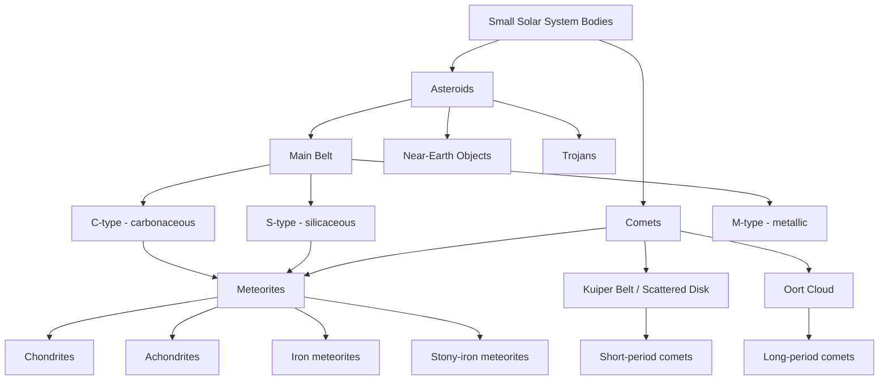

## Asteroids, Comets, and Meteorites

### Overview

Asteroids, comets, and meteorites are small bodies and their fragments that preserve the most direct physical and chemical record of Solar System formation available for study. Asteroids are predominantly rocky/metallic bodies concentrated in the inner and middle Solar System, comets are volatile-rich bodies originating in the outer Solar System and beyond, and meteorites are fragments of either that survive atmospheric entry and reach a planetary surface, providing ground-truth samples analyzable in terrestrial laboratories.

### Asteroids: Populations and Distribution

**Main Asteroid Belt**

Located between the orbits of Mars and Jupiter (roughly 2.1–3.3 AU), containing the vast majority of numbered asteroids. Total belt mass is estimated at only about 3–4% of the Moon's mass, concentrated primarily in the four largest bodies (Ceres, Vesta, Pallas, Hygiea). The belt's low mass relative to models of a smoothly accreted primordial disk is attributed to gravitational stirring and ejection by Jupiter during and after formation.

- **Kirkwood gaps**: Depleted zones within the belt corresponding to mean-motion orbital resonances with Jupiter (e.g., 3:1, 5:2, 7:3), where resonant perturbations destabilize orbits over time, ejecting or scattering bodies out of those semi-major axis ranges.
- **Asteroid families**: Clusters of asteroids sharing similar orbital elements, interpreted as fragments of ancient collisional breakup events of a common parent body (e.g., the Vesta family, linked to a major south-polar impact basin on Vesta itself).

**Near-Earth Objects (NEOs)**

Asteroids and comets with perihelion distances bringing them within approximately 1.3 AU of the Sun, subdivided into:

- **Atens**: Semi-major axis <1 AU, primarily interior to Earth's orbit
- **Apollos**: Semi-major axis >1 AU, orbit crosses Earth's orbit
- **Amors**: Orbit entirely exterior to Earth's but with perihelion <1.3 AU

NEOs are the primary focus of planetary defense monitoring programs, since a subset qualify as **Potentially Hazardous Asteroids (PHAs)** based on minimum orbit intersection distance and absolute magnitude (size proxy) thresholds.

**Trojan asteroids**: Bodies trapped in stable Lagrange points (L4/L5) 60° ahead of and behind a planet along its orbit, most numerously associated with Jupiter, but also confirmed for Earth, Mars, Neptune, and Uranus.

**Trans-Neptunian and Centaur populations**: Distinct from the main belt, including Centaurs (unstable orbits between Jupiter and Neptune, often exhibiting comet-like activity) and the broader Kuiper Belt/scattered disk populations discussed further under comets.

### Asteroid Composition and Taxonomy

Spectroscopic classification (based on reflectance spectra) divides asteroids into compositional taxonomic classes, the most significant being:

- **C-type (carbonaceous)**: ~75% of known asteroids, dominant in the outer belt; low albedo, rich in carbon compounds, hydrated minerals, and organics; parent bodies of carbonaceous chondrite meteorites.
- **S-type (silicaceous)**: ~17% of known asteroids, dominant in the inner belt; composed of silicate minerals (olivine, pyroxene) and nickel-iron; parent bodies of ordinary chondrites.
- **M-type (metallic)**: Believed to represent exposed metallic cores of differentiated parent bodies disrupted by collisions, linked to iron meteorites.

This compositional gradient (C-type outer belt to S-type inner belt) reflects the original solar nebula's radial temperature and volatile-condensation structure at the time of planetesimal formation.

### Notable Asteroid Bodies and Mission Targets

- **Ceres**: Largest asteroid belt object, classified as a dwarf planet; NASA's Dawn mission revealed a differentiated body with evidence of a subsurface brine reservoir, cryovolcanic features (notably the bright dome Ahuna Mons), and salt deposits (Occator Crater's bright spots), suggesting recent or ongoing hydrological activity.
- **Vesta**: Second-largest belt object; differentiated with a basaltic crust, studied in detail by Dawn; source of the HED (Howardite-Eucrite-Diogenite) meteorite clan via a major impact basin at its south pole.
- **Bennu**: Near-Earth C-type asteroid, sampled by NASA's OSIRIS-REx mission (sample returned to Earth in September 2023), revealing a rubble-pile structure, unexpectedly active surface (particle ejection events), and organics/hydrated minerals consistent with a carbonaceous chondrite parent body.
- **Ryugu**: Near-Earth C-type asteroid sampled by JAXA's Hayabusa2 mission (sample returned December 2020); also a rubble-pile body, with returned samples showing amino acids and other prebiotic organic compounds.
- **Didymos/Dimorphos**: Binary asteroid system targeted by NASA's DART mission (impact September 2022), the first full-scale demonstration of a kinetic impactor for planetary defense, successfully altering Dimorphos's orbital period around Didymos; ESA's Hera mission is following up to characterize the impact outcome in detail. [Fact: mission outcomes confirmed via published results; verify Hera mission status/timeline against current sources for real-time updates]

### Comets: Structure and Origin

**Physical structure**

- **Nucleus**: Solid core of ice (primarily water, with CO, CO₂, and other volatiles) mixed with dust and rocky material — commonly described as a "dirty snowball" or, per more recent characterization, an icy, porous, low-density conglomerate ("rubble pile" of ice and dust)
- **Coma**: Diffuse gas and dust envelope formed by sublimation as the nucleus approaches the Sun and solar heating drives volatile outgassing
- **Ion tail**: Straight tail composed of ionized gas, shaped by interaction with the solar wind and always pointing directly away from the Sun
- **Dust tail**: Curved tail composed of dust particles pushed by radiation pressure, generally trailing the comet's orbital path

**Origin reservoirs**

- **Kuiper Belt / Scattered Disk**: Region beyond Neptune (roughly 30–50+ AU) hosting short-period comets (orbital periods <200 years), generally with low orbital inclinations, consistent with formation in the outer protoplanetary disk plane
- **Oort Cloud**: Hypothesized spherical shell of icy bodies extending from roughly 2,000 to 100,000+ AU, source of long-period comets (orbital periods >200 years, often with highly random inclinations, including retrograde orbits), thought to have formed closer to the giant planets and been gravitationally scattered outward early in Solar System history. [Inference: Oort Cloud existence is strongly supported by long-period comet orbital statistics, though it has never been directly observed]

**Dynamical comet classes**: Jupiter-family comets (short-period, low inclination, orbits shaped by repeated close encounters with Jupiter), Halley-type comets (intermediate period, higher inclination), and long-period/Oort Cloud comets.

### Notable Comet Missions and Findings

- **1P/Halley**: Most famous periodic comet (~76-year period), studied by the multi-spacecraft "Halley Armada" (including ESA's Giotto) during its 1986 apparition, providing the first close-up nucleus imaging.
- **67P/Churyumov-Gerasimenko**: Target of ESA's Rosetta mission (2014–2016) and its Philae lander, providing unprecedented in-situ characterization of a comet nucleus, including detection of complex organic molecules, a bilobed ("rubber duck") shape interpreted as a contact binary, and measurement of the nucleus's deuterium-to-hydrogen (D/H) ratio, which differed from Earth's ocean water D/H ratio, complicating (though not eliminating) cometary delivery hypotheses for Earth's water. [Inference: implications for the "comets delivered Earth's water" hypothesis remain debated given D/H ratio variability across different comet populations]
- **9P/Tempel 1**: Target of NASA's Deep Impact mission (2005), which released an impactor to excavate subsurface material, revealing a fine, powdery interior structure.

### Meteorites: Classification

Meteorites are classified primarily by bulk composition and structure, reflecting their parent body's degree of differentiation:

**Chondrites** (~86% of falls; undifferentiated parent bodies)

- **Ordinary chondrites**: Most common meteorite type; contain chondrules (millimeter-scale spherical silicate droplets formed by rapid melting/cooling in the early solar nebula) and reflect S-type asteroid parent bodies
- **Carbonaceous chondrites** (e.g., CI, CM, CV groups): Chemically primitive, retaining volatile and organic compounds, including amino acids in some specimens (e.g., the Murchison meteorite); considered the most compositionally representative samples of primordial solar nebula material and key targets for prebiotic chemistry research
- **Enstatite chondrites**: Formed under highly reducing conditions, notable for isotopic similarities to Earth in some studies, informing hypotheses about Earth's building-block material [Inference: exact parent-body-to-Earth linkage remains an active isotopic geochemistry research area]

**Achondrites** (differentiated parent bodies, igneous origin, lack chondrules)

- Includes HED meteorites (from Vesta), and rarer Martian meteorites (SNC group: Shergottites, Nakhlites, Chassignites) and Lunar meteorites, identified via trapped gas isotopic signatures matching Viking-era Martian atmospheric measurements (for SNC) or Apollo sample compositions (for lunar meteorites)

**Iron meteorites**: Composed primarily of iron-nickel alloy, representing fragments of differentiated parent body cores exposed by catastrophic collisional disruption; classified further by trace element (Ga, Ge, Ir) chemical groups corresponding to distinct parent bodies

**Stony-iron meteorites**: Mixed silicate-metal composition (e.g., pallasites, containing olivine crystals embedded in a metal matrix), interpreted as samples from the core-mantle boundary region of differentiated parent bodies

### Atmospheric Entry and Fall Classification

- **Meteoroid**: Small body in space, generally <1 m (upper size boundary is loosely defined and varies by convention)
- **Meteor**: The visible streak of light produced by atmospheric ablation as a meteoroid passes through the atmosphere at high velocity (commonly tens of km/s)
- **Meteorite**: Surviving fragment that reaches the ground
- **Fall vs. find**: A "fall" is a meteorite recovered after being observed arriving (often via fireball/bolide sightings and, increasingly, camera network triangulation); a "find" is a meteorite discovered without a witnessed arrival, often significantly weathered

### Astrobiological and Origin-of-Life Relevance

Carbonaceous chondrites and comet nuclei are considered plausible delivery vehicles for prebiotic organic compounds and volatiles to the early Earth, a concept sometimes termed "cosmic seeding" or exogenous delivery of prebiotic material:

- Amino acids (including some not common in terrestrial biochemistry), nucleobases, and other complex organics have been identified in carbonaceous chondrites (e.g., Murchison) and in samples returned from Ryugu and Bennu
- Isotopic and structural evidence (e.g., chirality/enantiomeric excess patterns in meteoritic amino acids) is studied for clues about the origin of biological homochirality, though no definitive mechanism has been established [Speculation: proposed mechanisms include circularly polarized light in star-forming regions and mineral-surface catalysis, none conclusively confirmed]
- Water delivery to early Earth is attributed to some combination of asteroidal and cometary sources, with current isotopic (D/H ratio) evidence favoring carbonaceous chondrite-type asteroids as a larger relative contributor compared to most sampled comets, though this remains an active area of refinement as more comet D/H measurements become available

### Planetary Defense Framework

$$E_k = \frac{1}{2}mv^2$$

Impact energy scales with the square of impact velocity, meaning even modest-diameter NEOs can deliver energies orders of magnitude beyond typical terrestrial explosive events at typical encounter velocities (commonly 15–30 km/s). Mitigation strategies under active development or demonstration include:

- **Kinetic impactor**: Directly altering an asteroid's velocity via spacecraft collision (demonstrated by DART)
- **Gravity tractor**: Long-duration, low-thrust gravitational tugging using a nearby spacecraft's mass, applicable for long warning-time scenarios
- **Nuclear deflection/disruption**: Standoff nuclear detonation to alter trajectory via ablation-driven thrust, generally considered for larger objects or shorter warning times [Inference: remains largely theoretical/modeled, not operationally tested]

### Classification Overview Diagram

### Key Points

- Asteroids and comets represent two distinct formation reservoirs distinguished largely by heliocentric distance and volatile content at accretion, though the boundary is genetically blurred (some "asteroids" show comet-like activity).
- Compositional taxonomy (C, S, M-type) correlates directly with meteorite classification (carbonaceous, ordinary chondrites, irons), providing a linked orbital-compositional framework.
- Sample-return missions (Hayabusa2, OSIRIS-REx) have directly confirmed organic and hydrated mineral content in primitive asteroids, strengthening the case for exogenous delivery of prebiotic material to early Earth.
- Cometary D/H ratio measurements complicate simple "comets delivered Earth's water" narratives, shifting current consensus toward a mixed or asteroid-dominated water delivery model.
- DART's successful kinetic impactor demonstration marks a significant operational milestone in planetary defense capability.

### Related Topics

- Rubble-pile body mechanics and low-gravity regolith dynamics
- Isotopic geochemistry methods for meteorite parent-body identification
- Amino acid chirality and the origin of biological homochirality
- Kuiper Belt dynamical structure and New Horizons flyby findings (Arrokoth)
- Planetary defense survey programs and NEO detection statistics
- Sample-return mission engineering (touch-and-go sampling, curation protocols)
- Chondrule formation mechanisms in the early solar nebula
- Comparative D/H ratios across comet populations and Earth's oceans