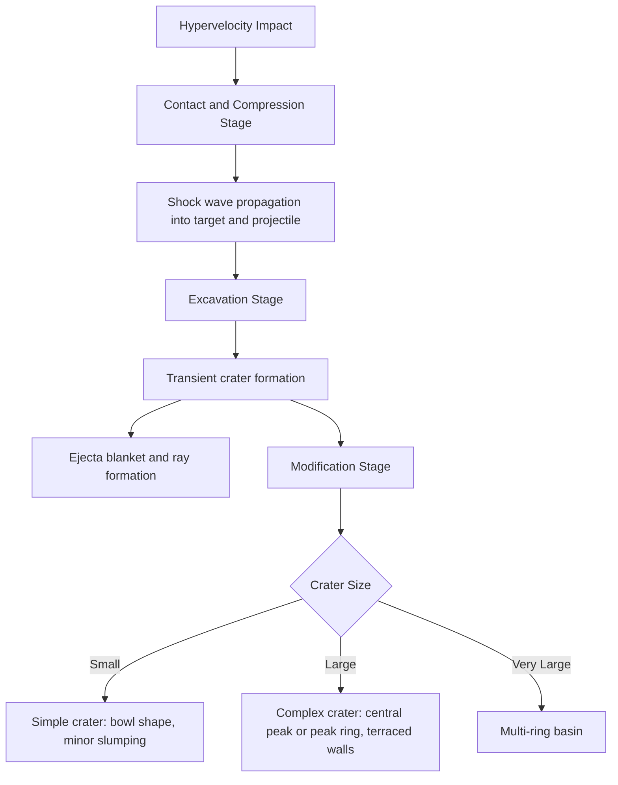

## Impact Cratering Processes

### Overview

Impact cratering is a fundamental geologic process throughout the Solar System, driven by hypervelocity collisions between a projectile (asteroid, comet, or meteoroid) and a target body. It is one of the few geologic processes common to essentially all solid Solar System surfaces, and serves as both a surface-modification mechanism and a chronometric tool for dating planetary surfaces via crater size-frequency statistics.

### Impact Velocities and Energy Regime

Hypervelocity impacts occur at speeds far exceeding the speed of sound in the target material, typically ranging from ~11 km/s (Earth's escape velocity, effectively a practical lower bound for Earth impacts) up to several tens of km/s depending on the body and encounter geometry. At these velocities, target material behaves hydrodynamically on impact timescales — rock strength becomes negligible compared to inertial and shock pressures, and the process is dominated by shock physics rather than conventional mechanical excavation.

Kinetic energy released scales with the square of velocity:

$$E_k = \frac{1}{2}mv^2$$

For a given projectile mass, even modest velocity increases produce disproportionately large energy releases, which is why hypervelocity impacts generate craters far larger than the projectile itself — commonly by a factor of 10–20× in diameter for simple craters. [Fact: scaling ratio well-established from laboratory experiments, nuclear test crater analogs, and terrestrial/planetary crater surveys]

### Stages of Crater Formation

**1. Contact and Compression Stage**

The projectile contacts the target surface and begins transferring kinetic energy. A shock wave propagates both into the target and back through the projectile (a reflected rarefaction wave), compressing and heating material to extreme pressures (often tens to hundreds of GPa) and temperatures sufficient to melt or vaporize both projectile and adjacent target material. This stage lasts only a fraction of a second for typical planetary impactors, scaling with projectile diameter divided by impact velocity.

**2. Excavation Stage**

The shock wave expands hemispherically into the target, and as it passes, an interacting rarefaction (release) wave sets material into motion, excavating a growing transient crater via a combination of:

- **Ejection**: Material near the surface is ejected along ballistic trajectories, forming the ejecta blanket and, at sufficient energy, distal ejecta rays
- **Displacement**: Deeper material is pushed downward and outward without being ejected, contributing to the crater's structural rim uplift

This stage produces the **transient crater**, a bowl-shaped excavation whose diameter and depth follow well-established scaling laws (e.g., the Maxwell Z-model and related point-source scaling relationships) as functions of projectile size, velocity, density, and target properties (density, strength, gravity regime).

**3. Modification Stage**

The transient crater is gravitationally and structurally unstable, and undergoes near-immediate collapse and modification, the character of which depends strongly on final crater size:

- **Small (simple) craters**: Minor wall slumping and infill by breccia (fragmented, mixed rock debris) produce a bowl-shaped final structure with a raised rim.
- **Large (complex) craters**: Transient crater walls collapse inward under gravity, the crater floor rebounds upward (analogous to the recoil in a viscous fluid impact), producing a **central peak** or, at even larger sizes, a **peak ring**, along with terraced walls from listric normal faulting of the rim collapse.

### Simple vs. Complex Crater Morphology

The transition diameter between simple and complex crater morphology depends on target gravity and material strength/gravity regime, following an approximate inverse relationship with surface gravity:

| Body | Approximate Simple-Complex Transition Diameter |
| --- | --- |
| Moon | ~15–20 km |
| Mars | ~5–10 km (varies with target material, e.g., ice-rich vs. rocky terrain) |
| Earth | ~2–4 km (target-material dependent; lower in sedimentary rock than crystalline basement) |
| Mercury | ~10–12 km |

[Inference: exact transition values vary across studies and depend on target lithology, so figures above should be treated as representative ranges rather than fixed constants]

At still larger scales (typically several hundred km), **multi-ring basins** form, characterized by multiple concentric rings of scarps or ridges surrounding a central basin, thought to result from large-scale collapse of an initially very deep transient cavity into isostatic equilibrium (e.g., the Orientale Basin on the Moon, Caloris Basin on Mercury, Hellas Basin on Mars).

### Shock Metamorphism and Diagnostic Evidence

Impact events produce distinctive, diagnostic mineralogical and structural signatures unambiguously distinguishing impact structures from volcanic or tectonic landforms:

- **Shatter cones**: Distinctive striated, conical fracture patterns in rock, formed by shock wave passage; considered one of the most reliable macroscopic impact indicators
- **Planar deformation features (PDFs)**: Microscopic parallel lamellae within mineral grains (especially quartz), formed only under shock pressures exceeding several GPa — a threshold not reached by ordinary tectonic or volcanic processes
- **High-pressure mineral polymorphs**: Formation of minerals such as coesite and stishovite (high-pressure SiO₂ polymorphs) or ringwoodite, requiring transient pressures unattainable by any known terrestrial endogenic process
- **Impact melt and breccias**: Glassy or crystalline melt sheets and mixed rock-fragment breccias (suevite) formed from shock-melted and fragmented target material
- **Iridium/platinum-group element anomalies**: Enrichment in siderophile elements (notably iridium) relative to typical crustal abundance, reflecting a meteoritic contribution, famously used as key evidence for the Cretaceous-Paleogene (K-Pg) extinction impact hypothesis

### Ejecta and Secondary Cratering

- **Continuous ejecta blanket**: Proximal deposit of excavated material immediately surrounding the crater rim, thinning with distance
- **Rays**: Bright, high-albedo linear ejecta streaks extending far beyond the continuous ejecta blanket, prominent on airless bodies (e.g., lunar crater Tycho) and gradually darkened/erased over geologic time by space weathering, making ray prominence a useful relative-age indicator for young craters
- **Secondary craters**: Formed by ballistic re-impact of ejected blocks, often clustered in chains or clusters radiating from the primary crater; secondary craters must be excluded or accounted for in crater size-frequency dating to avoid overestimating a surface's true (primary) cratering age

### Crater Size-Frequency Distribution Dating

Because impact flux is (to first order) statistically predictable over geologic time for a given region of the Solar System, the areal density and size distribution of superposed craters on a surface can be used to estimate relative and, with calibration, absolute surface ages:

$$N(D) \propto D^{-b}$$

where $N(D)$ is the cumulative number of craters larger than diameter $D$ per unit area, and $b$ is an empirically-derived power-law exponent (typically in the range of ~2–3 for many crater populations, though it varies with diameter range and target properties).

Absolute age calibration for the Moon relies on radiometrically dated Apollo/Luna returned samples correlated with crater counts at those landing sites; for other bodies (e.g., Mars), the same relative lunar-derived production function is extrapolated and adjusted using estimated impactor flux ratios, introducing greater absolute-age uncertainty. [Inference: Martian absolute chronology carries larger systematic uncertainty than lunar chronology due to the lack of directly dated Martian samples — a key motivation for Mars Sample Return]

### Crater Degradation and Erasure

Crater populations record not only impact flux but also the intensity of subsequent surface modification processes:

- **Airless bodies** (Moon, Mercury, most asteroids): Craters degrade primarily via subsequent impact gardening (bombardment by smaller impactors) and slow regolith creep, preserving craters over billions of years
- **Bodies with atmospheres and/or active surface processes** (Earth, Mars, Venus, Titan): Fluvial, aeolian, volcanic, tectonic, and (on Earth) biological/anthropogenic processes progressively degrade and erase craters, meaning the observed crater population records only a fraction of total impact history, weighted toward younger, less-degraded events
- **Earth's crater record**: Fewer than 200 confirmed impact structures are recognized on Earth, dramatically fewer than expected from impact flux models applied to the Moon, reflecting the combined effects of plate tectonic recycling (subduction erasing oceanic crust older than ~200 million years), erosion, and sedimentary burial

### Notable Impact Structures and Case Studies

- **Chicxulub crater** (Yucatán, Mexico): ~180 km diameter multi-ring basin, dated to ~66 million years ago, associated with the Cretaceous-Paleogene mass extinction event, identified via a global iridium anomaly layer, shocked quartz, and tektite deposits, later confirmed by direct drilling into the crater's peak ring (IODP-ICDP Expedition 364)
- **Vredefort crater** (South Africa): Largest confirmed verified impact structure on Earth (original diameter estimated at ~250–300 km, though heavily eroded), dated to ~2.02 billion years ago
- **Sudbury Basin** (Canada): ~1.85-billion-year-old impact structure, notable for its associated nickel-copper-platinum group element ore deposits, formed by impact-induced melting and subsequent magmatic differentiation
- **Meteor Crater (Barringer Crater)** (Arizona, USA): Well-preserved simple crater (~1.2 km diameter, ~50,000 years old), historically significant as the first terrestrial structure conclusively demonstrated to be of impact rather than volcanic origin

### Impact Cratering Across the Solar System: Comparative Notes

- **Mercury**: Heavily cratered surface with limited resurfacing since early heavy bombardment; hosts the large multi-ring Caloris Basin
- **Moon**: Extensively studied cratering record underpinning the standard lunar chronology used to calibrate other bodies; distinct maria (resurfaced, less-cratered basalt plains) versus highlands (ancient, heavily cratered) terrains
- **Mars**: Crater populations modified by later fluvial, aeolian, and periglacial processes; crater morphology (e.g., "rampart" or fluidized ejecta patterns) provides evidence for subsurface volatile (ice) content at the time of impact
- **Venus**: Thick atmosphere filters out smaller impactors before ground impact, and resurfacing (volcanic/tectonic) has erased most older craters, yielding a relatively young, more uniformly distributed crater population compared to other terrestrial bodies
- **Icy moons** (Europa, Ganymede, Enceladus): Crater retention varies dramatically with local geologic activity — Europa's sparse cratering indicates a very young, actively resurfaced ice shell, while Callisto's dense cratering indicates an ancient, largely inactive surface

### Crater Formation Sequence Diagram

### Key Points

- Impact cratering is a hydrodynamic, shock-dominated process at hypervelocity scales, fundamentally distinct from low-velocity mechanical excavation.
- Crater morphology transitions systematically from simple (bowl-shaped) to complex (central peak/peak ring) to multi-ring basin with increasing size, governed primarily by target gravity.
- Shock metamorphic indicators (PDFs, shatter cones, high-pressure polymorphs, siderophile element anomalies) provide unambiguous diagnostic evidence distinguishing impact origin from volcanic or tectonic processes.
- Crater size-frequency distribution analysis is the primary tool for relative and absolute surface age dating across the Solar System, though absolute calibration outside the Moon carries larger uncertainty.
- Earth's anomalously sparse crater record reflects active erosion, sedimentation, and plate tectonic recycling rather than a genuinely lower impact rate compared to other terrestrial planets.

### Related Topics

- Crater chronology systems and lunar sample radiometric calibration
- Chicxulub impact and Cretaceous-Paleogene extinction mechanisms
- Shock metamorphism petrology and diagnostic mineral indicators
- Rampart crater morphology as a Martian subsurface volatile indicator
- Multi-ring basin formation models (e.g., Orientale, Caloris)
- Planetary defense and impact hazard risk assessment
- Impact-generated hydrothermal systems and their astrobiological implications
- Comparative crater retention ages across icy moon surfaces